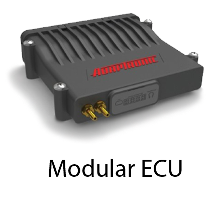
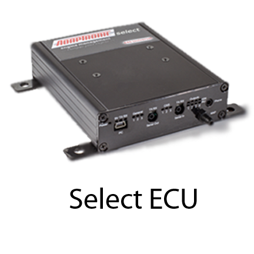

  
  
  
  
  
[DOWNLOADS](#)[STORE](#)[CONTACT
          US](#)  
  
  
[  

          ](#)  

# Eugene Support Home
  
  
  

  

Need help configuring your
                  Adaptronic ECU? Click an image below :  

  
  

  
  

  
  

Want to learn more about Eugene
                  and its included software?

  

  

  

  

What's New?

  

  

  

Want info on previous Eugene
                  releases? Click[here](EN_EUGENE_PREVIOUS.md).  

- [How to
                  use Eugene, the basics.](EN_EUGENE_ABOUT.md)
- [The
                  gauge page](EN_EUGENE_GAUGE_PAGE.md)
- [Manipulating
                    tables and graphs](EN_EUGENE_HOW_TABLE_GRAPH.md)
- [Main
                  window keyboard shortcuts.](EN_EUGENE_KBSC_MAIN.md)
- [Table
                  and graph page keyboard shortcuts](EN_EUGENE_KBSC_TG.md)
- [Navigating
                    Eugene menus](EN_MOD_002_HOMERIBBON.md)
- [Eugene's
                  auto-updater](EN_EUGENE_UPDATER.md)
- [Adaptronic
                  logviewer](EN_EUGENE_LOGVIEWER.md)  

- [Eugene
                  release notes](EN_EUGENE_RELEASE_NOTES.md)
- [Modular
                  firmware changelog](EN_ModFW.md)
- [Select
                  firmware changelog](EN_SelFW.md)

  
  
  
©2018 Adaptronic  
  
