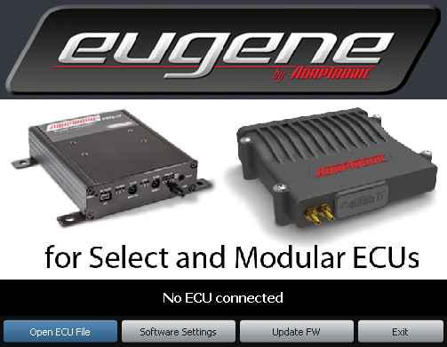
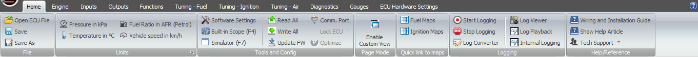
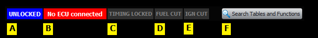
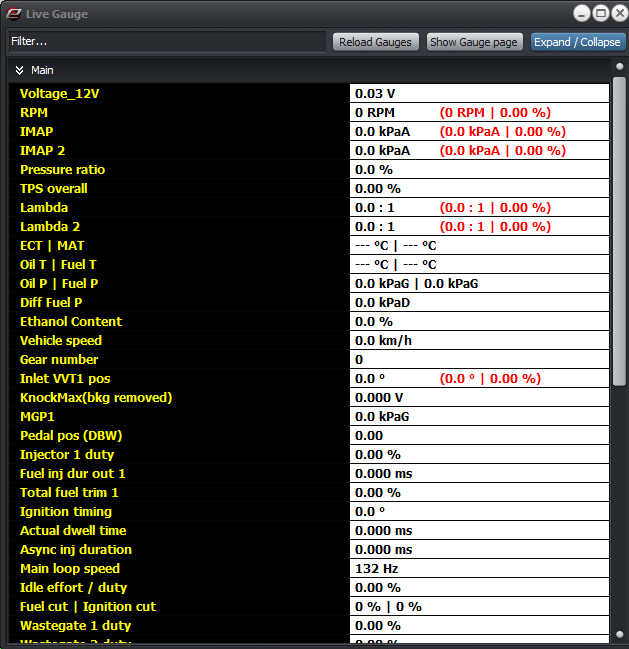
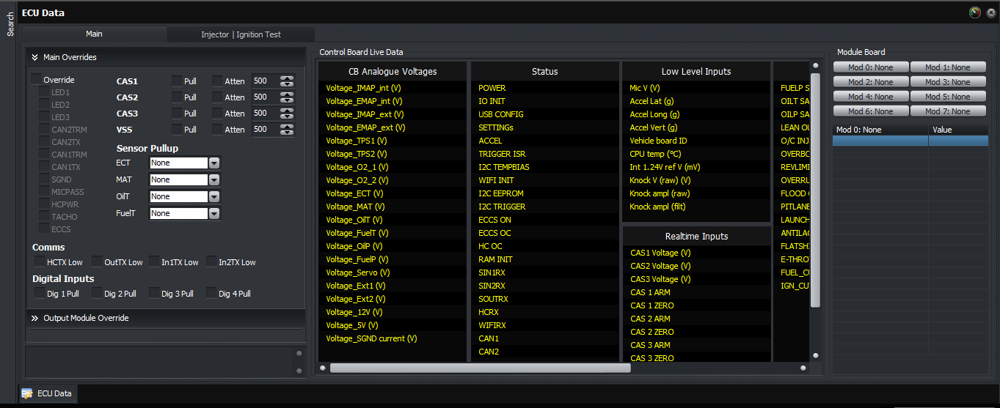
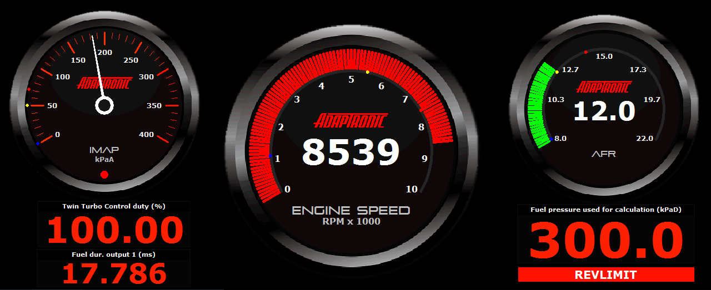
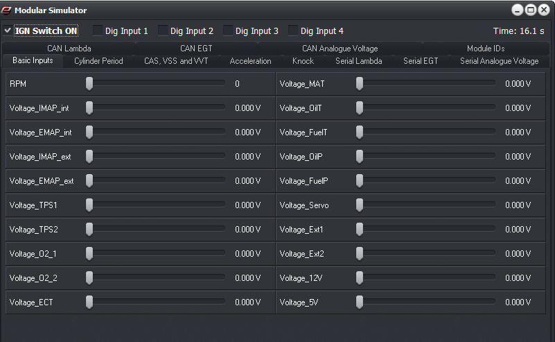

  
  
  
  
  
  
[DOWNLOADS](#)[STORE](#)[CONTACT US](#)  
  
  
  
  
  
  

Eugene Basics

[go back to support
                home](EN_EUGENE_HOME.md)  

  
  
  

[Manipulating tables and graphs  

                ](EN_EUGENE_HOW_TABLE_GRAPH.md)

[Keyboard
                  shortcuts (Main)](EN_EUGENE_KBSC_MAIN.md)

[Keyboard
                  shortcuts (tables)  

                ](EN_EUGENE_KBSC_TG.md)

[Navigating
                  Eugene menus](EN_MOD_002_HOMERIBBON.md)

[The
                  Gauge Page](EN_EUGENE_GAUGE_PAGE.md)

[Adding a custom gauge  

                ](EN_EUGENE_GAUGE_PAGE.html#Adding_custom_gauges)

[  

              ](EN_SelFW.md)

  

  
  
  
  
  
Eugeneis the Engine
                  Management Software designed forAdaptronic
Modular
                  ECUs. It is also
                  compatible withAdaptronic Select ECU models.  

- [Starting
                      Eugene](file:///C:/Users/Frank/Dropbox/Release/Support/EN/EN_EUGENE_ABOUT.html#Starting_Eugene)
- [Navigating the menu](EN_EUGENE_ABOUT.html#Navigating_the_Menu)
- [Status Bar](EN_EUGENE_ABOUT.html#Status_Bar)
- [Monitor Panel](EN_EUGENE_ABOUT.html#Monitor_Panel)
- [Gauges
                        Window](EN_EUGENE_ABOUT.html#Gauges_Window)
- [ECU
                      Data](EN_EUGENE_ABOUT.html#ECU_Data)
- [Gauge
                      Page](EN_EUGENE_ABOUT.html#Gauge_Page)
- [Simulator (Modular)](EN_EUGENE_ABOUT.html#Simulator)  
Starting
                      Eugene  
  
Double-click "Launch
                      Eugene" icon from Desktop.  
  

  
  
The user can either
                      load the settings (1) by opening a basemap (.ECU
                      file) or (2) by connecting an ECU via USB or Wi-Fi.  
  
When an ECU is connected
                      via USB, the software can communicate and retrieve
                      the settings even there is no 12V ignition power
                      going to the ECU. (This is possible due to the 5V power
                      inside a USB cable)  
  
Now, with Eugene running
                      and the ECU connected, the user should verify that the
                      software can see the ECU. A message such as 'ECU
                        connected’ or ‘Reading
                        Settings’, rather than‘No
                        ECU connected’ should be displayed. The status
                      should then progress from‘Reading
                        Settings 0%’ to ‘Reading
                        Settings 100%’ as the settings are extracted from
                      the ECU.  
  
[Back
                    to top...](EN_EUGENE_ABOUT.html#top)  
Navigating
the
                  Menu  
  
For detailed instructions,
                  click[here](EN_MOD_002_HOMERIBBON.md)[.](file:///C:/Users/Frank/Dropbox/Release/Support/EN/EN_EUG_NAV.md)  
  
The Ribbon menu is laid out
                  logically in the order the user would set things up in the
                  ECU. The Home menu tab has the access to all  functions
                  and tools for convenience in using the software. The rest of
                  the menu tabs are the groups of settings that the user would
                  setup, as outlined at the home page.  
  

  
  
  
File  

- Open ECU File-
                    allows the user to load ECU settings from a file (*.ecu)
- Save As-
                    save current settings into a file with a specific file
                    name
- Save- save current
                    settings to the active file name
- Import- import
                    specific settings or tables from another ECU file  
Units  

- Pressure- toggles
                    unit for Pressure, i.e. kPa or inHg/psi
- Temperature-
                    toggles unit for temperature, i.e. °C or °F
- Fuel Ratio- toggles
                    unit for fuel ratio, i.e. AFR or Lambda
- Speed- toggles unit
                    for vehicle speed, i.e. km/h or mi/h  
Tools
and
                    Config  

- Software settings - access the rest of the settings
                    in the software, e.g. Communications Port, table axis
                    orientation, etc
- Read All - read all settings from the ECU
- Write All - write all settings to the ECU
- Update FW -  flashing new FW for the ECU
- Comm. Port - selection on where the ECU is connected
- Lock ECU - only for Modular. Disables any write
                    events going to the ECU
- Optimize - only for Modular. Optimizes settings
                    synchronization between Eugene and ECU  
Page Mode-
                    toggle between Classic and Custom Page mode  

- Classic - can only view one table or settings config
                    window at a time. Full access to the monitor panel
- Custom Page - can view multiple table / settings
                    config window in one page. No access to monitor panel (gauge
                    displays can be added on the same page)  
Quick link to maps  

- shortcut access to
                      active fuel and ignition maps  
Logging  

- Start Logging (Ctrl + L) - initiates the log session.
                    Eugene creates two files, Adaptronic Log file (.alg) and a
                    Comma-Separated Values file (.csv)
- Stop Logging (Ctrl + K) - ends logging session
- Log Converter - tool used to convert .ALG log file to
                    .CSV
- CSV Log Channels - only for Modular. Allows user to
                    select which live channels in ht eModular are to be logged
                    in CSV format. ALG files on the other hand logs all
                    live channels
- Log Viewer - access to Adaptronic Log Viewer, and
                    opens the most recent log created in the session. If there
                    are no recent log, it will ask the user to select a log file  
Reference  

- allows the user to
                      open the wiring document and pinout guide for the current
                      ECU model  
Contact  

- opens a window
                      that will allow users to create an email (with file
                      attachments) to Adaptronic Technical Support
                      (tech@adaptronic.com.au)  
[Back
                    to top...](EN_EUGENE_ABOUT.html#top)  
Status Bar  
  

  
  
  
A.
                    Locked/Unlocked - only for Modular. Displays "ECU Lock"
                    state.When
                    an ECU is locked, the user can not write/modify any settings
                    in the ECU. To Lock/Unlock, click on "Lock
                      ECU" in "Tools and
                      Config" underHomemenu tab.  
B. Connection Status -
                    displays current ECU connection status. When an ECU is
                    connected, the serial number and FW version is also
                    displayed. Also indicates Read/Write progress  
C. Timing Locked -
                    when RPM > 0 and the timing locked is set in the
                    settings, this indicator will blink  
D. Fuel Cut -
                    indicator if the ECU is in Fuel cut  
E. Ignition Cut -
                    indicator if the ECU is in Ignition cut  
F. Search - access to
                    Search window, which allow the user to search for specific
                    setting in config window or tables.Shortcut key: Ctrl + F  
  
[Back
                    to top...](EN_EUGENE_ABOUT.html#top)  
Monitor Panel(Ctrl
                  + F2)  
  
An area in the main
                    window that allows users to add gauge displays to view live
                    variables that are being monitored.  
There are two monitor panels in Eugene main window: (1)
                    static and (2) dynamic  
  
  
1.
The
                      static monitor is the upper portion of the panel, where
                      gauge displays are constantly visible regardless of the
                      changes in the settings configuration window or tables.
                      Usually gauge display of basic live variables (e.g. Engine
                      speed, MAP, Throttle position, etc) are found here since
                      they're mostly likely being monitored throughout the
                      entire tuning process.  
  
2. The dynamic
                      monitor is the lower portion of the panel, where
                      the gauge displays are relevant to the active
                      settings configuration / table window being shown.  
  

- [How
                      to add a gauge display in the Monitor panel](EN_EUGENE_GAUGE_PAGE.html#Adding_custom_gauges)
- [Learn more about
                      the Monitor panel](EN_EUGENE_GAUGE_PAGE.md)  
  
[Back
                    to top...](EN_EUGENE_ABOUT.html#top)  
Gauges
                      Window (F2)  
  
Displays all (available)
                      live channels for monitoring.  
With Modular, some live
                      channels (e.g. Engine Speed) have its target and effort
                      values displayed inside the parenthesis:  (Target
                      value  |  Effort value)  
  
  

  
  
  
[Back
                    to top...](EN_EUGENE_ABOUT.html#top)  
ECU Data (F11)  
  
Displays control board's
                      live voltages and output overrides (Modular).  
  

  
  
[Back
                    to top...](EN_EUGENE_ABOUT.html#top)  
Gauge Page (F3)  
  
A page dedicated for custom
                  gauge displays.  
For users who are running
                  Eugene in a tablet dash, it's highly recommended to set the
                  start-up view to "Full-screen gauge page Mode" (see Software
                  Setttings -> Misc.)  
  

  
  

- [How
                      to add a gauge display in gauge page.](EN_EUGENE_MONITOR_PANEL_GAUGE_PAGE.md)
- [Learn more about
                      the Gauge page](EN_EUGENE_GAUGE_PAGE.md)  
[Back
                    to top...](EN_EUGENE_ABOUT.html#top)  
Simulator (F7) - Modular  
  

Allows the user to simulate
                  most of the live values, replicate almost any real-world
                  situation, and observe the behaviour of the ECU settings (no
                  need for the ECU to be connected!)

We strongly recommend
                  testing any setting changes using this simulator whenever
                  possible!

  
  
  
[Back
                        to top...](EN_EUGENE_ABOUT.html#top)  
  
  
  
  
©2018
        Adaptronic  
  
