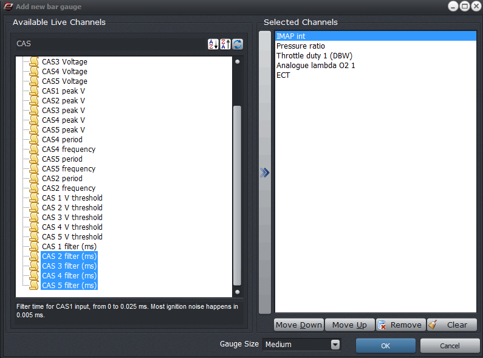

  
  
  
  
  
  
[DOWNLOADS](#)[STORE](#)[CONTACT US](#)  
  
  
  
  
  
  

Gauge Page/Monitor Panel

[go back to support
                home](EN_EUGENE_HOME.md)  

  
  
  

[Adding
                gauges  

              ](EN_EUGENE_MONITOR_PANEL_GAUGE_PAGE.md)

[Eugene
                Basics](EN_EUGENE_ABOUT.md)

[  

              ](EN_SelFW.md)

  

  
  
  
  
  

- [Adding
                      a gauge display](file:///C:/Users/Frank/Dropbox/Release/Support/EN/EN_EUGENE_GAUGE_PAGE.html#Adding_custom_gauges)
- [Removing a gauge display](EN_EUGENE_GAUGE_PAGE.html#removing)
- [Saving gauge page to file](EN_EUGENE_GAUGE_PAGE.html#saving)
- [Loading gauge page from file](EN_EUGENE_GAUGE_PAGE.html#loding)
- [Alignments](EN_EUGENE_GAUGE_PAGE.html#align)
- [Restore system default (Monitor
                      mode)](EN_EUGENE_GAUGE_PAGE.html#restore)  
  
  
Adding a gauge
                  display  
The following are the different gauge types available in gauge
                page.  
  
  
A.
                  Text gauge  
B. Analogue Dial Gauge  
C. Curved Dial Gauge  
D. Vertical Bar Gauge  
E. Horizontal Bar Gauge  
F. Flag monitor  
G. Live Log  
  
  

  
  
To
add
                    a gauge display,  
  
1. Right-click on the
                    monitor panel (or gauge page), and then click to select
                    which gauge display type to add.  
2. Select the live
                    variable(s) to display. The live variables are grouped
                    according to its category. Or you can use the search
                    function by clicking on the "maginifying glass" button. To
                    add multiple items, use the "Selected items" panel button to
                    add selected variables to the list.  
  

  
  
3. Select a gauge size
                    (default is "Medium").  
4. ClickOKwhen finished.  
  
[Back
                    to top...](EN_EUGENE_GAUGE_PAGE.html#top)  
  
  
Removing a
                gauge display  

- To remove gauge control
                    individually, right-click on the gauge and then select "Remove Display".
- To clear gauge
                      page, right-click on gauge page and then select "Clear
                        Page".[Back to
                    top...](EN_EUGENE_GAUGE_PAGE.html#top)  
Saving gauge page to file  

- Right-click on gauge page, and then select "Save
                      gauge page to file".
- Set the filename on the save dialog window.
- ClickSavewhen finished.[Back to top...](EN_EUGENE_GAUGE_PAGE.html#top)  
Loading gauge page from file  
Gauge page files have an .agp
                file extension. This file can only be loaded in gauge page or
                Monitor panels in tables and graphs.
- Right-click on gauge page, and then select "Load
                      gauge page from file".
- Locate the .agp file from the directory.
- ClickOpenwhen finished.[Back to top...](EN_EUGENE_GAUGE_PAGE.html#top)  
Alignments  
Alignements of gauges can be set on the window to have a better
                and neat view. In monitor panels, the alignments can be
                automatic if preferred. Right-click on the gauge control and
                then select "Align gauge" from the pop out menu.  

- None
- Top
- Bottom
- Left
- Right
- Client (takes up the whole window)[Back to top...](EN_EUGENE_GAUGE_PAGE.html#top)  
  
Restore system default (Monitor mode)  
Monitor panel in the
                  tables and graphs window is actually a gauge page - just
                  built-in. The purpose of monitor panels is for you to have a
                  custom selection of gauges that are relevant to the
                  setting that they're tuning. Each settiing configuration (in
                  tabular mode) has its predefined gauge page. But you can
                  always customized it according to your preference. In case you
                  want to revert to default monitor panel gauges, right-click on
                  the monitor panel, and then select "Restore
                  system default".  
  
Note: When you customize the
                  monitor panel gauges (adding/deleting), the changes will be
                  saved when the window is closed and will be reloaded on the
                  next session.  
  
[Back to top...](EN_EUGENE_GAUGE_PAGE.html#top)  
©2018
        Adaptronic  
  
