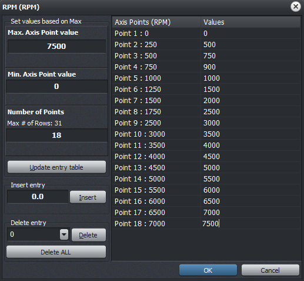
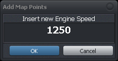
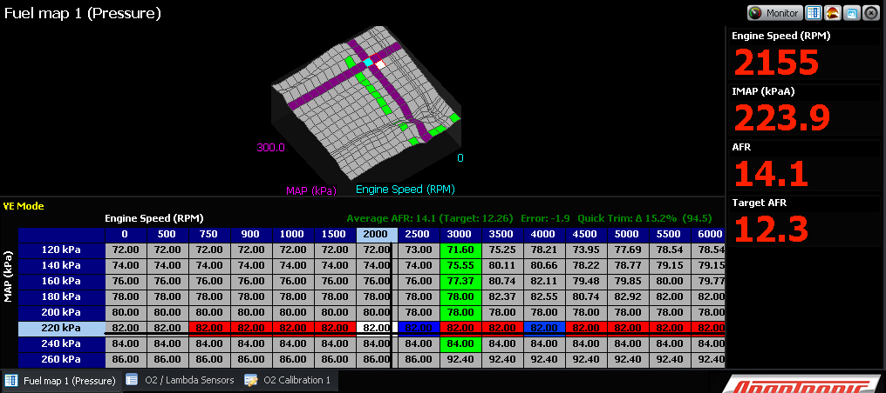
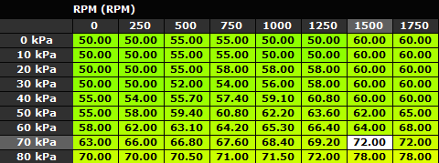

  
  
  
  
  
  
[DOWNLOADS](#)[STORE](#)[CONTACT US](#)  
  
  
  
  
  
  

How to Use Tables and Graphs

[go back to support
                home](EN_EUGENE_HOME.md)  

  
  
  

[Eugene basics  

              ](EN_EUGENE_ABOUT.md)

[Keyboard
                shortcuts for tables and graphs  

              ](EN_EUGENE_KBSC_TG.md)

  

[  

              ](EN_SelFW.md)

  

  
  
  
  

- [Setting up axes](EN_EUGENE_HOW_TABLE_GRAPH.html#Setting_up_axes)
- [Inserting cells](EN_EUGENE_HOW_TABLE_GRAPH.html#II._Inserting_cells)
- [Deleting cells](EN_EUGENE_HOW_TABLE_GRAPH.html#III._Deleting_cells_)
- [Selecting cells](EN_EUGENE_HOW_TABLE_GRAPH.html#IV._Selecting_Cells)
- [Data Entry](EN_EUGENE_HOW_TABLE_GRAPH.html#IV._Data_Entry)
- [Interpolation](EN_EUGENE_HOW_TABLE_GRAPH.html#V._Interpolation)
- [Duplicating
                      cell value a.k.a. Copy/Paste](EN_EUGENE_HOW_TABLE_GRAPH.html#VII._Duplicating_Cell_Values_a.k.a)
- [Map trace](EN_EUGENE_HOW_TABLE_GRAPH.html#VIII._Map_Trace)
- [Cell Tagging](EN_EUGENE_HOW_TABLE_GRAPH.html#IX._Cell_Tagging)  
Setting
                    up the axes  
  
X and Y axes of the table may
                  have different data types depending on which settings you're
                  working on.. For example if you're working on a fuel map,
                  X-axis has the RPM data type while the Y-axis has either MAP
                  or TPS, depending on your load selection setup.  
  
1. To start setting up
                  the X-axis, right-click on the table (or graph) and choose
                  'Change X-axis step size' from the pop-out menu. The axis
                  configuration window will pop out.  
  

  
  
2. You should be able
                  to insert and delete entry points in the axis range, or set
                  the maximum axis value and Eugene will work out each interval
                  in the series. This fills out the maximum number of columns
                  for X-axis (or rows for Y-axis).  
3. Once everything is
                  set, click OK. If an error is detected (e.g. duplicate
                  netries, etc), fix the entry value and hit OK again.  
  
[Back to
                    top](EN_EUGENE_HOW_TABLE_GRAPH.html#top)  
  
  
Inserting
                    cells  
Inserting a row
                  or column is easy!  
  
1. Click on the table
                  to select a cell.  
2. HitINSERTkey to insert a column (orSHIFT
                    + INSERTto insert a row).  
3. A window will pop
                  out to ask for the Column (or row) header value. The default
                  value is usually the average between the activell cell column
                  and the column to the right (or the active cell row and the
                  row below).  

  
4. Hit OK when
                  finished.  
  
[Back to
                    top](EN_EUGENE_HOW_TABLE_GRAPH.html#top)  
  
Deleting cells  
Deleting cells are
                  much easier! Unlike inserting cells, you can delete multiple
                  columns or rows at one time.  
  
1. Click (and drag) to
                  selec the columns or rows to be deleted.  
2. HitDELETEkey to delete columns (orSHIFT
                    + DELETEto delete rows).  A prompt window will
                  pop out for the confirmation.  
3. Hit YES to confirm.  
  
[Back
                    to top](EN_EUGENE_HOW_TABLE_GRAPH.html#top)  
  
Selecting Cells  
Navigating through the
                  cells can be done by using mouse or arrow keys.  

- To select multiple
                      cells, simply select the starting cell and then hold downSHIFTkey while
                      using the arrow keys. When using a mouse, simply drag
                      while pressing left-mouse button.
- Selecting the
                      entire column or row is done using a mouse by clicking on
                      the header. To select multiple columns or rows, just drag
                      from the initial header while pressing left-muse button.[Back to
                    top](EN_EUGENE_HOW_TABLE_GRAPH.html#top)  
  
Data Entry  
Only these are valid
                  entries in data tables  

- Numbers 0-9
- Decimal point ( .
                      )
- Negative sign (
                      - )  
After entering the
                  number, hit ENTER key so Eugene can validate the entry ie
                  checking within the preset minimum and maximum value. If an
                  ECU is connected (online) the new values in the table are then
                  written into the ECU.  
  
Tips:  
a. To invalidate
                      an entry, press ESCAPE key to revert to previous cell
                      value  
b. To increment /
                      decrement the cell's value, press PAGE UP or PAGE DOWN.
                      When pressed while holding CTRL key down, the increment or
                      decrement is the tenth of the default increment value  
  
[Back
                    to top](EN_EUGENE_HOW_TABLE_GRAPH.html#top)  
  
Interpolation  
Use the interpolation
                  function to blend parts of the map. There are 3 ways to do it:  
  
1.
                  Interpolate from Corner  
a.
                  Select group of cells (at least 3x3) in the table. To
                  select all cells, pressW(Select All).  
b.
                  PressLto start
                  interpolation  
2.
                  Interpolate Columns  
a.
                  Select group of cells (at least 3 cells in a column) in
                  the table. To select all cells, pressW(Select All).  
b.
                  PressYto start
                  interpolation  
3.
                  Interpolate Rows  
a.
                  Select group of cells (at least 3 cells in a row) in the
                  table. To select all cells, pressW(Select All).  
b.
                  PressXto start
                  interpolation  
  
[Back to
                    top](EN_EUGENE_HOW_TABLE_GRAPH.html#top)  
  
Duplicating
                    Cell Value a.k.a Copy/Paste  
There are two ways to do
                  it  
  
1.
                  Conventional Copy and Paste  
a.
                  Select a cell or group of cells to be copied and then pressCTRL + C.  
b.
                  Click on the cell where you want those values to be copied and
                  then pressCTRL + V.  
  
Note: If the size of the copied cells is 3x3 for example,
                  it will be pasted to a 3x3 cell area as well.  
  
2.Speed
                    Copy- this mode copies the active cell value to its
                  adjacent cell. This mode needs to be activated though by
                  pressingD.  
a.
                  Copy single cell - click on the cell that will be copied, and
                  then pressCTRL + ARROWkeys to start copying.  
b.
                  Copy entire column - click on the column header, and then
                  pressCTRL + LEFT/RIGHT
                    ARROWkey to start copying.  
c.
                  Copy entrire row - click on the row header, and then pressCTRL + UP/DOWN ARROWkey
                  to start copying.  
  
[Back to
                    top](EN_EUGENE_HOW_TABLE_GRAPH.html#top)  
  
Map Trace  
This function is only
                  available when an ECU is connected and Eugene is reading gauge
                  data out of the ECU. When this happens, the cross hair in the
                  table will be shown, displaying the the axes' live data values
                  from the ECU. Map trace function basically just maps out the
                  cells that were previously active based on the axes' live
                  data.  
  
When this function is
                  enabled (by pressingT), the active cells (both
                  previous and current) are highlighted in color RED, except for
                  fuel map tables which highlights are based on the
                  leanness/richness of the average AFR vs. the target AFR.  
  

  
  
[Back to
                    top](EN_EUGENE_HOW_TABLE_GRAPH.html#top)  
  
Cell
                  Tagging  
When working with fuel
                  maps, a cell can be tagged as "Tuned" or "Untuned".  
  
1. Select cells to be
                  marked, either by using a mouse or by arrow keys.  
2. PressMto mark cells as'Tuned"or pressUto mark cells as "Untuned".  
3. Tuned-marked cells
                  will have a green font color to be distinguished among the
                  rest.  
  

  
[Back to
                    top](EN_EUGENE_HOW_TABLE_GRAPH.html#top)  
  
  
©2018
        Adaptronic  
  
