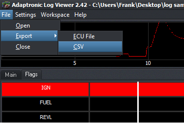
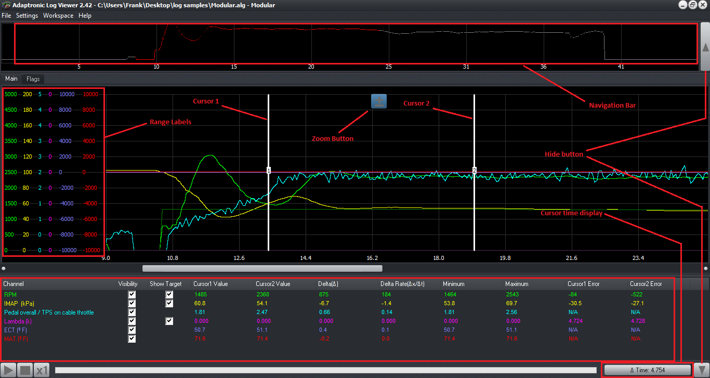
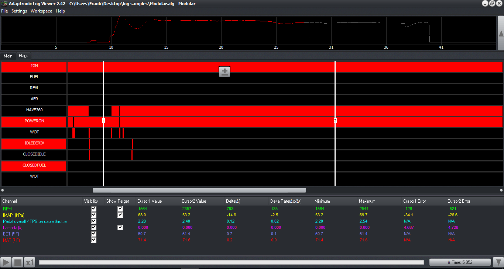
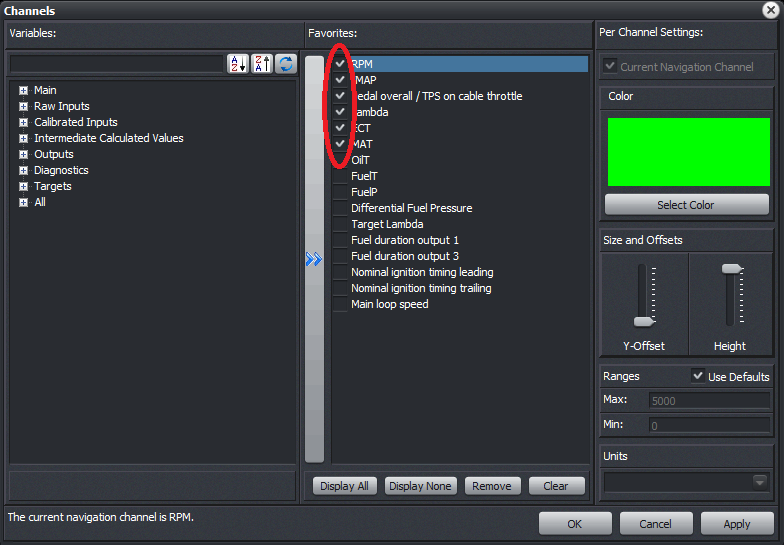

  
  
  
  
  
  
[DOWNLOADS](#)[STORE](#)[CONTACT US](#)  
  
  
  
  
  
  

Adaptronic Logviewer

[go back to support
                home](EN_EUGENE_HOME.md)  

  
  
  

[Eugene
                Basics  

              ](file:///C:/New%20Help/EN_EUGENE_ABOUT.md)  

[  

              ](EN_SelFW.md)

  

  
  
  
  
  

- [Features](EN_EUGENE_LOGVIEWER.html#I._Features:)
- [The
                        Main Workspace](EN_EUGENE_LOGVIEWER.html#II._The_Main_Workspace:)
- [The Flag Display Tab](EN_EUGENE_LOGVIEWER.html#III._The_Flag_Display_Tab)
- [The
                        Channel and Flag Selection Screens](EN_EUGENE_LOGVIEWER.html#IV._The_Channel_and_Flag_Selection)
- [Keyboard
                        Shortcuts](EN_EUGENE_LOGVIEWER.html#V._Keyboard_Shortcuts:)  
Features:  

- The Adaptronic log viewer is cable of displaying
                    files created with Eugene (ALG files), WARI (CSV files), and
                    SEKUKU (CSV files).
- ALG files contain all the information available to
                    the user, except ones made with internal logging for space
                    saving reasons.
- The log viewer graphs in a time-based manner instead
                    of  a "log based" manner., meaning even if there is a
                    discrepancy in the interval of logging (which is the case
                    since logging is dependent on clock cycles instead of a
                    fixed time interval), the graphing is still accurate vs.
                    time.
- ALG files also contains the ECU information when
                    the log was taken. This makes diagnosis a lot easier for you
                    or us.
- CSV extraction is useful if you want to view the file
                    usng spreadsheet software of other log viewers
                    available.
- Because if the endless possibilities of the number
                    channels that can be displayed with CSV files, there is no
                    default channel setting. The channels window will
                    automatically appear the first time you open a CSV file.
- With Modular ECUs, flags are saved as well, and you
                    can view these with the log viewer, again making diagnosis
                    easier.  

  
Modular ALG (Recorded
                        with Eugene)Select ALG File
                        (Recorded with Eugene)CSV File (Recorded
                        with WARI or converted)Unit ConversionYESYESNOFlagsYESNONODisplay Target ChannelYESYESNOConversion to CSVYES*YES*N/ACustom RangeYESYESYES  
*Unlike Eugene, only
                  channels flagged as favorites will be written into the CSV of
                  the same filename, located in the same folder.The Main Workspace:  

  

- Navigation - Drag the mouse with the left
                    button over the navigation bar to select the area to display
                    on the main window. Navigation parameter can be changed in
                    the channels window. Zoom in/out by pressing PageUp/Dwn or
                    clicking the Zoom Button, visible if the mouse hovers in the
                    area between the two cursors. Navigate left or right using
                    the left/right arrow keys or drag the scroll bar below the
                    graphing area.
- View - You can hide/show the Navigation bar and
                    Bottom Panel by clicking the shown buttons or pressing the
                    up or down arrow key. You can also drag the bottom panel
                    upwards or downwards by pointing in the area below the
                    scrollbar.
- Range labels - You can approximate the actual value
                    with these labels. There are 10 "steps", with interval of
                    maximum (denoted) minus minimum over 10. You can customize
                    the minimum and maximum using the Channels window.
- Cursors -There are two cursors, Cursor 1 is
                    positioned with a left click on the workspace, Cursor 2 with
                    a right click. Actual graph values are displayed at the
                    table located at the bottom of the screen. Each column is
                    described below in the next section.
- Time Display/Button - Can either show the time
                    difference of the position of both cursors or the exact time
                    the selected cursor is pointed to. Simply left click to
                    change mode. (Note: Each vertical "line" in the graph may be
                    representative of a time range. Thus the displayed value is
                    the average value of all the logs made in that range)
- Bottom Panel - Contains a table that displays
                    numerical values based on the positions of the two cursors
                    and controls which channel and it's target (if applicable)
                    is visible. Clicking on a row description (parameter name)
                    will display the Channels window wuth that parameter
                    selected.
- Cursor 1/2 Value - Displays the scaled value of each
                    parameter in the current position of the cursor.
- Delta - The difference of the values of each
                    parameter (ie. how much it has changed from cursor 1 to 2).
- Delta Rate - The rate divided by the time elapsed
                    between cursors.
- Minimum - The minimum value in the area between
                    cursors.
- Maximum - The maximum value in the area between
                    cursors.
- Cursor 1/2 error - Only applicable in channels with
                    targets. Shows the difference between a parameter and it's
                    target value. (ie. Closed loop)The
                  Flag Display Tab  

  

- Only Cursor 1 is used in flag selection. The
                    background color of the graph row label becomes red if the
                    flag is active when the cursor is over it. Parameters at the
                    bottom are displayed as usual. Cursor 2 does not detect of a
                    flag is active or not, but still shows the associated values
                    in the bottom panel.
- Navigation in this tab is much like main panel
                    navigation. In fact, you can just switch tabs since the
                    displayed time interval is the same.
- The flag tab is only available for Modular ALG logs
                    only. Not all flags are available in internal logs (only the
                    ones under FLAGSH and FLAGSL are logged every time
                    internally by default).The Channel
                  and Flag Selection Screens:  

  

- The left pane shows all the channels that have been
                    logged in tree form. Searching for a specific parameter
                    works too. Simply type on the text box and the tree will
                    expand to suit.
- Clicking the >> button or double clicking the
                    parameter will transfer it to the right pane, making it a
                    favorite.  
What are favorites?These are parameters
                      which are saved and flagged as ones to be loaded into
                      memory for later viewing. With 1024 channels, and a VERY
                      long log, not loading everything will save file
                      opening times. This is useful for opening files over a
                      network, etc.
- Checked channels in the right pane will select it for
                    viewing.
- To set the navigation parameter to use, simply click
                    "Use as Navigation Channel" with the channel selected. The
                    default is RPM.
- Channel graphing color, Custom minimum, maximum
                    (graph range)m Y-offset and Graph Height is saved per
                    channel.
- Units are saved globally, meaning setting it to °F
                    will convert, graph and display all temperature logs in that
                    unit.
- The Flag Selection screen has the same structure, but
                    does not have per channel settings.Keyboard Shortcuts:  

- Left Arrow Key- Pan Graph to the left.
- Right Arrow Key- Pan Graph to the right.
- Up Arrow Key- Toggle navigation bar.
- Down Arrow Key- Toggle data table.
- Page Up-
                    Zoom to area between cursors.
- Page Down-
                    Zoom out.

[Back to top](EN_EUGENE_LOGVIEWER.html#top)  
©2018
        Adaptronic  
  
