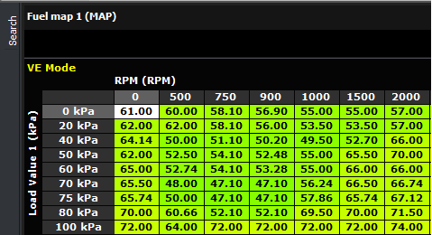

templateFuel
Maps  
  
The
fuel map indicates the amount of fuel supplied to the engine at one
cycle. The numbers in the table represent either the Volumetric
Efficiency(check onVE Modein Fuel map
settings)or the millisecond value . The X-axis is always the Engine
speed,
however the Y-axis will depend on Pressure selection mode in
Fuel
map settings. A second fuel map table with TPS as load variable is used
whenever theOperatorinvolves TPS (i.e. TPS, MAP + TPS and MAP x TPS)  
  
  
  
Fuel
Map Settings  
  
Operator  

- MAP
-  the VE or millisecond values are read from Fuel map (MAP)
table. The load axis can either be MAP or Pressure Ratio
(MAP/EMAP), depending on Pressure Selection. It can go as much as 31
RPM points and 31 load points.The
axis values are fully user customizable
- TPS
-the
VE or millisecond values are read from Fuel map (TPS) table. It can go
as much as 31 RPM points and 15 load points. The axis values are fully
user customizable
- MAP + TPS
-the sum of VE or millisecond
value from both Fuel map (MAP) and Fuel map (TPS) will be used for fuel
calculation
- MAP
x TPS  - the product ofVE or millisecond value from
both Fuel map (MAP) and Fuel map (TPS) will be used for fuel calculation  
See
also:  

- [How to use tables and graphs](EN_EUGENE_HOW_TABLE_GRAPH.md)