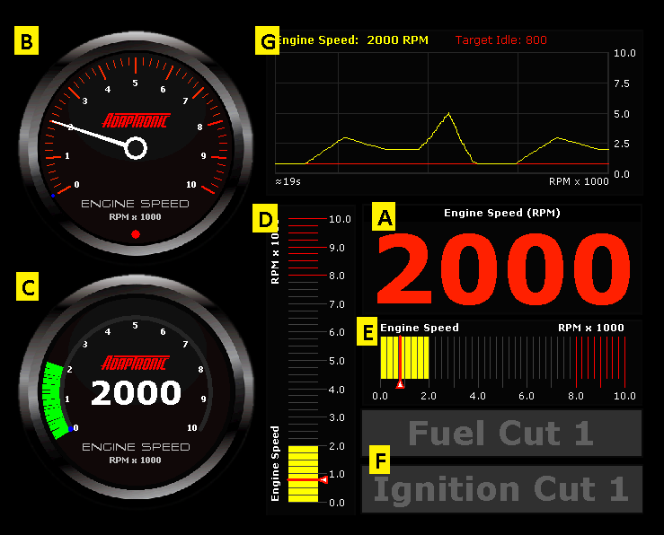

  
  
  
  
  
  
[DOWNLOADS](#)[STORE](#)[CONTACT US](#)  
  
  
  
  
  
  

Adding Gauge Displays in Gauge Page/Monitor
              Panel

[go back to support
                home](EN_EUGENE_HOME.md)  

  
  
  

[Eugene
                Gauge Page/Monitor Panel  

              ](EN_EUGENE_GAUGE_PAGE.md)

[Eugene
                Basics  

              ](EN_EUGENE_ABOUT.md)

[  

              ](EN_SelFW.md)

  

  
  
  
  
  
There
                  are 7 types of gauge displays available in Eugene:  

- Text gauge
- Analogue dial
                      gauge
- Curved
                      dial gauge
- Vertical bar gauge
- Horizontal bar
                      gauge
- Flag
- Live log  
  

  
  
To
                  add a gauge display:  

- Right-click on
                      the monitor panel (or gauge page), and then click to
                      select which gauge display type to add.
- Select the live
                      variable(s) to display. The live variables are grouped
                      according to its category. Or you can use the search
                      function by clicking on the "maginifying glass" button. To
                      add multiple items, use the "Selected items" panel button
                      to add selected variables to the list.
- Select a gauge
                      size (default is "Medium").
- ClickOK.  
©2018
        Adaptronic  
  
