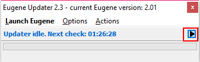
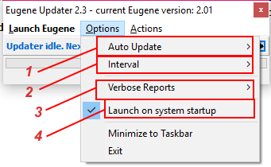
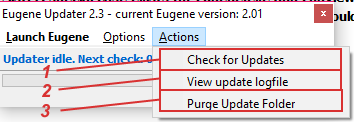
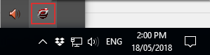
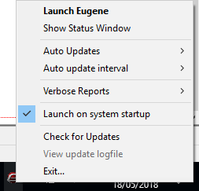
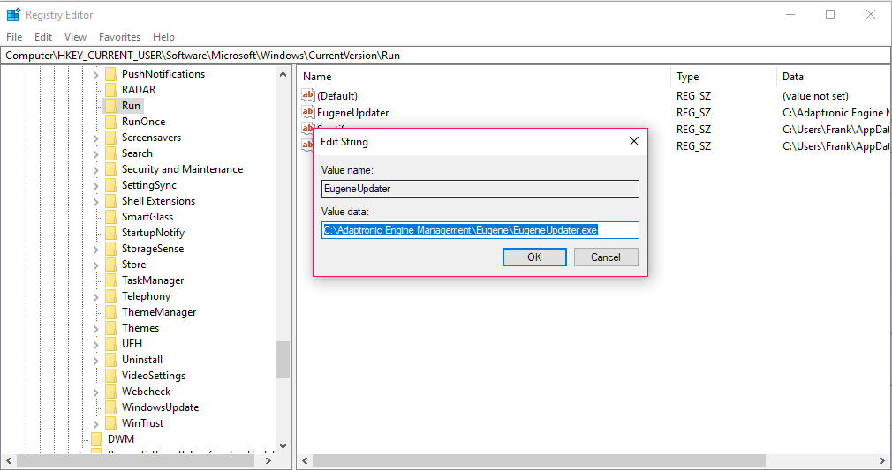
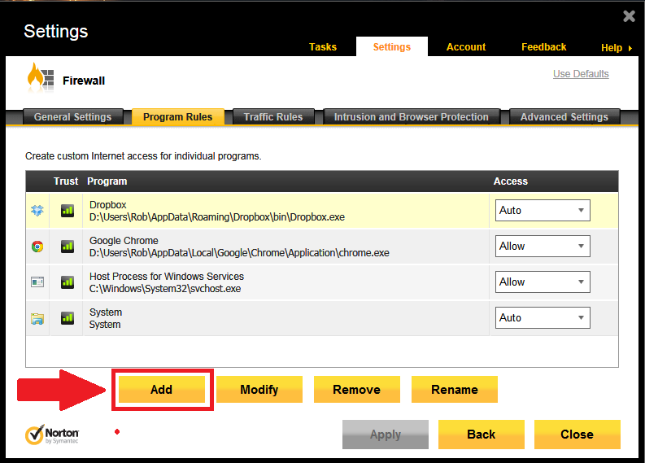

Eugene Updater Support/*

Copyright (c) 2008, Yahoo! Inc. All rights reserved.

Code licensed under the BSD License:

http://developer.yahoo.net/yui/license.txt

version: 2.6.0

*/

html{color:#000;background:#FFF;}body,div,dl,dt,dd,ul,ol,li,h1,h2,h3,h4,h5,h6,pre,code,form,fieldset,legend,input,textarea,p,blockquote,th,td{margin:0;padding:0;}table{border-collapse:collapse;border-spacing:0;}fieldset,img{border:0;}address,caption,cite,code,dfn,em,strong,th,var{font-style:normal;font-weight:normal;}li{list-style:none;}caption,th{text-align:left;}h1,h2,h3,h4,h5,h6{font-size:100%;font-weight:normal;}q:before,q:after{content:'';}abbr,acronym{border:0;font-variant:normal;}sup{vertical-align:text-top;}sub{vertical-align:text-bottom;}input,textarea,select{font-family:inherit;font-size:inherit;font-weight:inherit;}input,textarea,select{*font-size:100%;}legend{color:#000;}del,ins{text-decoration:none;}body{font:13px/1.231 arial,helvetica,clean,sans-serif;*font-size:small;*font:x-small;}select,input,button,textarea{font:99% arial,helvetica,clean,sans-serif;}table{font-size:inherit;font:100%;}pre,code,kbd,samp,tt{font-family:monospace;*font-size:108%;line-height:100%;}body{text-align:center;}#ft{clear:both;}#doc,#doc2,#doc3,#doc4,.yui-t1,.yui-t2,.yui-t3,.yui-t4,.yui-t5,.yui-t6,.yui-t7{margin:auto;text-align:left;width:57.69em;*width:56.25em;min-width:750px;}#doc2{width:73.076em;*width:71.25em;}#doc3{margin:auto 10px;width:auto;}#doc4{width:74.923em;*width:73.05em;}.yui-b{position:relative;}.yui-b{_position:static;}#yui-main .yui-b{position:static;}#yui-main,.yui-g .yui-u .yui-g{width:100%;}{width:100%;}.yui-t1 #yui-main,.yui-t2 #yui-main,.yui-t3 #yui-main{float:right;margin-left:-25em;}.yui-t4 #yui-main,.yui-t5 #yui-main,.yui-t6 #yui-main{float:left;margin-right:-25em;}.yui-t1 .yui-b{float:left;width:12.30769em;*width:12.00em;}.yui-t1 #yui-main .yui-b{margin-left:13.30769em;*margin-left:13.05em;}.yui-t2 .yui-b{float:left;width:13.8461em;*width:13.50em;}.yui-t2 #yui-main .yui-b{margin-left:14.8461em;*margin-left:14.55em;}.yui-t3 .yui-b{float:left;width:23.0769em;*width:22.50em;}.yui-t3 #yui-main .yui-b{margin-left:24.0769em;*margin-left:23.62em;}.yui-t4 .yui-b{float:right;width:13.8456em;*width:13.50em;}.yui-t4 #yui-main .yui-b{margin-right:14.8456em;*margin-right:14.55em;}.yui-t5 .yui-b{float:right;width:18.4615em;*width:18.00em;}.yui-t5 #yui-main .yui-b{margin-right:19.4615em;*margin-right:19.125em;}.yui-t6 .yui-b{float:right;width:23.0769em;*width:22.50em;}.yui-t6 #yui-main .yui-b{margin-right:24.0769em;*margin-right:23.62em;}.yui-t7 #yui-main .yui-b{display:block;margin:0 0 1em 0;}#yui-main .yui-b{float:none;width:auto;}.yui-gb .yui-u,.yui-g .yui-gb .yui-u,.yui-gb .yui-g,.yui-gb .yui-gb,.yui-gb .yui-gc,.yui-gb .yui-gd,.yui-gb .yui-ge,.yui-gb .yui-gf,.yui-gc .yui-u,.yui-gc .yui-g,.yui-gd .yui-u{float:left;}.yui-g .yui-u,.yui-g .yui-g,.yui-g .yui-gb,.yui-g .yui-gc,.yui-g .yui-gd,.yui-g .yui-ge,.yui-g .yui-gf,.yui-gc .yui-u,.yui-gd .yui-g,.yui-g .yui-gc .yui-u,.yui-ge .yui-u,.yui-ge .yui-g,.yui-gf .yui-g,.yui-gf .yui-u{float:right;}.yui-g div.first,.yui-gb div.first,.yui-gc div.first,.yui-gd div.first,.yui-ge div.first,.yui-gf div.first,.yui-g .yui-gc div.first,.yui-g .yui-ge div.first,.yui-gc div.first div.first{float:left;}.yui-g .yui-u,.yui-g .yui-g,.yui-g .yui-gb,.yui-g .yui-gc,.yui-g .yui-gd,.yui-g .yui-ge,.yui-g .yui-gf{width:49.1%;}.yui-gb .yui-u,.yui-g .yui-gb .yui-u,.yui-gb .yui-g,.yui-gb .yui-gb,.yui-gb .yui-gc,.yui-gb .yui-gd,.yui-gb .yui-ge,.yui-gb .yui-gf,.yui-gc .yui-u,.yui-gc .yui-g,.yui-gd .yui-u{width:32%;margin-left:1.99%;}.yui-gb .yui-u{*margin-left:1.9%;*width:31.9%;}.yui-gc div.first,.yui-gd .yui-u{width:66%;}.yui-gd div.first{width:32%;}.yui-ge div.first,.yui-gf .yui-u{width:74.2%;}.yui-ge .yui-u,.yui-gf div.first{width:24%;}.yui-g .yui-gb div.first,.yui-gb div.first,.yui-gc div.first,.yui-gd div.first{margin-left:0;}.yui-g .yui-g .yui-u,.yui-gb .yui-g .yui-u,.yui-gc .yui-g .yui-u,.yui-gd .yui-g .yui-u,.yui-ge .yui-g .yui-u,.yui-gf .yui-g .yui-u{width:49%;*width:48.1%;*margin-left:0;}.yui-g .yui-g .yui-u{width:48.1%;}.yui-g .yui-gb div.first,.yui-gb .yui-gb div.first{*margin-right:0;*width:32%;_width:31.7%;}.yui-g .yui-gc div.first,.yui-gd .yui-g{width:66%;}.yui-gb .yui-g div.first{*margin-right:4%;_margin-right:1.3%;}.yui-gb .yui-gc div.first,.yui-gb .yui-gd div.first{*margin-right:0;}.yui-gb .yui-gb .yui-u,.yui-gb .yui-gc .yui-u{*margin-left:1.8%;_margin-left:4%;}.yui-g .yui-gb .yui-u{_margin-left:1.0%;}.yui-gb .yui-gd .yui-u{*width:66%;_width:61.2%;}.yui-gb .yui-gd div.first{*width:31%;_width:29.5%;}.yui-g .yui-gc .yui-u,.yui-gb .yui-gc .yui-u{width:32%;_float:right;margin-right:0;_margin-left:0;}.yui-gb .yui-gc div.first{width:66%;*float:left;*margin-left:0;}.yui-gb .yui-ge .yui-u,.yui-gb .yui-gf .yui-u{margin:0;}.yui-gb .yui-gb .yui-u{_margin-left:.7%;}.yui-gb .yui-g div.first,.yui-gb .yui-gb div.first{*margin-left:0;}.yui-gc .yui-g .yui-u,.yui-gd .yui-g .yui-u{*width:48.1%;*margin-left:0;} .yui-gb .yui-gd div.first{width:32%;}.yui-g .yui-gd div.first{_width:29.9%;}.yui-ge .yui-g{width:24%;}.yui-gf .yui-g{width:74.2%;}.yui-gb .yui-ge div.yui-u,.yui-gb .yui-gf div.yui-u{float:right;}.yui-gb .yui-ge div.first,.yui-gb .yui-gf div.first{float:left;}.yui-gb .yui-ge .yui-u,.yui-gb .yui-gf div.first{*width:24%;_width:20%;}.yui-gb .yui-ge div.first,.yui-gb .yui-gf .yui-u{*width:73.5%;_width:65.5%;}.yui-ge div.first .yui-gd .yui-u{width:65%;}.yui-ge div.first .yui-gd div.first{width:32%;}#bd:after,.yui-g:after,.yui-gb:after,.yui-gc:after,.yui-gd:after,.yui-ge:after,.yui-gf:after{content:".";display:block;height:0;clear:both;visibility:hidden;}#bd,.yui-g,.yui-gb,.yui-gc,.yui-gd,.yui-ge,.yui-gf{zoom:1;}h1 {
  font-size: 138.5%;
}

h2 {
  font-size: 123.1%;
}

h3 {
  font-size: 108%;
}

h1, h2, h3 {
  margin-top: 1em;
  margin-right: 0px;
  margin-bottom: 1em;
  margin-left: 0px;
}

h1, h2, h3, h4, h5, h6, strong {
  font-weight: bold;
}

abbr, acronym {
  border-bottom-width: 1px;
  border-bottom-style: dotted;
  border-bottom-color: black;
  cursor: help;
}

em {
  font-style: italic;
}

blockquote, ul, ol, dl {
  margin-top: 1em;
  margin-right: 1em;
  margin-bottom: 1em;
  margin-left: 1em;
}

ol, ul, dl {
  margin-left: 2em;
}

ol li {
  list-style-type: decimal;
  list-style-image: none;
  list-style-position: outside;
}

ul li {
  list-style-type: disc;
  list-style-image: none;
  list-style-position: outside;
}

dl dd {
  margin-left: 1em;
}

th, td {
  border-top-width: 1px;
  border-right-width: 1px;
  border-bottom-width: 1px;
  border-left-width: 1px;
  border-top-style: solid;
  border-right-style: solid;
  border-bottom-style: solid;
  border-left-style: solid;
  border-top-color: black;
  border-right-color: black;
  border-bottom-color: black;
  border-left-color: black;
  -moz-border-top-colors: none;
  border-top-colors: none;
  -moz-border-right-colors: none;
  border-right-colors: none;
  -moz-border-bottom-colors: none;
  border-bottom-colors: none;
  -moz-border-left-colors: none;
  border-left-colors: none;
  border-image-source: none;
  border-image-slice: 100% 100% 100% 100%;
  border-image-width: 1 1 1 1;
  border-image-outset: 0 0 0 0;
  border-image-repeat: stretch stretch;
  padding-top: 0.5em;
  padding-right: 0.5em;
  padding-bottom: 0.5em;
  padding-left: 0.5em;
}

th {
  font-weight: bold;
  text-align: center;
}

caption {
  margin-bottom: 0.5em;
  text-align: center;
}

p, fieldset, table, pre {
  margin-bottom: 1em;
}

input[type="text"], input[type="password"], textarea {
  width: 12.25em;
}

.navbar {
  background-color: black;
  color: white;
  font-size: smaller;
}

.Pagetitle {
  font-size: large;
  font-weight: bold;
}

.navbar:hover {
  font-weight: normal;
}

#downloads:hover {
  font-weight: normal !important;
  font-size: smaller !important;
}

.contact:hover {
  font-weight: bolder;
}

.downloads:hover {
  font-weight: bolder;
}

.store:hover {
  font-weight: bolder;
}

.downloads {
  font-weight: normal;
}

.store {
  font-weight: normal;
}

.contact {
  font-weight: normal;
}

.versionnum {
  font-size: large;
  color: black;
  font-weight: bold;
}

.releasedate {
  font-size: small;
  font-style: italic;
  color: black;
}

.releasecontent {
  font-size: medium;
}

.modrev {
  font-style: normal;
  font-weight: normal;
  font-size: small;
  color: #3333ff;
}

.selectrev {
  font-weight: normal;
  font-style: normal;
  color: #3333ff;
  font-size: small;
}

.yui-u {
  font-size: medium;
}

.backhome {
  font-size: smaller;
}

.latestrev {
  font-size: smaller;
}

.bodytxt1 {
  font-size: xx-small;
}  
  
[DOWNLOADS](#)[STORE](#)[CONTACT US](#)  
  

Eugene Updater

[go back to support
                home](EN_EUGENE_HOME.md)

  

[Eugene Basics  

              ](EN_EUGENE_ABOUT.md)

[Adaptronic
                Logviewer  

              ](EN_EUGENE_LOGVIEWER.md)

[  

              ](EN_SelFW.md)

  

  
  
  
[Description
                    and Operation](EN_EUGENE_UPDATER.html#I._Description_and_Operation)  
[Features](EN_EUGENE_UPDATER.html#II._Features)  
[Troubleshooting](EN_EUGENE_UPDATER.html#III._TroubleshootingFAQ)  
Description and Operation  
  
The Updater tool downloads
                  file updates and new files like firmware and help files. It
                  can do so automatically with a user set interval (default =
                  12hrs)  or manually, triggered from the updater itself or
                  Eugene. When an update is triggered, the Updater will download
                  a list of files from the server. If the file in the list
                  exists but not locally, it is downloaded. If the local file is
                  older than the one in the list, it is downloaded as well.
                  The file gets downloaded to the
                  <Username>\Documents\Eugene\Updates folder.  
  
After download, the local file is deleted (if it exists), and
                  moved to the folder where the Updater is (EugeneUpdate.exe),
                  which is the Eugene installation folder. The updater then
                  moves on to the next file in the list. A special case
                  exists for Eugene.exe and Logviewer.exe. If one of these
                  programs (for example, Eugene) are open, the updater will move
                  the file anyway and the user is prompted that an update
                  exists. Should you choose to update, UpdateKicker.exe will
                  close the program, delete the old one and rename the updated
                  file  (for example, Eugene.ex_ to Eugene.exe).  
  
All operations are logged for easier diagnostics.  
Features  
  
The updater window when no
                  update is being downloaded. Clicking on the "play" button will
                  trigger an update check, regardless of the update check mode
                  (auto or manual).  
  
  
The Options Menu.  
  

- Sets Auto Update mode.
- Sets auto update check interval.
- Enabling this will generate a more detailed log of
                      the update. It will include the list of files in the
                      update and the reason why a file is added to the
                      "download" list.
- Toggles the registry entry to auto-run on Windows
                      launch.  
The Actions Menu.  
  

- Same function as the "play" button.
- Views the logfile. The option will be disabled when
                      an update is in progress as the updater is writing into
                      the logfile at this time.
- Deletes all the files in the catcher folder
                      (<Username>\Documents\Eugene\Updates).The updater window can be accessed via the Windows System
                  Tray icon (bottom right). If the updater is running, it should
                  appear here. Also, this is a good way to check if the updater
                  is launching on Windows start-up or not.  
  
  
  
Right clicking on the icon will show a menu that contains the
                  common operations that can be done thru the main window. This
                  allows easier configuration without having to access the main
                  window itself.  
  
  
  
Troubleshooting/FAQ  

- My updater is not
                      running on startup.  
First, launch the updater
                  from the start menu, under "Adaptronic Engine Management".
                  Check the icon in the Windows system tray and make sure the
                  "Launch on system startup option is checked.  
  
If this still does not work, you'll have to check the registry
                  entry. Press the Windows Button + R, type regedit.exe into the
                  window that appears. Browse into
                  HKEY_CURRENT_USER\Software\Microsoft\Windows\CurrentVersion\Run
                  or simply paste
                  "Computer\HKEY_CURRENT_USER\Software\Microsoft\Windows\CurrentVersion\Run"
                  into the address bar. There should be a EugeneUpdater entry
                  there, with value set to the path of EugeneUpdater.exe. The
                  value should be a string. The path shown in the image is the
                  default path.  
  
  
  
Restart your computer to
                  check if the process worked. Otherwise, send us an email at
                  tech@adaptronic.com.au.  
  

- My updater fails to
                      get any updates (or any download failure).First, try to access this
                  link. It should download the file. This is the "list" file
                  mentioned earlier.  
  
[https://s3.amazonaws.com/](https://s3.amazonaws.com/adaptronicupdaterfiles/Update.info)[adaptronicupdaterfiles/Update.](https://s3.amazonaws.com/adaptronicupdaterfiles/Update.info)[info](https://s3.amazonaws.com/adaptronicupdaterfiles/Update.info)  
  
If it does not download, there might be a problem with your
                  connection or the connection to the server, in which case, try
                  updating again at a later time.  
  
If it does, then it might be blocked (as a false
                  positive) by the antivirus or antimalware installed in your
                  system. All of these have the ability to add exclusions,
                  either a file or the whole folder. We recommend excluding the
                  whole folder if the option is available. The default path (if
                  you did not change it in the installation process) is
                  C:\Adaptronic Engine Management\Eugene. If you can only
                  exclude files, exclude EugeneUpdater.exe.  
  
Here is an example of adding an exclusion into Norton 360:  
  
  
Why
                    is the update being blocked in the first place?  
  
By
                  design the updater downloads individual files, which includes
                  exes. We used to download the exe as it is, but now we
                  download these files in a different filename, then renamed
                  locally. In the future we might opt to download the files as
                  an archive then deploy. This should be a good middle ground
                  vs. letting the update download an installer which kind of
                  defeats the purpose of the updater.  
  

- My updater keeps on
                      downloading files, and the same files every time.First, try to purge the
                  update folder (Actions -> Purge Update folder), and check
                  your system time. The updater's decision to download an
                  existing file or not is determined largely by the system time.  
  
Failing that, enable "Verbose reports", try an update and send
                  log_download.txt to us at tech@adaptronic.com.au. It is
                  located by default in C:\Adaptronic Engine Management\Eugene.
                  It is of importance to us as there might have been an error in
                  the file naming or dates of the files uploaded.  
  
Also kindly send us a log if a specific file does not get
                  downloaded and updated and if the others do. This points to an
                  internal remote file naming issue, which should be reported to
                  us immediately.  
[Back to top](EN_EUGENE_UPDATER.html#top)  
©2018
        Adaptronic  
