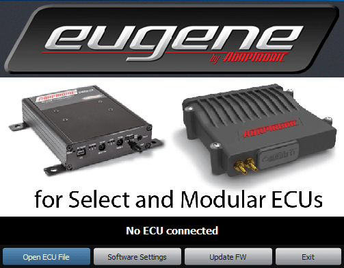
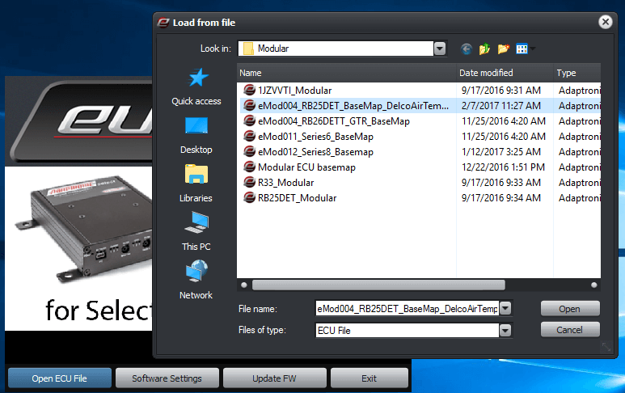
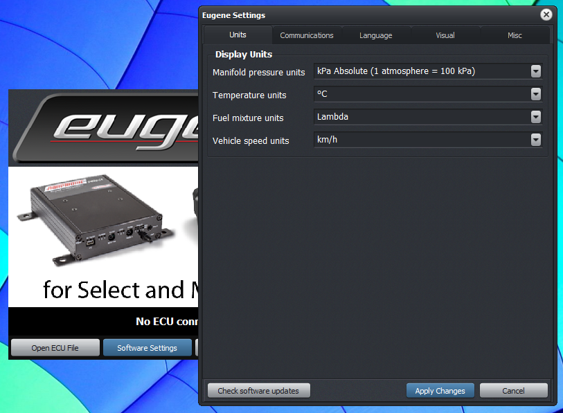
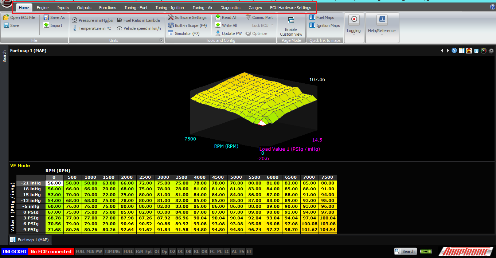
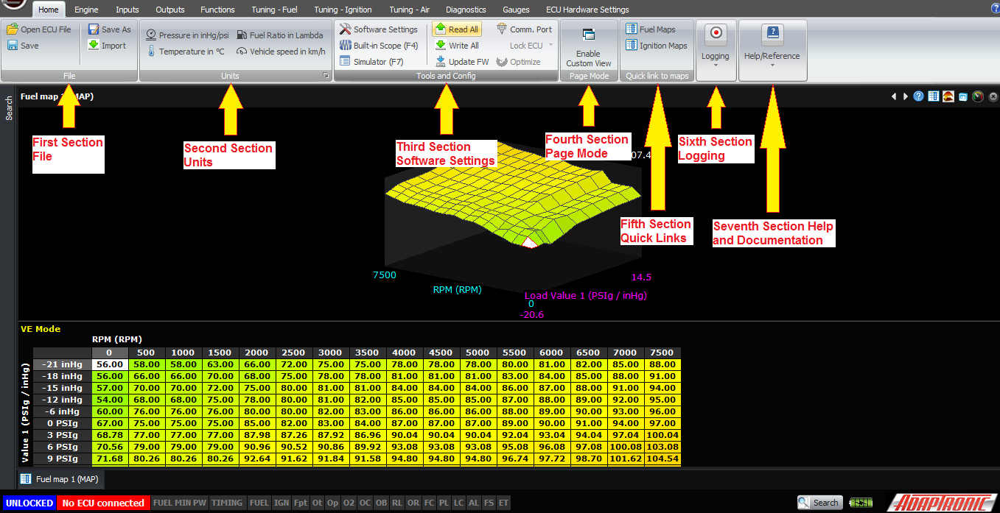
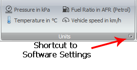
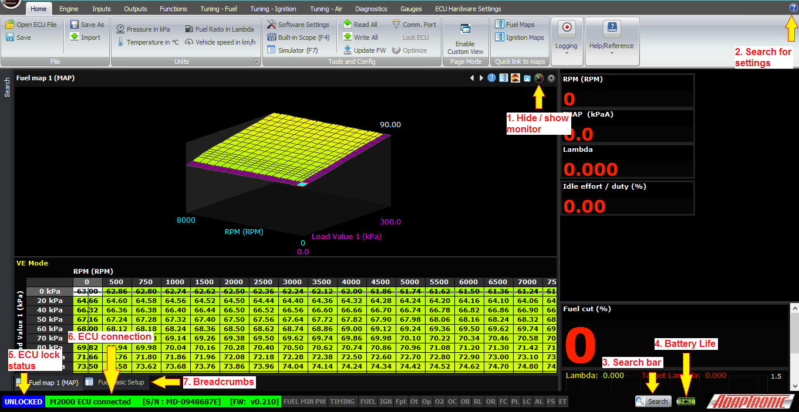

  
  
[Home
          menu and navigation](https://youtu.be/EA0nEVIsLuc)  
  
  
  
[DOWNLOADS](#)[STORE](#)[CONTACT US](#)  
  
  
  
  
  
  

Home Menu and Navigation

[go back to support
                home](EN_EUGENE_HOME.md)  

  
  
  

[Eugene Basics  

              ](EN_EUGENE_ABOUT.md)  

[  

              ](EN_SelFW.md)

  

  
  
  
  
  
  
Firstly, when the
                    Eugene software is started, it presents you with a
                  startup screen:  
  

  
From here, you can change the software settings, exit, update
                  firmware in the ECU or load an ECU file.  
  
In most cases, you would be working online, with an
                  ECU connected. If the ECU is connected via USB (note: the ECU
                  does not need 12V power connected; you can do it on the bench
                  just with a USB connection) and everything is working then the
                  software will automatically detect the ECU and read the
                  settings out, and then go to the main screen. This ensures
                  that you are looking at what is actually in the ECU.  
  
If you want to work offline, you can click “Open ECU
                  File” and it will prompt you to locate the file to load, and
                  you can then load the file you want to work on.  
  

  
The “Software Settings” allows you to change software settings
                  such as the ECU connection mode and language, without going
                  actually into the software. Update firmware allows you to
                  connect to an ECU and update the firmware without loading the
                  settings. This would be useful if the firmware in the ECU was
                  corrupted somehow. The firmware update procedure will be
                  explained later.  
  

  
Once you have either opened an ECU file or the settings have
                  been read from the ECU, the software presents you with the
                  main screen:  
  

  
Along the top of the ribbon, there are menu options such as
                  Home, Engine, Inputs, Outputs and so on. These allow you to
                  select the area of settings or data that you want to access. I
                  won’t be describing all of them in this article.  
  
Once you have selected a menu at the top, for example
                  “Home”, the contents of that ribbon will appear underneath,
                  and you can select the option that you want. Note that the
                  screens and settings available depend on the ECU connected;
                  connecting a Select instead of a Modular ECU or opening a
                  Select instead of a Modular ECU file in offline mode will show
                  you completely different maps and settings.  
  

  
  
1.The first section is called“File”and it’s really
                  just file hygiene, giving you the ability to load and save
                  files using the standard Windows file requester. By default
                  Eugene makes a folder within My Documents but it’s up to you
                  to make folders for each car that you do and save backups as
                  you progress with the tune.  
  
There is also an “import” option which allows you to
                  import certain settings from another ECU file, without
                  overwriting others. For example you can import just the dwell
                  time settings from another tune that used the same ignition
                  coils but leave the rest of the settings alone.  
  
The

at
the
                  top left also gives you these options, as well as shortcuts to
                  recent files  
  
2. The second section is“Unit”or the unit
                  selection. Normally you wouldn’t need to set these more than
                  once, but because people really want to make them how they
                  want without trying to find them in menus, we have these
                  settings on the home ribbon. While tuning I will often flick
                  between lambda and AFR or PSI and kPa, as I have to watch
                  different gauges separate from the ECU, for example. Down the
                  bottom right of that box is a shortcut to the software
                  settings window.  
  

  
  
Just one point to remember: these unit settings do
                  not change how the data are stored or processed in the ECU.
                  The ECU thinks in lambda; the only time it converts to AFR is
                  to calculate the amount of fuel to be delivered, and in that
                  case it uses actual AFR, ie lambda multiplied by the stoich
                  ratio. When you choose in the software to display lambda as
                  AFR, it does not show you the actual AFR; it shows you lambda
                  times 14.7. Even though it’s wrong, almost every tuner I’ve
                  met who asks to see lambda expressed as AFR wants it this way,
                  because he is used to thinking in targets for petrol (or
                  gasoline, depending on the language you’ve selected). So in my
                  experience tuners still want to see targets of 11:1 for E85 on
                  boost, even though that would be leaner than stoich if taken
                  literally.  
  
Similarly, the ECU does not think in manifold gauge
                  pressure; it thinks in manifold absolute pressure or MAP. The
                  only time barometric pressure is taken into account is when
                  measurements relative to MAP are required, and taken with a
                  gauge pressure sensor (for example, fuel pressure) or using
                  pressure ratio tuning where you don’t have an absolute
                  pressure sensor for EMAP. But again, every tuner who wants to
                  see pressure in PSI does not want to see absolute pressure in
                  my experience. At atmospheric pressure, they want to see 0
                  PSI, not 14.7 PSI. And to make matters even more complex, they
                  want to use different units for less than atmospheric
                  pressure, namely inches of mercury. Hence in this mode we
                  subtract 1 bar of pressure from the MAP before displaying it,
                  and display in PSI if this value is positive and inches of
                  mercury if this is negative. We can also output this
                  calculated value for race dashes, because no race dashes seem
                  to do this conversion internally despite the fact that it’s
                  what tuners seem to ask for.  
  
3. The third section is the“Software
                    Settings”, which also includes the ECU
                  communication settings, reading / writing settings to/from the
                  ECU, firmware update and security. The software settings allow
                  you to change the units, as already discussed. The connection
                  to the ECU can also be changed, the default being USB which is
                  by far the fastest way to connect to a Modular or Select ECU.
                  The language can be changed also; Eugene has been written to
                  be multilingual in its architecture. The final tab gives you
                  some other personal preferences that you can adjust. In
                  automatic updating mode, Eugene will automatically connect to
                  our server and download any updates while using Eugene. It
                  will then prompt you to install the update after you close
                  Eugene. We’ve all had the experience of going to use a piece
                  of software and it forces you to update before you use it, and
                  personally I never do because I’m in a hurry and I want to use
                  the software instead. I’m sure we’ve also had experiences
                  where Windows suddenly decides to restart and perform 40 or
                  100 updates when you’re on the dyno and trying to tune a car,
                  so we wanted to avoid contributing to that source of
                  frustration.  
  
As mentioned before, when you start the software and
                  an ECU is connected, Eugene reads all the settings from the
                  ECU so that you’re looking at what’s in the ECU. So there’s
                  not usually any need to click the “Read All” button, but if
                  you want to confirm what’s in the ECU, then you can do that.
                  While the software is reading the settings from the ECU, it
                  will display this status on the bottom left of the window in a
                  status bar. Similarly, when you make a change to an ECU
                  setting, the ECU is updated immediately and transparently so
                  you don’t need to do anything, but if you want you can click
                  “Write All” and the progress will be displayed on the bottom
                  left.  
  
Update FW allows you to update the firmware in the
                  ECU. This can’t be done with the engine running, but just like
                  reading and writing settings, it does not need 12V power. In
                  fact I would normally turn off ignition power during this
                  process so that if there’s a configuration error it doesn’t
                  cause anything to go wrong on the engine.  
  
Clicking on Update FW brings up the firmware update
                  window. From there the window tells you the serial number of
                  the connected ECU and that it’s ready to update the firmware.
                  Click on “load” to select the firmware file to load; it will
                  have an extension of “.ADF”. Then click “Program” and it will
                  program this into the ECU. The progress bar will move in
                  segments as each part of the ECU is programmed; currently
                  there will be 4 chunky steps for the control board, plus 1
                  smoother step for each module installed, so an M2000 will go
                  in 4 chunky steps then 1 smoother step, but if you have an
                  additional module populated for example drive by wire, there
                  will be 6 steps. A fully populated M6000 will take longer than
                  an M2000 because each module in the ECU has to be programmed
                  with the latest firmware. Each module has its own processor so
                  that as more features are added to the ECU, it has enough
                  power to operate them all.  
  
You should click “verify” to check that it was done
                  correctly; it’s very quick to do and good practice.  
  
Once that is done, you click “exit” on this window.  
  
The “comm port” allows you to change the connection
                  of the ECU, just as in the software settings.  
  
The “Lock ECU” on a Modular ECU allows you to lock
                  the ECU so that the settings can not be read out. They can
                  only be changed if you load a complete new file into the ECU.
                  The motivations of people locking ECUs are varied; from
                  preventing people copying your tune that you’ve spent years
                  refining, to preventing internet “experts” posting your maps
                  online and saying how bad they are, without having first put
                  it on a dyno and seen what the AFR actually does (some engines
                  are cantankerous and end up with funny shaped maps, or the map
                  may end up looking funny to compensate for an inadequacy in
                  the system). Some tuners say that they do it to save customers
                  from themselves, because otherwise they would fiddle with it
                  and damage their engine. The lock code is an 8 hex digit
                  number, so 32 bits in total. This can only be done with the
                  engine not running.  
  
There is a second button there called “Optimize”
                  which is for Modular ECUs. It’s similar to the lock function
                  in that it encodes the maps in a format that’s quick for the
                  ECU to read, but it just doesn’t apply the security as the
                  lock function does. It can also only be done with the engine
                  stopped. The ECU periodically does this automatically under
                  certain conditions anyway so there’s no need to do it manually
                  (I’ve never done it).  
  
4. The fourth section is“Custom
Page
                    View”,it
allows
                  you to display your own combinations of maps and live
                  variables on the screen at once, if you prefer to see
                  different things on the screen from what we have selected in
                  the defaults.  
  
5. The fifth section is the“Quick
                    Links”,ithas
shortcuts
                  to fuel and ignition maps, rather than requiring you to
                  navigate to them. The F5 function key does this also.  
  
6. The sixth section is the “Logging”,
                  it allows you to control logging. Eugene records logs in
                  2 formats; our proprietary binary format (ALG) and a standard
                  CSV format. The ALG format includes metadata like the map at
                  the time the log was taken, and about 1000 channels of data.
                  The CSV file does not include the map, and the data channels
                  are limited. However in the CSV Log Channels setting box you
                  can select additional channels that you want to log. The
                  reason we log everything in the ALG file is that Murphy’s law
                  tells us that sooner or later, the thing that you are actually
                  looking for in the log, won’t be there because you didn’t
                  think that you needed to log it when you started the log.  
  
Start Log, or Ctrl+L, same as WARI, starts Eugene
                  logging data and saves the data in both file formats. It will
                  ask you where to save the file and give it a name, by default
                  the name is the date and time. Once you click OK to the save
                  window, Eugene will be logging. This is indicated in the
                  status bar at the bottom. Stop Log, or Ctrl+K, stops the
                  current log.  
  
Open Log Viewer opens the Adaptronic log viewer
                  program with the log which was just recorded.  
  
The Log Converter button allows you to convert a
                  binary ALG file into a CSV file, for viewing in Excel or
                  another third party log viewer.  
  
7. The last section is for“Help
and
                    Documentation”. Currently this displays a view of
                  the ECU connector (always looking into the ECU), with a 
                  list of pins and wire colours. The wire colour and pin
                  description can be changed by the tuner so that they can
                  record for example that auxiliary output 2 drives the variable
                  valve lift solenoid and has a blue wire with a black trace. As
                  well as displaying text and colours that you have selected,
                  where that pin connects inside the ECU is shown, and that
                  context changes depending on the ECU settings. For example, if
                  you have a 3 rotor engine with 2 injection stages, the
                  injector outputs 1-6 will be displayed as injector 1 primary,
                  injector 2 primary, injector 3 primary, injector 1 secondary,
                  injector 2 secondary and injector 3 secondary. Injector
                  outputs 7 and 8 will just be called 7 and 8. Similarly the
                  ignition outputs in a rotary mode with leading and trailing
                  outputs, are displayed as such. Base maps have these pin
                  descriptions and wire colours populated according to the
                  factory loom as best we can determine. From this screen you
                  can also open the wiring diagram as a separate PDF, so it can
                  be printed easily.  
  
The final panel allows Eugene to submit a log to
                  Adaptronic’s technical support system, rather than having to
                  separately save files and email them. You must enter a valid
                  email address to receive a response. This goes through the one
                  support system that also covers the sales and tech email
                  addresses, Facebook page posts and Facebook page messages, so
                  it gets checked along with all of those. Just like with any
                  support, we need to see a log that demonstrates the problem
                  you’re having and a text description from you so we know what
                  to look for.  
  

  
  
In all of the screens, you can select whether to hide
                  or show the (1) monitor, which is a set of gauges down the
                  right hand side. The top part of that monitor window is
                  constant for all screens, but the bottom part can be changed
                  from one screen to the next to show the most relevant data.  
  
There are some other useful indicators on the main
                  window:  
  
At the top right is a (2) blue question mark, which
                  you can use to search for settings, or context help. For
                  example if you don’t know where to find target slip for
                  traction control, you can go to that, select “Find Settings”
                  and type “slip” into the search bar, and click the magnifying
                  glass. By clicking on the search result, you can jump straight
                  to that setting.  
  
At the bottom there is a larger (3) search bar which
                  does the same function. Next to that is some information that
                  you’d normally want to see while tuning, such as the (4)
                  battery life, time and date. There are two status indicators
                  on the left; (5) one shows the ECU lock status (locked or
                  unlocked) and the other shows the (6) ECU connection /
                  settings synchronization and logging status. When an ECU is
                  connected, it shows the serial number, type of ECU and
                  firmware version.  
  
Just above that is a list of the previous screens
                  you’ve been to, so you can navigate back to them easily. I
                  believe in web design speak these are called (7) “breadcrumbs”
                  which is a reference to Hansel and Gretel.  
  
That covers the home ribbon, the next articles will
                  go into the contents of the other ribbons and how to set up
                  the ECU from scratch.  
  
Thank you very much and happy learning!  
  
©2018
        Adaptronic  
  
