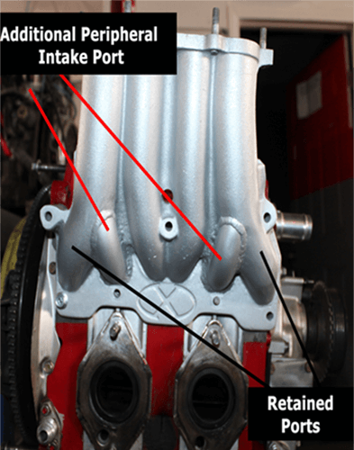
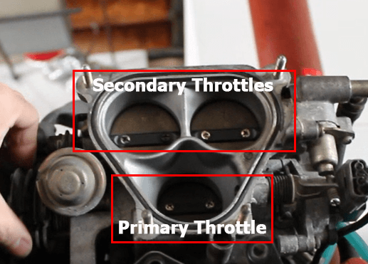
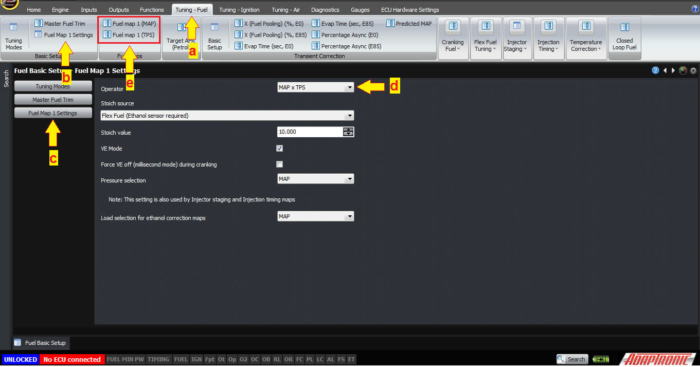
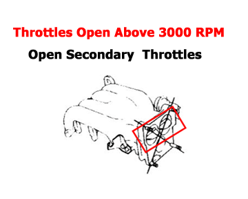

  
  
  
  
  
  
[DOWNLOADS](#)[STORE](#)[CONTACT US](#)  
  
  
  
  
  
  

Semi-Peripheral Rotary Tuning

[go back to
                support home](EN_EUGENE_MOD_HOME.md)  

  
  
  

[The Modular
                Fuel Model  

              ](EN_MOD_029_FUELMODEL.md)

[Fuel Pressure in RX7
                FDs  

              ](EN_MOD_006_FUELPRESSURE_FD.md)

  

[  

              ](EN_SelFW.md)

  

  
  
  
  
  
  
  
  
  
  
Once one of our dealers was tuning what’s
                commonly called a semi peripheral 13B engine. For those not
                familiar with this porting arrangement, this is a standard 13B
                2-rotor engine, where the two side intake ports are retained,
                but an additional peripheral intake port is added. So each rotor
                has 3 intake ports.  

  
  
If
                you’ve looked at a standard FD intake manifold, you’d have seen
                that each of the side inlet ports has its own runner, so there
                are 4 runners in total. On a semi peripheral intake manifold,
                the peripheral port gets its air from the original runner for
                the secondary port.  
  
This
                engine had a Borg Warner turbocharger so it was making about 5
                PSI of boost around 2000 RPM, even at about 30% throttle. The
                engine could be tuned correctly for this condition, but then
                when the throttle was opened to 100%, it was lean, and needed
                about another 20% more fuel.  
  
Why
                would this be? If the pressure in the inlet manifold is the
                same, why would the engine need different amounts of fuel? This
                doesn’t usually happen. Originally I thought there might be
                something funny with the car, or there was fuel pressure
                pulsation or something strange.  
  
But
                within a few minutes of trying it on the dyno myself and looking
                at the engine, I worked it out. The FD has staged throttles; the
                first 30% or so of travel only opens the primary throttle, which
                provides air to the primary ports only. The remainder of the
                travel opens up the secondary throttles, which provide air to
                the secondary ports. Therefore, the port timing depends on
                throttle position.  
  

  
  
And
                we all know what that means, when you have a turbocharged engine
                where the VE changes with TPS independently from boost, it means
                the engine has to be tuned by MAP x TPS.  
  

  
  
[(a) Go
to
                    Tuning Fuel. (b) and (c) Click on Fuel Map 1 Settings. (d)
                    Set the operator to MAPxTPS (e) You will notice Fuel map for
                    MAP will appear together with Fuel map for TPS.](http://www.adaptronic.com.au/wp/wp-content/uploads/2017/02/MAPxTPS.png)  
  
Now,
                there are a few ways you can do this. The way I chose to do it
                was to tune the MAP based on the primary throttle, and the TPS
                map tells the ECU how much better the engine breathes as the
                secondary throttles are opened.  
  
The
                way to do this is to lock the secondary throttles so that they
                don’t open. This can either be done by manually closing the
                second throttles which are normally under ECU control, or
                removing the linkage that opens the second throttles. Then set
                the TPS map to 100% everywhere, and tune it up on MAP as per
                usual, up to wastegate boost pressure.  
  
Then
                re-enable the secondary throttles, and then adjust the TPS map
                to get the correct mixtures, again up to wastegate pressure.
                Then as you increase the boost, make corrections on the pressure
                based map.  
  
This
                tuned up excellently on several of these that I’ve helped tune.
                Depending on the exact porting though, it might be possible that
                drivability is not going to be great a certain low RPM / high
                throttle openings, due to intake reversion. In this case, the
                options are to either drive around it, or better is to retain
                the ECU control over the secondary throttles, using a vacuum
                tank, check valve and a solenoid valve as on the factory system.
                Then when the solenoid is activated and vacuum is applied to the
                diaphragm, the secondary throttles close. So the ECU can be
                configured to hold this output low when the RPM is below say
                3000 or wherever the problem area finishes.  

  
We
                would like to thank these people; Ric Shaw, Aaron
                Parker and Alex Rodriguez for giving us visuals on some
                parts of their car.  
  
Thank
                you and happy learning!  
  
©2018
        Adaptronic  
  
