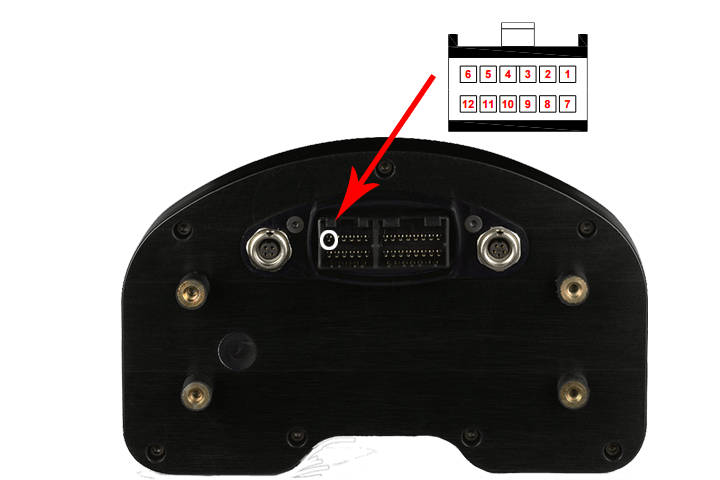
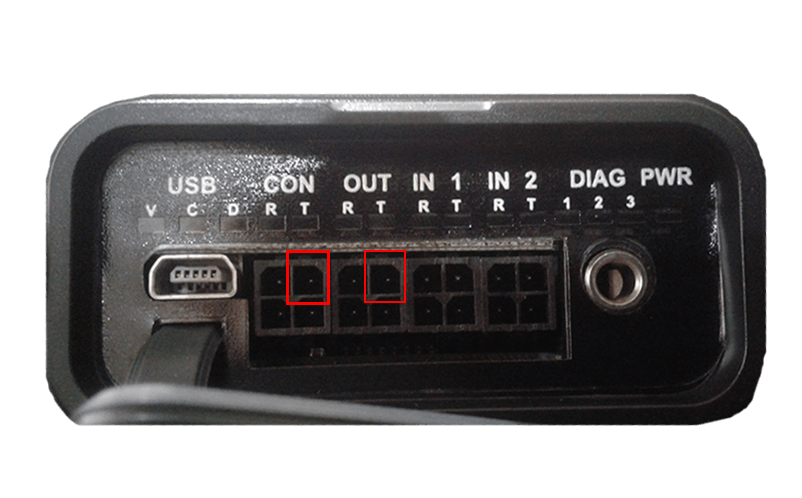
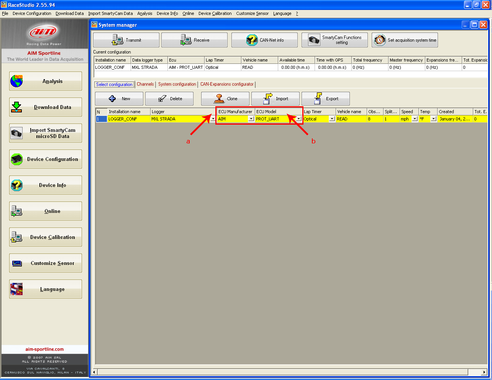
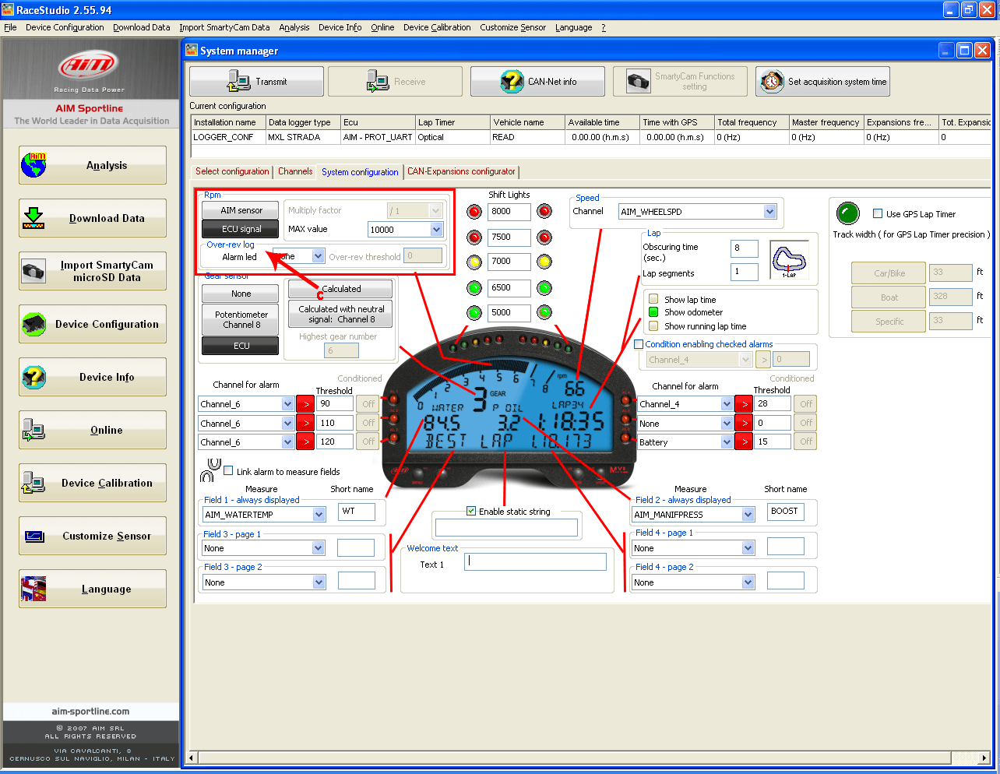
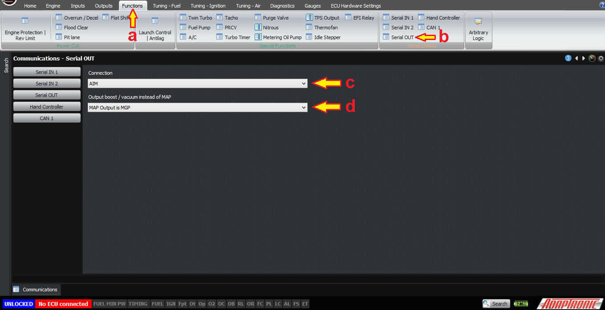

  
  
  
  
  
  
[DOWNLOADS](#)[STORE](#)[CONTACT US](#)  
  
  
  
  
  
  

Setting up AIM MXL Dashes with Modular ECUs

[go back to
                support home](EN_EUGENE_MOD_HOME.md)  

  
  
  

[Setting
                up AEM Dashes  

              ](EN_MOD_051_AEMDASH.md)

[Configuring
                Serial Out  

              ](EN_EUGENE_SERIAL_OUT.md)

  

[  

              ](EN_SelFW.md)

  

  
  
  
  
For ease of setting up the AIM series of
                  dashes, the Adaptronic Modular ECU can output natively in the
                  AIM serial protocol.  
  
  
This can be done on either the CON
                  port or the serial OUT port, both at the front of the ECU.  
To make the connection, simply connect the TX pin from
                  the connector to the RX data pin on the dash (pin 6 on the
                  dash).  
  

  
  
The TX pin on the connector is the top-right when looking
                  into the front of the ECU.  
  

  
  
The channels output are as follows:  
  
Every 80 ms:  

- 1
                      RPM
- 5
                      Vehicle speed
- 45
                      Overall throttle position
- 69
                      Manifold absolute / gauge pressure
- 9
                      Oil pressure
- 21
                      Fuel pressure
- 105
                      LambdaEvery 560 ms:  

- 13
                      Oil Temp
- 17
                      Coolant temp
- 33
                      12V supply
- 97
                      Air temp
- 101
                      EGT 1
- 109
                      Fuel temp
- 113
                      Gear selected
-   
In the AIM software, you must (a) select the ECU
                  manufacturer as AIM, and (b) the protocol as Prot_UART.  
  

  
  
(c) Select the RPM signal, speed and gear signal as coming
                  from the ECU.  
  

  
  
In the Eugene software, the output type for the port you
                  choose must be set. To do this open Eugene software and (a)
                  click on “Functions” tab. (b) Go to Serial Comms panel then
                  select Serial OUT. (c) Set AIM Serial as the connection and
                  (d) Output boost as either MAP or MGP. If you want to display
                  boost on the dash instead of MAP, then you will need to select
                  MGP in the software option. Unfortunately the dash does not
                  support having different units depending on whether the value
                  is positive or negative, so if you choose units of boost as
                  PSI then vacuum will also be in PSI.  
  

  
  
Thank you and happy learning!

  
©2018
        Adaptronic  
  
