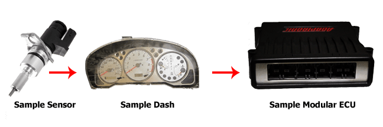
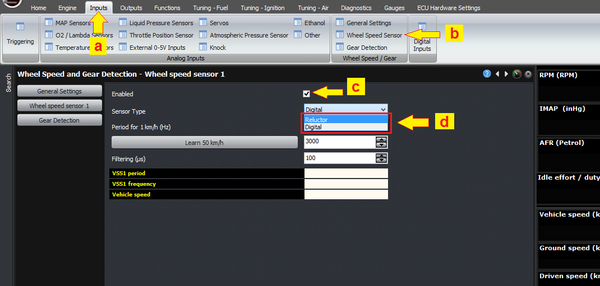
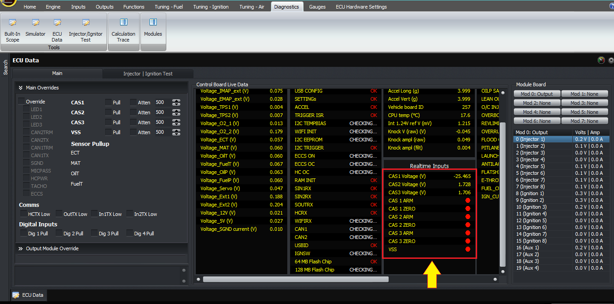
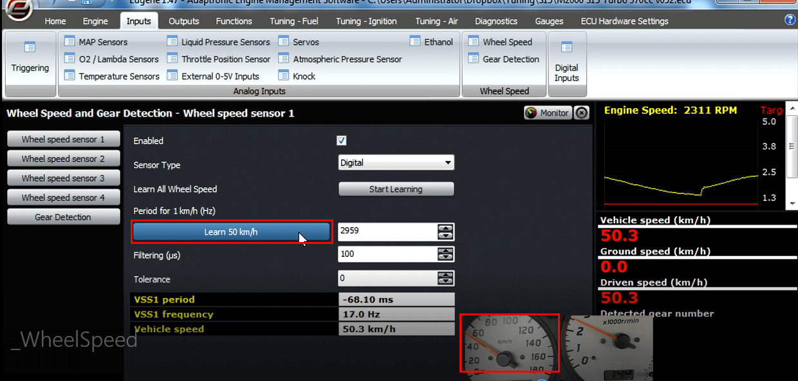
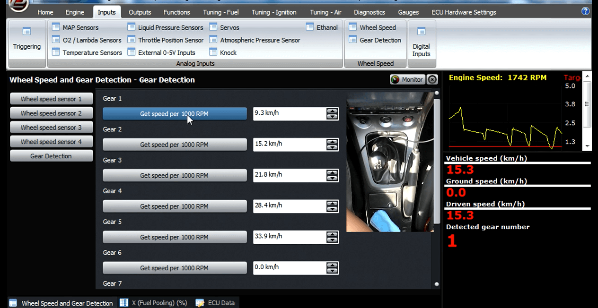

  
  
  
  
  
  
[DOWNLOADS](#)[STORE](#)[CONTACT US](#)  
  
  
  
  
  
  

Wheel Speed Inputs & Gear Detection on
              Modular ECUs

[go back to support
                home](EN_EUGENE_HOME.md)  

  
  
  

[Setting up
                inputs on Modular ECUs  

              ](EN_MOD_008_INPUTS.md)

[  

              ](EN_EUGENE_KBSC_TG.md)

  

[  

              ](EN_SelFW.md)

  

  
  
  
  

  
This article explains how to set up and use wheel speed
                inputs on the Modular ECUs.  
Most cars have a tailshaft speed sensor mounted in the
                gearbox. This either connects to the ECU, or to the dash which
                then outputs a signal to the ECU. We need to be able to read
                road speed to perform functions such as idle control on some
                cars, launch control, gear detection and traction control.  
  
Almost all the speed sensors you will find are magnetic in
                nature, but the technology varies between different sensors. As
                far as the ECU is concerned, there are two kinds of inputs it
                can accept; a digital signal that is pulsed to ground with a
                varying frequency, or a variable reluctance sensor which gives
                approximately a sine wave output whose frequency again varies
                with speed.  
  
Both of these input types can be wired into the VSS input
                on the ECU, and this is done in the factory wiring of plug and
                play ECUs (assuming the car has a VSS from factory).  
  

  
  
For the digital switch type sensor, you must select the
                type as digital in the wheel speed input settings. For the sine
                wave analogue type, you must select reluctor as the type.  
  

Go
                  to (a) Inputs tab (b) select wheel speed (c) tick the check
                  box to enable wheel speed sensor (d) then select for the
                  sensor type (digital/reluctor).  
  
On some older cars, this digital signal is generated using
                a magnetic reed switch. A magnet on a rotating shaft causes the
                reed switch to close as the magnet passes it, which pulls the
                signal to ground. Because it uses mechanical contacts, they tend
                to bounce when they close instead of making a clean square wave.
                Therefore to use this kind of sensor, you may need to run a high
                value on the filter setting to filter out this contact bounce.
                Normally much lower filter settings can be used on Hall effect
                sensors.  
  
Once you have wired in the wheel speed sensor, you can
                verify that it’s working by checking the ECU data window in the
                software. As the wheel rotates, the VSS input should change
                state continuously, and it should keep the same state when the
                car is no longer moving.  
  

  
  
Assuming that this is working, the next step is to
                calibrate the road speed. If you have selected km/h as your
                speed units, the software will give you an option to learn the
                50 km/h calibration value. In miles per hour mode, the target
                speed is 30 mph. To learn the speed, drive the car to this
                speed, and hit the “learn” button in the software. After this,
                the road speed should read accurately.  
  

  
  
In a manual transmission car, you can now go through the
                different gears and learn them in turn. This does not require
                driving at any specific speed; simply drive in each gear with
                the clutch fully engaged (ie not slipping), and hit the “learn”
                button for that gear. The ECU then learns the ratio between the
                road speed and RPM and uses that to detect which gear is
                engaged. After this, the gear number in the gauges window should
                also read correctly when driving in that gear. This is useful in
                reviewing data logs, to gain context and driver training, but
                also to select different boost pressure in different gears.  
  

  
  
On systems with individual wheel speed sensors, as required
                for traction control, the process is the same but the wheel
                speeds must all be learnt at the same time. If you have a two
                wheel drive car and you’re using a dyno to do the learning, then
                you can manually copy the calibration from the two driven wheels
                to the two passive wheels, assuming the front and rear wheels
                have the same type of tyre.  
  
Thank you and happy learning!  
  
©2018
        Adaptronic  
  
