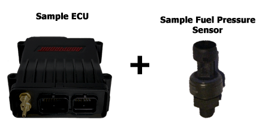
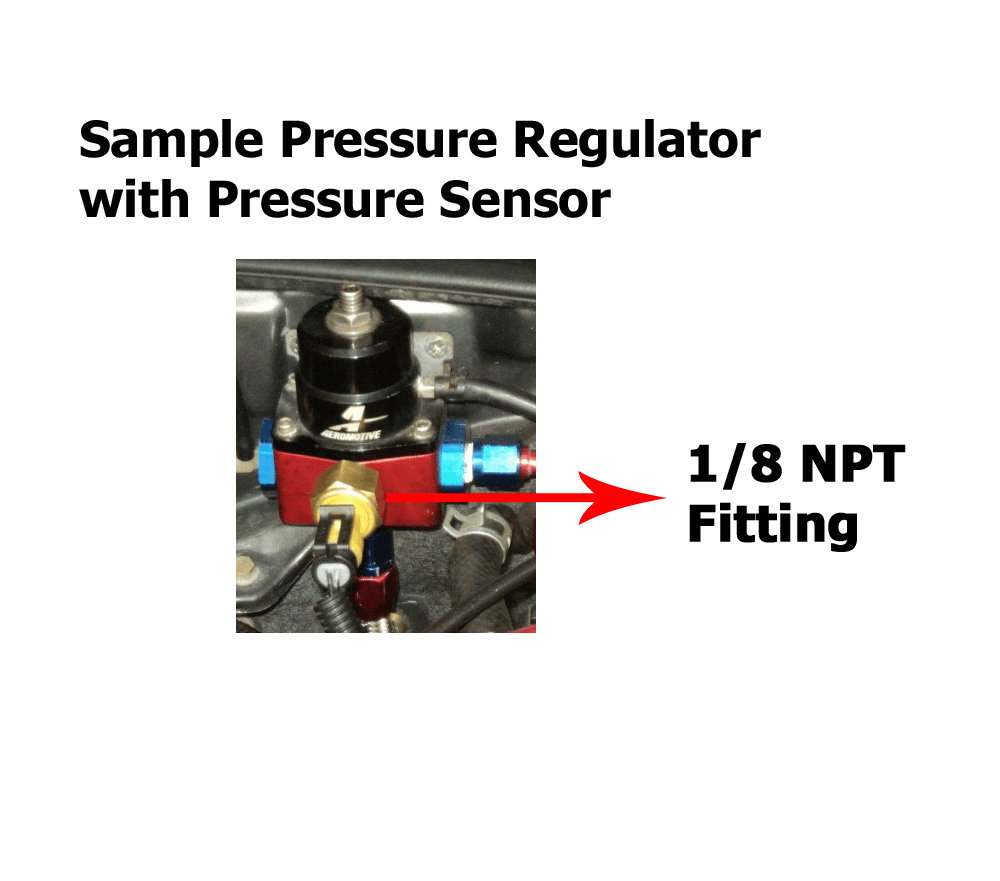
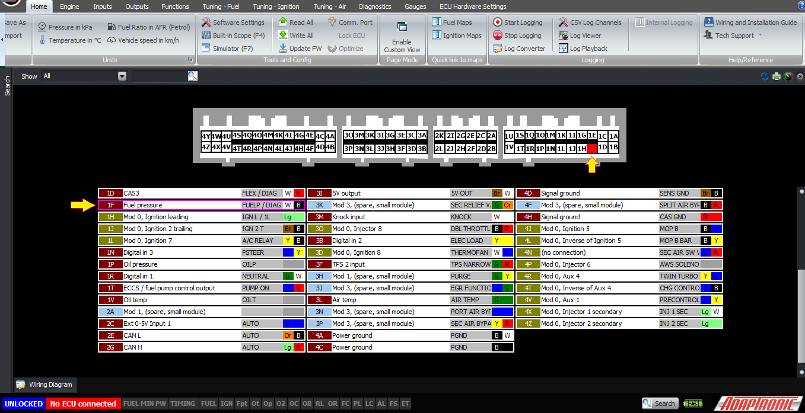
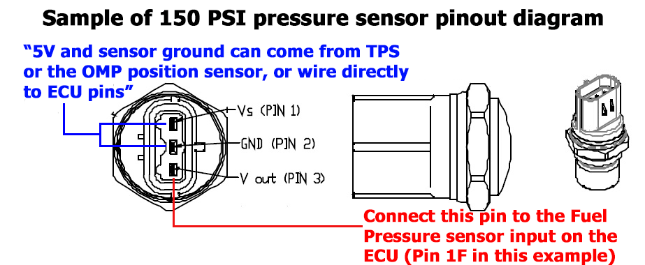
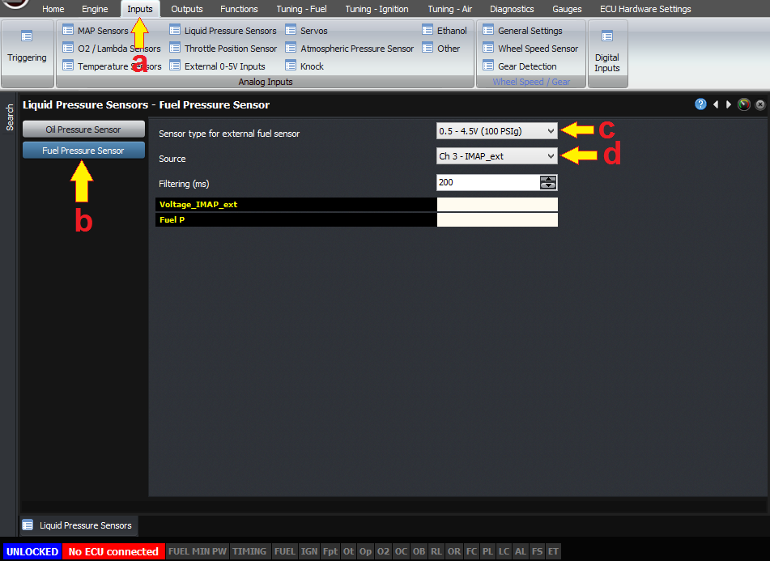
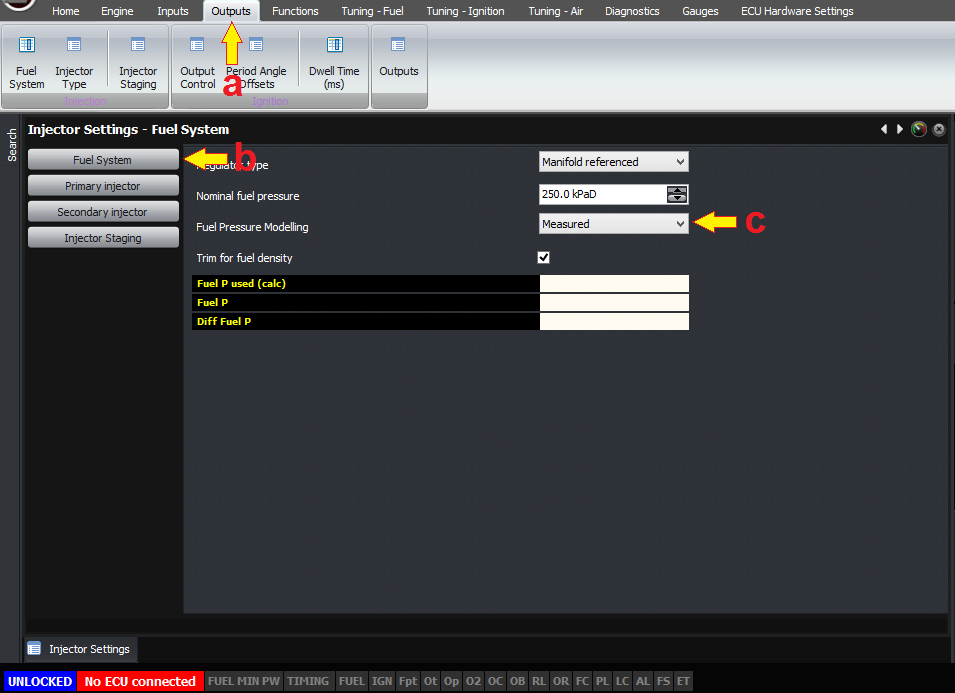

  
  
  
  
  
  
[DOWNLOADS](#)[STORE](#)[CONTACT US](#)  
  
  
  
  
  
  

Measuring Fuel Pressure on Mazda RX7s

[go back to
                support home](EN_EUGENE_MOD_HOME.md)  

  
  
  

[Setting up
                inputs for Modular ECUs  

              ](EN_MOD_008_INPUTS.md)

[Semi-peripheral
                tuning for Rotary Engines  

              ](EN_MOD_003_SEMIPP.md)

  

[  

              ](EN_SelFW.md)

  

  
  
  
  
  

  
I've explained in other articles the benefits to measuring
                fuel pressure; firstly it allows you to monitor the health of
                your fuel system but more importantly it allows the ECU to know
                the fuel pressure seen by the injectors, and therefore how long
                the injection pulse needs to be to deliver a given volume of
                fuel. So we highly recommend adding a fuel pressure sensor when
                installing an ECU.  
  
  
  

  
  
Most modified RX7s tend to convert to at least the secondary
                injectors to top-feed style to increase the flow. Because the
                factory fuel pressure regulator is mounted on the secondary
                rail, this means that normally an aftermarket fuel pressure
                regulator is added.  
  
This provides a convenient place to connect a fuel pressure
                sensor; because almost all aftermarket regulators have a 1/8 NPT
                fitting into which you can screw a gauge. So it's very simple to
                screw a pressure sensor into that location instead. The sensors
                we sell are 0-150 PSI gauge pressure; you can use other sensors
                but you must ensure they are rated for fuel use.  
  

  
Once you've mounted the fuel pressure sensor and checked
                for leaks, you can wire it in. There are two ways to do this if
                you're using a plug and play ECU. The first is to wire it into
                the dedicated fuel pressure input pin on the ECU. Cut the wire
                that goes out to the loom, and connect the signal output of the
                sensor to this pin. Then Tee the 5 Volt and sensor ground
                connections to those that go to the TPS, MOP sensor and so on.
                You can find these pins on the diagram in the software.  
  

  
  

  
  
The alternate method is to wire the fuel pressure sensor
                into the factory MAP sensor wires, and use the internal MAP
                sensor in the ECU to measure manifold pressure. If you do this,
                you'll need to select the (d) source for the fuel pressure as
                coming from the external IMAP (intake manifold absolute
                pressure) input.  
  

  
  
To change the source and sensor type go to (a)" Input"
                  tab in Home Ribbon, then (b) select "Fuel Pressure Sensor".  
  
You'll also need to (c) select the sensor type - 0 - 150
                PSI gauge being the most common, and once you're satisfied it's
                reading correctly, Select the fuel pressure as being "measured"
                as opposed to "nominal" in the software, and the ECU will
                automatically take the fuel pressure into account when
                calculating the injector pulsewidth.  
  

  
  
To change fuel pressure modeling, go to (a) "Output"
                  tab in Home Ribbon, then (b) select "Fuel System"  
  
Thank you and happy learning!  
  
©2018
        Adaptronic  
  
