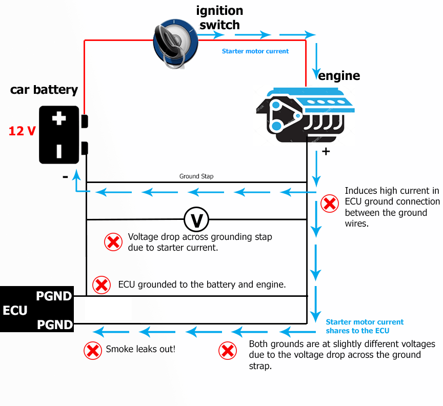
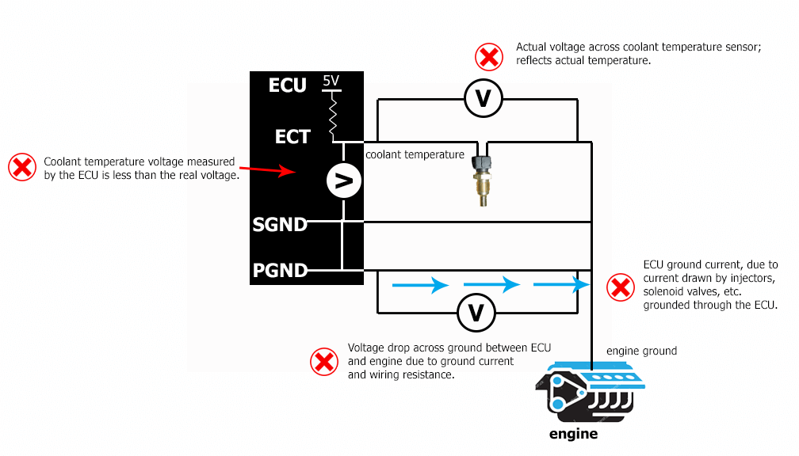
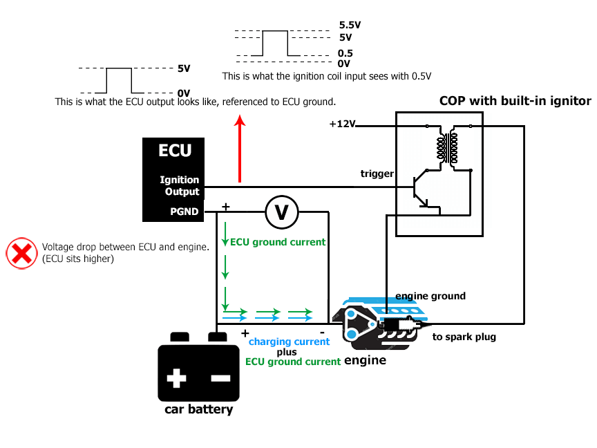
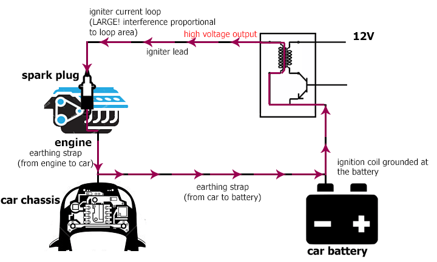
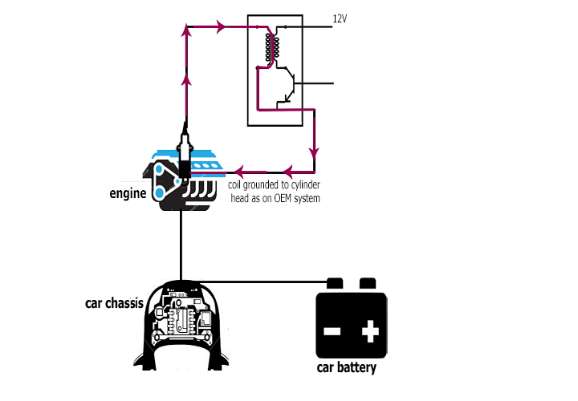
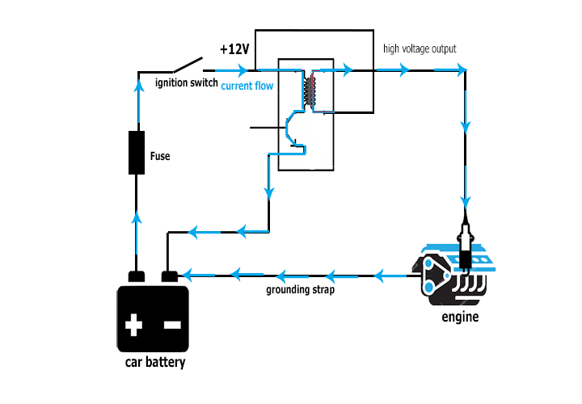
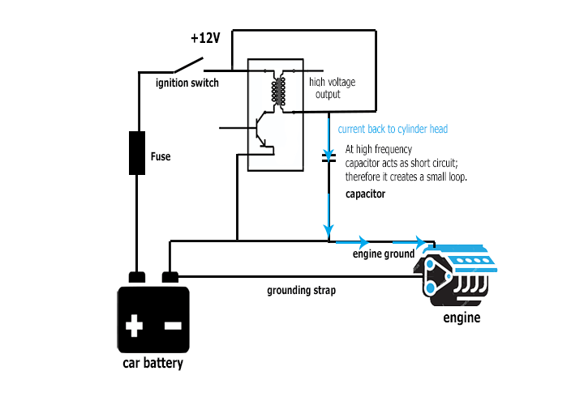

  
  
  
  
  
  
[DOWNLOADS](#)[STORE](#)[CONTACT US](#)  
  
  
  
  
  
  

ECU Grounding Tips

[go
                back to support home](file:///C:/New%20Help/EN_EUGENE_MOD_HOME.md)  

  
  
  

[Setting up
                Inputs on Modular ECUs  

              ](EN_MOD_008_INPUTS.md)

[Configuring
                Aux outputs in Modular ECUs  

              ](EN_MOD_011_AUXOUTPUTS.md)

  

[  

              ](EN_SelFW.md)

  

  
  
  
  
  
  
There have been many
                “debates” about the best way to ground ECUs, so the
                best way to answer this is to go back first to its theory.
                It is however, complex, with several separate considerations,
                and when someone see how they all interact they’ll see that
                there is an optimal solution which is the same for most cases.  
  
First of all we’ll going to discuss the separate
                problems we’re trying to avoid, and then how to analyse them and
                optimize the ground layout for each of the problems. The two
                main problems are ground offsets due to common impedance paths
                and magnetic field noise.  
Ground offsets are often not very well understood, which is
                a missed opportunity because they are quite simple to visualize
                if you draw a diagram.  
To analyse a system for ground offsets, first draw a
                diagram of the system. Then remember that every wire has
                resistance, which means that there will be a voltage drop
                across the wire, depending on the current flowing through it.
                Since we’re talking about the context of ECU grounding, we can
                look at the voltages from the ECU’s perspective and predict what
                can go wrong due to the voltage drops.  
  
In this first example, the installer has grounded the ECU
                to the engine and also to the battery. Someone might ask why
                would anyone do that, but some people do. During cranking, a lot
                of current flows through the ground strap between the engine and
                the battery, so there’s a voltage drop between the engine and
                the battery. This in turn induces current in the ground wires
                going to the ECU; or in other words, the ECU shares some of the
                starter motor current. Exactly how much depends on the relative
                resistances between the ECU grounds and the ground strap; if the
                ground strap is in good condition then not much; but otherwise
                people have blown up tracks in the ECU by doing this. So
                obviously this case is bad!  
  

This
                second example is one of the interview questions we use when
                looking for support engineers. It’s actually a mistake made
                by Mazda in the factory NA6 MX5 / Miata loom; they fixed it on
                the next model (the NA8). The sensor ground is externally
                grounded to the engine, as well as to the ECU. The ECU is
                grounded to the engine also. We know that as the injector duty
                cycle increases, the average ground current of the ECU will also
                increase, and therefore so will the voltage drop between the ECU
                and the engine. The ECU ground will be sitting at a slightly
                higher voltage than the engine ground, so any sensors connected
                to the engine ground instead of to sensor ground on the ECU,
                will read a lower voltage. In the case of coolant temperature,
                it means that as injector duty cycle increases, the voltage seen
                by the ECU on the coolant temperature input reduces and the ECU
                believes the engine is at a higher temperature. This is fairly
                easy to spot in logs; you can look for noise on inputs such as
                coolant temperature, throttle position etc, but it causes
                problems for obvious reasons.  
  

  
In this last example, the car has coil-on-plug ignition.
                The coils are grounded to the engine, and the ECU is grounded
                instead to the battery. As the engine speed increases, the
                alternator charge current increases and so the voltage drop
                between the engine and the battery increases also. Let’s assume
                the grounding to the ECU from the battery is also substandard,
                which means that as injector duty cycle increases, the voltage
                drop between the ECU and the battery also increases. We now have
                a double effect causing the ECU ground to sit higher than the
                engine ground. The coils however are grounded to the engine,
                which means that when the ECU is outputting zero Volts on its
                ignition output, the coil sees a positive voltage (equal to the
                voltage drop described earlier) on its input. Some coils with
                built-in ignitors only need 0.7V to trigger, which means that in
                extreme cases you could even get the coils to trigger by
                themselves, while the ECU is outputting zero volts on its
                ignition output. Of course this spark would be at a completely
                unpredictable engine angle and on a fragile engine like a rotary
                could destroy it very quickly. This is how important good ground
                hygiene is!  
  

In
                all of the examples, the problem is common impedance paths. We
                have one path (eg a wire) which has multiple things referencing
                it (eg injector current feeding through, but offseting the
                voltage for the coolant temperature sensor). The way around this
                is star earthing. People should pick a single point for
                ground, and reference all grounds there. Actually
                it doesn’t really matter whether this point is the engine
                or the chassis or the battery negative, but there are other
                factors which I’ll explain later.  
  
Sensors, if they have the ground isolated from the sensor
                body (for example TPS, pressure, temperature sensors), they must
                be grounded to the sensor ground on the ECU, not the engine
                ground. The reason for this is as given in the second example
                above; if you ground the sensor to the engine ground, then its
                output is going to be offset by the ground current times the
                ground resistance. This is why ECUs have dedicated sensor ground
                wires.  
  
  
If the sensor’s ground is not isolated
                from the body of the sensor and it has to screw onto the engine,
                for example many Nissan cam angle sensors, narrowband oxygen
                sensors and many knock sensors, then you don’t have a choice;
                you have to choose the star point ground at the engine. Because
                the engine is so thick and low resistance, the actual point on
                the engine doesn’t matter too much; but often this point is on
                the inlet manifold or cylinder head on production cars.  
  
The next issue that we need to discuss is magnetic field
                noise. This is one of the two forms of electrical interference
                that can be generated by electrical circuits. This is actually
                an entire discipline called EMC, or electromagnetic
                compatibility, and spark ignition engines have their own
                standard they must comply with (it’s called CISPR12 if you’re
                curious).  
Magnetic fields are created by currents flowing in a loop.
                We all remember from school that current has to flow in a
                circuit, but they probably didn’t tell you that currents flowing
                in a loop create a magnetic field. The higher the current, and
                the higher the loop area, the greater the magnetic flux.
                Increasing the number of turns also increases the flux which is
                why ignition coils, fuel injectors, transformers and so on have
                many turns of wire. The main consideration we have to worry
                about with magnetic field noise is high frequency noise; and the
                noisiest source of magnetic field interference in an ECU system
                is the high voltage side of the ignition system. If you consider
                the circuit of a typical direct fire system, the high voltage is
                generated at the output of the ignition coil. The current
                travels along the ignition lead (if there is one), down the
                center electrode of the spark plug, where it jumps the gap via
                ionized air and down to the ground strap of the spark plug. From
                there the current flows into the cylinder head or rotor housing,
                and it has to find its way from there back to the secondary of
                the ignition coil. On most modern coils this connects through
                the power ground terminal of the ignition coil. Therefore, to
                minimize electrical interference, this loop area has to be as
                small as possible. If you ground the ignition coil to the
                battery, you have a problem because the high voltage current has
                to flow out of the head, to the grounding strap to the battery
                and then back from there to the ignition coil. The loop area is
                very large compared to if the coil was grounded to the head, and
                this creates electrical interference. This interference can get
                into crank angle sensor wiring and cause triggering problems,
                but more on that later.  

  
Large Loop Area  

  
Small Loop Area  
On old style, 2-pin ignition coils, the secondary of the
                coil is connected not to ground but to the positive 12 Volt
                supply to the coil. Therefore there needs to be a path from this
                12V supply back to the cylinder head. Without any other changes,
                this would have to go through the battery and then from the
                battery negative to the engine through the grounding strap. That
                is a large loop area. So in such systems normally they would
                have a capacitor that connects between the 12V supply to the
                coil and ground. The capacitor can be thought of as being a
                short circuit at high frequencies, so the high frequency current
                from the ignition system can then bypass the rest of the
                electrical system on the car and go straight back to the head.  

  
Large Loop Area  

  
Small Loop Area  
  
As mentioned earlier noise getting into crank angle sensor
                wiring and causing triggering problems. Firstly, this can often
                be misdiagnosed because it’s a complex interaction. As the load
                on an engine is increased, the ignition system generates more
                noise, because it requires a higher voltage to ionize the higher
                pressure air in the cylinder. This noise can then get into the
                trigger input. So although it’s a trigger problem, it is load
                dependent. And although it’s a trigger problem, it’s caused by
                the ignition system. So the fact that a misfire is load
                dependent does not rule out a trigger problem, but at the same
                time changing the ignition system may not fix the problem.  
  
Also, they say that there’s no shortage of advice online
                but there’s a shortage of good advice. We’ve seen people say
                that “you should rerun your crank angle sensors with really good
                shielding and that will help keep out the ignition noise”. If
                the shield is copper or aluminium, it’s not going to do anything
                to the magnetic interference because those metals are not
                magnetic. So although people say to do it, my first
                recommendation would be to check that the ignition loop current
                area is as small as you can make it. If we’ll look at any OEM
                ignition system, we will see that’s exactly what they’ve
                done.  
  
There are other factors that will influence the amount of
                magnetic noise that a system generates. Running non-resistor
                plugs will generate more noise than resistor plugs. Running
                solid leads will generate more noise than resistor leads. Higher
                boost / load will generate more noise. Larger gap will generate
                more noise for the same reason.  
  
Finally, most ECUs allow changes to the amount of filtering
                and voltage thresholds for the crank and cam sensor inputs, so
                in many cases you can filter out the noise anyway. In some cases
                it just won’t be possible though and it depends on signal to
                noise ratio. This is one reason I really like reluctor sensors
                over Hall effect; the voltage of the sensor increases with RPM,
                and generally if there’s going to be a trigger problem it’s
                going to be when the engine is at mid to high RPM anyway, so the
                reluctor sensor gives you a much higher signal to noise ratio
                than Hall effect.  
  
So, now to the punchline. Because we are going to use star
                earthing, we need to pick a point for it. Because the coils need
                to be grounded to the engine to keep the loop area small, that
                means that the star point has to be the engine. This also
                conveniently works for some sensors whose output is not isolated
                from the chassis, for example many Nissan cam sensors. And if
                you look at almost any OEM installation, they ground the ECU to
                the engine.  
  
Thank you and happy learning!  
©2018
        Adaptronic  
  
