Configuring Inputs (Modular)/*

Copyright (c) 2008, Yahoo! Inc. All rights reserved.

Code licensed under the BSD License:

http://developer.yahoo.net/yui/license.txt

version: 2.6.0

*/

html{color:#000;background:#FFF;}body,div,dl,dt,dd,ul,ol,li,h1,h2,h3,h4,h5,h6,pre,code,form,fieldset,legend,input,textarea,p,blockquote,th,td{margin:0;padding:0;}table{border-collapse:collapse;border-spacing:0;}fieldset,img{border:0;}address,caption,cite,code,dfn,em,strong,th,var{font-style:normal;font-weight:normal;}li{list-style:none;}caption,th{text-align:left;}h1,h2,h3,h4,h5,h6{font-size:100%;font-weight:normal;}q:before,q:after{content:'';}abbr,acronym{border:0;font-variant:normal;}sup{vertical-align:text-top;}sub{vertical-align:text-bottom;}input,textarea,select{font-family:inherit;font-size:inherit;font-weight:inherit;}input,textarea,select{*font-size:100%;}legend{color:#000;}del,ins{text-decoration:none;}body{font:13px/1.231 arial,helvetica,clean,sans-serif;*font-size:small;*font:x-small;}select,input,button,textarea{font:99% arial,helvetica,clean,sans-serif;}table{font-size:inherit;font:100%;}pre,code,kbd,samp,tt{font-family:monospace;*font-size:108%;line-height:100%;}body{text-align:center;}#ft{clear:both;}#doc,#doc2,#doc3,#doc4,.yui-t1,.yui-t2,.yui-t3,.yui-t4,.yui-t5,.yui-t6,.yui-t7{margin:auto;text-align:left;width:57.69em;*width:56.25em;min-width:750px;}#doc2{width:73.076em;*width:71.25em;}#doc3{margin:auto 10px;width:auto;}#doc4{width:74.923em;*width:73.05em;}.yui-b{position:relative;}.yui-b{_position:static;}#yui-main .yui-b{position:static;}#yui-main,.yui-g .yui-u .yui-g{width:100%;}{width:100%;}.yui-t1 #yui-main,.yui-t2 #yui-main,.yui-t3 #yui-main{float:right;margin-left:-25em;}.yui-t4 #yui-main,.yui-t5 #yui-main,.yui-t6 #yui-main{float:left;margin-right:-25em;}.yui-t1 .yui-b{float:left;width:12.30769em;*width:12.00em;}.yui-t1 #yui-main .yui-b{margin-left:13.30769em;*margin-left:13.05em;}.yui-t2 .yui-b{float:left;width:13.8461em;*width:13.50em;}.yui-t2 #yui-main .yui-b{margin-left:14.8461em;*margin-left:14.55em;}.yui-t3 .yui-b{float:left;width:23.0769em;*width:22.50em;}.yui-t3 #yui-main .yui-b{margin-left:24.0769em;*margin-left:23.62em;}.yui-t4 .yui-b{float:right;width:13.8456em;*width:13.50em;}.yui-t4 #yui-main .yui-b{margin-right:14.8456em;*margin-right:14.55em;}.yui-t5 .yui-b{float:right;width:18.4615em;*width:18.00em;}.yui-t5 #yui-main .yui-b{margin-right:19.4615em;*margin-right:19.125em;}.yui-t6 .yui-b{float:right;width:23.0769em;*width:22.50em;}.yui-t6 #yui-main .yui-b{margin-right:24.0769em;*margin-right:23.62em;}.yui-t7 #yui-main .yui-b{display:block;margin:0 0 1em 0;}#yui-main .yui-b{float:none;width:auto;}.yui-gb .yui-u,.yui-g .yui-gb .yui-u,.yui-gb .yui-g,.yui-gb .yui-gb,.yui-gb .yui-gc,.yui-gb .yui-gd,.yui-gb .yui-ge,.yui-gb .yui-gf,.yui-gc .yui-u,.yui-gc .yui-g,.yui-gd .yui-u{float:left;}.yui-g .yui-u,.yui-g .yui-g,.yui-g .yui-gb,.yui-g .yui-gc,.yui-g .yui-gd,.yui-g .yui-ge,.yui-g .yui-gf,.yui-gc .yui-u,.yui-gd .yui-g,.yui-g .yui-gc .yui-u,.yui-ge .yui-u,.yui-ge .yui-g,.yui-gf .yui-g,.yui-gf .yui-u{float:right;}.yui-g div.first,.yui-gb div.first,.yui-gc div.first,.yui-gd div.first,.yui-ge div.first,.yui-gf div.first,.yui-g .yui-gc div.first,.yui-g .yui-ge div.first,.yui-gc div.first div.first{float:left;}.yui-g .yui-u,.yui-g .yui-g,.yui-g .yui-gb,.yui-g .yui-gc,.yui-g .yui-gd,.yui-g .yui-ge,.yui-g .yui-gf{width:49.1%;}.yui-gb .yui-u,.yui-g .yui-gb .yui-u,.yui-gb .yui-g,.yui-gb .yui-gb,.yui-gb .yui-gc,.yui-gb .yui-gd,.yui-gb .yui-ge,.yui-gb .yui-gf,.yui-gc .yui-u,.yui-gc .yui-g,.yui-gd .yui-u{width:32%;margin-left:1.99%;}.yui-gb .yui-u{*margin-left:1.9%;*width:31.9%;}.yui-gc div.first,.yui-gd .yui-u{width:66%;}.yui-gd div.first{width:32%;}.yui-ge div.first,.yui-gf .yui-u{width:74.2%;}.yui-ge .yui-u,.yui-gf div.first{width:24%;}.yui-g .yui-gb div.first,.yui-gb div.first,.yui-gc div.first,.yui-gd div.first{margin-left:0;}.yui-g .yui-g .yui-u,.yui-gb .yui-g .yui-u,.yui-gc .yui-g .yui-u,.yui-gd .yui-g .yui-u,.yui-ge .yui-g .yui-u,.yui-gf .yui-g .yui-u{width:49%;*width:48.1%;*margin-left:0;}.yui-g .yui-g .yui-u{width:48.1%;}.yui-g .yui-gb div.first,.yui-gb .yui-gb div.first{*margin-right:0;*width:32%;_width:31.7%;}.yui-g .yui-gc div.first,.yui-gd .yui-g{width:66%;}.yui-gb .yui-g div.first{*margin-right:4%;_margin-right:1.3%;}.yui-gb .yui-gc div.first,.yui-gb .yui-gd div.first{*margin-right:0;}.yui-gb .yui-gb .yui-u,.yui-gb .yui-gc .yui-u{*margin-left:1.8%;_margin-left:4%;}.yui-g .yui-gb .yui-u{_margin-left:1.0%;}.yui-gb .yui-gd .yui-u{*width:66%;_width:61.2%;}.yui-gb .yui-gd div.first{*width:31%;_width:29.5%;}.yui-g .yui-gc .yui-u,.yui-gb .yui-gc .yui-u{width:32%;_float:right;margin-right:0;_margin-left:0;}.yui-gb .yui-gc div.first{width:66%;*float:left;*margin-left:0;}.yui-gb .yui-ge .yui-u,.yui-gb .yui-gf .yui-u{margin:0;}.yui-gb .yui-gb .yui-u{_margin-left:.7%;}.yui-gb .yui-g div.first,.yui-gb .yui-gb div.first{*margin-left:0;}.yui-gc .yui-g .yui-u,.yui-gd .yui-g .yui-u{*width:48.1%;*margin-left:0;} .yui-gb .yui-gd div.first{width:32%;}.yui-g .yui-gd div.first{_width:29.9%;}.yui-ge .yui-g{width:24%;}.yui-gf .yui-g{width:74.2%;}.yui-gb .yui-ge div.yui-u,.yui-gb .yui-gf div.yui-u{float:right;}.yui-gb .yui-ge div.first,.yui-gb .yui-gf div.first{float:left;}.yui-gb .yui-ge .yui-u,.yui-gb .yui-gf div.first{*width:24%;_width:20%;}.yui-gb .yui-ge div.first,.yui-gb .yui-gf .yui-u{*width:73.5%;_width:65.5%;}.yui-ge div.first .yui-gd .yui-u{width:65%;}.yui-ge div.first .yui-gd div.first{width:32%;}#bd:after,.yui-g:after,.yui-gb:after,.yui-gc:after,.yui-gd:after,.yui-ge:after,.yui-gf:after{content:".";display:block;height:0;clear:both;visibility:hidden;}#bd,.yui-g,.yui-gb,.yui-gc,.yui-gd,.yui-ge,.yui-gf{zoom:1;}h1 {
  font-size: 138.5%;
}

h2 {
  font-size: 123.1%;
}

h3 {
  font-size: 108%;
}

h1, h2, h3 {
  margin-top: 1em;
  margin-right: 0px;
  margin-bottom: 1em;
  margin-left: 0px;
}

h1, h2, h3, h4, h5, h6, strong {
  font-weight: bold;
}

abbr, acronym {
  border-bottom-width: 1px;
  border-bottom-style: dotted;
  border-bottom-color: black;
  cursor: help;
}

em {
  font-style: italic;
}

blockquote, ul, ol, dl {
  margin-top: 1em;
  margin-right: 1em;
  margin-bottom: 1em;
  margin-left: 1em;
}

ol, ul, dl {
  margin-left: 2em;
}

ol li {
  list-style-type: decimal;
  list-style-image: none;
  list-style-position: outside;
}

ul li {
  list-style-type: disc;
  list-style-image: none;
  list-style-position: outside;
}

dl dd {
  margin-left: 1em;
}

th, td {
  border-top-width: 1px;
  border-right-width: 1px;
  border-bottom-width: 1px;
  border-left-width: 1px;
  border-top-style: solid;
  border-right-style: solid;
  border-bottom-style: solid;
  border-left-style: solid;
  border-top-color: black;
  border-right-color: black;
  border-bottom-color: black;
  border-left-color: black;
  -moz-border-top-colors: none;
  border-top-colors: none;
  -moz-border-right-colors: none;
  border-right-colors: none;
  -moz-border-bottom-colors: none;
  border-bottom-colors: none;
  -moz-border-left-colors: none;
  border-left-colors: none;
  border-image-source: none;
  border-image-slice: 100% 100% 100% 100%;
  border-image-width: 1 1 1 1;
  border-image-outset: 0 0 0 0;
  border-image-repeat: stretch stretch;
  padding-top: 0.5em;
  padding-right: 0.5em;
  padding-bottom: 0.5em;
  padding-left: 0.5em;
}

th {
  font-weight: bold;
  text-align: center;
}

caption {
  margin-bottom: 0.5em;
  text-align: center;
}

p, fieldset, table, pre {
  margin-bottom: 1em;
}

input[type="text"], input[type="password"], textarea {
  width: 12.25em;
}

.navbar {
  background-color: black;
  color: white;
  font-size: smaller;
}

.Pagetitle {
  font-size: large;
  font-weight: bold;
}

.navbar:hover {
  font-weight: normal;
}

#downloads:hover {
  font-weight: normal !important;
  font-size: smaller !important;
}

.contact:hover {
  font-weight: bolder;
}

.downloads:hover {
  font-weight: bolder;
}

.store:hover {
  font-weight: bolder;
}

.downloads {
  font-weight: normal;
}

.store {
  font-weight: normal;
}

.contact {
  font-weight: normal;
}

.versionnum {
  font-size: large;
  color: black;
  font-weight: bold;
}

.releasedate {
  font-size: small;
  font-style: italic;
  color: black;
}

.releasecontent {
  font-size: medium;
}

.modrev {
  font-style: normal;
  font-weight: normal;
  font-size: small;
  color: #3333ff;
}

.selectrev {
  font-weight: normal;
  font-style: normal;
  color: #3333ff;
  font-size: small;
}

.yui-u {
  font-size: medium;
}

.backhome {
  font-size: smaller;
}

.latestrev {
  font-size: smaller;
}

.bodytxt1 {
  font-size: xx-small;
}  
  
[DOWNLOADS](#)[STORE](#)[CONTACT US](#)  
  

Configuring Input on Modular ECU

[go back to
                support home](EN_EUGENE_MOD_HOME.md)

  

[Configuring
                wheel speed sensors  

              ](file:///C:/New%20Help/EN_MOD_005_WHEELSPEED.md)

[Configuring
                Aux Outputs  

              ](EN_MOD_011_AUXOUTPUTS.md)

  

[  

              ](EN_SelFW.md)

  

  

-   
  
[  

                    ](EN_MOD_008_INPUTS.html#Manifold_pressure)  
This article describes how to
                  configure inputs on your Modular ECU. In this article we will
                  discuss analogue and digital inputs, but we will exclude the
                  trigger / crank angle sensor inputs, wheel speed inputs, flex,
                  knock, or ethanol content. Also we will only discuss the
                  inputs available on a standard M2000 ECU with no expansions.  
  
Here is the list of the inputs we will discuss:
- [Manifold
                          pressure](EN_MOD_008_INPUTS.html#Manifold_pressure)and[ barometric](EN_MOD_008_INPUTS.html#Barometric_pressure)
- [Liquid
                          pressure inputs](EN_MOD_008_INPUTS.html#Liquid_Pressure_Inputs)
- [Temperature](EN_MOD_008_INPUTS.html#Temperature_Inputs)
- [Throttle
                          position](EN_MOD_008_INPUTS.html#Throttle_Position)
- [Lambda](EN_MOD_008_INPUTS.html#Lambda)
- [External 0-5V](https://s3.amazonaws.com/adaptronicupdaterfiles/Image/Support/EN/This%20article%20describes%20how%20to%20configure%20inputs%20on%20your%20Modular%20ECU.%20In%20this%20article%20we%20will%20discuss%20analogue%20and%20digital%20inputs,%20but%20we%20will%20exclude%20the%20trigger%20/%20crank%20angle%20sensor%20inputs,%20wheel%20speed%20inputs,%20flex,%20knock,%20or%20ethanol%20content.%20Also%20we%20will%20only%20discuss%20the%20inputs%20available%20on%20a%20standard%20M2000%20ECU%20with%20no%20expansions.Here%20is%20the%20list%20of%20the%20inputs%20we%20will%20discuss:)  
  
Manifold pressure:  
  
The ECU can measure the intake and exhaust manifold
                  pressures, as well as barometric pressure. The M2000 ECU has
                  two internal MAP sensors, and supports two external MAP
                  sensors. The minimum you will need is intake manifold
                  pressure, as this is part of the fuel model. For a dual bank
                  engine with separate intake manifolds for each bank, for
                  example most V12 and some V6 engines, you can run a separate
                  MAP sensor on each manifold and control the fuel to each bank
                  separately. You will have already set the “separate banks”
                  selection when you set up the engine initially, so that will
                  already be set. If you are running separate banks, you will
                  need to configure both of the intake MAP (IMAP) inputs; if you
                  are running a single bank engine then you only need to do 1
                  IMAP configuration.  
  
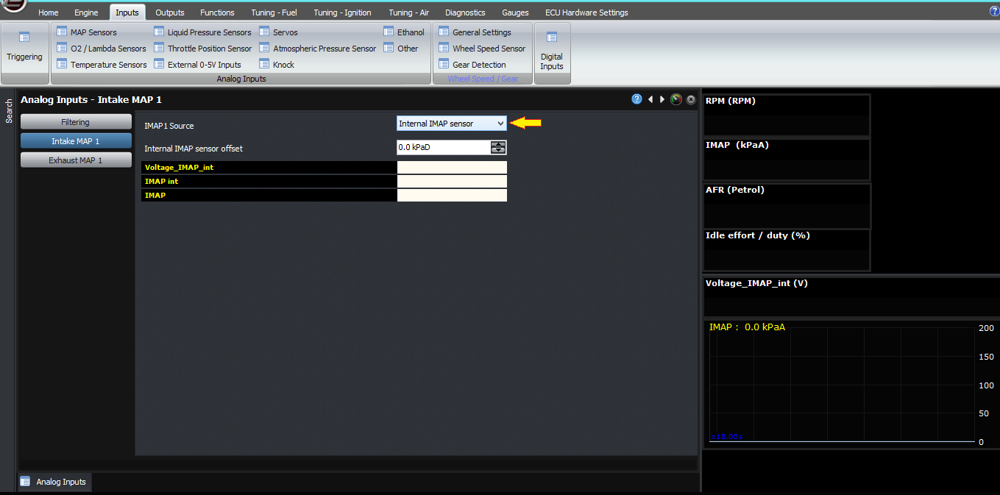  
  
The first thing to configure is the source for the
                  MAP sensor. Your choices are either one of the two internal
                  4-bar MAP sensors, or an external input with a separate MAP
                  sensor wired in. The M2000 and small box ECUs have the intake
                  MAP as the lower port, whereas the upper port is called the
                  EMAP sensor. Note that both sensors are identical, so you can
                  use either one for intake MAP.  
  
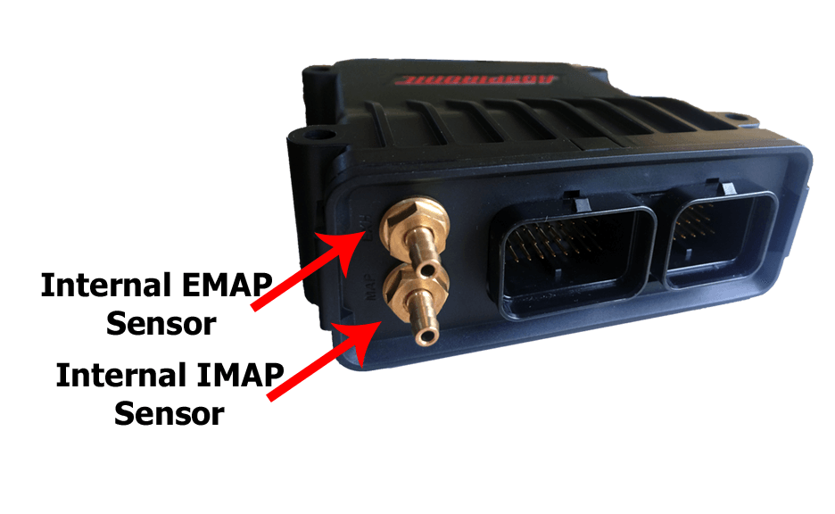If
                  you’re using an external sensor, then you need to calibrate
                  the sensor, or select the calibration from the list of
                  preconfigured system.  
  
After doing this for the 1 or 2 IMAP inputs, you can
                  decide if you’re going to run exhaust MAP sensors as well. If
                  so then you configure them in the same way as the IMAP
                  sensors. I need to tell you that measuring EMAP is much harder
                  than IMAP. If you’re going to use one of the built-in MAP
                  sensors on the ECU, then the signal must be run through a
                  canister filled with steel wool or similar to prevent water
                  and fuel from getting into the MAP sensor. The hose from the
                  canister to the ECU must come from the top of the canister.
                  For some applications this still won’t be robust enough and a
                  stainless steel sensor, the sort that would be used for fuel
                  or oil pressure, should be used instead and wired in to the
                  external IMAP or EMAP input signal pin.  
  
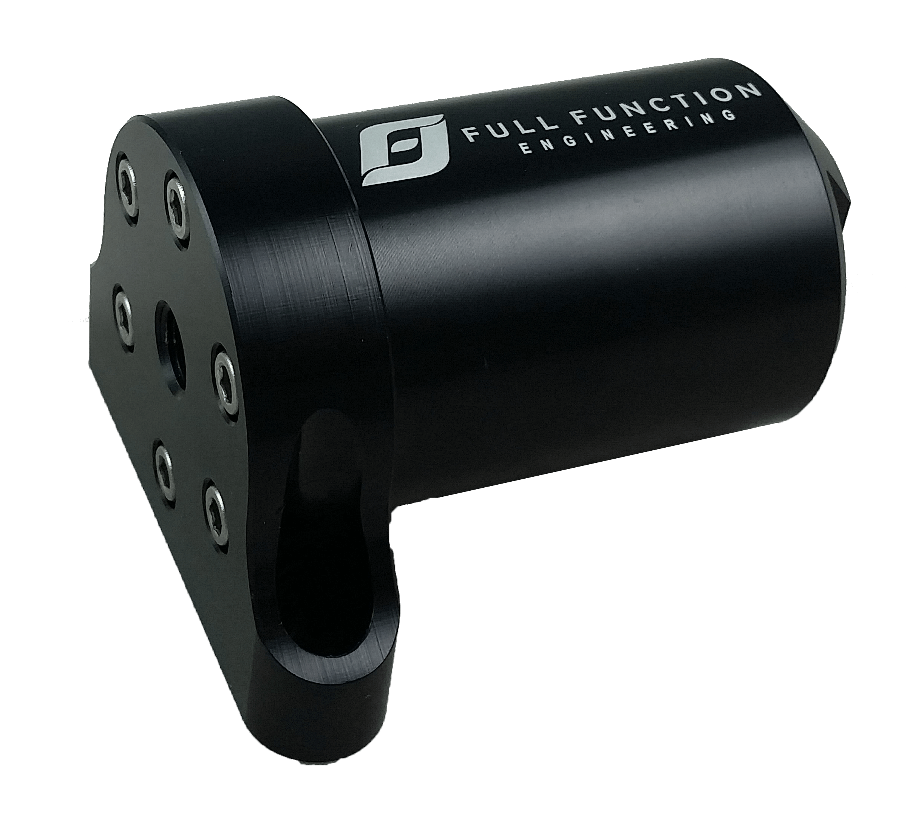Sample
                    of EMAP Cannister  
  
If you like, the second IMAP input can be used for
                  diagnostics, for example measuring the post-compressor boost
                  so you can detect the pressure drop across the inter-cooler.  
  
Lastly, there are some global settings for the MAP
                  sensor filtering. This is required because the intake manifold
                  pressure actually changes as each cylinder or rotor does its
                  intake stroke. The unfiltered IMAP signal actually looks like
                  this; this was taken from a 6 cylinder engine at idle.  
  
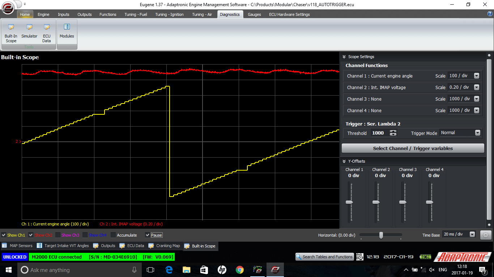What
                  the ECU can do is to average the MAP signal over each
                  induction stroke, for example every 120 degrees on a 6
                  cylinder inline. If you were to use a standard V8 engine with
                  a single plenum, then you would select 90 degrees as the
                  averaging period. If you had a flat-plane V8 with a separate
                  plenum for each bank, then each bank would do an intake stroke
                  every 180 degrees, so you would select 180 degrees as the
                  filter period. A similar effect happens with exhaust
                  pulsation.  
Barometric pressure:  
Barometric pressure measurement is a separate issue.
                  Some ECUs have an internal MAP sensor, but for obvious reasons
                  you can’t have a waterproof ECU with an internal MAP sensor.
                  So the options instead are to either:  
  
1) Use the other built-in MAP sensor that you’re not
                  already using for tuning  
  
2) Have the ECU measure the MAP before the engine
                  starts  
  
3) Use an external barometric pressure sensor, for
                  example a MAP sensor, wired in to the IMAP or EMAP port; this
                  must be configured and calibrated.  
  
4) Use a fixed pressure value  
  
Note that the ECU does not use barometric
                    pressure as part of the tuning algorithm, because MAP at
                    wide open throttle changes with barometric pressure. For the
                    changes in back pressure affecting the VE, the IMAP / EMAP
                    tuning method automatically deals with this. The only
                    reason for the ECU using barometric pressure is to convert
                    between gauge and absolute pressure sensors, for example to
                    measure fuel pressure which we’ll talk about in a second.  
  
The other thing you can enable is a time based
                  filter, which helps filter out some other effects due to
                  asymmetry of the plenum; 0 to 50 ms are typical values.  
  
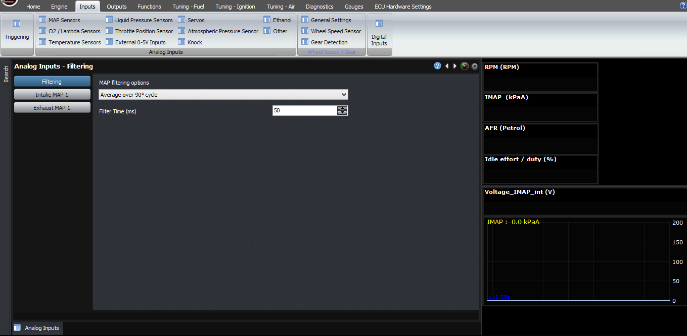  
  
Liquid Pressure
                  Inputs:  
  
The next thing we’ll talk about is fuel and oil
                  pressure sensing. The M2000 has dedicated input pins for fuel
                  and oil pressure, and as you’ve probably seen in other
                  articles or videos, measuring fuel pressure and using that as
                  part of the fuel modelling algorithm makes life a lot easier
                  for the tuner and also safer for everyone.  
  
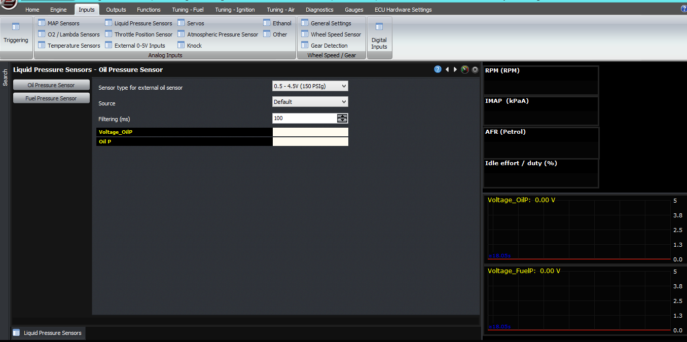  
So for fuel and oil
                  pressure, you must select firstly the sensor that you’ll be
                  using – the 150 PSI gauge pressure sensors being the most
                  common. You can also specify a filter time similar to the time
                  based filter on the MAP sensor, for example 50 or 100 ms. You
                  can also specify different input pins if you need to, but we
                  recommend people to leave the default connection.  
Temperature Inputs:  
Now let’s discuss temperature inputs. The M2000 and
                  the plug-in ECUs have 4 temperature inputs, which are named
                  coolant, air, oil and fuel temperature. Coolant and air are
                  used as part of the tuning algorithm. Oil is used for
                  monitoring, alarms and safeties only. Fuel is used as part of
                  the tuning algorithm if the “trim for fuel density” option is
                  selected in the fuel output control section.  
  
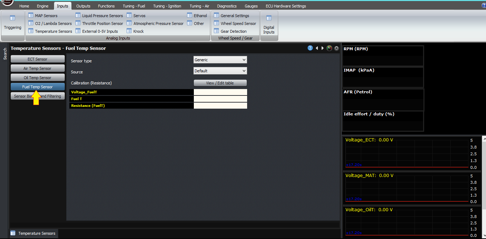  
The 4 temperature
                  inputs each have 2 bias resistors in the ECU, so the ECU can
                  select one of three different pullup resistor values (one, two
                  or both) and the ECU automatically selects the one that gives
                  the best for the current sensor resistance. The ECU then
                  calculates the resistance from this and looks it up against
                  the calibration. So you can select a predefined temperature
                  calibration, or you can enter your own calibration, but the
                  values are resistances; not voltages, ADC counts or another
                  measurement. So for each of the sensors, you must select
                  either that there’s no sensor selected, or select the sensor
                  type. You must also select the input source for that sensor,
                  again we suggest people use the default input pin for this.  
  
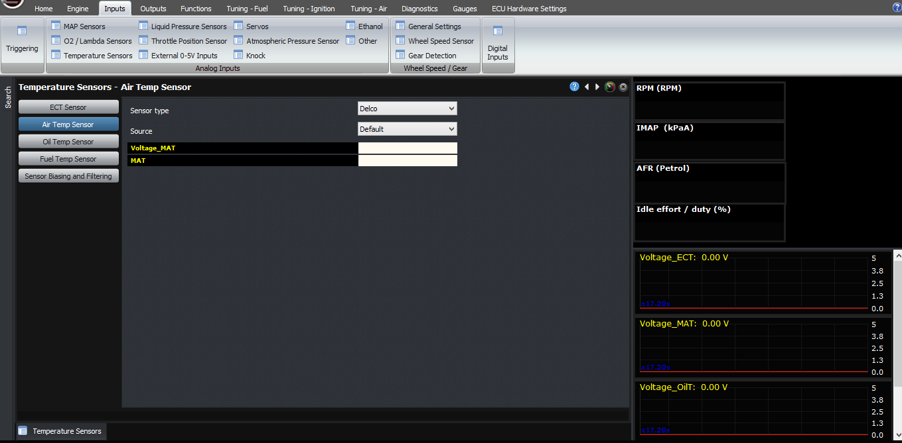  
For each of the input
                  pins, you can also select the filter time. Note that this
                  filter is applied to the pin, not to the sensor channel. So if
                  you are reading air temperature from the fuel temperature pin,
                  you must select the filtering on the fuel temperature pin.  
  
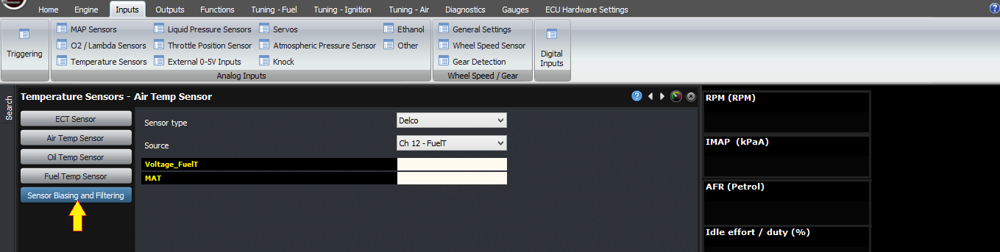Change
                    the source to FuelT  
  
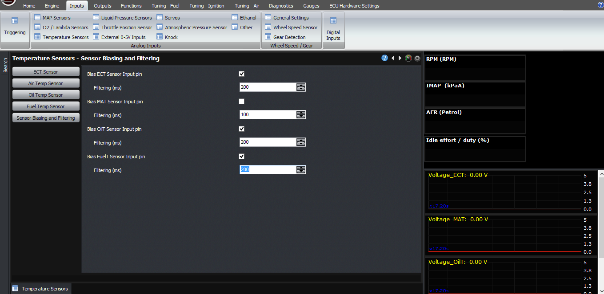Then
                    adjust the filtering in Bias FuelT Sensor Input pin  
  
The final option is if you are using an external
                  pullup resistor, or piggybacking the sensor with a factory ECU
                  that has its own pullup resistor. In this case you need to
                  disable the sensor bias, but in this case the input is
                  calibrated in Volts, rather than resistance (because the
                  Adaptronic doesn’t know the pullup value in the factory ECU)  
Throttle Position  
Throttle position inputs are the next one that we
                  will talk about. In this article we’ll only discuss cable
                  throttle systems because we’ll cover electronic throttle in a
                  separate article. We recommend setting the selection to
                  “default”, and in this case the ECU knows it’s cable throttle
                  because there are no DBW modules installed, and it only reads
                  the TPS1 input. You can also set it up to average the TPS1 and
                  TPS2 inputs if you like.  
  
To calibrate the TPS inputs, firstly close the
                  throttle, and then click on the Learn for TPS 0% on TPS 1. Do
                  the same on TPS 2 if you’re using a second sensor. Then open
                  the throttle all the way to 100% and click learn on the 100%
                  TPS voltages. Note that on some cars like the RX7 FD, a wax
                  pellet holds the throttle open at low coolant temperatures, so
                  this must be done with the engine at operating temperature on
                  such cars.  
  
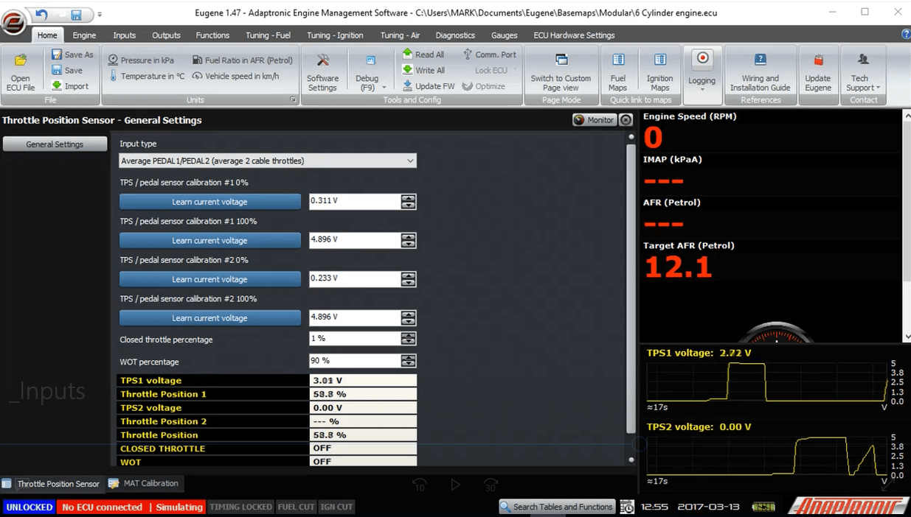  
Lambda:  
Lambda sensing is complex because there are many ways
                  to do it. The first thing we need to select is the lambda
                  sensing method we will use. The first is single, where you are
                  using a single lambda sensor only. The second is average,
                  where you run two, or multiple, lambda sensors, but the ECU
                  averages them and gives you the average as the lambda reading,
                  and that’s what’s considered for closed loop fuel and leanout
                  safety protection. The third is individual, where you have a
                  separate lambda sensor for each bank or cylinder, and each
                  bank can have separate fuel trims.  
  
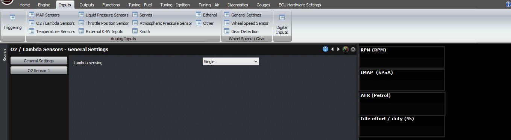  
  
Note that even if you are averaging the sensors, you
                  can still see the individual value from each sensor on the
                  laptop, and they will be logged individually as well, but the
                  closed loop control and safeties will use the average.  
  
You can also run individual lambda on each cylinder,
                  and if so, the ECU will average all the lambdas for that bank
                  to give the overall lambda reading, for the bank trim. For
                  example on a V engine numbered with odd and even banks, the
                  ECU can average the odd lambda values and the even lambda
                  values. But as I mentioned before, you can still see the
                  individual lambda for each cylinder.  
  
The first, and most simple way, is to connect the
                  oxygen sensor, or sensors, into the O2 input or inputs on the
                  ECU. If you’re doing this, then select the lambda sensing
                  option as being analogue only. Then select the type of input
                  from a list of precalibrated sensors, or you can enter your
                  own calibration.  
  
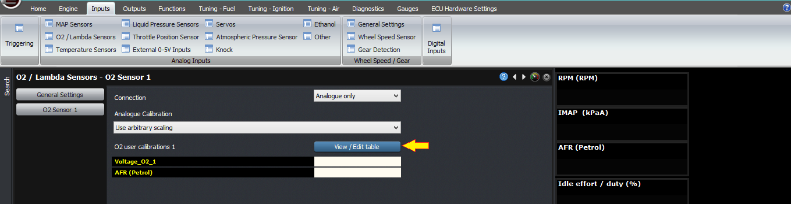  
The second way is to
                  use serial. For this, select “serial only”. In this case the
                  ECU will read the lambda only from a serial port. But in this
                  case you need to also configure the serial port. For the more
                  simple products like the Zeitronix, AEM and so on, just select
                  the correct protocol on the appropriate serial in port. The
                  ECU has two serial input ports, which are functionally the
                  same so they can be used interchangeably. So for example, on a
                  V engine, you can run a Zeitronix sensor on each bank, by
                  selecting both serial inputs as Zeitronix, connecting the odd
                  bank sensor into serial port 1, and the even bank sensor into
                  serial port 2.  
  
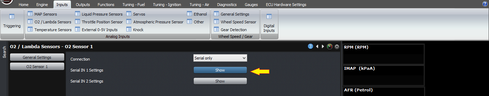  
  
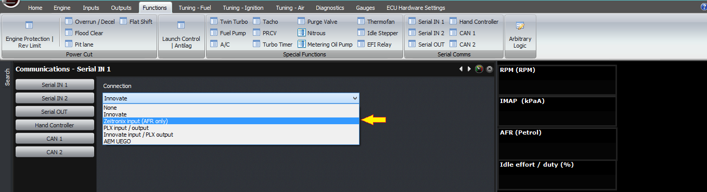The
                  Innovate sensors are more complex because they can be daisy
                  chained, however the in-band MTS serial output doesn’t contain
                  the configuration of the system. The ECU can accept several of
                  the integrated combination gauges, for example the SCG, ECF
                  and so on. I won’t list them here because they’re continually
                  being updated. If you’re not using one of these integrated
                  lambda with another function gauges, then select “none” for
                  this input. The other setting that needs to be set is the
                  number of individual lambda channels, which includes the LC2,
                  MTX-L and the older LC1 sensor controllers.  
  
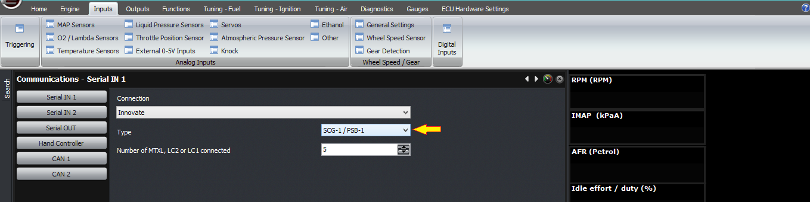  
Any other channels not
                  included in these just mentioned are considered to be EGT
                  inputs, via the Innovate TC4 thermocouple amplifier and input
                  device.  
  
The “serial overrides analogue” selection will use
                  the serial input if available, but if it’s not available then
                  the analogue input is used instead.  
  
Very soon we will have a CAN input option as well,
                  for that there will be additional settings to select the
                  pre-programmed CAN channel definition for example the Motec
                  PLM.  
  
External 0-5V:  
  
There are three more inputs which can be configured
                  as generic 0-5V inputs; if you’re using additional sensors for
                  logging inputs which are not part of the ECU calculations,
                  they can be calibrated in this section.  
  
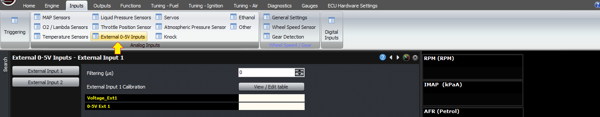  
  
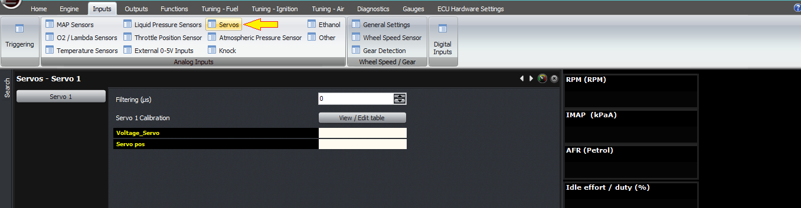  
  
Digital Inputs:  
  
Finally, we’re going to discuss the digital inputs.  
  
For each digital input, you can select “none”, or the
                  function of that digital input. In general, we will discuss
                  the function of these digital inputs in the respective article
                  for that function.  
  
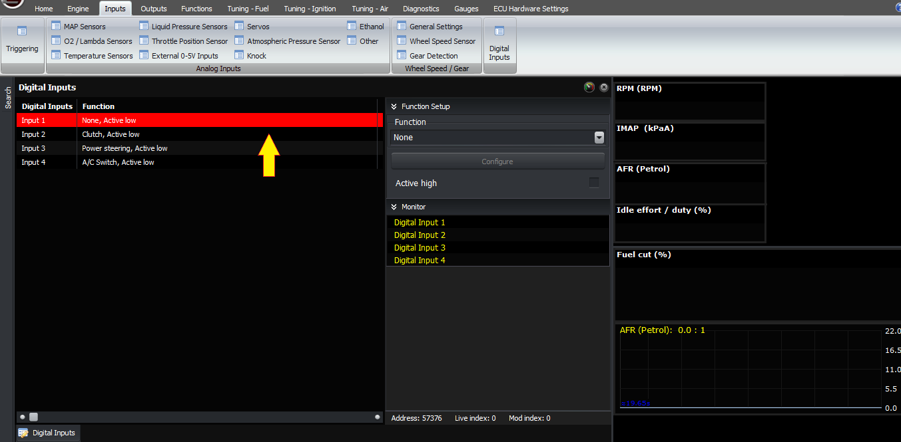  
Thank you and happy
                  learning!  
©2018
        Adaptronic  
