  
  
  
  
  
  
[DOWNLOADS](#)[STORE](#)[CONTACT US](#)  
  
  
  
  
  
  

Triggering on Modular ECU [go back to support home](EN_EUGENE_MOD_HOME.md) 
  
  
  

[Configuring inputs](EN_MOD_008_INPUTS.md)

[Configuring aux outputs](EN_MOD_011_AUXOUTPUTS.md)

  

  
  
  
  
  
  
Triggering is one of the most poorly
                  understood areas of ECU configuration, and it’s arguable the
                  most important one to get right. It’s certainly the one that
                  cause a lot of engine damage if it’s not right.  
  
One thing that I always say is to make sure we
                  understand the objective. What problem are we solving? The
                  whole point of triggering is for the ECU to know the current
                  engine angle as accurately as possible, and as quickly as
                  possible from when the engine starts to crank. The more
                  accurate the ECU’s knowledge of the engine angle, the more
                  stable the ignition timing will be and the closer it can run
                  to the ragged edge. The less rotation that the ECU requires
                  from the triggering system before it knows the angle, the
                  faster the engine will fire up from cranking.  
  
The ECU always tracks the engine angle over a 720
                  degree period; and this is represented as a range from -360 to
                  +360 degrees and then straight to -360 again. Zero degrees is
                  defined as cylinder 1 TDC ignition. For 2-stroke engines,
                  including rotaries, the ECU still calculates the engine over
                  the 720 degree range but the injection and ignition is fired
                  every 360 degrees.  
  
There are several preconfigured triggers for various
                  engines, so if your engine is listed then use it. Start with
                  the base angle of zero degrees, and then fine tune the
                  ignition timing using timing lock when the engine is running.  
  

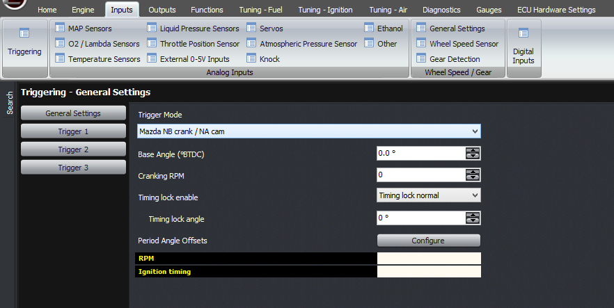
  
  
But this article is mostly about the generic trigger
                  mode. In this mode, you will need to configure it yourself
                  based on what’s on the actual engine. There are several
                  variables that need to be known, which are the angle
                  increment, the base angle, and the reset types.  
  
First we’ll discuss sensor wiring and sensor types.
                  Firstly, we should have the highest tooth count input
                  connected to CAS1. This is the main trigger that the ECU will
                  use for working out the engine angle, which affects ignition
                  timing and so on. Using the trigger with the most teeth gives
                  the most accuracy. For example, if you have a Toyota crank
                  sensor engine with 12 teeth on the crank and 2 on one or two
                  camshafts, then the 12 tooth crank sensor will need to connect
                  to CAS1. If you have a 36-2 trigger on the crank, then that
                  must connect to CAS1. Another example is the Mitsubishi /
                  Mazda sensor with 4 teeth on the camshaft and either 1 or 2
                  for cylinder identification; the 4 tooth sensor needs to
                  connect to CAS1 whereas the 1 or 2 trigger sensor must connect
                  to CAS2. For the Nissan optical style triggers, they have
                  their own dedicated trigger modes and they will accept either
                  sensor output connected to either input, but following this
                  protocol, the 360 window trigger would connect to CAS1.  
  

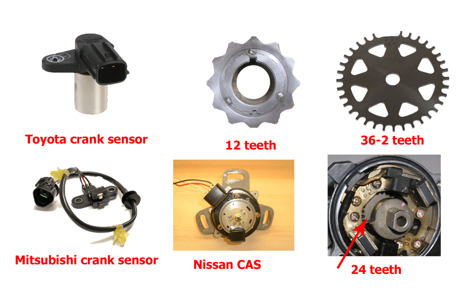

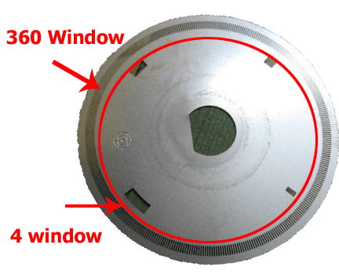
  
Sample Pictures Only  
  
Secondly, there are broadly speaking 2 types of
                  sensor output, as far as the ECU is concerned. The first is a
                  variable reluctance sensor; also called reluctor, VR, or
                  confusingly a “magnetic” sensor. These sensors have 2 pins on
                  the sensor only. The sensor is a coil of wire and has an
                  internal magnet. A tooth passing the sensor creates a change
                  in reluctance, which causes a change in the magnetic field
                  strength. This changing magnetic field creates a voltage in
                  the coil, just like in an alternator. The voltage that the
                  sensor generates is proportional to voltage; at 6000 RPM it
                  will generate double the voltage as at 3000 RPM. From this you
                  can extrapolate that the sensor generates no voltage when the
                  engine is stopped. So one downside of this type of sensor is
                  that with the engine stationary, you can’t tell from the
                  output from the sensor whether it’s currently facing the
                  trigger tooth or not.  
  
The other thing to be careful about with the reluctor
                  sensors is that the polarity is important. The voltage should
                  increase as the tooth approaches the sensor, and then when the
                  tooth is facing the sensor, the voltage drops. When the tooth
                  is in the middle of the sensor, the voltage is zero. Then the
                  voltage goes negative, and finally as the tooth goes away from
                  the sensor it goes back to zero. So the voltage goes positive,
                  then negative through zero, then back to zero again. With a
                  missing tooth trigger, you can tell the polarity during the
                  missing tooth gap; the voltage should rise slowly through the
                  gap because the ECU triggers off the negative zero crossing.
                  With a multitooth trigger, where there is no missing tooth
                  gap, the main thing to consider is the relative angle of CAS1
                  and the reset event. You can see both the polarity of the
                  waveform and the relative timing on the built-in scope in the
                  ECU.  
  

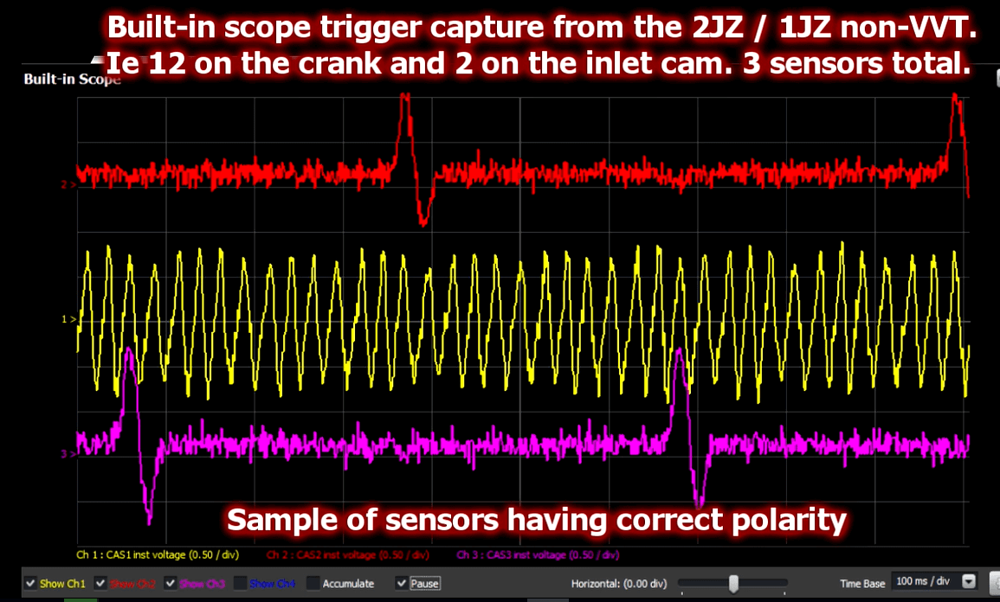
  
  

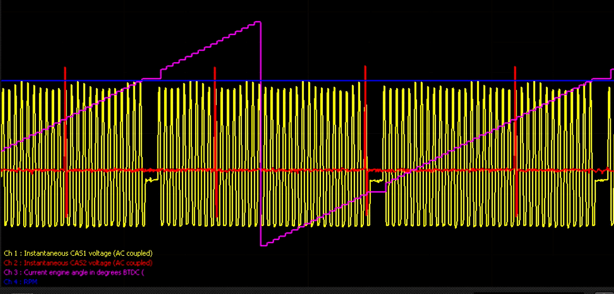
  
  

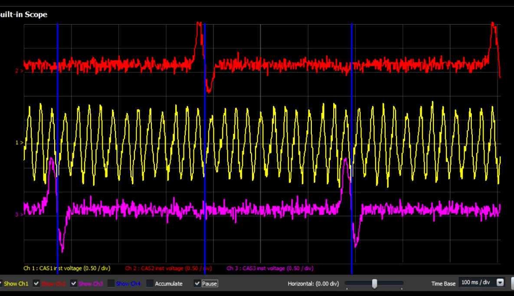
  
The other type of
                  sensor is a digital sensor. These can take the form of a an
                  optical sensor, or a Hall effect sensor. In some cases there
                  might also be reluctor sensors with built-in signal
                  conditioning to give a digital output. In this case the sensor
                  requires power, which may be 5V or 12V. When the sensor is
                  triggered, it pulls the output to ground, and otherwise it
                  doesn’t – therefore there must be a pull-up resistor in the
                  ECU.  
  
For both the reluctor and digital trigger types, you
                  can adjust the voltage at which the ECU triggers. If this
                  figure is too low, then the sensor will trigger off noise and
                  cause triggering problems. If the figure is too high, then the
                  sensor may not trigger at all, and this will cause triggering
                  problems (for example, difficulty in starting). This threshold
                  voltage can be adjusted against RPM. The ECU can also handle
                  the threshold automatically, which is what we recommend unless
                  there’s a problem.  
  
So in a generic trigger mode, you need to select that
                  you’re using a generic trigger mode. This will open the
                  trigger settings for each input. Next you can select each of
                  your trigger inputs, and select whether it’s a digital or a
                  reluctor input.  
  
Then select the automatic voltage threshold option.  
  
The next feature is the filtering. In general, you
                  probably won’t need to touch this. Normally about 20
                  microseconds is a good duration to deal with ignition noise,
                  but on very high tooth count engines like the Nissan optical
                  sensors this will need to reduce to about 4 microseconds at
                  high RPM.  
  

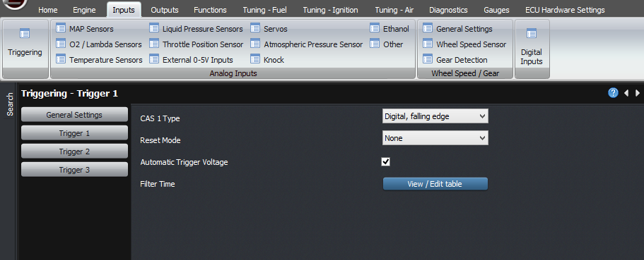
  
Now, we’ll look at how
                  the ECU interprets these trigger events. The first setting we
                  need to consider is the angle increment. This is the crank
                  angle, in degrees between each of the CAS1 trigger events. For
                  example if you have 12 teeth on the crankshaft, this value is
                  30 degrees. If you have 60-2 on the crank, then the value is 6
                  degrees. If the spacing is uneven (apart from missing teeth),
                  you will need to use a dedicated trigger mode, not the generic
                  trigger mode.  
  

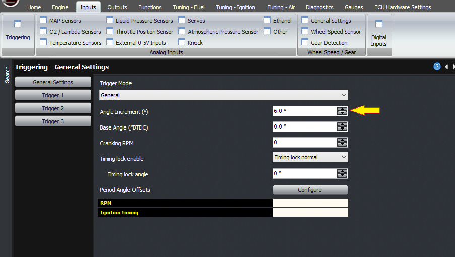
  
  

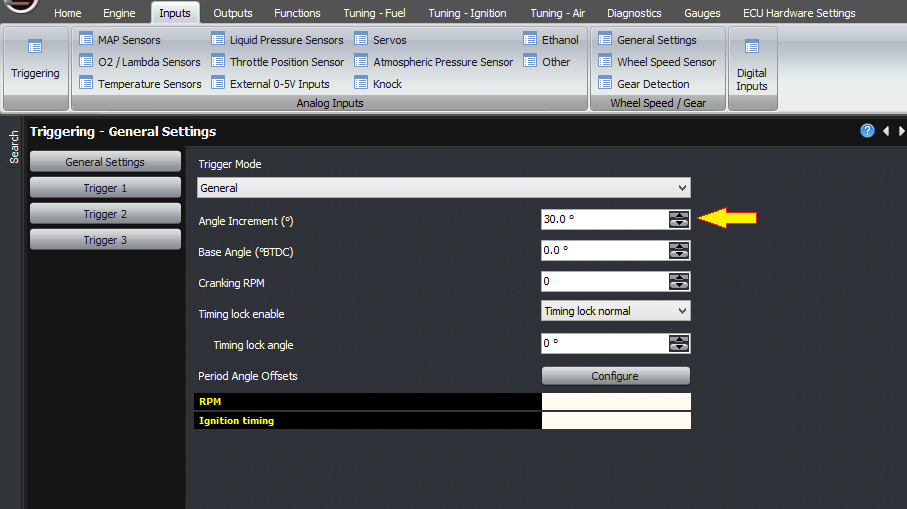
  
The next thing to
                  consider is how the ECU will know when the engine is at TDC,
                  ie where to start counting from. There will need to be some
                  kind of reset event that occurs once per crank revolution, or
                  once per cam revolution, that the ECU can use to know what
                  angle the engine is at. If there is a missing tooth on the
                  crank, then you will need to use that. In that case, set the
                  reset type for Trigger 1 to be a crank type reset, and select
                  either 1 or 2 missing teeth as appropriate for your engine.  
  

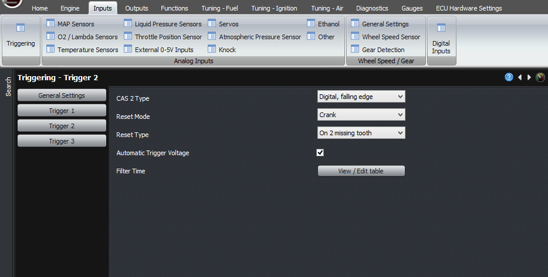
  
In this case, the base
                  trigger angle will be the angle BTDC of the first tooth after
                  the gap. Now, being a 720 degree cycle and a crank sensor,
                  this will occur twice within the 720 degree cycle. So there
                  are two possible values; one value and the same value plus or
                  minus 360 degrees. At this stage, just select one of them.  
  
The other common case is where there is a single
                  tooth on the cam, and no missing teeth on the crank. In this
                  case, the reset type for trigger 1 must be “none”, and the
                  reset type for “trigger 2” must be “cam”, and set to “every
                  tooth” (rather than missing teeth). If it’s on the crank
                  instead, then you should select “crank” instead of “cam”, for
                  example the factory trigger on the RX7 FD engine.  
  

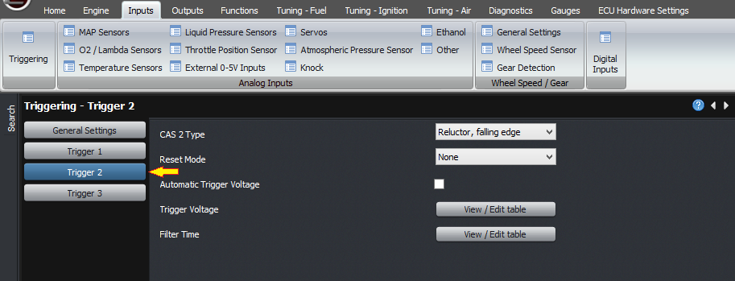

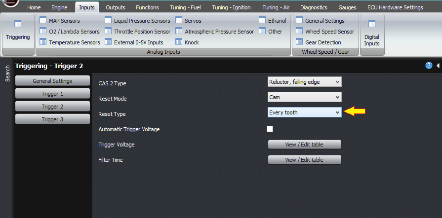
  
If you are using this
                  trigger type with a multitooth and a cam reset, then you will
                  need to check the relative trigger angles. You can do this
                  using the built-in scope, during cranking. The important
                  criterion is that the reset event (eg single tooth cam
                  trigger) happens as far as possible from CAS1 trigger events.
                  If you have a reluctor on CAS1, and its negative edge happens
                  at almost the same time as the CAS2 reset trigger, then you
                  may need to reverse the polarity of CAS1. Or similarly you may
                  need to select the rising or falling edges differently on a
                  digital trigger.  
  

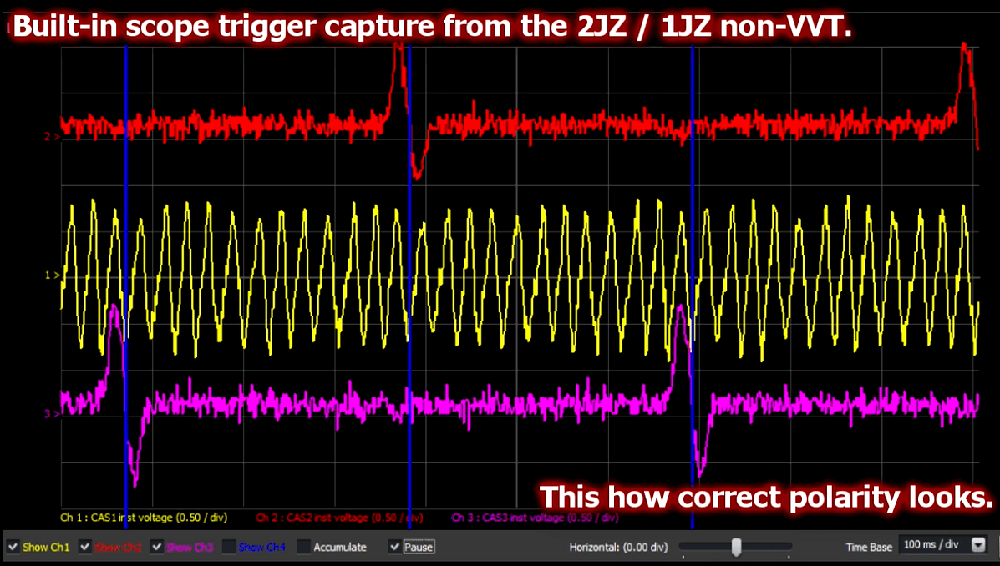
  
  
If you so far have only selected a crank type reset,
                  for example if you have a missing tooth on the crank, and you
                  are running a 4 stroke engine, then best results will be
                  obtained by using a cam sensor as well so that the ECU can
                  achieve 720 degrees of crank angle information. If it’s a
                  single tooth, then select the trigger type as “first half
                  only”.  
  

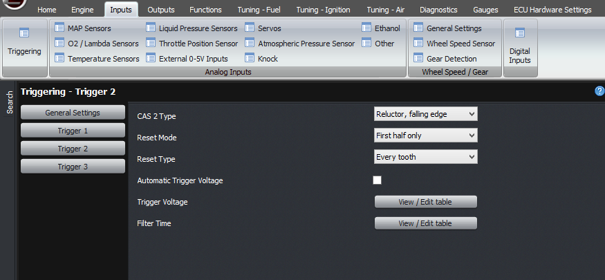
  
If it’s a missing tooth
                  type sensor for example the Toyota 2ZZ or BEAMS which has 4-1
                  on the cam, you should select it as first half only, but
                  select it as “reset on 1 missing tooth” rather than “reset on
                  every tooth”.  
  

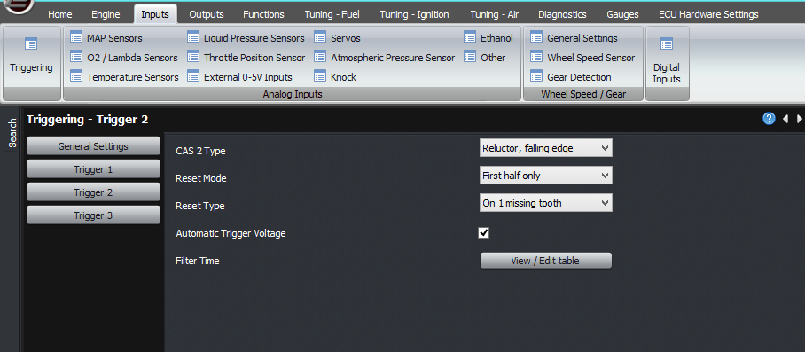
  
Note that in first half
                  only type reset, this only switches the ECU’s crank angle by
                  360 degrees or leaves it as is. There must be a separate
                  reset, usually a crank type reset, to tell the ECU where TDC
                  is.  
  
You can use the built-in scope to verify not only the
                  trigger inputs, but also the ECU’s understanding of the
                  current engine angle. As you can see here the crank angle
                  estimated by the ECU goes up in steps where each step
                  corresponds to another CAS1 trigger.  
  
The typical scope settings you’ll need to see during
                  cranking, are:  
  
Channel 1: CAS1 inst voltage, 1V/div  
  
Channel 2: CAS2 inst voltage, 1V/div  
  
Channel 3: Current engine angle, 100/div  
  
Timebase: 50ms per division  
  

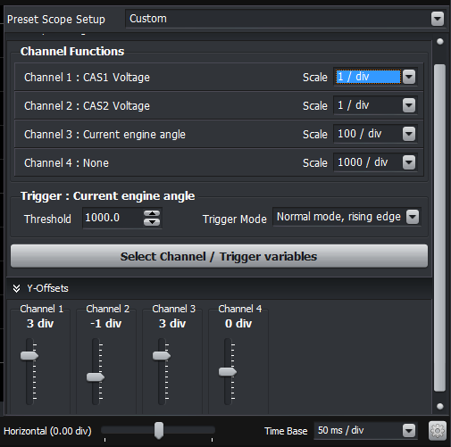
  
  
Once you have the correct triggering, you can set the
                  base timing using the base angle setting. When cranking you
                  should now have stable RPM.  
  
The other setting that must be set correctly is the
                  cranking RPM threshold. This must be higher than the actual
                  cranking RPM with some margin. Once the RPM exceeds this
                  value, the ECU considers the engine to be running, switches
                  over to the main fuel map instead of the cranking map and so
                  on.  
  
The final thing we need to discuss with respect to
                  trigger inputs is VVT. The ECU always records the crank angle
                  of the CAS2 and CAS3 trigger events, and the CAS4 and CAS5
                  trigger events if you have the mini realtime expansion module.
                  For digital triggers you will need to select the correct edge
                  (positive or negative) to get stable readings.  
  
Reading the crank angle can be done with the factory
                  timing marks, or making your own as we describe in another
                  article, but how do you know whether it’s TDC ignition or TDC
                  overlap? If you can see the cam pulleys then that might tell
                  you, or you could put a hose into the spark plug hole and try
                  blowing into it to see if the valves are closed. Another way,
                  which I like because I don’t really like getting my hands too
                  dirty, that works if you have a coil per plug system, is to
                  start off the engine in wasted spark mode. Ie, set the
                  ignition output firing pattern to 360 degrees instead of 720.
                  With the engine running, change the ignition output firing to
                  720 and see if the engine stalls. If so, change the base
                  timing setting by 360 degrees and try again. Once it’s only
                  firing every 720 degrees, then you know it’s correct.  
  

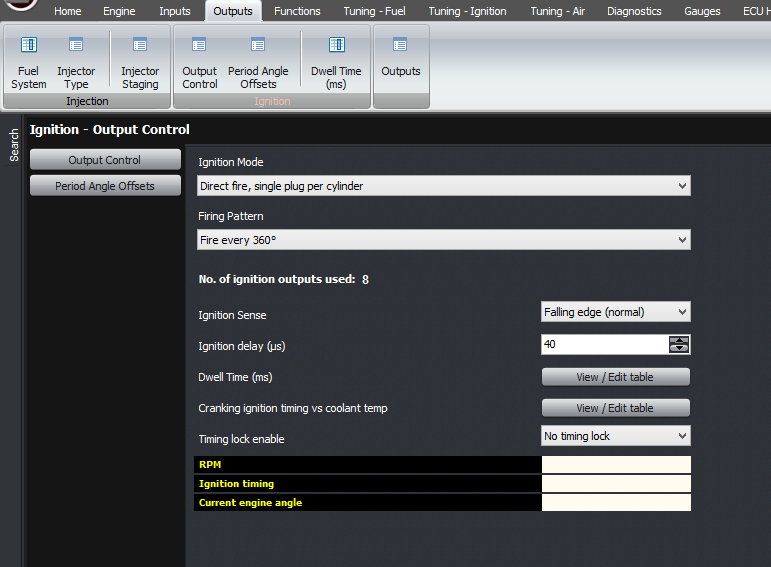
  
Finally, if you have a
                  crank reset that occurs potentially a long time before the
                  reset on the camshaft, which would be a “first half only”
                  reset type, you can set the ignition output mode to fire every
                  360 degrees, until the cam sensor is triggered, and then
                  switch over to 720 degrees. This gives you the nyeh-nyeh-vroom
                  starting performance of a factory car.  
  

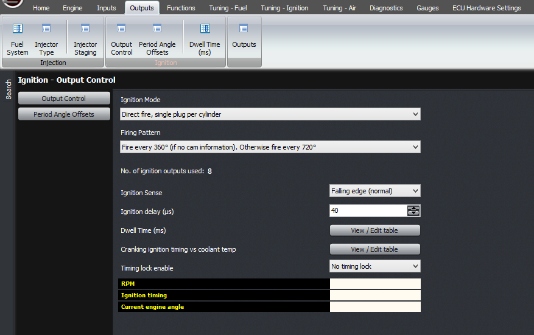
  
Thank you and happy
                  learning!  
  
©2018
        Adaptronic  
  
