  
  
  
  
  
  
[DOWNLOADS](#)[STORE](#)[CONTACT US](#)  
  
  
  
  
  
  

Basic Engine Setup on Modular ECUs

[go back to
                support home](EN_EUGENE_MOD_HOME.md)  

  
  
  

[Setting up
                triggering in Modular ECUs  

              ](EN_MOD_009_TRIGGERING.md)

[ECU
                Grounding tips  

              ](EN_MOD_007_GROUNDING.md)

  

[  

              ](EN_SelFW.md)

  

  
  
  
  
This article describes the basic engine setup of the Modular
                  ECUs.  
  
It’s from this that the ECU works out the majority of what it
                  needs to run the engine, so this has to be right. If it’s not
                  right, you’ll make your life harder and that’s the opposite of
                  what we’re trying to do.  
  

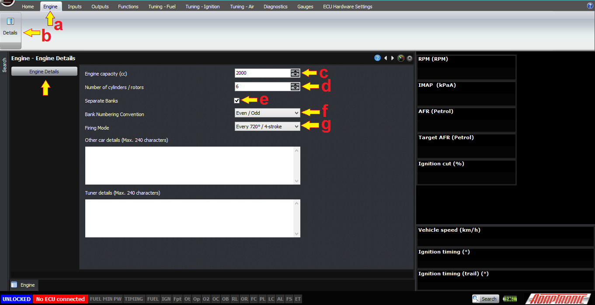
  
  
The (a) first tab we’ll look at is the “Engine” one. Select
                  this, (b) and go into the “Details” section. This brings up a
                  window where you can select some really basic information
                  about the engine.  
  
The first is (c) engine capacity, in ccs (cubic centimetres,
                  or mL – or get litres and multiply by 1000, so 2000 for a 2L
                  engine). If you don’t know what this is already but you know
                  the engine type, you can normally find it online somewhere.
                  This is the actual swept volume, we’re not doing any tricks
                  like doubling it for a 2-stroke or anything like that.  
  
The next setting is the (d) number of cylinders or rotors, eg
                  6 for a JZ or 2 for a 13B. Pretty self explanatory. The only
                  time this would need to change is if you’re trying to
                  duplicate outputs to do something like running 8 methanol
                  injectors per rotor on a 13B, you could in that case tell the
                  ECU that it was a 4 rotor engine but they fire in pairs at the
                  same time, which would have the effect of driving injectors in
                  pairs but give you a separate output per injector, which you
                  need for low impedance injectors.  
  
The (e) next setting is “separate banks”. If this is enabled,
                  then the engine is considered by the ECU to have two halves,
                  and all the fuel calculations including things like predicted
                  MAP, fuel film modelling and so on are done twice. Each bank
                  can have its own intake MAP sensor and/or EMAP sensor and you
                  can run independent closed loop boost control for each. This
                  is particularly useful on dual-plenum engines, because they
                  never balance as well as you’d expect them to. If this mode is
                  enabled, you have the choice to either describe the banks as
                  (f) odd and even, or first half and second half, which allows
                  you to use the “standard” naming convention for the engine.
                  But it also allows you to do the same thing to treat the front
                  and back halves of an inline-6 independently; for example on
                  the GTR each half has its own turbocharger and oxygen sensor,
                  or on a 2-rotor you can do the same thing.  
  
Finally, the (g) firing mode can either be 4-stroke or
                  2-stroke. A stroke is defined as the distance travelled from
                  top dead centre to bottom dead centre, so 2-stroke means that
                  the engine performs a combustion event every 2 strokes, or 360
                  degrees. 4-stroke means that the engine performs a combustion
                  event every 4 strokes, or 720 crank degrees. Both
                  configurations still must perform the suck-squeeze-bang-blow
                  sequence because that’s how the Otto and Diesel cycles are
                  defined. Note that this does not directly affect the ignition
                  output sequence, which will be configured later, but it does
                  affect whether the injectors are fired every 360 or 720 crank
                  degrees, and also affects calculations such as the fuel film
                  changes. So on a 2-stroke piston or a rotary engine, select
                  360° / 2-stroke – otherwise for a 4-stroke piston engine
                  select 720 ° / 4-stroke  
  
The next section we will cover is the outputs, ie what the ECU
                  actually controls, particularly the injector and ignition
                  outputs.  
  

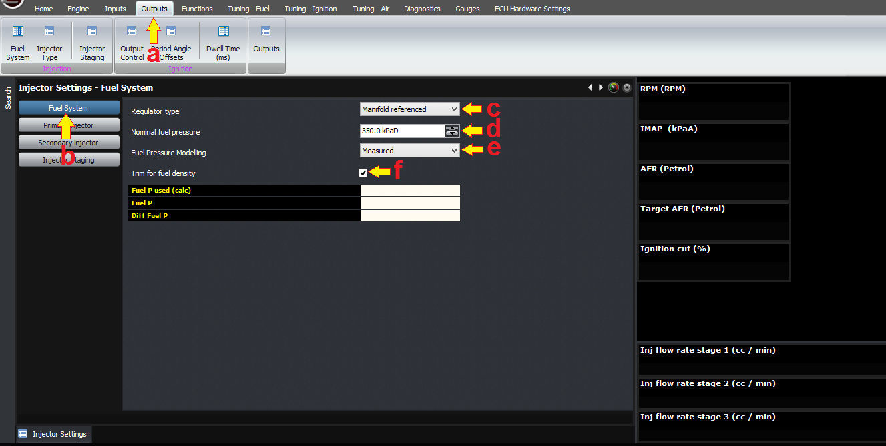
  
  
(a) Go to the “outputs” tab, and (b) then select “fuel system”
                  from the injection panel. This is where we enter the basics
                  about the fuel system.  
  
The (c) first setting, manifold referenced or fixed, is
                  whether the fuel pressure has a constant differential
                  pressure, ie the fuel pressure reg is manifold referenced, or
                  if the fuel pressure has a constant gauge pressure, ie no
                  manifold reference. Often this is incorrectly described as
                  dead-head or return style system, but there is nothing
                  stopping you from running a manifold referenced dead-head
                  system or a return style system with no manifold reference.
                  Generally we prefer to see manifold-referenced systems so that
                  the injector behavior is more consistent but the ECU can
                  handle either in the fuel model.  
  

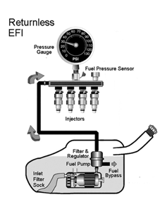
  
  
Fixed Pressure Regulator  
  

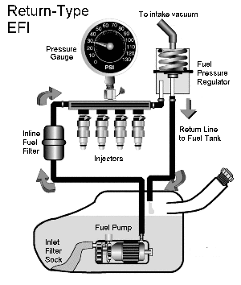
  
  
Manifold Referenced  
  
The type that the ECU doesn’t support, unless you have a fuel
                  pressure sensor, is the rising rate fuel pressure regulator;
                  in this pressure regulator the differential fuel pressure
                  increases with manifold pressure. For example for every 10 kPa
                  of manifold pressure increase, the gauge fuel pressure might
                  increase 20 kPa, which means that the differential fuel
                  pressure has increased by 10 kPa instead of being constant. If
                  you have a fuel pressure sensor the ECU can handle this
                  though.  
  

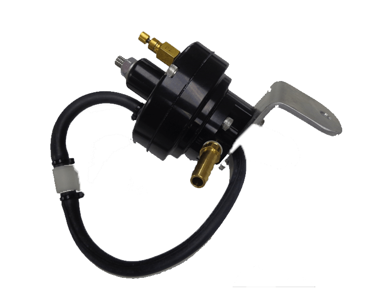
  
  

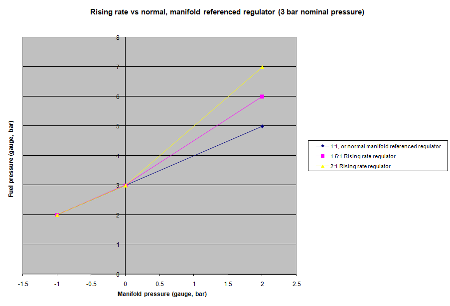
  
  
The (d) next setting is the nominal fuel pressure. Normally
                  this should be set to the minimum that you see at the full
                  power condition. If the ECU detects a failure in the fuel
                  pressure sensor, it will reference this value instead. In a
                  manifold-referenced system, this is the differential fuel
                  pressure, as you can see by the units being kPaD (or PSId in
                  Imperial units). In a fixed pressure system, this is the gauge
                  fuel pressure, the units being kPaG or PSIg. A typical fuel
                  pressure is about 3 bar for manifold referenced and 4 bar for
                  fixed fuel pressure.  
  
The next option, (e) fuel pressure modelling, tells the ECU
                  how to work out the fuel pressure; either from a fuel pressure
                  sensor, or from the nominal fuel pressure setting. If there’s
                  a fuel pressure sensor, we would recommend using the sensor.  
  
The next checkbox is to (f) trim for fuel density. Again we
                  would recommend to have this turned ON, because it means that
                  fuel temperature changes will be accounted for in the
                  calculations. The coefficient of expansion of fuel is
                  different between E85 and E0 so this is taken into account
                  also. The fuel temperature can either be taken from a
                  dedicated fuel temperature sensor, or it can be read from the
                  ethanol sensor if equipped (because it tells the ECU
                  temperature and ethanol percentage), or it can be modelled
                  from the engine temperature. The ECU assumes some heat soak
                  and that the fuel temperature will start off at engine
                  temperature but eventually stabilise. If you prefer to model
                  this yourself you can disable this feature and trim it using
                  the post crank enrichment table.  
  
If you now click on the “injector staging” button you can set
                  up the staged injection. If you aren’t running staged
                  injection, just set the number of stages to 1 and that’s all
                  you need to do. Otherwise, set the number of stages you’re
                  using and set the off-time for each stage – we normally
                  recommend 2 ms as enough time for the injector to fully close
                  so that when you open it again it delivers the correct amount
                  of fuel.  
  

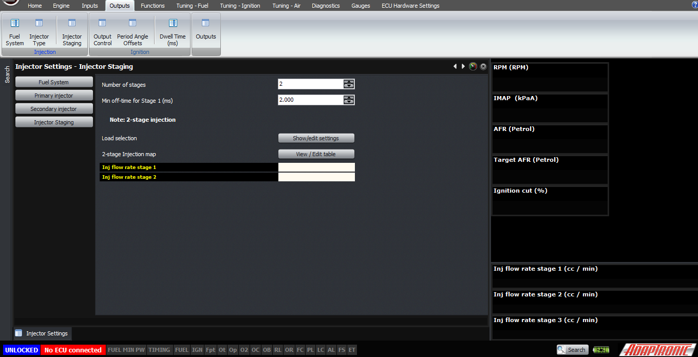
  
  
Next, in the injection panel select “injector type”. For each
                  stage of injectors you have, you will need to select the
                  injector type from the dropdown list. If your injector isn’t
                  in there, then you will need to select “custom” and enter the
                  dead times and flow rates against fuel pressure (and battery
                  voltage as well for dead time) manually.  
  

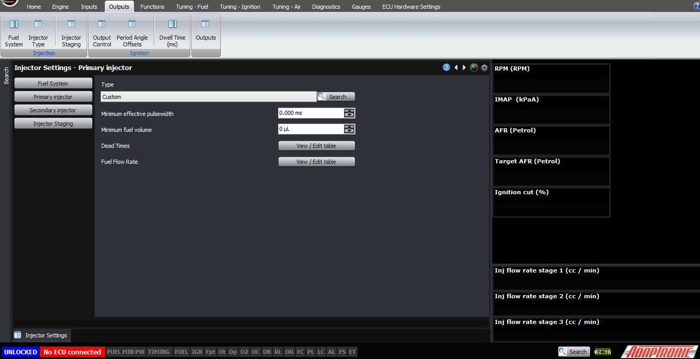
  
  
Now that we have fully described the fuel system, we need to
                  tell the ECU about the ignition system. The first step is to
                  go to “Output control” in the “Ignition” panel. From there,
                  the first thing is to select the ignition output mode.  
  

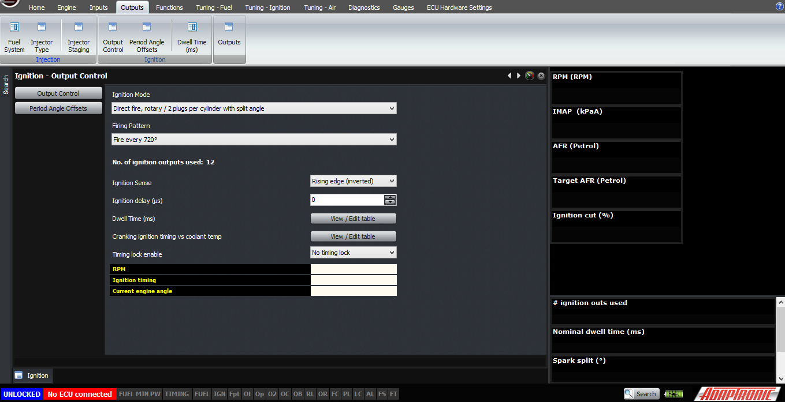
  
  
For a rotary, or an engine with two spark plugs per cylinder,
                  there are a few different modes available:  
  
Direct fire, rotary / 2 plugs per cylinder with split angle is
                  the most simple and just uses a single coil per plug. In this
                  mode, you must select the firing pattern as well, which will
                  be 720 degrees on a 4-stroke and 360 degrees on a rotary or a
                  2-stroke. If you don’t have a cam trigger on a 4-stroke, you
                  will need to fire the ignition every 360 degrees. And a cool
                  feature is the option to fire every 360 degrees until a cam
                  signal is detected where it switches over to 720 degrees.  
  
FD: wasted leading, direct fire trailing – for the factory
                  ignition system on the RX7 FD  
  
FC: wasted leaning, address mode trailing – factory ignition
                  system on the RX7 FC  
  
For a single plug per cylinder, the following modes are
                  available:  
  
Direct fire, single plug per cylinder. In this mode the ECU
                  allocates one ignition output per cylinder. The ignition
                  firing pattern must be set to 720, 360 or 360 then switch to
                  720 with cam information.  
  
Wasted spark. In this mode, only one output is used for every
                  2 coils, and the firing pattern needs to be set to every 360
                  degrees. This works for 4 cylinder, 6 cylinder and 8 cylinder
                  flat plane engines. For 8 cylinder crossplane engines, the
                  cylinder mapping needs to be different so that ignition
                  outputs 1-4 correspond to the 4 separate pairs.  
  
Single distributor. In this mode, only a single output is
                  enabled. The firing pattern is set automatically based on the
                  firing frequency of the engine (720 or 360) and the number of
                  cylinders.  
  
Twin distributor. In this mode, two outputs are used; the
                  first being the one for cylinder 1 and the other for the other
                  distributor. Again the firing pattern is set automatically in
                  this mode.  
  
The next setting to check is the ignition sense. This should
                  normally be “falling edge (normal)”. Very few systems require
                  a rising edge, and if so then you should know about it and
                  have seen the waveform on a scope for yourself. Setting an
                  output to rising edge when it should be falling edge can burn
                  out ignitors and ignition coils.  
  
The dwell time table can now be set, as a function of engine
                  speed and battery voltage.  
  
Lastly, but definitely not least, is the set of period angle
                  offsets. These are found in the “Ignition” panel again. These
                  period angle offsets are the number of degrees after TDC
                  ignition cylinder 1 that each of those cylinders gets its TDC
                  ignition.  
  

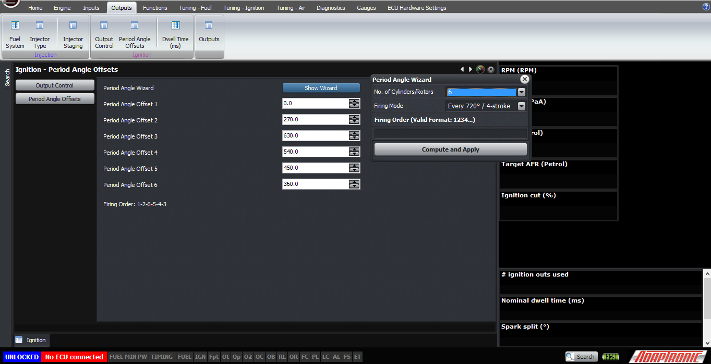
  
  
For example, if your firing order is 1-3-4-2 on a 4 stroke
                  piston engine, the firing order angles are:  
  
0, -180, 180, 360  
  
This period angle offset is used for the injection timing as
                  well as ignition.  
  
Here are the samples of different ignition output waveforms:  
  
  

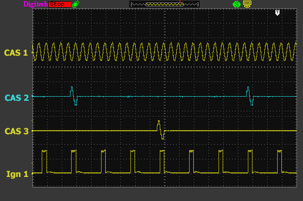
  
  
2JZGET_SingleDistributor  
  
  

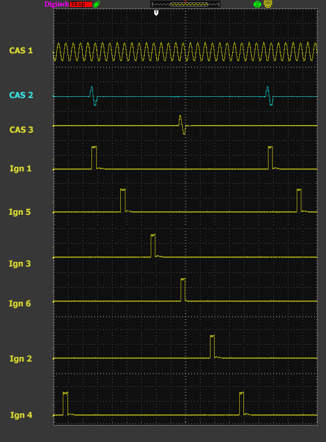
  
  
2JZGTE_Directfiresingleplug  
  
  

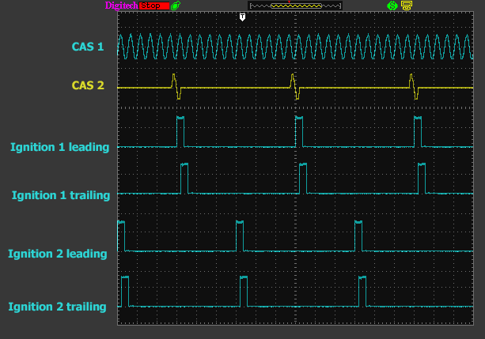
  
  
2JZGTE_DirectRotary  
  
  

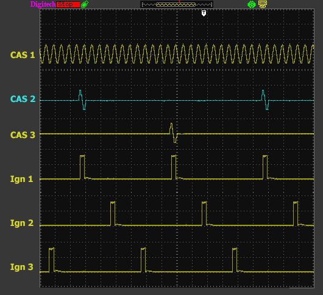
  
  
2JZGTE_WastedSpark  
  

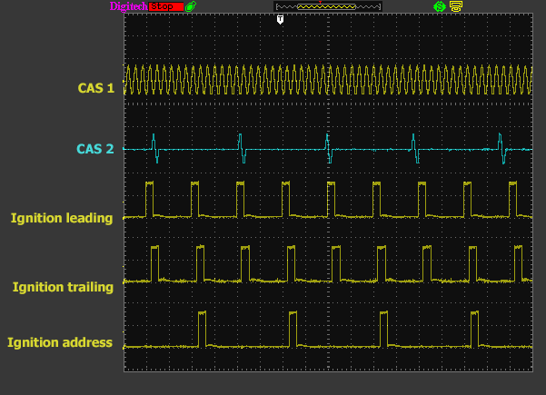
  
FC  
  
  

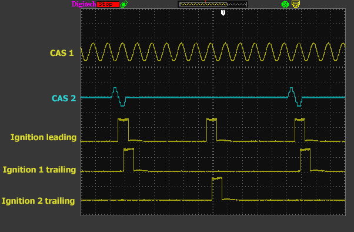
  
  
FD  
  
  

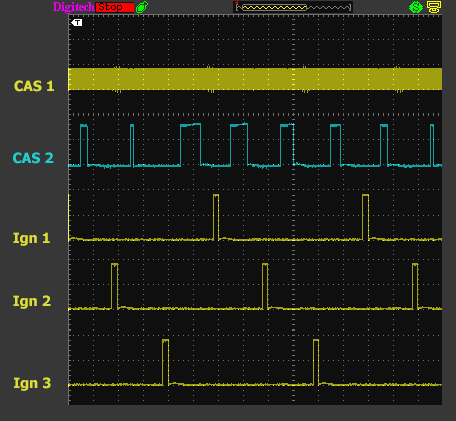
  
  
Nissan6-WastedSpark  
  
  

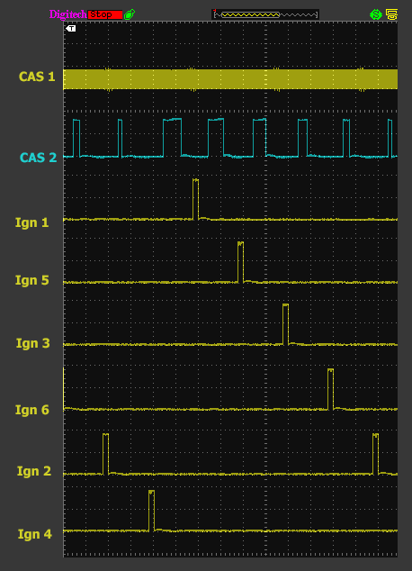
  
  
Nissan6-DirectFiresingleplug  
  
  

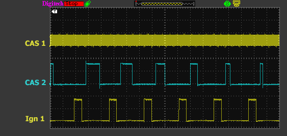
  
  
Nissan6-SingleDistributor  
  
  
©2018
        Adaptronic  
  
