Setting up Auxiliary Outputs on Modular ECU/*

Copyright (c) 2008, Yahoo! Inc. All rights reserved.

Code licensed under the BSD License:

http://developer.yahoo.net/yui/license.txt

version: 2.6.0

*/

html{color:#000;background:#FFF;}body,div,dl,dt,dd,ul,ol,li,h1,h2,h3,h4,h5,h6,pre,code,form,fieldset,legend,input,textarea,p,blockquote,th,td{margin:0;padding:0;}table{border-collapse:collapse;border-spacing:0;}fieldset,img{border:0;}address,caption,cite,code,dfn,em,strong,th,var{font-style:normal;font-weight:normal;}li{list-style:none;}caption,th{text-align:left;}h1,h2,h3,h4,h5,h6{font-size:100%;font-weight:normal;}q:before,q:after{content:'';}abbr,acronym{border:0;font-variant:normal;}sup{vertical-align:text-top;}sub{vertical-align:text-bottom;}input,textarea,select{font-family:inherit;font-size:inherit;font-weight:inherit;}input,textarea,select{*font-size:100%;}legend{color:#000;}del,ins{text-decoration:none;}body{font:13px/1.231 arial,helvetica,clean,sans-serif;*font-size:small;*font:x-small;}select,input,button,textarea{font:99% arial,helvetica,clean,sans-serif;}table{font-size:inherit;font:100%;}pre,code,kbd,samp,tt{font-family:monospace;*font-size:108%;line-height:100%;}body{text-align:center;}#ft{clear:both;}#doc,#doc2,#doc3,#doc4,.yui-t1,.yui-t2,.yui-t3,.yui-t4,.yui-t5,.yui-t6,.yui-t7{margin:auto;text-align:left;width:57.69em;*width:56.25em;min-width:750px;}#doc2{width:73.076em;*width:71.25em;}#doc3{margin:auto 10px;width:auto;}#doc4{width:74.923em;*width:73.05em;}.yui-b{position:relative;}.yui-b{_position:static;}#yui-main .yui-b{position:static;}#yui-main,.yui-g .yui-u .yui-g{width:100%;}{width:100%;}.yui-t1 #yui-main,.yui-t2 #yui-main,.yui-t3 #yui-main{float:right;margin-left:-25em;}.yui-t4 #yui-main,.yui-t5 #yui-main,.yui-t6 #yui-main{float:left;margin-right:-25em;}.yui-t1 .yui-b{float:left;width:12.30769em;*width:12.00em;}.yui-t1 #yui-main .yui-b{margin-left:13.30769em;*margin-left:13.05em;}.yui-t2 .yui-b{float:left;width:13.8461em;*width:13.50em;}.yui-t2 #yui-main .yui-b{margin-left:14.8461em;*margin-left:14.55em;}.yui-t3 .yui-b{float:left;width:23.0769em;*width:22.50em;}.yui-t3 #yui-main .yui-b{margin-left:24.0769em;*margin-left:23.62em;}.yui-t4 .yui-b{float:right;width:13.8456em;*width:13.50em;}.yui-t4 #yui-main .yui-b{margin-right:14.8456em;*margin-right:14.55em;}.yui-t5 .yui-b{float:right;width:18.4615em;*width:18.00em;}.yui-t5 #yui-main .yui-b{margin-right:19.4615em;*margin-right:19.125em;}.yui-t6 .yui-b{float:right;width:23.0769em;*width:22.50em;}.yui-t6 #yui-main .yui-b{margin-right:24.0769em;*margin-right:23.62em;}.yui-t7 #yui-main .yui-b{display:block;margin:0 0 1em 0;}#yui-main .yui-b{float:none;width:auto;}.yui-gb .yui-u,.yui-g .yui-gb .yui-u,.yui-gb .yui-g,.yui-gb .yui-gb,.yui-gb .yui-gc,.yui-gb .yui-gd,.yui-gb .yui-ge,.yui-gb .yui-gf,.yui-gc .yui-u,.yui-gc .yui-g,.yui-gd .yui-u{float:left;}.yui-g .yui-u,.yui-g .yui-g,.yui-g .yui-gb,.yui-g .yui-gc,.yui-g .yui-gd,.yui-g .yui-ge,.yui-g .yui-gf,.yui-gc .yui-u,.yui-gd .yui-g,.yui-g .yui-gc .yui-u,.yui-ge .yui-u,.yui-ge .yui-g,.yui-gf .yui-g,.yui-gf .yui-u{float:right;}.yui-g div.first,.yui-gb div.first,.yui-gc div.first,.yui-gd div.first,.yui-ge div.first,.yui-gf div.first,.yui-g .yui-gc div.first,.yui-g .yui-ge div.first,.yui-gc div.first div.first{float:left;}.yui-g .yui-u,.yui-g .yui-g,.yui-g .yui-gb,.yui-g .yui-gc,.yui-g .yui-gd,.yui-g .yui-ge,.yui-g .yui-gf{width:49.1%;}.yui-gb .yui-u,.yui-g .yui-gb .yui-u,.yui-gb .yui-g,.yui-gb .yui-gb,.yui-gb .yui-gc,.yui-gb .yui-gd,.yui-gb .yui-ge,.yui-gb .yui-gf,.yui-gc .yui-u,.yui-gc .yui-g,.yui-gd .yui-u{width:32%;margin-left:1.99%;}.yui-gb .yui-u{*margin-left:1.9%;*width:31.9%;}.yui-gc div.first,.yui-gd .yui-u{width:66%;}.yui-gd div.first{width:32%;}.yui-ge div.first,.yui-gf .yui-u{width:74.2%;}.yui-ge .yui-u,.yui-gf div.first{width:24%;}.yui-g .yui-gb div.first,.yui-gb div.first,.yui-gc div.first,.yui-gd div.first{margin-left:0;}.yui-g .yui-g .yui-u,.yui-gb .yui-g .yui-u,.yui-gc .yui-g .yui-u,.yui-gd .yui-g .yui-u,.yui-ge .yui-g .yui-u,.yui-gf .yui-g .yui-u{width:49%;*width:48.1%;*margin-left:0;}.yui-g .yui-g .yui-u{width:48.1%;}.yui-g .yui-gb div.first,.yui-gb .yui-gb div.first{*margin-right:0;*width:32%;_width:31.7%;}.yui-g .yui-gc div.first,.yui-gd .yui-g{width:66%;}.yui-gb .yui-g div.first{*margin-right:4%;_margin-right:1.3%;}.yui-gb .yui-gc div.first,.yui-gb .yui-gd div.first{*margin-right:0;}.yui-gb .yui-gb .yui-u,.yui-gb .yui-gc .yui-u{*margin-left:1.8%;_margin-left:4%;}.yui-g .yui-gb .yui-u{_margin-left:1.0%;}.yui-gb .yui-gd .yui-u{*width:66%;_width:61.2%;}.yui-gb .yui-gd div.first{*width:31%;_width:29.5%;}.yui-g .yui-gc .yui-u,.yui-gb .yui-gc .yui-u{width:32%;_float:right;margin-right:0;_margin-left:0;}.yui-gb .yui-gc div.first{width:66%;*float:left;*margin-left:0;}.yui-gb .yui-ge .yui-u,.yui-gb .yui-gf .yui-u{margin:0;}.yui-gb .yui-gb .yui-u{_margin-left:.7%;}.yui-gb .yui-g div.first,.yui-gb .yui-gb div.first{*margin-left:0;}.yui-gc .yui-g .yui-u,.yui-gd .yui-g .yui-u{*width:48.1%;*margin-left:0;} .yui-gb .yui-gd div.first{width:32%;}.yui-g .yui-gd div.first{_width:29.9%;}.yui-ge .yui-g{width:24%;}.yui-gf .yui-g{width:74.2%;}.yui-gb .yui-ge div.yui-u,.yui-gb .yui-gf div.yui-u{float:right;}.yui-gb .yui-ge div.first,.yui-gb .yui-gf div.first{float:left;}.yui-gb .yui-ge .yui-u,.yui-gb .yui-gf div.first{*width:24%;_width:20%;}.yui-gb .yui-ge div.first,.yui-gb .yui-gf .yui-u{*width:73.5%;_width:65.5%;}.yui-ge div.first .yui-gd .yui-u{width:65%;}.yui-ge div.first .yui-gd div.first{width:32%;}#bd:after,.yui-g:after,.yui-gb:after,.yui-gc:after,.yui-gd:after,.yui-ge:after,.yui-gf:after{content:".";display:block;height:0;clear:both;visibility:hidden;}#bd,.yui-g,.yui-gb,.yui-gc,.yui-gd,.yui-ge,.yui-gf{zoom:1;}h1 {
  font-size: 138.5%;
}

h2 {
  font-size: 123.1%;
}

h3 {
  font-size: 108%;
}

h1, h2, h3 {
  margin-top: 1em;
  margin-right: 0px;
  margin-bottom: 1em;
  margin-left: 0px;
}

h1, h2, h3, h4, h5, h6, strong {
  font-weight: bold;
}

abbr, acronym {
  border-bottom-width: 1px;
  border-bottom-style: dotted;
  border-bottom-color: black;
  cursor: help;
}

em {
  font-style: italic;
}

blockquote, ul, ol, dl {
  margin-top: 1em;
  margin-right: 1em;
  margin-bottom: 1em;
  margin-left: 1em;
}

ol, ul, dl {
  margin-left: 2em;
}

ol li {
  list-style-type: decimal;
  list-style-image: none;
  list-style-position: outside;
}

ul li {
  list-style-type: disc;
  list-style-image: none;
  list-style-position: outside;
}

dl dd {
  margin-left: 1em;
}

th, td {
  border-top-width: 1px;
  border-right-width: 1px;
  border-bottom-width: 1px;
  border-left-width: 1px;
  border-top-style: solid;
  border-right-style: solid;
  border-bottom-style: solid;
  border-left-style: solid;
  border-top-color: black;
  border-right-color: black;
  border-bottom-color: black;
  border-left-color: black;
  -moz-border-top-colors: none;
  border-top-colors: none;
  -moz-border-right-colors: none;
  border-right-colors: none;
  -moz-border-bottom-colors: none;
  border-bottom-colors: none;
  -moz-border-left-colors: none;
  border-left-colors: none;
  border-image-source: none;
  border-image-slice: 100% 100% 100% 100%;
  border-image-width: 1 1 1 1;
  border-image-outset: 0 0 0 0;
  border-image-repeat: stretch stretch;
  padding-top: 0.5em;
  padding-right: 0.5em;
  padding-bottom: 0.5em;
  padding-left: 0.5em;
}

th {
  font-weight: bold;
  text-align: center;
}

caption {
  margin-bottom: 0.5em;
  text-align: center;
}

p, fieldset, table, pre {
  margin-bottom: 1em;
}

input[type="text"], input[type="password"], textarea {
  width: 12.25em;
}

.navbar {
  background-color: black;
  color: white;
  font-size: smaller;
}

.Pagetitle {
  font-size: large;
  font-weight: bold;
}

.navbar:hover {
  font-weight: normal;
}

#downloads:hover {
  font-weight: normal !important;
  font-size: smaller !important;
}

.contact:hover {
  font-weight: bolder;
}

.downloads:hover {
  font-weight: bolder;
}

.store:hover {
  font-weight: bolder;
}

.downloads {
  font-weight: normal;
}

.store {
  font-weight: normal;
}

.contact {
  font-weight: normal;
}

.versionnum {
  font-size: large;
  color: black;
  font-weight: bold;
}

.releasedate {
  font-size: small;
  font-style: italic;
  color: black;
}

.releasecontent {
  font-size: medium;
}

.modrev {
  font-style: normal;
  font-weight: normal;
  font-size: small;
  color: #3333ff;
}

.selectrev {
  font-weight: normal;
  font-style: normal;
  color: #3333ff;
  font-size: small;
}

.yui-u {
  font-size: medium;
}

.backhome {
  font-size: smaller;
}

.latestrev {
  font-size: smaller;
}

.bodytxt1 {
  font-size: xx-small;
}  
  
[DOWNLOADS](#)[STORE](#)[CONTACT US](#)  
  

Setting up Auxiliary Outputs on Modular ECU

[go back to
                support home](EN_EUGENE_MOD_HOME.md)

  

[Adding
                Modules](EN_MOD_019_ADDINGMODULES.md)

[Wiring
                and Configuring Outputs on Different Types of Idle Actuators  

              ](EN_MOD_024_IDLEOPSWIRING.md)

  

[  

              ](EN_SelFW.md)

  

  
  
  
  

  
This article is about how to set up auxiliary outputs
                  on Modular ECU.  
  
First I’ll explain about the types of outputs in
                  terms of hardware, because that might affect how you select
                  them.  
  
Most auxiliary outputs on ECUs switch to ground, with
                  the positive voltage supply provided to the load externally.
                  This is basically because of the way transistors are made;
                  switching to ground is a lot easier and cheaper than switching
                  to power.  
  
The Modular ECUs have three types of outputs.  
  
The first is what we call a push-pull auxiliary
                  output. All 4 of the aux outputs on the M2000 are of this
                  type. These can switch to ground, or switch to power. Any load
                  that requires being switched to power will need to use this
                  type, and that includes bipolar (or 4-wire) stepper motors.
                  For example if you’re intending to run a 4 wire idle stepper
                  motor on an unexpanded M2000, you will need all 4 auxiliary
                  outputs for the idle control motor. This output can source up
                  to 1A, and sink up to 4A.  The actual transistors are
                  rated at higher currents but this is where we have set the
                  limit so that there’s margin. These outputs can be pulse width
                  modulated.  
  
The second is an injector output, which can be used
                  as an auxiliary output. In this case, the output can only
                  switch to ground, not switch to power. The maximum current we
                  allow it to sink is 4A, same as an auxiliary output. These can
                  be pulse width modulated also.  
  
The third type is an ignition output, which can be
                  used as an auxiliary output. Again the output can only switch
                  to ground, but the maximum current is much lower at 0.5A. This
                  means it can be used to trigger a relay coil, solid state
                  relay, warning / shift light and so on. This output can be
                  pulse width modulated, but usually the actuators that you’d
                  want to pulse width modulate would require more current to
                  drive, for example idle or boost control valves. One example
                  of where this would be useful is to pulse width modulate the
                  trigger input to a solid state relay.  
  
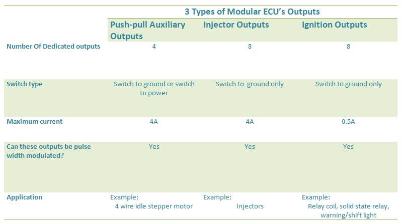Summary
                    Table  
  
If you expand a Modular ECU with a mini Aux Output
                  module, then that comes with 6 push-pull auxiliary outputs, so
                  they can be used to drive 4-wire idle motors or pretty much
                  whatever you like.  
  
Now, an auxiliary output can be configured to be one
                  of the preprogrammed outputs in the ECU, or you can implement
                  your own based on any variable in the ECU.  
  
I should explain variables in the ECU at first. There
                  are about a thousand variables built into the ECU. You can see
                  these on either the live gauges, you can add them to the
                  monitor panel, you can watch them in the buit-in scope and you
                  can see them in the logs. They are separated into different
                  categories to make them easier to find, and if you can’t find
                  one then you can type into the search tool and see variables
                  which include the string you’ve typed.  
  
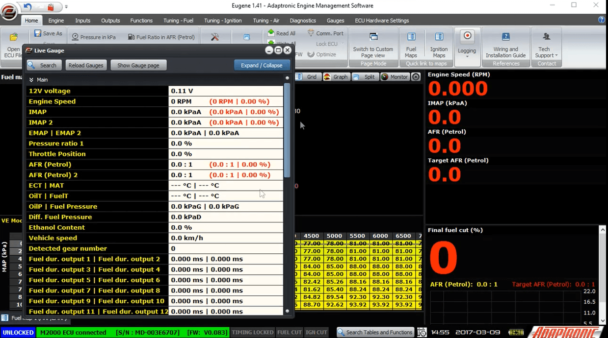  
Live Gauges (Shortcut key – F2)  
  
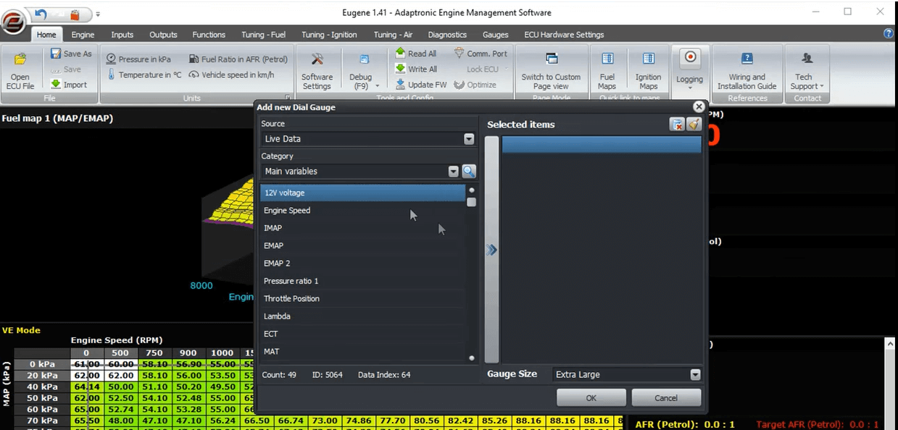Monitor
                    Panel (Right click on monitor panel then add new gauge)  
  
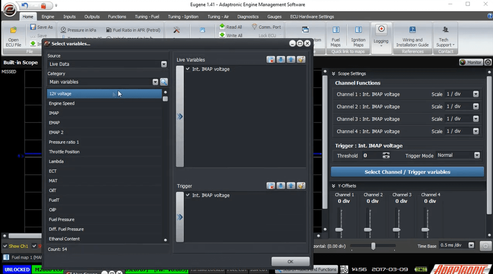Simulator
                    (Shortcut key -F4)  
  
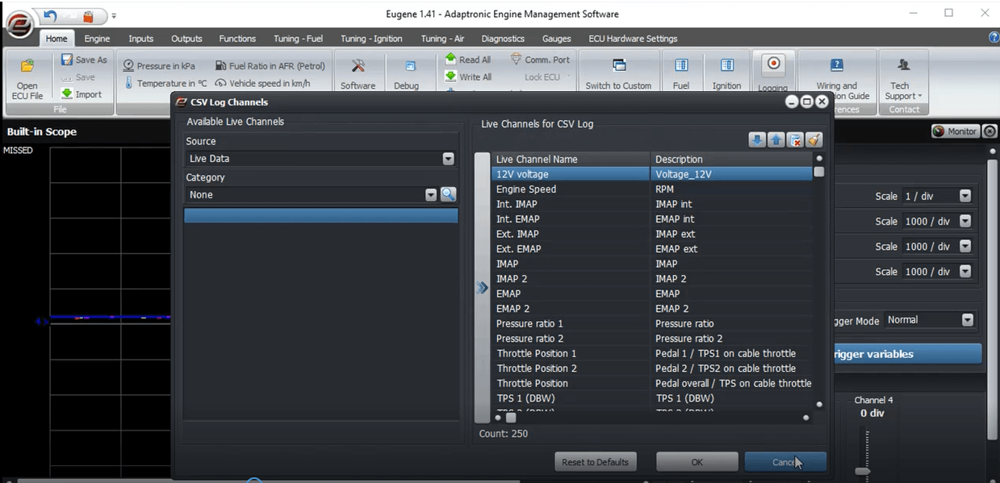Logs
                    (Go to logs and select CSV Log Channel)  
  
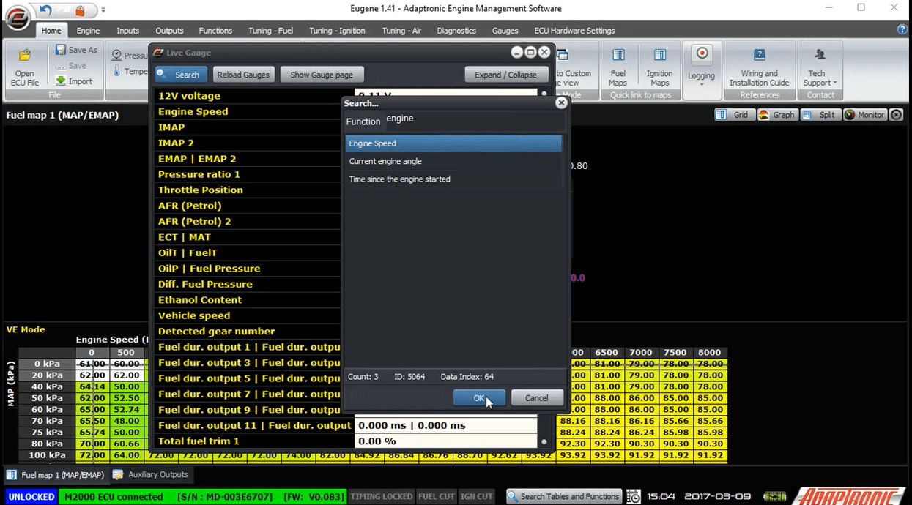  
In live gauge window you can click the search
                    button and type-in the variable your looking for.  
  
I’ll start first with preprogrammed outputs. These
                  are output functions that the ECU decides based on built-in
                  logic, the settings you enter and the conditions. For an
                  output that’s going to be a simple on/off function, these
                  values either show 0% or 100% and this value refers to the
                  duty cycle (representing off and on, respectively). These
                  include functions such as thermofan, air conditioning
                  compressor, fuel pump and also stepper motor drive phases.  
  
Other prepregrammed outputs have variable duty cycles
                  which vary from 0 to 100%. These include idle valve duty
                  cycle, boost control duty cycle, VVT control valve duty cycle
                  and so on.  
  
Let’s have a look at the output screen in Eugene. In
                  this screen, all the outputs on the ECU are listed, in
                  accordance with the modules that have been installed in the
                  ECU.  
  
On a base model M2000 for example, there are 20
                  outputs; 8 injection, 8 ignition and 4 auxiliary push-pull.  
  
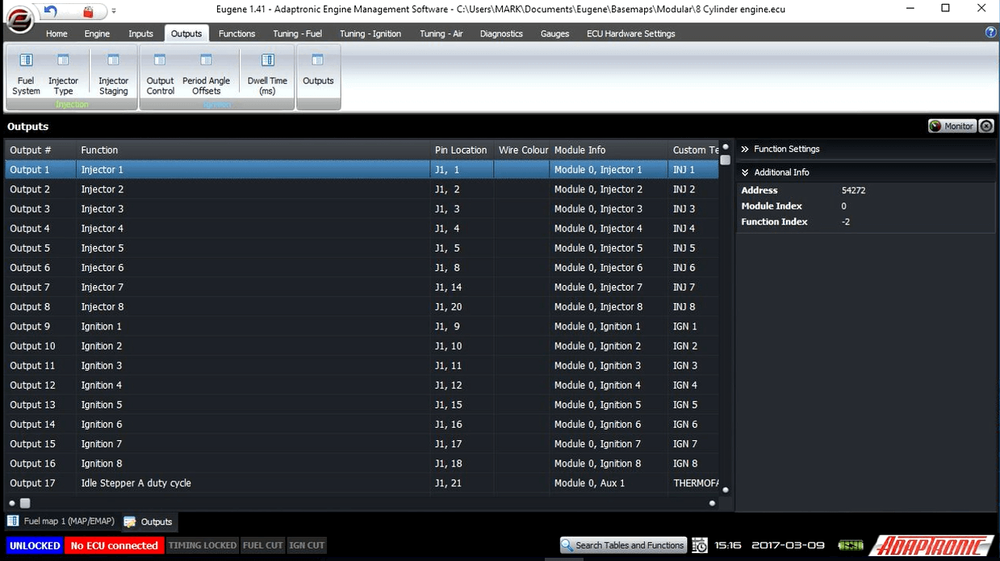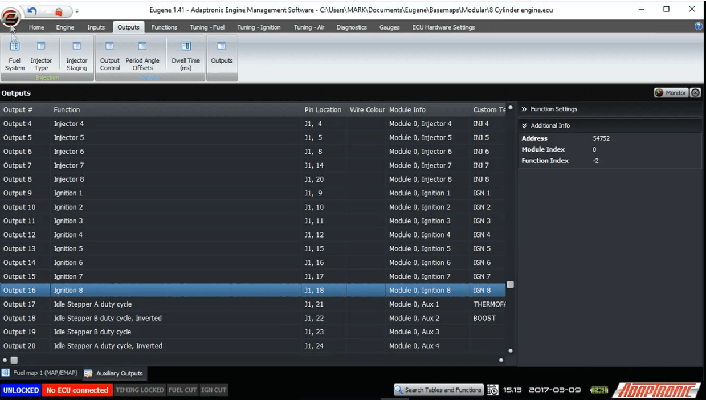8
                    ignition; 8 injection;4 auxiliary push-pull  
  
If you have a configuration that only uses 6 injector
                  outputs, for example an in-line 6, or a 3-rotor with 2
                  injection stages, you will see that injector outputs 1-6 can
                  not be changed, but injector outputs 7 and 8 can be modified
                  in the settings.  
  
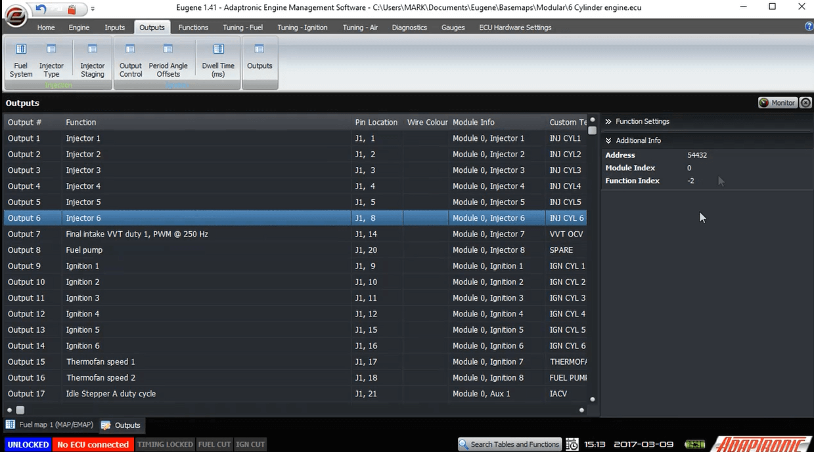Injector
                    6 cannot be change.  
  
For argument’s sake, let’s assume that we want to
                  configure injector output 7 to be an idle valve pulse width
                  modulated output that oscillates at 250 Hz. What you would do
                  is select the output, and change the type. Do this by
                  selecting “outputs” from the variable category and choosing
                  “Idle effort”. Then enter the frequency of 250 Hz, and the job
                  is done. The procedure is the same for selecting a boost
                  control output, although for one of those you would generally
                  run a lower frequency eg 30 Hz.  
  
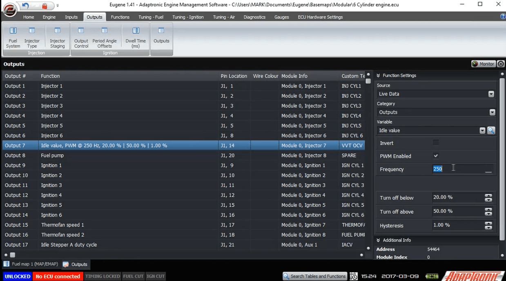Output
                    7 configured  
  
Let’s do a more complex example now. Let’s assume
                  that we want to configure auxiliary outputs 1-4 as push-pull
                  outputs to drive a 4 wire stepper motor. In this case we would
                  go to the first output, and select it as Idle Stepper A. We
                  also need to enable Drive High to enable the output to be able
                  to supply current, rather than just being a short to ground.
                  The next output needs to be the complementary of this to drive
                  the other end of the coil, so in this case we select Idle
                  Stepper A, drive high again, but this time we also select
                  “invert” so it drives with the opposite phase to the previous
                  output. We then do the same for the following 2 outputs for
                  Idle Stepper B.  
  
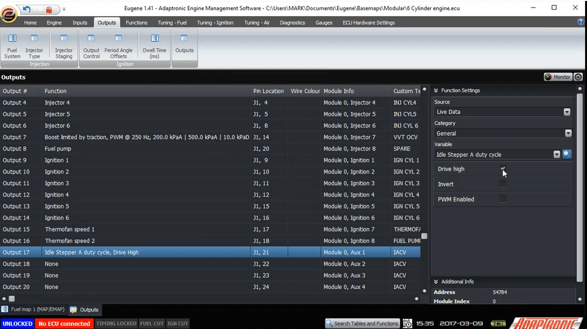Output
                    17 Stepper A  
  
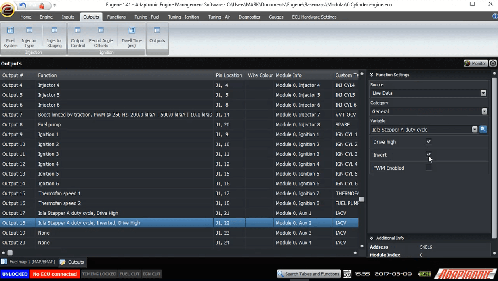Output
                    18 Stepper A  
  
This way, each coil gets both ends energized in the
                  right sequence.  
  
For a 6 wire stepper motor, the procedure is the same
                  except that you do not enable the “drive high” selection.
                  Because of this, you are also free to use ignition or injector
                  outputs to drive a 6 wire stepper motor; it does not need to
                  use push-pull outputs. The same wiring and setup process is
                  used for other 6 wire stepper motors for example metering oil
                  pumps.  
  
Let’s look now are a generic, input based output. In
                  this example we will use an on-off style VVT, for example as
                  used on the RB25 or 4AGE engines. If you’ve played with VVT
                  you’ll know that in general the intake cam must be advanced in
                  the midrange, but above about 5000 RPM the cam needs to be
                  returned to its home position. For the sake of an example,
                  let’s say that we want the output to come on between 2000 and
                  5000 RPM, with 100 RPM hysteresis. Ie, as the engine
                  accelerates from idle, it will turn the output on when the RPM
                  exceeds 2000, but it must go below 1900 for the output to turn
                  off again. Similarly above 5000 the valve will turn off, and
                  to turn back on the RPM must all below 4900.  
  
You configure this firstly by selecting the variable
                  from “main variables” rather than “outputs”. The variable that
                  you want is obviously “engine speed”. Enter the “off below” as
                  2000 RPM, and the “off-above” as 5000 RPM, and the hysteresis
                  as 100 RPM. Disable PWM on the output, and the job is done.  
  
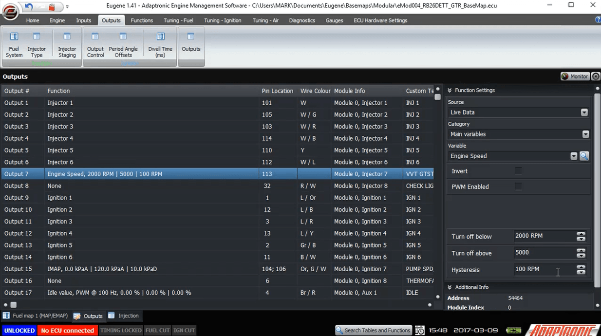Configured
                    engine speed.  
  
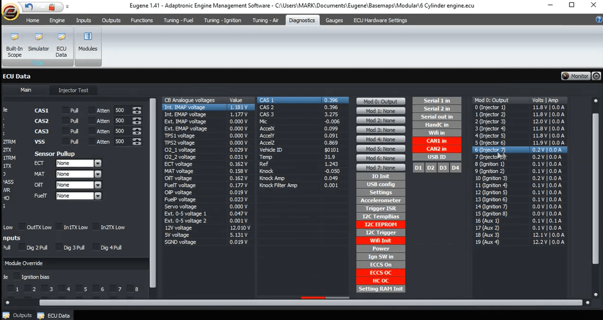  
  
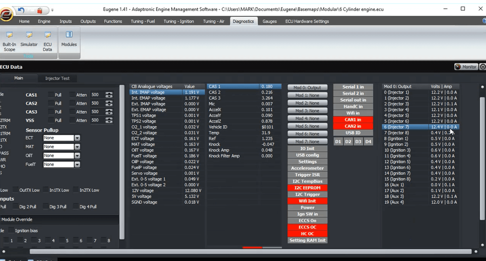  
  
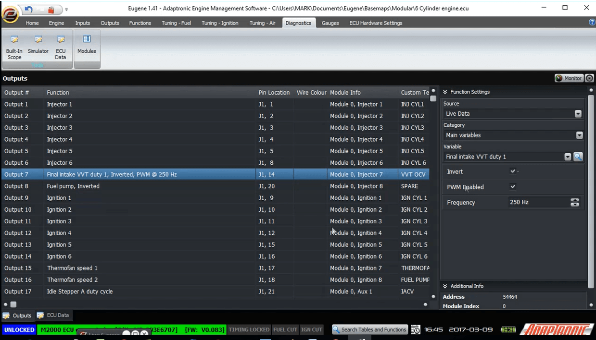  
  
If you want a simple threshold, for example an
                  auxiliary fuel pump to come on above a certain MAP value
                  (above a certain boost), you can do this by just selecting the
                  “off below” as your turn-on threshold (eg 130 kPa or 5 PSI),
                  and make the “off above” very high so that you don’t ever see
                  it (eg 500 kPa).  
  
There is also a shortcut here which tells you which
                  pin this output controls on the ECU connector, and how it is
                  described in the pinout page. You can double click on that to
                  take you to the wiring page so you can make sure you keep that
                  up to date as you add another output.  
  
Just
                    double click the output row.  
  
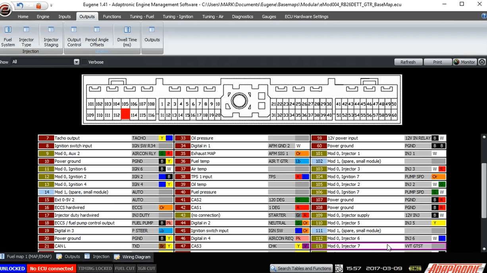Wiring
                    pins.  
  
To check that an output is working, there are a few
                  ways to do it. The easiest is to go into the auxiliary output
                  setting and click the invert on and off and verify that the
                  output turns off and on.  
  
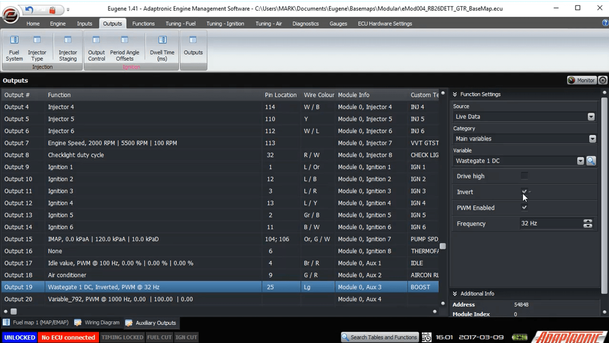Click
                    invert on/off  
  
A second way is to go into the ECU data page, and
                  look at the output voltage and current. If an output is off,
                  then its current should be close to zero, and if there is a
                  load connected with 12V on the other side, then you should see
                  the 12V on the auxiliary output pin, and in the diagnostic
                  window. When you turn the output on, this voltage should go to
                  near zero, and the current should increase to represent the
                  current drawn by the load. This way you can tell if the load
                  is connected and if it’s drawing the approximate correct
                  amount of current.  
  
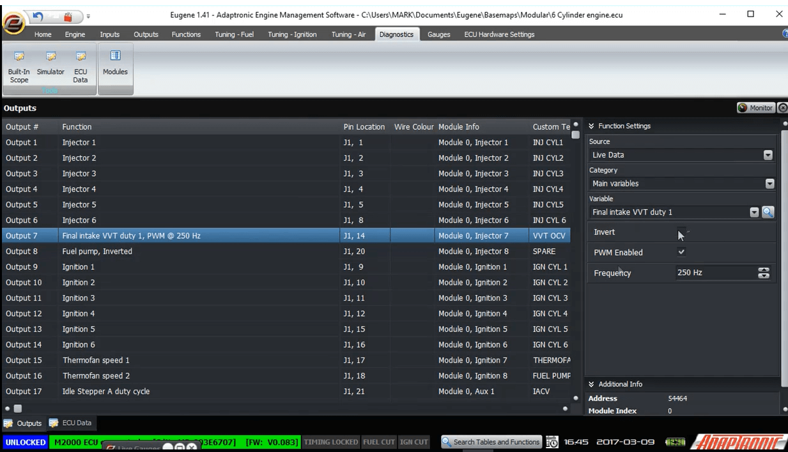When
                    invert check box is off output voltage on diagnostic window
                    will show 12V.  
  
When
                    invert check box is on output voltage on diagnostic window
                    will show 0V.  
  
One final point about the outputs page; because the
                  injector outputs are switching mode, they need to recirculate
                  the current back to the injector supply. If they recirculate
                  the current back to another 12V supply then you end up with a
                  large current loop and corresponding electrical noise. So this
                  is why we show injectors powered from the ECU power in the
                  M2000 wiring diagram. On some cars, the injectors are hot all
                  the time, and on plug and play ECUs for those cars we connect
                  the injector flyback connection to the injector supply, rather
                  than to the 12V supply inside the ECU. This injector flyback
                  connection is also shown on the outputs page, not so that you
                  can change anything, but so that you can see which pin it
                  connects to  
  
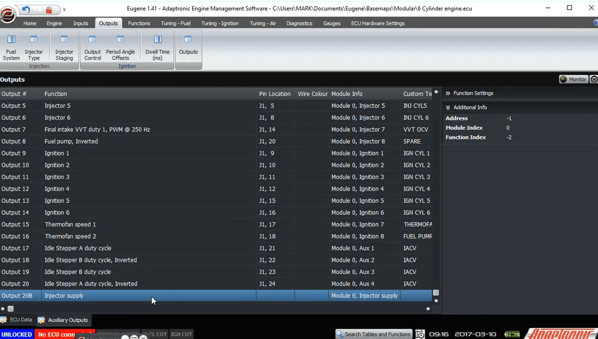  
Thank you and happy learning!  
©2018
        Adaptronic  
