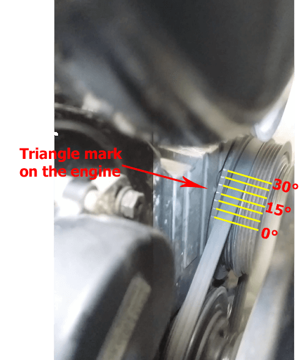
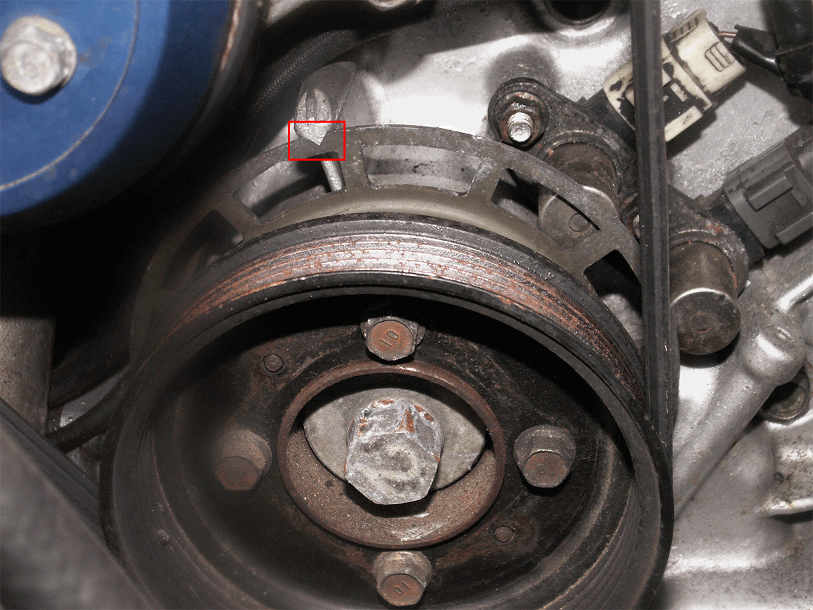
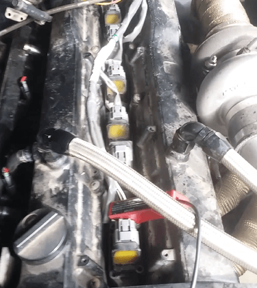
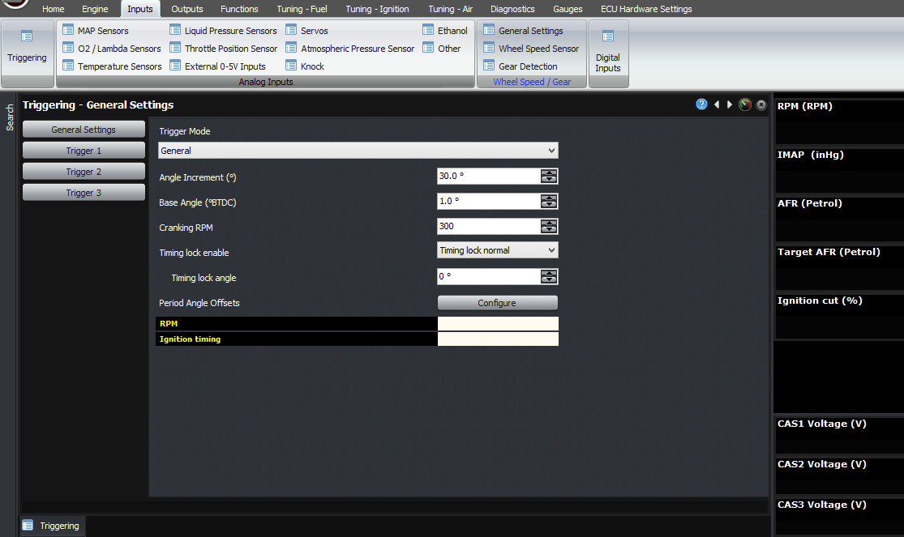
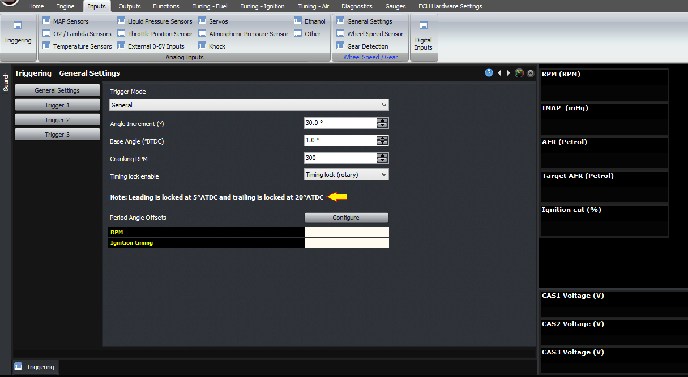

  
  
  
  
  
  
[DOWNLOADS](#)[STORE](#)[CONTACT US](#)  
  
  
  
  
  
  

Setting Base Timing on Modular ECUs

[go back to
                support home](EN_EUGENE_MOD_HOME.md)  

  
  
  

[Cranking
                Conditions](EN_MOD_034_CRANKING.md)[
              ](file:///C:/Users/Computer/Dropbox/2018/Scratch/Using%20Blue%20Griffon%20to%20edit%20Eugene%20HTML%20help%20files/EN/EN_MOD_034_CRANKING.md)

[Ignition
                Timing Tuning Modes  

              ](EN_MOD_038_IGNITIONTUNINGMODES.md)

  

[  

              ](EN_SelFW.md)

  

  
  
  
  

  
The ECU has to have a very good understanding of the
                  engine’s current crank angle. Setting the base timing is a
                  critical part of the ECU setup and tuning process.  
  
  
  

  
  
Sample Timing Mark  
  
First of all, you must have timing marks to be able
                  to do this. Many engines, especially older ones, will have
                  these on them from factory. Sometimes they are at funny
                  positions, for example the FD 13B engine has a single mark at
                  20 degrees ATDC.  
  
  
  

  
  
FD 13B engine timing mark  
  
If there is no timing mark on the crank pulley, you
                  can determine where TDC is by pulling out a spark plug and
                  rotating the engine by hand to see where the spark plug gets
                  to the top. If you have put a screwdriver down the hole and
                  use that to move a dial gauge, that will get it to within a
                  degree or so. If you can’t, or you don’t have a dial gauge
                  then you can screw a bolt into the spark plug hole and roate
                  the engine until the piston touches the bolt near TDC, and
                  mark that position on the crank. Then rotate the engine back
                  the other way until it touches the bolt from the other side,
                  and mark that position. TDC is halfway between those two
                  marks.  
  
This assumes that you have a running engine that will
                  idle by itself.  
  
You will need a timing light; the dumber and more
                  basic the better. If you’re using a timing like that has
                  intelligence in it and advances or retards the time of the
                  flash relative to the ignition trigger, then you must disable
                  that.  
  
On COP engines, there’s no ignition lead so you can’t
                  clip the pickup on the lead. In most cases you can clip the
                  pickup on the leads at the back of the ignition coil, because
                  the common mode current is the same as the high voltage
                  current by Kirchoff’s current law. I have never seen this not
                  work, but if it fails you can remove the coil and connect an
                  ignition lead between the coil and the plug. On some Nissans,
                  they have a timing loop which you are supposed to be able to
                  clip your timing light onto, but in my experience this often
                  doesn’t read correctly so I recommend against using that.  
  
  
  

  
  
Timing light clipped onto the back of the COP  
  
In Eugene, go to the inputs -> triggering page,
                  and enable the timing lock. You will need to select a value
                  for the timing lock angle, based on the angle of the timing
                  mark that you have on the engine. For the RX7 engine, you can
                  select the dedicated 13B RX7 trigger mode, which locks the
                  leading ignition timing to 5 degrees ATDC and the trailing to
                  20 degrees ATDC, so that you can use the factory timing marks.  
  
  
  

  
  
Enable timing lock  
  
  

  
  
13B RX7  trigger mode  
  
Then check the timing with the timing light, and
                  adjust the ignition timing using the up and down arrows to
                  change the base trigger angle until the timing light shows the
                  same number commanded by the ECU. You should also increase the
                  revs and make sure that the timing stays still.  
  
Thank you and happy learning!  
  
©2018
        Adaptronic  
  
