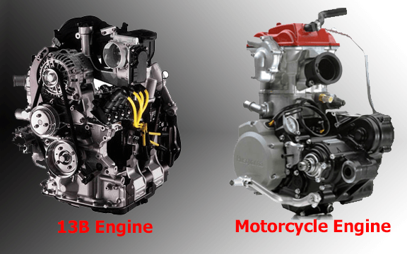
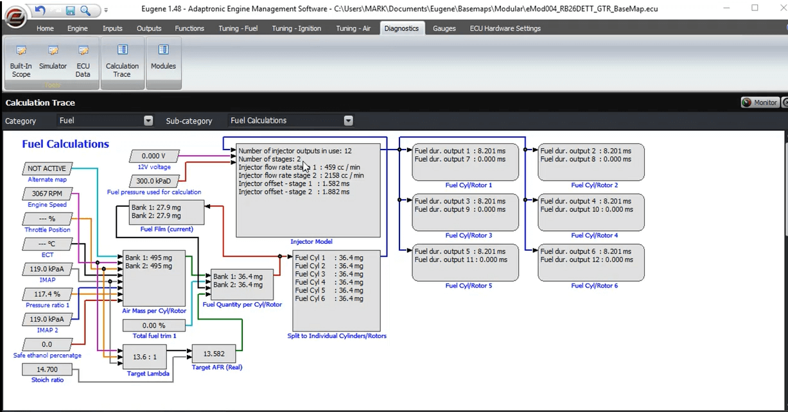
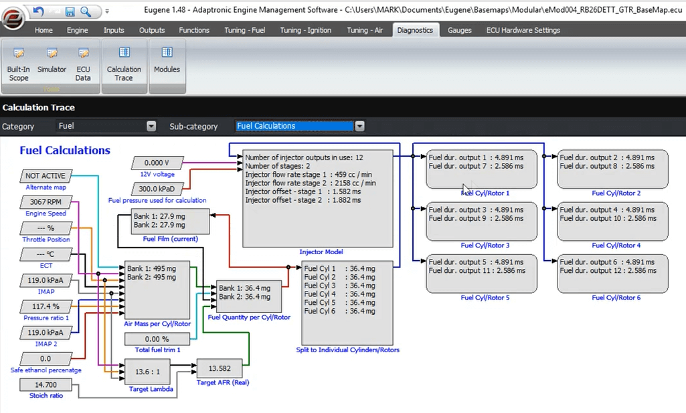
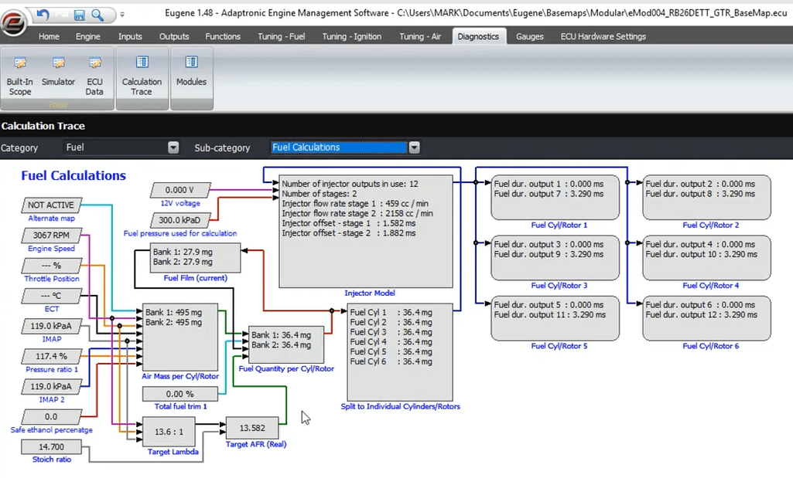
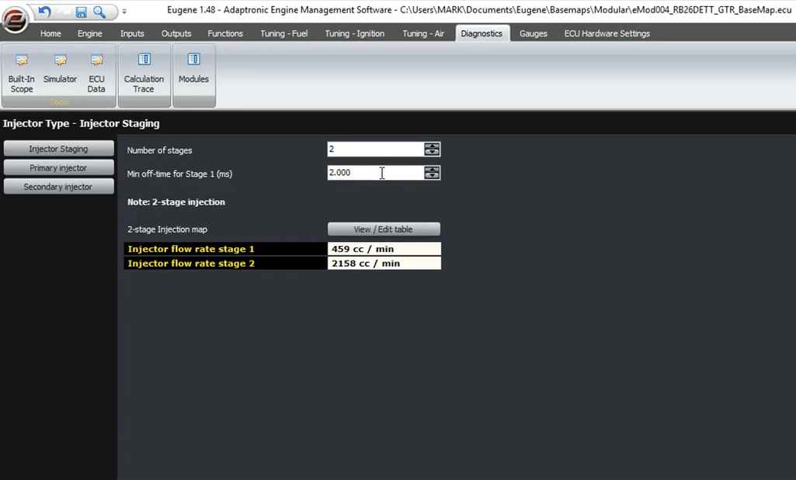
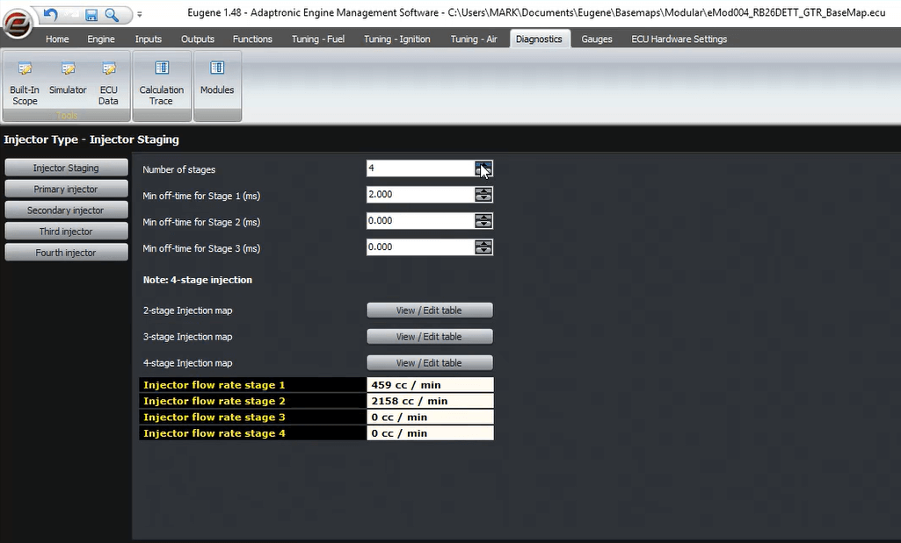
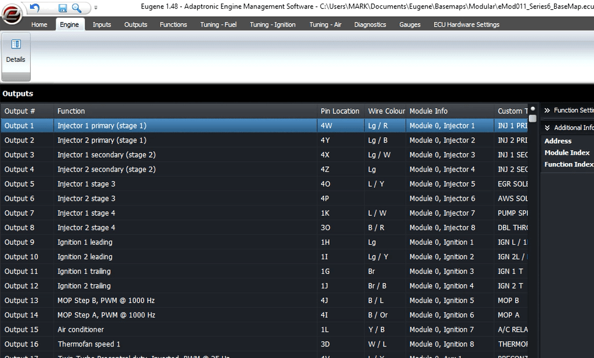

  
  
  
  
  
  
[DOWNLOADS](#)[STORE](#)[CONTACT US](#)  
  
  
  
  
  
  

Staged Injection | Discussion and How to Set up
              on Modular ECU

[go back to
                support home](EN_EUGENE_MOD_HOME.md)  

  
  
  

[Fuel
                Model](EN_MOD_029_FUELMODEL.md)[
              ](file:///C:/Users/Computer/Dropbox/2018/Scratch/Using%20Blue%20Griffon%20to%20edit%20Eugene%20HTML%20help%20files/EN/EN_MOD_029_FUELMODEL.md)

[Injection
                Timing on Port Injected Engines  

              ](EN_MOD_035_INJECTORTIMING.md)

  

[  

              ](EN_SelFW.md)

  

  
  
  
  
  
  
In this article, we’re going to
                  discuss staged injection, what it is, and how to set it up on
                  a Modular ECU.  
  
Staged injection is where you have multiple
                  injectors per combustion chamber. The reason for doing this is
                  that a single injector, sized so that there is sufficient fuel
                  flow at the full power condition, will struggle to deliver the
                  small amount of fuel required in the overrun and possibly the
                  idle condition.  
  
The only engines I’ve seen these on from factory are
                  the Mazda rotaries and some motorbike engines, but in addition
                  to these it’s a common addition to high performance piston
                  engines.  
  

  
  
The first thing to remember is that the ECU has a
                  complete fuel model. So what the ECU needs to know is how much
                  fuel to try to deliver using the primary injector, and how
                  much to deliver on secondary injectors or any subsequent
                  stages.  
  
Let’s pick a 2 stage system as an example. The ECU
                  first calculates the amount of fuel that’s needed for each
                  rotor or cylinder, the same as on a single stage engine. But
                  with a 2 stage injection engine, the ECU needs to work out how
                  much fuel to attempt to deliver with each injector stage.  
  
It does this using the secondary staged injection
                  map. This value is a percentage, which represents the
                  percentage of fuel which is to be delivered by the second
                  stage. Eg if this is 0, the ECU will deliver all the fuel
                  using the primary stage. If the value in the table is 50%,
                  that means that the fuel will be split equally between the two
                  stages. Note that this does not mean that the primary and
                  secondary injectors will have equal duration, unless they are
                  the same type of injector. And if the value is 100%, all of
                  the fuel will be delivered by the secondary injector and the
                  primary injectors will not be fired at all. So as well as a
                  traditional staged injection engine, this system allows you to
                  do things like have injectors up above the throttle bodies
                  which are active at high RPM to improve vaporization.  
  
  

  
  
ECU calculations when MAP is zero  
  
  

  
  
ECU Calculation when MAP equals to 50%  
  
  

  
  
ECU Calculation when MAP equals to 100%  
  
You can probably appreciate that this system is open
                  to mistakes, by asking an injector to deliver more than it can
                  physically flow. There are practical limits and we’ll discuss
                  those now.  
  
You can select a minimum off-time for each injector
                  stage. For nicely behaved, linear performance, this should be
                  the amount of time it takes for the injector to fully close,
                  so that when you begin the next pulse, it releases the same
                  amount of fuel as if the delay was much longer. If you make
                  this off-time too short, then the injector does not fully
                  close, which means that it takes less time for the injector to
                  open, and therefore the amount of fuel delivered is higher
                  than the amount calculated. We recommend 2ms for this figure,
                  based on our testing of many types of injectors. This gives
                  you the limit of the duty cycle of that stage, which you can
                  calculate quite easily – for example at 6000 RPM on a rotary
                  or 2-stroke, a 2ms off-time means a maximum injector pulse of
                  8ms which therefore corresponds to an 80% duty cycle.  
  

  
  
If the ECU can not deliver the percentages selected
                  in the staged injection map, then it reverts to a default
                  strategy which is used on the Select ECUs, which is to deliver
                  as much fuel as possible on the primary injectors, and then
                  any left over will be delivered on the next stage, and if
                  there’s any after that it will be delivered on the 3rd stage
                  and so on, all the time while respecting the minimum off-time
                  (which was a fixed value, not a variable, in the Select ECUs).
                  It stands to reason that if you just set the whole staged
                  injection map to zero, it will follow this strategy all the
                  time, and that’s how we set it in the base maps for rotary
                  engines. The only reason not to do this is if you believe the
                  engine can or might make more power by increasing the relative
                  amount of fuel delivered by the higher stages, for example if
                  this creates more charge-cooling vaporization or promotes
                  better mixing.  
  
The Modular ECUs currently support up to 4 injector
                  stages, and on a higher stage system, the behavior is just an
                  extension of the 2-stage. On a 4-stage system, there are 3
                  staged injection maps – 2nd stage, 3rd stage and 4th stage –
                  and the balance (100 percent minus the sum of these three) is
                  to be delivered by the primary injectors. Therefore if you
                  leave all these maps at zero, you again have the default
                  automatic behavior.  
  

  
  
So that the ECU can convert the fuel volume into the
                  injector pulse duration, the ECU needs to know the fuel flow
                  rate versus fuel pressure and also the dead time or offset.
                  Because in the general case you will have different sized
                  injectors between the different stages, these are all separate
                  settings for each stage.  
  
The wiring and mapping of the injectors is the last
                  point we will discuss. The mapping is fixed so that the order
                  of the injector outputs is all the first stage first, then all
                  the second stage, then all the third stage, then all the
                  fourth stage. For example if you have a 2 rotor, 3 staged
                  engine, we would have:  
  
Injector output 1 = rotor 1, primary  
Injector output 2 = rotor 2, primary  
Injector output 3 = rotor 1, secondary  
Injector output 4 = rotor 2, secondary  
Injector output 5 = rotor 1, third stage  
Injector output 6 = rotor 2, third stage  
  

  
  
We chose to do it in this order, rather than pull
                  all cylinder / rotor 1 together and then all cylinder / rotor
                  2 together, so that you can add stages easily without having
                  to change all the existing wiring, just adding the injector
                  wires for the new stage. We find it’s more common for people
                  to add stages than to change the number of rotors or
                  cylinders.  
  
  
Thanks and happy learning!  
  
©2018
        Adaptronic  
  
