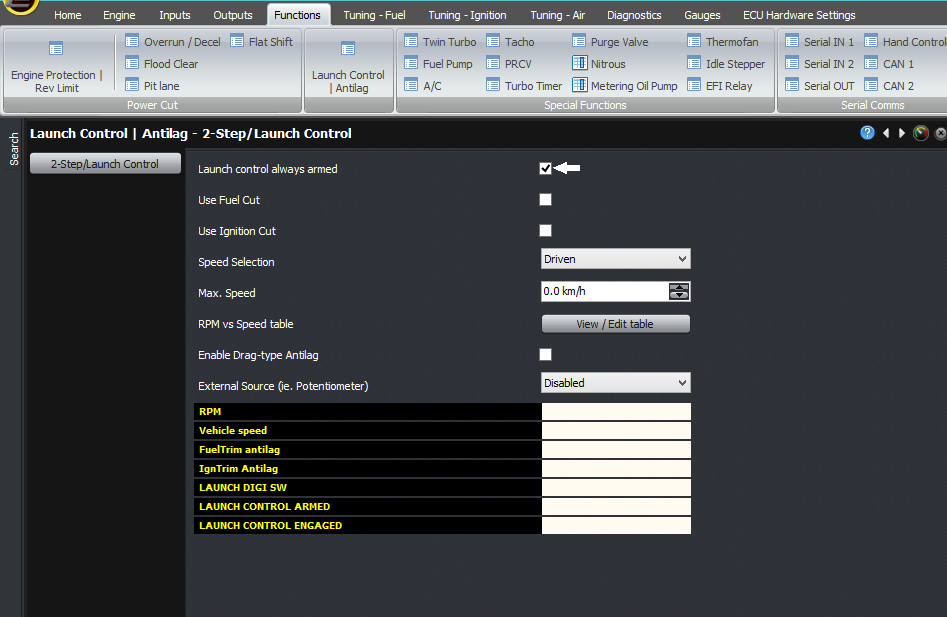
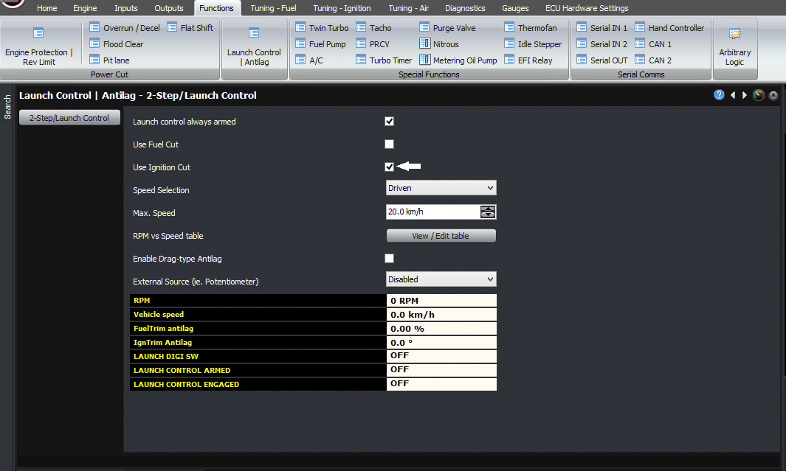
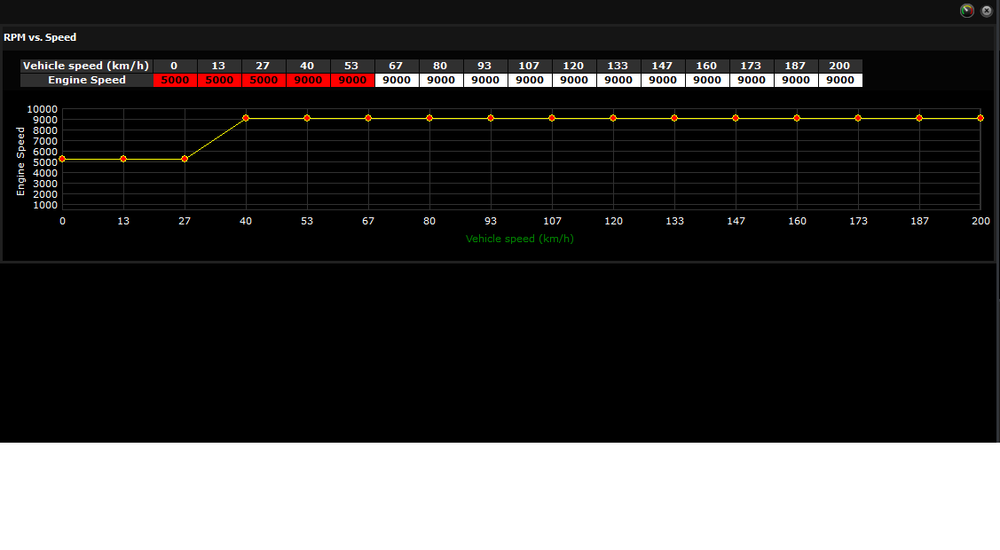
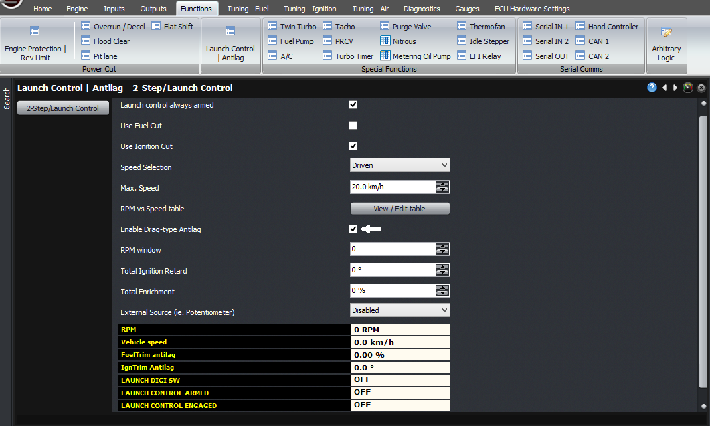
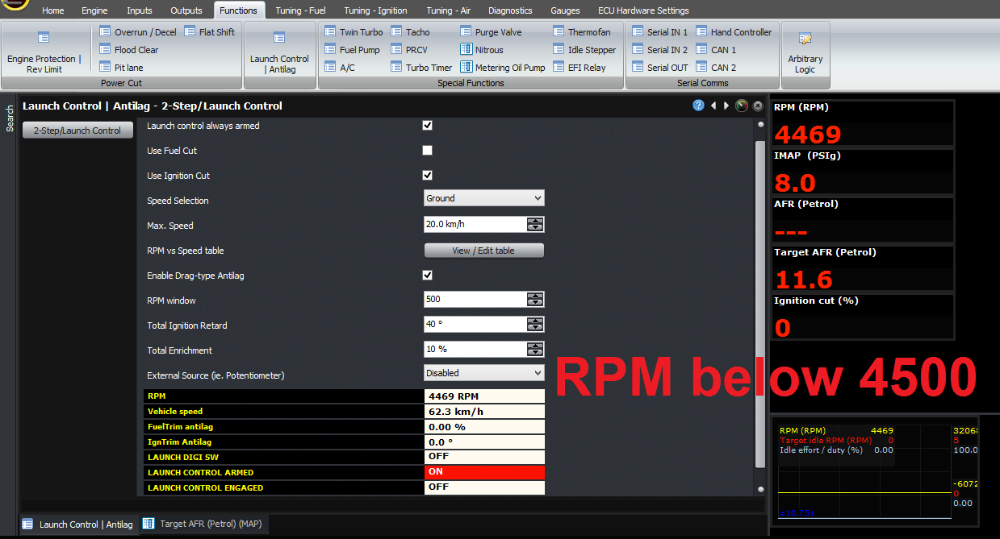
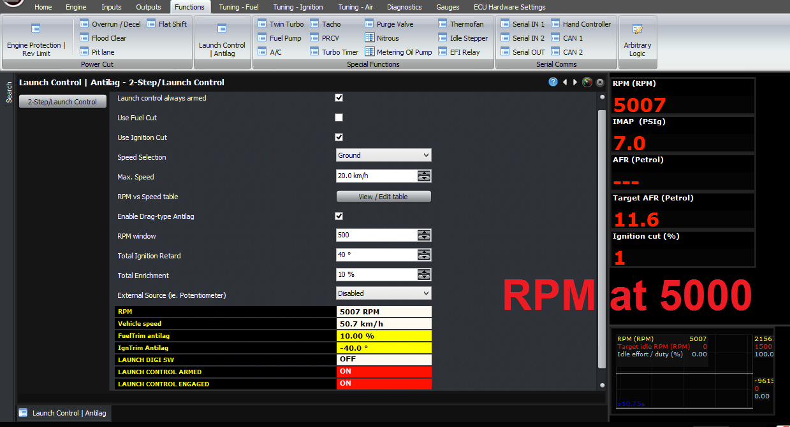
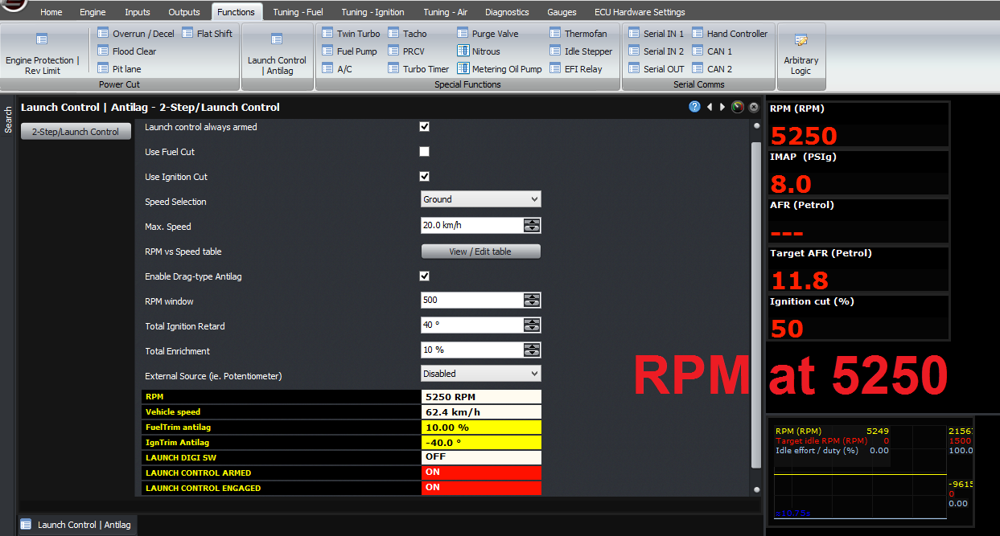
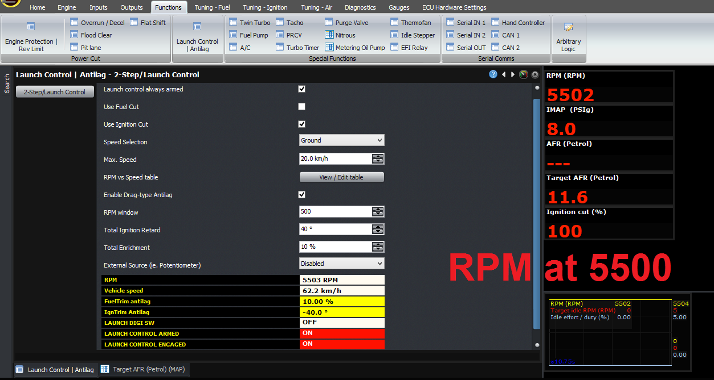

  
  
  
  
  
  
[DOWNLOADS](#)[STORE](#)[CONTACT US](#)  
  
  
  
  
  
  

Setting up Launch Control and Drag Style
              Antilag

[go back to
                support home](EN_EUGENE_MOD_HOME.md)  

  
  
  

[Wheel
                Speed Inputs and Gear Detection  

              ](EN_MOD_005_WHEELSPEED.md)

[How
                to Setup Open Loop Boost Control  

              ](EN_MOD_039_OPENLOOPBOOSTCONTROL.md)

  

[  

              ](EN_SelFW.md)

  

  
  
  
  
  
  
  
  
This article explains how to set up launch
                  control and drag style antilag. Sometimes this is called “2
                  step” in keeping with the tradition of inaccurate and
                  unspecific nomenclature like “dynamic compression” and
                  “trailing throttle response”. These are really two separate
                  functions with separate purposes, but often they are
                  configured together and the term “2 step” is used to describe
                  both of them by different people so we will discuss them both
                  in the same article.  
  
The first function is to control the launch RPM, so
                  that when you launch the car you can have the optimum amount
                  of wheel slip. Zero wheel slip (ie full grip) often does not
                  allow the maximum acceleration because the engine falls out of
                  its torque band, and too much slip (too much wheelspin) fails
                  to get the power to the ground to accelerate the vehicle.  
  
The second function is to build boost. A
                  turbocharged engine will normally need some amount of boost to
                  get off the line quickly, and holding the engine at a
                  particular RPM with throttle, or ignition cut alone, generally
                  won’t build enough boost. So to build boost, the EGT from the
                  engine must be increased, so the way we do this is with a
                  combination of ignition retard and ignition cut.  
  
To use this function, you will need a vehicle speed
                  sensor, so that the ECU can know to stop applying the ignition
                  cut and retard once the car has got out of the hole.  
  
To enable it, go to the “Launch control / Antilag”
                  screen within Functions -> Power Cut.  
  
Select “enable launch control” to enable the
                  function and see the settings.  
  

  
  
Then assuming that you want to build boost, you will
                  want to use ignition cut, and not fuel cut, so you should
                  select ignition cut to be on and fuel cut to be off. The
                  reason you would use fuel cut is if you have naturally
                  aspirated engine which doesn’t mind having its fuel cut to
                  control RPM, and you’re only doing it to control the launch
                  RPM.  
  
  
  

  
  
Enabled ignition cut  
  
The next selection is “Speed selection”, in which
                  you select how the ECU will determine vehicle speed. Ideally
                  this would be taken from the ground speed, but to do this
                  requires 4 vehicle speed sensors, rather than many
                  installations which will only have a single sensor on the
                  gearbox. If you only have a single sensor, then you must
                  select “Driven” as the speed selection, but for obvious
                  reasons, the RPM limit vs road speed table won’t have much of
                  a meaning because the ECU will not know the road speed. If the
                  RPM is too high and you only have the single sensor on the
                  gearbox, then there’s no way for the ECU to know that the road
                  speed isn’t high enough yet and the slip is too great.  
  
The maximum speed is a setting above which the
                  launch control or 2-step will not longer do anything.  
  
The next setting is the RPM vs speed table, which is
                  the RPM limit as a function of the road speed. Now technically
                  in a 2-step, there would be a fixed RPM below a certain speed,
                  and then the RPM would not be limited about that speed. But
                  using this system, it allows you to ramp up the RPM, if that’s
                  what your application calls for.  
  

The
                  next setting is “enable drag-type antilag”, which if you’re
                  trying to build boost, you should enable.  
  
If you enable the antilag function, the first
                  setting is the RPM window. This is the RPM range over which
                  the antilag feature is fed in, and the range over which the
                  full ignition cut occurs. I’ll explain this in a second. The
                  next settings are the amount of ignition retard (this should
                  be a positive number), and fuel enrichment, during antilag.  
  
  
  

  
  
Enabled drag style antilag  
  
To pick an example, let’s assume our ignition retard
                  is set to 40 degrees, the fuel enrichment is set to 10%, the
                  RPM window is 500 RPM, and the RPM limit set in the RPM vs
                  Speed table is set to 5000 RPM at the current speed.  
  
Below 4500 RPM, the engine will behave normally.
                  Then over the range of 4500 – 5000 RPM, the ignition will
                  retard by 40 degrees and the fuel enrichment will go from 0 to
                  10%.  
  

  
  
By 5000 RPM, the ECU will be applying the full
                  ignition retard and full fuel enrichment.  
  

  
  
Then over the range from 5000 – 5500 RPM, the ECU
                  will go from 0% ignition cut to 100% ignition cut. So at 5250
                  RPM for example, the ECU will be at 50% ignition cut, 40
                  degrees ignition retard with respect to the ignition map, and
                  10% fuel enrichment.  
  

  
  

  
  
Like the other functions, you can see the current
                  variables ont he main screen as it’s happening, and these are
                  all logged in the if you’re logging at the time.  
  
  
Thank you and happy learning!  
  
©2018
        Adaptronic  
  
