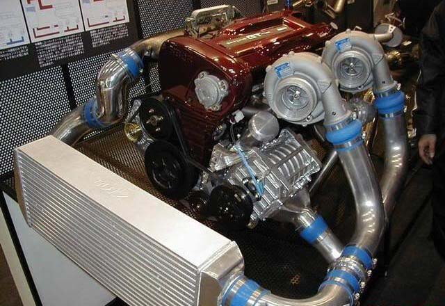
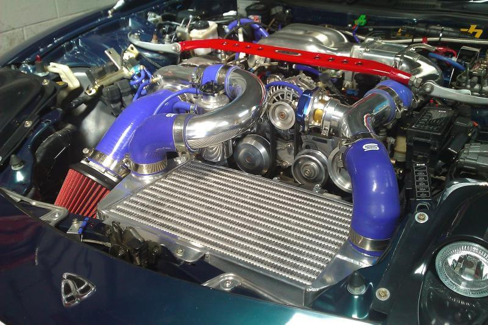
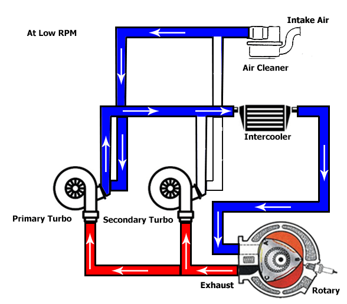
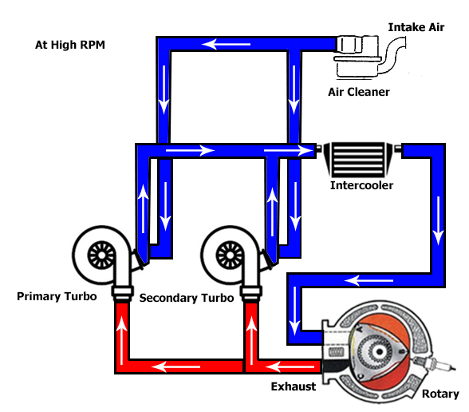
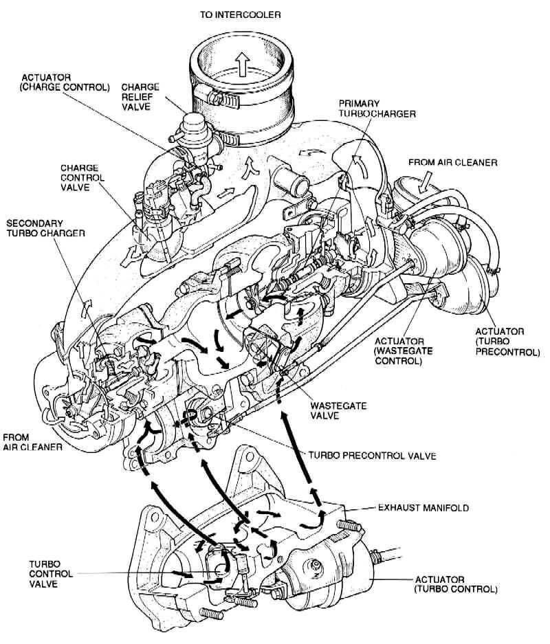
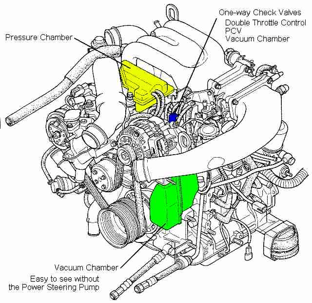
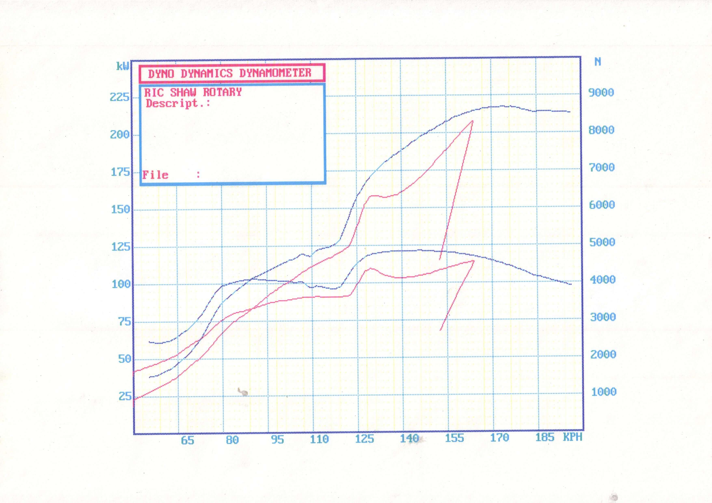
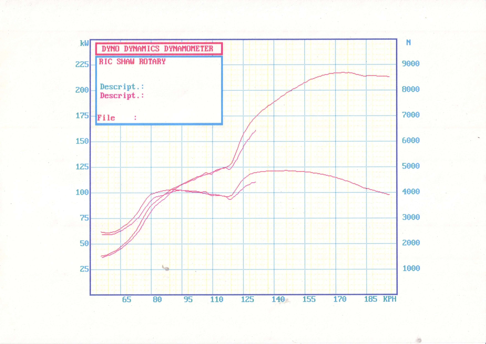
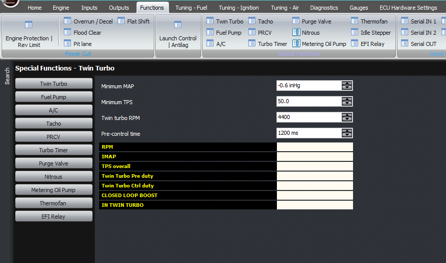

  
  
  
  
  
  
[DOWNLOADS](#)[STORE](#)[CONTACT US](#)  
  
  
  
  
  
  

Twin Turbo Control on Modular ECU

[go back to
                support home](EN_EUGENE_MOD_HOME.md)  

  
  
  

[Target
                Boost Modes  

              ](EN_MOD_043_TARGETBOOST.md)

[Turbo
                Speed Sensors  

              ](EN_MOD_045_TURBOSPEED.md)

  

[  

              ](EN_SelFW.md)

  

  
  
  
  
  
  
  
  
In the early to late 1990s, it was common for some halo cars
                  to run twin turbocharger systems. We saw this with the Nissan
                  GTR from the R32 to the R34, the Mazda RX7 FD and the Supra
                  JZA80. Broadly speaking, there are two types of twin turbo
                  systems; the parallel systems as on the RB26 Nissan engines,
                  and the sequential twin turbos as on on the RX7 and the Supra.
                  This article will only discuss the sequential twin turbo
                  system on the RX7 FD.  
  
  
  
  

  
  
Parallel twin turbo systems  
  
  

  
  
Sequential twin turbo systems  
  
The two turbochargers are both the same size on the standard
                  RX7, however at low RPM, only one turbo is active. At high
                  RPM, or the full-power condition, both turbochargers are
                  active. This allows rapid spooling of the small turbo at low
                  RPM, while not being limited by its restriction at high RPM,
                  because at high RPM you have two of them working and therefore
                  double the flow capacity.  
  

  
  

  
  
When only the primary turbo is running, all the engine exhaust
                  goes through either the primary turbine, or bypasses the
                  turbine through the wastegate. The compressed air from the
                  primary turbo is fed into the intercooler after which it goes
                  up to the throttle and intake manifold. Note that in this
                  case, the compressor exit from the secondary turbo has to be
                  blocked off, otherwise the compressed air from the primary
                  turbo would feed back through it, which would mean it wouldn’t
                  produce any boost.  
  

  
  
So in this condition, the inlet charge control flap is closed,
                  and the turbo control valve is also closed, to prevent exhaust
                  going through the secondary turbine.  
  
At high RPM, we must open both of these flaps, to allow the
                  second turbo to share in the exhaust from the engine, and to
                  contribute compressed air into the inlet. So in this
                  condition, both flaps are open.  
  
In the RX7 system, there are two chambers which check valves
                  going to the inlet manifold. One is pressurised with boost
                  air, and the other stores vacuum. The solenoids that control
                  these flaps are configured so that each flap actually has two
                  solenoids, that each connect either boost or vacuum to one
                  side of a servo diaphragm. Therefore in one position, one side
                  of the diaphragm has boost and the other has vacuum, and in
                  the other position the two are swapped around. Therefore it is
                  necessary for both solenoids to be working, on all the flaps
                  which need to be controlled (both the intake and the exhaust,
                  and there is a second one in the exhaust I will describe
                  later), and the hoses all need to go to the correct locations.  
  

  
  
The tricky part comes with the transition. You can imagine
                  that if you’ve just been boosting hard on the first turbo, and
                  you engage the second turbo straight away by moving both the
                  exhaust and inlet flaps at once, then you’re going to get a
                  dose of turbo lag until the second turbo comes up to speed so
                  it’s producing the same boost as the primary turbo. This gets
                  worse the more boost you have on the primary turbo, for two
                  reasons. The first reason is that the first turbo loses boost,
                  because you’re diverting exhaust to the secondary turbo to
                  spool it up. The second reason is that the secondary turbo
                  actually needs to spin up to a higher speed to match the boost
                  of the primary turbo.  
  
Mazda weren’t silly so they added in what they call a
                  “precontrol valve”. This allows a small amount of air to be
                  diverted through the secondary turbine. It does cause a drop
                  in boost of the primary turbo but it’s not too extreme.
                  Secondly, there is a blow-off valve (charge relief valve) on
                  the outlet of the secondary turbo, which is under ECU control.
                  As you’d know it’s possible to overspeed a turbo by not
                  “loading” it, ie letting it just breathe into the atmosphere
                  and not deliver any boost. So what is done is for a very short
                  amount of time, we can open this precontrol valve, and the
                  charge relief valve at the same time, to get the secondary
                  turbo to spin up. Once it’s spun up, we can switch over the
                  intake flap and main exhaust flap to allow both turbos to do
                  the job.  
  
  
  
  

  
  
Dyno graph with PWM precontrol valve  

  
Sample dynograph  
  
  
How long we need to spin up the second turbo for depends
                  really on the turbo inertia, and that determines the time. So
                  doing this over an RPM window won’t be very useful because
                  that RPM window will correspond to a different time in
                  different gears, boosts and so on. So instead we actually tell
                  the ECU the time for which we want to spin up the second
                  turbo, and the RPM we want to finish by. The ECU looks at the
                  current rate of change of RPM and the current RPM to work out
                  when it needs to start the precontrol period. Previously we
                  have used a short period and just turned on the precontrol
                  output hard, but it turns out that starting earlier and pulse
                  width modulating the precontrol output period tends to keep
                  the boost up and smooths out the power curve.  
  
In terms of the settings, the ECU needs a minimum MAP and a
                  minimum TPS to activate the twin turbo function. Then there is
                  the RPM to enable the secondary turbo, and the pre-control
                  duration as described just before.  
  
The values we have used are 4400 RPM and 1200 ms (or 1.2
                  seconds).  
  

  
  
This feature is a bit redundant now since turbo technology has
                  come such a long way, and there are many single turbochargers
                  that behave as well as the factory twins, but many series 8s
                  are still running the factory twins so this function is
                  needed.  
  
Lastly, we need to talk about the outputs. The easiest way to
                  do this is with a plug and play ECU. But if you’re wiring in,
                  then please observe the following:  
1) The charge control valve and the turbo control valve need
                  to be opposite polarity. Therefore enable one in the software
                  as Twin Turbo, ann the other as Twin Turbo, inverted  
2) The precontrol output needs to be inverted, and as I said
                  above, making it PWM even at say 25 Hz does help with the
                  power curve.  
3) The charge relief valve can be connected in parallel with
                  the twin turbo output control  
  
  
Thank you!  
  
©2018
        Adaptronic  
  
