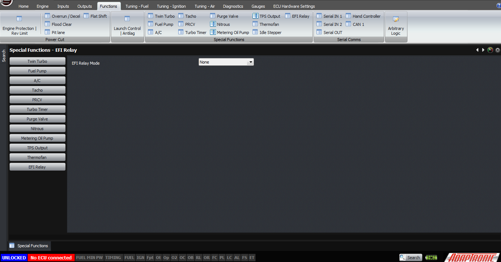
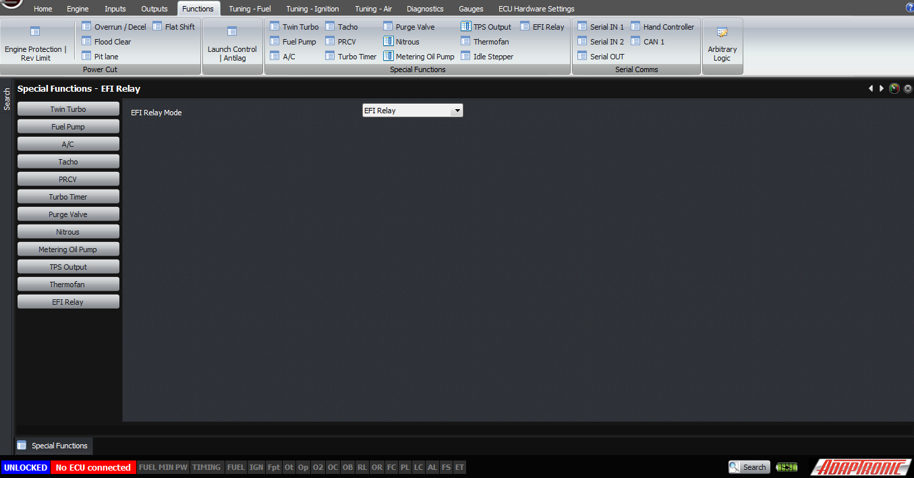
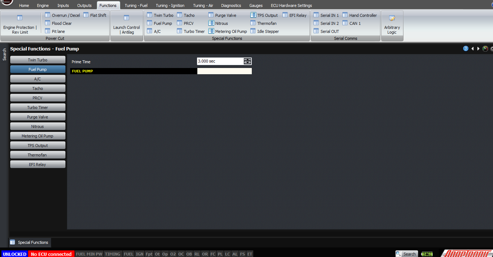
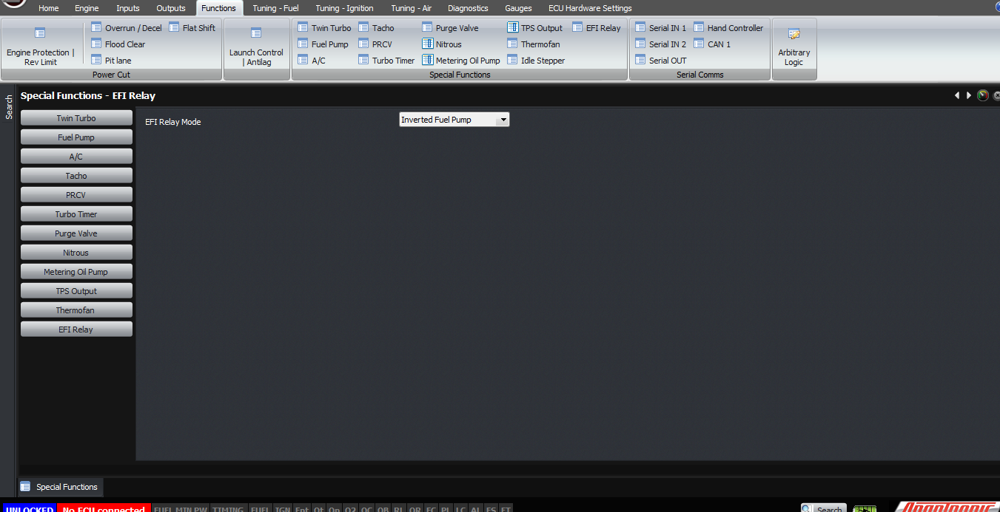
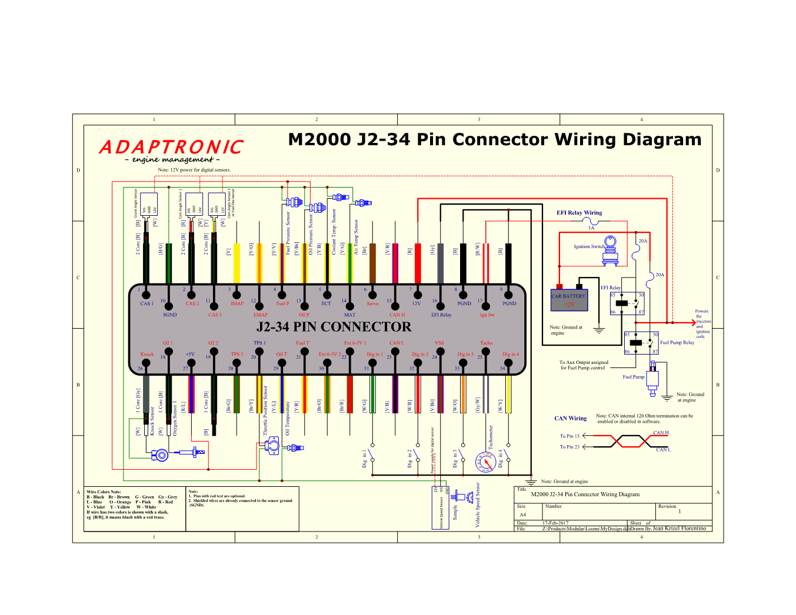

  
  
  
  
  
  
[DOWNLOADS](#)[STORE](#)[CONTACT US](#)  
  
  
  
  
  
  

Fuel Pump and EFI Relay Output on Modular ECUs

[go back to
                support home](EN_EUGENE_MOD_HOME.md)  

  
  
  

[Measuring
                Fuel Pressure on Mazda RX7s  

              ](EN_MOD_006_FUELPRESSURE_FD.md)

[  

              ](EN_EUGENE_KBSC_TG.md)

  

[  

              ](EN_SelFW.md)

  

  
  
  
  
  
  
  
  
Modular ECUs have the ability to drive an
                  EFI relay, and if your application doesn’t require ECU control
                  of an EFI relay, you can use this output as a fuel pump relay
                  control.  
  
This output can only switch to ground, it can’t
                  source current (that is, drive an output high). So if it’s
                  going to be used to drive a relay coil, the other side of the
                  relay coil needs to be connected to a 12V source.  
  
Let’s discuss the most basic system first of all,
                  which is where we have an ignition switch which powers up
                  everything via a relay, and we’ll use the ECU output to drive
                  the fuel pump relay. The power supply to the ECU must be
                  shared with the injectors. This is because the injector
                  drivers are switching mode, which means that they need to turn
                  the injector off and on very quickly to control the current on
                  a low impedance injector with no dropping resistor. The
                  injector stays open during this time.  
  
In this case, we connect power into the ECU on pin 7
                  of J2.  
  

  
  
We do not connect the ignition switch input pin on
                  the ECU. The EFI / fuel pump relay output triggers the
                  negative of the fuel pump relay. The setting in the ECU must
                  be set to be fuel pump relay, and you can find it under
                  Functions -> EFI / Fuel pump relay output. If you want to
                  disable the fuel pump relay, then you can set it to “none”.  
  
  
  

  
  
To enable fuel pump set EFI relay mode to “Fuel Pump”  
  
  

  
  
To disable set EFI relay mode to “none”  
  
And if you want it to run permanently, for example
                  to drain a tank, you can set the output to “EFI relay” and it
                  will stay on as long as the ECU has power on pin 7.  
  
  
  

  
  
To enable set EFI relay mode to “EFI Relay”  
  
The fuel pump relay’s function is that it primes for
                  a fixed amount of time after the ignition key is first turned
                  on. This duration is configured in the Functions -> Fuel
                  Pump relay section in the software. Then the fuel pump output
                  runs for as long as the engine is running, and if the engine
                  stops then the fuel pump shuts off.  
  

  
  
On some cars, the fuel pump is controlled not by a
                  relay but by a separate fuel pump control module. Often on
                  these, the input to the control module needs to go up to 5V to
                  enable the fuel pump, rather than pulling low as a normal fuel
                  pump relay output will do.  
  
In this case, the output function should be
                  configured as “inverted fuel pump”, and use an external
                  pull-up resistor on that output to 12V or 5V to generate the
                  high voltage.  
  

  
  
If you want to use the output to control an EFI
                  relay instead, then connect the ignition switch into pin 17.
                  Pin 16 becomes the EFI relay coil negative. The EFI relay
                  provides switched 12V power then to the injectors, ignition
                  coils and also back to pin 7 on the ECU, which is the main
                  power input. The output must also be configured as “EFI relay”  
  

  
Thank you and happy learning.  
  
©2018
        Adaptronic  
  
