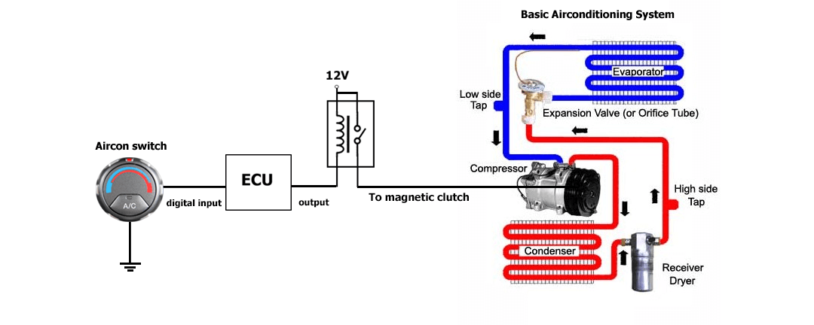
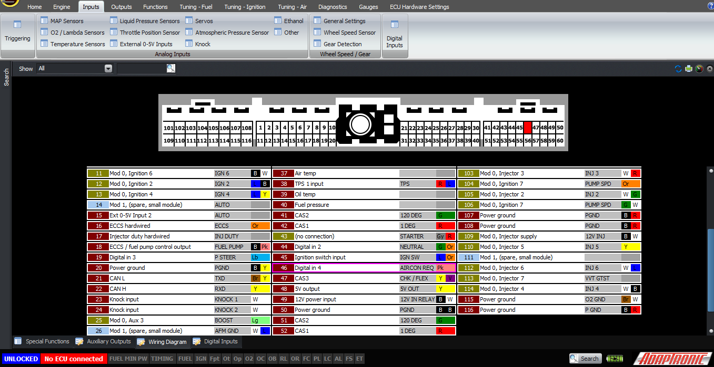
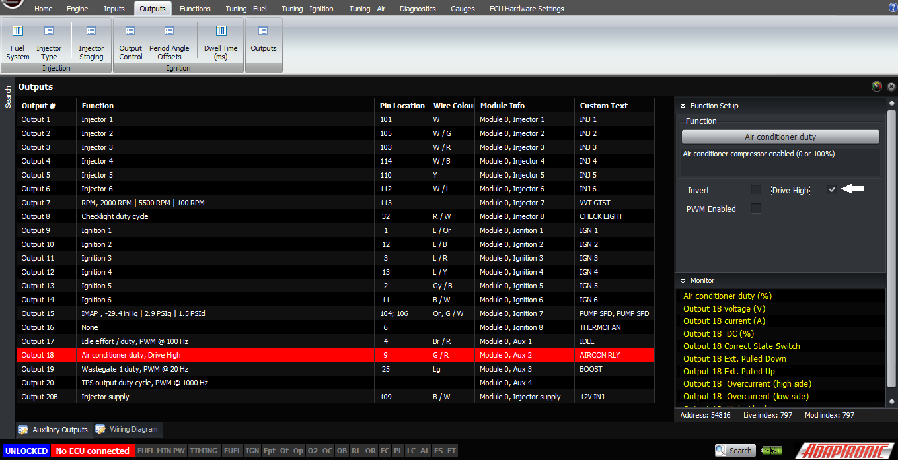
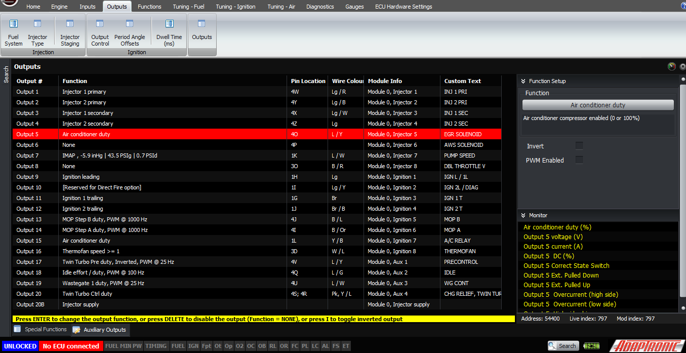
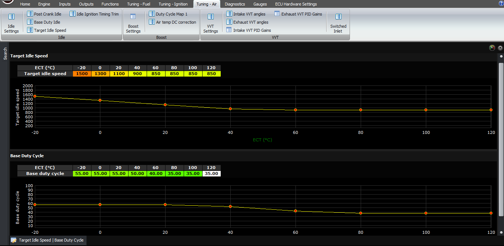
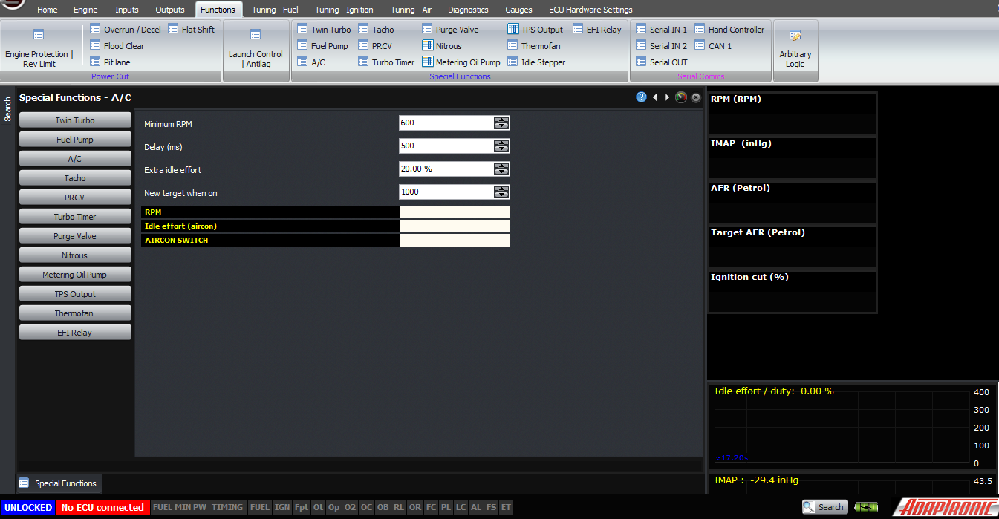
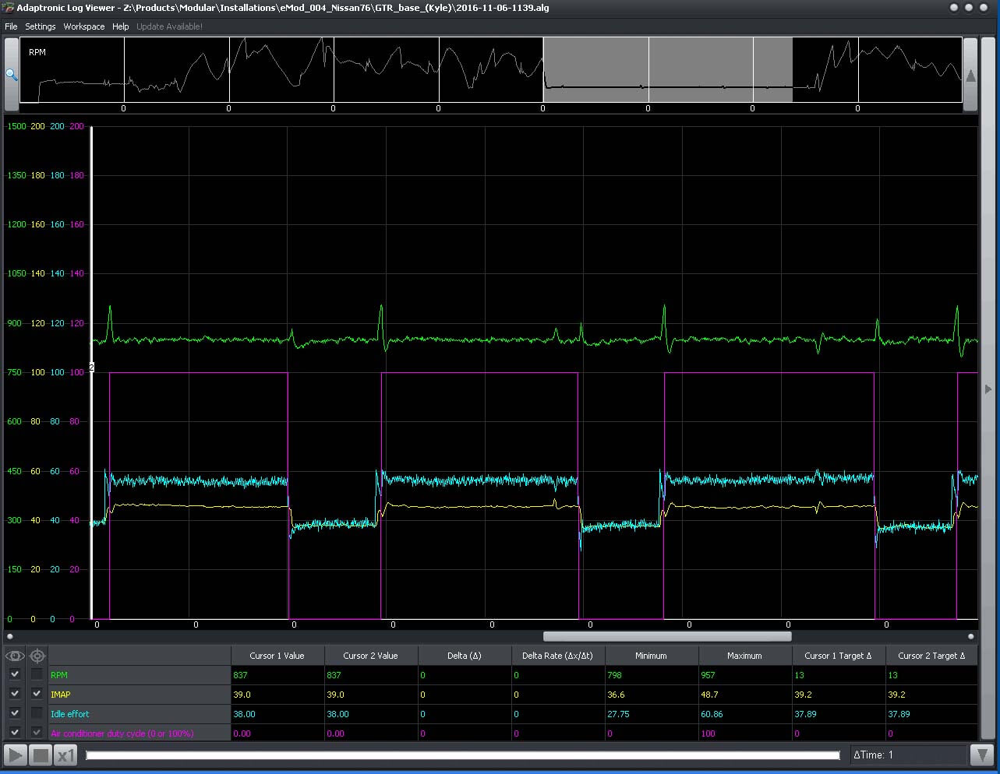
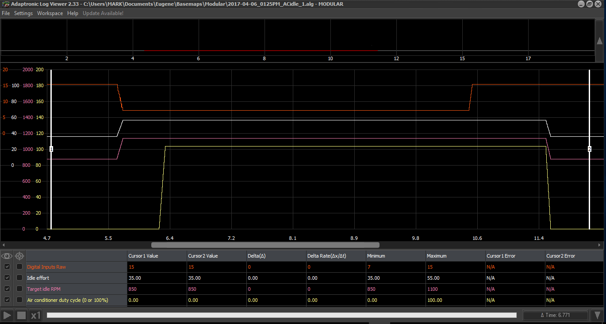
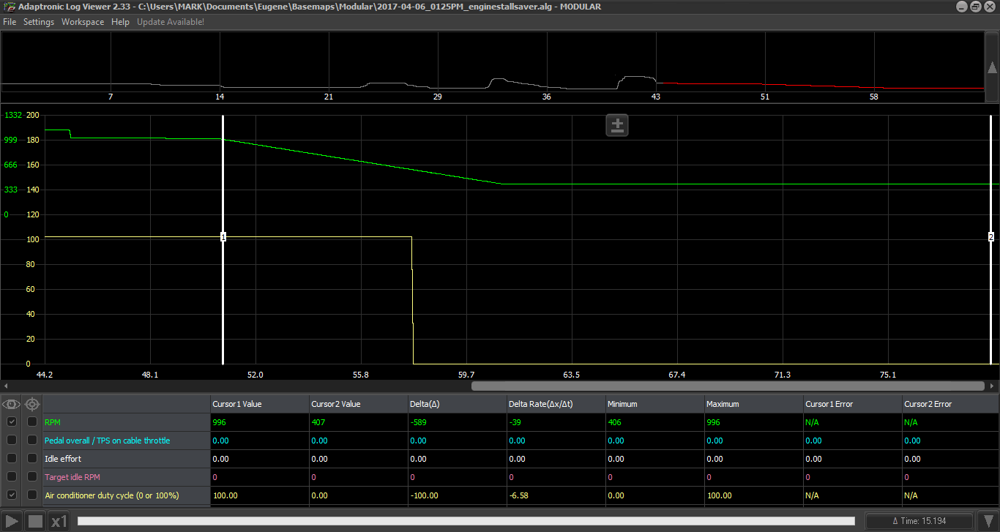
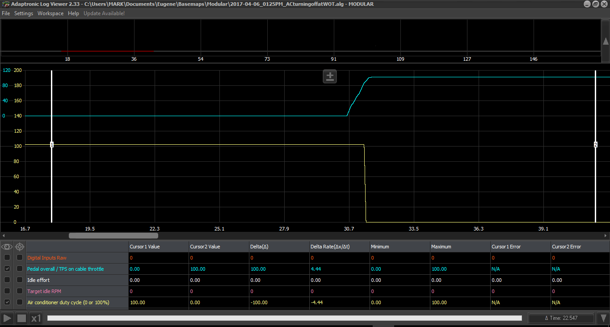

  
  
  
  
  
  
[DOWNLOADS](#)[STORE](#)[CONTACT US](#)  
  
  
  
  
  
  

Air Conditioner Setup on Modular ECUs

[go back to
                support home](EN_EUGENE_MOD_HOME.md)  

  
  
  

[Setting
                up Open Loop Idle Control  

              ](EN_MOD_025_IDLEOPENLOOP.md)

[Setting
                up Closed Loop Idle Control  

              ](EN_MOD_026_IDLECLOSEDLOOP.md)

  

[  

              ](EN_SelFW.md)

  

  
  
  
  
  
  
  
  
  
For people installing ECUs on street
                  cars, where this is legal to do so, often people will want to
                  run the factory air conditioning system through the
                  aftermarket ECU. This has several advantages over being wired
                  directly.  
  
Firstly, the biggest advantage you can gain is in
                  the idle control. The air conditioner compressor puts a large
                  torque load on the engine, so the ECU can compensate for this
                  with idle control. Secondly, the ECU can disable the
                  compressor if the engine is about to stall, and lastly the ECU
                  can disable the compressor at wide open throttle.  
  
Let’s first discuss how to wire in an air
                  conditioner system to the ECU. Firstly the ECU requires a
                  digital input to be triggered when the air conditioner request
                  is active. On most cars, this is a wire that pulls to ground
                  when the air conditioner is required to turn on. Normally this
                  comes from the user switch or a thermostat, connected in
                  series with a triple pressure switch on the refrigerant line.
                  Connect this to a spare digital input pin, and select that
                  input in the Digital Inputs setting as being air conditioner
                  request. If your pin connects to power when active rather than
                  ground, then you will need to select that input as being
                  active high.  
  
[
                  ](http://www.adaptronic.com.au/wp/wp-content/uploads/2017/04/Diagram.png)  

  
Wiring an air conditioner system  
  
  
  

  
  
Digital input set to air conditioner request  
  
  

  
  
Tick the checkbox when pin power is switched from high
                    supply or 12V  
  
The ECU then must be able to drive an external
                  relay, which provides 12V power to the compressor magnetic
                  clutch. On almost every car, this output to the relay coil
                  must pull to ground to activate the relay (and turn on the air
                  conditioner). In this case you can connect the output to any
                  of the unused injector, ignition or auxiliary outputs on the
                  ECU, and configure the output to be air conditioner.  
  

  
  

  
  
In terms of settings, let’s discuss idle control
                  first of all. There are several parameters to get right here,
                  but when you do, it works really nicely. The first setting is
                  the new, higher idle speed when the air conditioner is on. We
                  used to have an additional RPM that gets added to the target,
                  but that meant that the target RPM became very high at low
                  engine temperatures, so instead we have a new “minimum idle
                  RPM”, so whichever is greater out of the base target idle
                  table and the aircon RPM value will be the actual target RPM.
                  So wherever you want to set this is up to you, but often this
                  is set to about 1000 – 1100 RPM where the engine has a bit
                  more torque reserve than at the low speeds and has some room
                  to recover if a stall is imminent.  
  
  
  

  
  
Functions->Idle Stepper-> Base Idle-> Base duty
                    cycle table  
  
  

  
  
Set 1000 as new target RPM  
  
The next setting is the additional idle effort when
                  the air conditioner is on. The easiest way to set this is
                  practically; if you already have closed loop idle working,
                  then you can watch what the idle effort is before you turn on
                  the air conditioner, and then watch what it changes to, after
                  turning on the air conditioner and the RPM has stabilized to
                  the new target. Remember that this will also include the extra
                  effort for the thermofans which will also come on at the same
                  time, so their extra efforts have to already be configured
                  when you do this.  
  
This difference, minus the difference for the
                  thermofans, is what you need to put into the additional idle
                  effort for aircon setting.  
  
The next setting is the delay for turning on the
                  compressor. When the input is first enabled, the new idle
                  target and idle effort is applied straight away to bring up
                  the idle speed. After a short delay, the compressor is
                  enabled. This gives the engine some time to prepare for the
                  additional load of the compressor, which helps stabilize the
                  idle when cycling the aircon compressor. Here’s a graph of how
                  I got it to behave on a pretty much stock GTR. Notice how
                  smooth the RPM trace is; there’s a small amount of overshoot
                  but this is a well set up system.  
  

  
  
The next setting is the minimum RPM. Below this
                  value, the ECU won’t enable the aircon compressor at all. So
                  you can set this to a low value eg 600 RPM, so that if the
                  engine is about to stall, this will help save it. It has the
                  other benefit of disabling the aircon compressor during
                  cranking.  
  
The ECU will always disable the aircon during a wide
                  open throttle condition.  
  
Sample of logs from ECU are presented below.  
  
  
  

  
  
Aircon is turned ON (red line) you might notice that the
                    step is going down because in this case it is switch to the
                    ground. The request for idle effort (white line) and idle
                    speed (pink line) immediately comes after getting the
                    request and then A/C compressor turned on after some time
                    approximately about 0.56s.  
  
  

  
  
A/C compressor (yellow line) switched off automatically
                    when it reached certain RPM (green line),in this case
                    minimum RPM is set to 600.  
  
  

  
  
When throttle (blue line) is closed, the A/C
                    compressor (yellow line) is running constantly and
                    as the throttle opens it shuts the aircon off on some
                    point before reaching WOT.  
Thank you and happy learning!  
  
©2018
        Adaptronic  
  
