  
  
  
  
  
  
[DOWNLOADS](#)[STORE](#)[CONTACT US](#)  
  
  
  
  
  
  

Adding Modules on Modular ECUs

[go back to
                support home](EN_EUGENE_MOD_HOME.md)  

  
  
  

[  

              ](EN_EUGENE_ABOUT.md)

[  

              ](EN_EUGENE_KBSC_TG.md)

  

[  

              ](EN_SelFW.md)

  

  
  
  
  
  
  
  
  
This article gives instructions to people
                  who want to upgrade their modular ECUs. This shows and
                  documents the procedure for the M2000 and M6000 ECUs, but the
                  same applies to all Modular ECUs.  
  
M2000 Upgrade Procedure  
  
The M2000 has eight (8) ignition outputs, eight (8)
                  injector outputs and four (4) auxiliary outputs. It has one
                  (1) slot for an upgrade and it can be any of the small
                  expansion modules.  
  
The small expansion modules available as of the
                  moment are:  
  

- Mini Analogue Input Module (4 x 0-5V analogue
                      inputs)
- Mini Real-Time Input Module (2 x CAS, 1 x Flex
                      fuel / frequency input, 3 x VSS)
- Drive-by-wire Controller Module
- Mini Output Module (6 x push-pull auxiliary
                      outputs)  
  
The main internal parts of the M2000 are shown
                  below:  
  

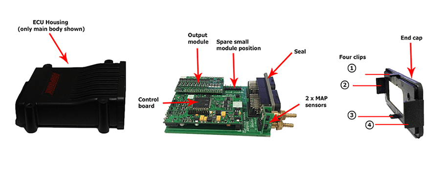
  
  
Step 1:  Tools you will need  
  
1.1          Get
                  a 10mm socket and a flat-head screwdriver.  
  
  
  

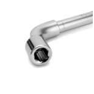
  
  
10mm socket  
  
  

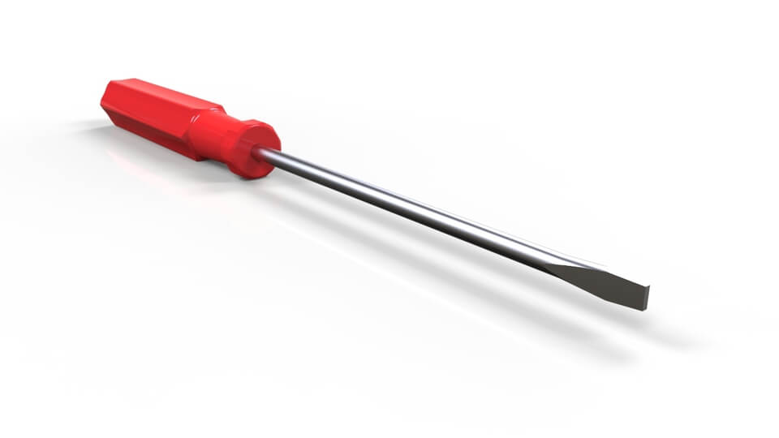
  
  
Flat-head screwdriver  
  
Step 2:  Remove the circuit boards
                    from the ECU housing  
  
2.1         
                  Unfasten all four clips at the end of the ECU.  
  
  
  

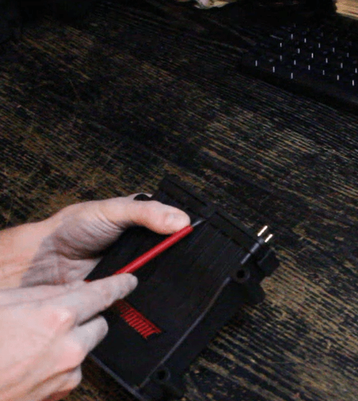
  
  
Note: Clips location is shown on the page above.  
  
2.2          Push
                  the circuit boards out of the housing by pushing on the serial
                  (square) connectors through the front connector opening:  
  

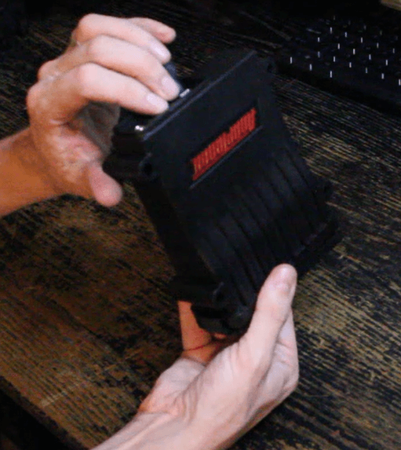

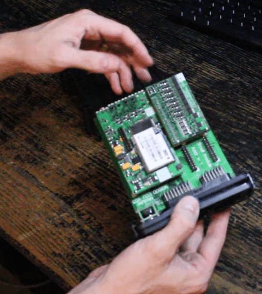
  
  
Step 3:  Plug the desired expansion
                    module onto the main circuit board  
  
  
  

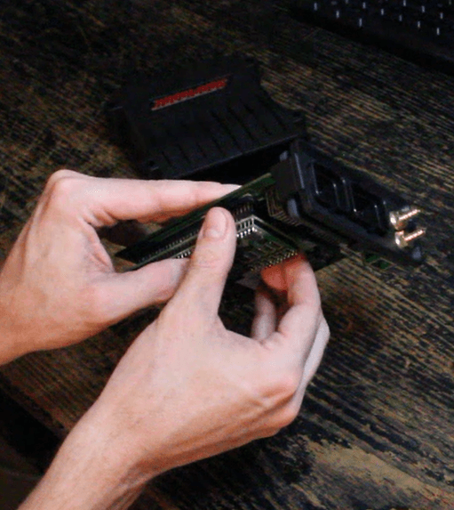
  
  
Note: M2000 can only accommodate one small expansion slot.
                    In this example, we have installed a mini output module
                    (giving 6 auxiliary outputs)  
  
Step 4:  Put back the boards back
                    inside the ECU housing.  
  
4.1         
                  Remove the MAP sensor nuts at the end of the ECU (using a 10mm
                  socket)  
  

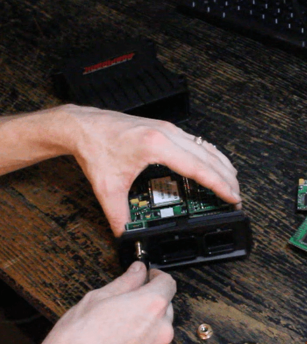
  
  
4.2         
                  Remove the plastic end cap  
  

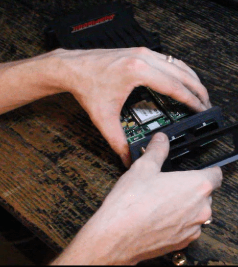
  
  
4.3          Make
                  sure the seal is tucked underneath the flange of the Superseal
                  connectors correctly  
  

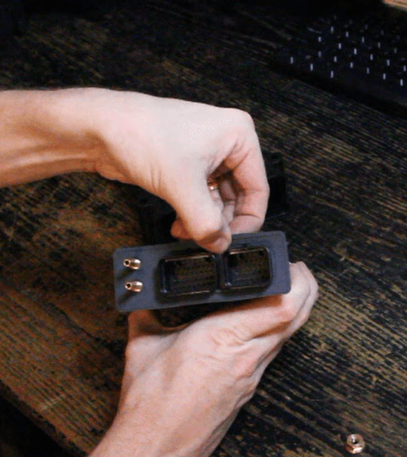
  
  
4.4         
                  Slide the boards back into ECU housing.  
  
In this step two things should be observed:  
  
a. The edge on the side of the seal must fit in to
                  the screw inside ECU housing.  
  

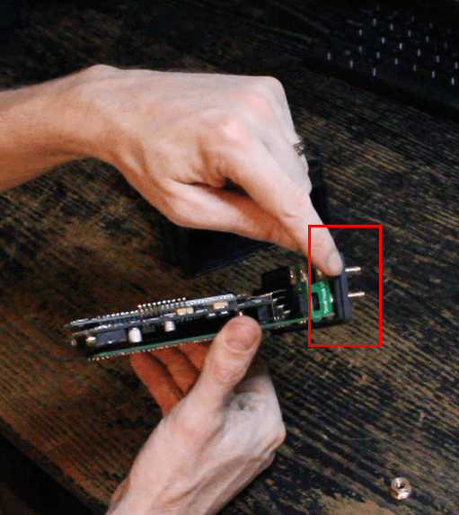

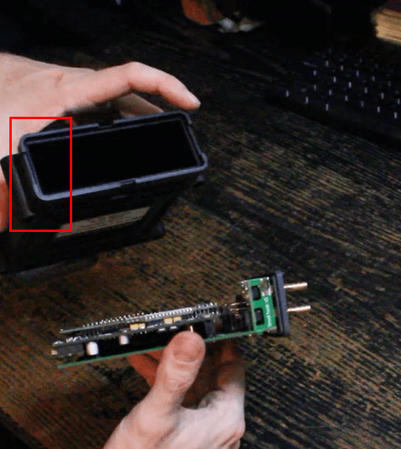
  
  
b. Make  sure that the seal is firmly attached
                  to the housing without being pinched or crushed.  
  

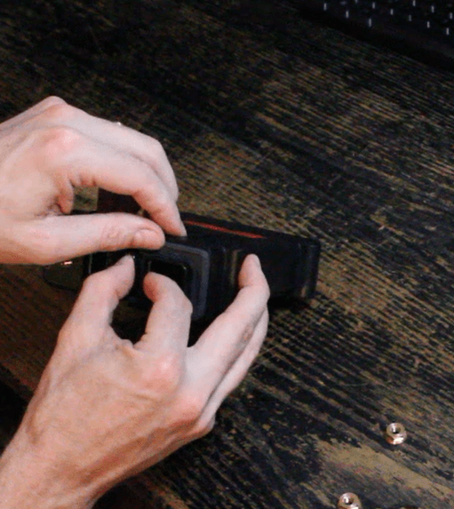
  
  
4.5         
                  Reinstall the end cap by sliding it over the MAP sensor barbs
                  and main connectors, and clip it on to the ECU housing.  
  

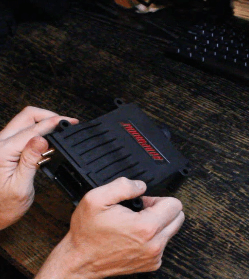
  
4.6         
                  Tighten the MAP sensor nuts with a 10mm socket  
  

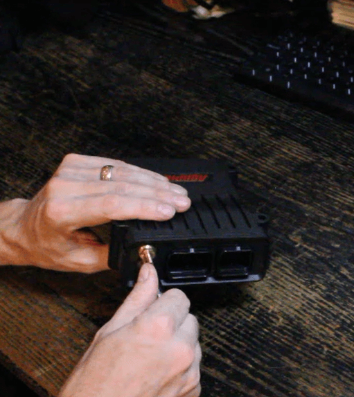
  
  
After following all these steps, M2000 upgrade is
                  done. As a check, you should ensure that the two MAP sensor
                  ports still hold vacuum. If not then the MAP sensor barb may
                  have come off the seal, or the seal may have come off the MAP
                  sensor itself.  
  
M6000 (and other large body Modular ECU)
                    upgrade procedure  
  
The main components of the M6000 are shown below:  
  

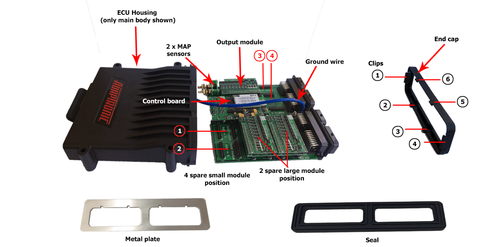
  
  
The large wire-in or M6000 is physically a lot
                  larger than M2000. It has three (3) large expansion slots (one
                  of which is fitted with an output module) and four (4) small
                  expansion slots.  
  
Here are the steps for M6000 upgrade.  
  
Step 1:  Prepare the tools.  
  
1.1          Get
                  a 10mm socket and a flat-head screwdriver.  
  
  
  

  
  
Flat-head screwdriver  
  
  

  
  
10mm socket  
  
Step 2:  Remove the board inside the
                    ECU housing.  
  
2.1         
                  Remove the MAP sensor nuts located in front of the ECU using a
                  10mm socket  
  

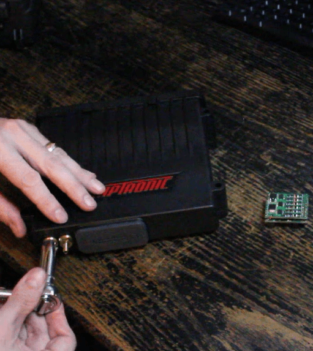
  
2.2         
                  Unfasten all six clips at the end of the ECU then remove the
                  end cap.  
  
  
  

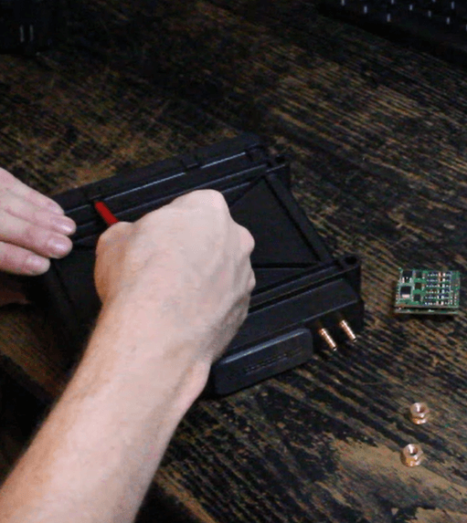
  
  
Note: Clips location is shown on the page above.  
  
2.3          Take
                  off the metal plate.  
  

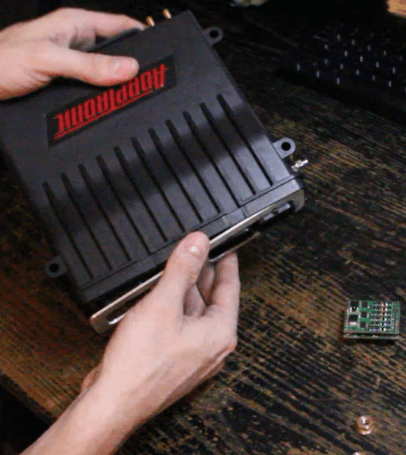
  
  
2.4         
                  Slide out the circuit boards by push the brass barbs located
                  in front of the ECU. Pushing on the brass barbs prevents them
                  from coming off the MAP sensors during disassembly.  
  

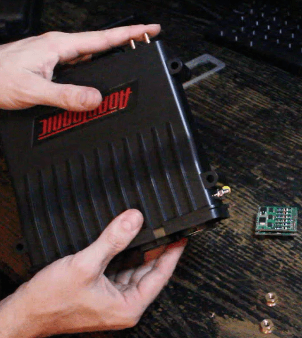

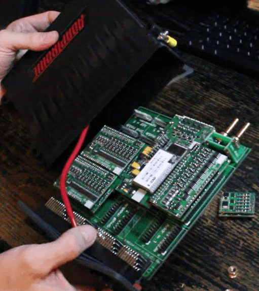
  
  
Note: Be careful of the additional high current
                  ground wire inside the ECU to ensure that circuit boards don’t
                  snag on it as they are removed.  
  
Step 3:  Add the expansion modules as
                    desired.  
  
  
  

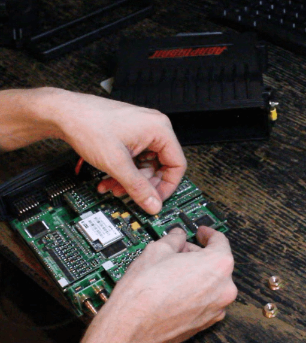
  
  
Note: Normally upon purchasing an M6000, 1 large output
                    module is already installed. M6000 can accommodate 4 small
                    modules and 3 large modules. In this example, we have
                    populated all expansion slots. Also, the same procedure for
                    M6000 can be used to upgrade the large plug-ins.  
  
Step 4:  Put back the boards inside
                    the ECU housing.  
  
4.1         
                  Slide it in with the circuit board at the bottom.  
  
  
  

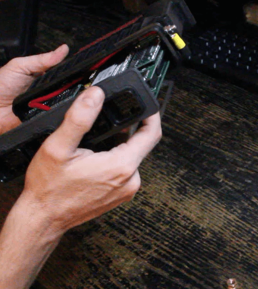
  
  
Note: Normally upon purchasing an M6000, 1 large output
                    module is already installed. M6000 can accommodate 4 small
                    modules and 3 large modules. In this example, we have
                    populated all expansion slots. Also, the same procedure for
                    M6000 can be used to upgrade the large plug-ins.  
  
4.2          Put
                  back the seal all way around.  
  
The seal on M6000 sits back a little further from
                  the end compared to M2000 because of the metal end plate.  
  

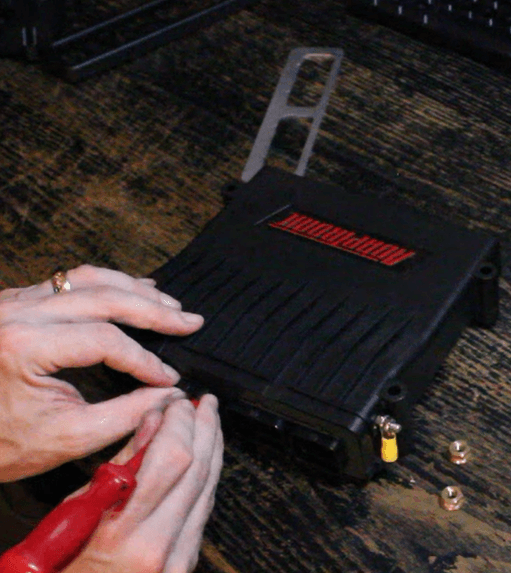

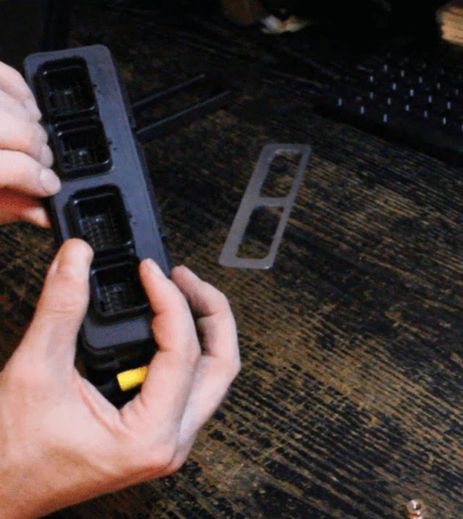
  
  
Note: Make sure that the seal is underneath the
                  flange of the connectors, and also inserted into the groove in
                  the end of the ECU housing.  
  
4.3          Put
                  back the end plate  
  

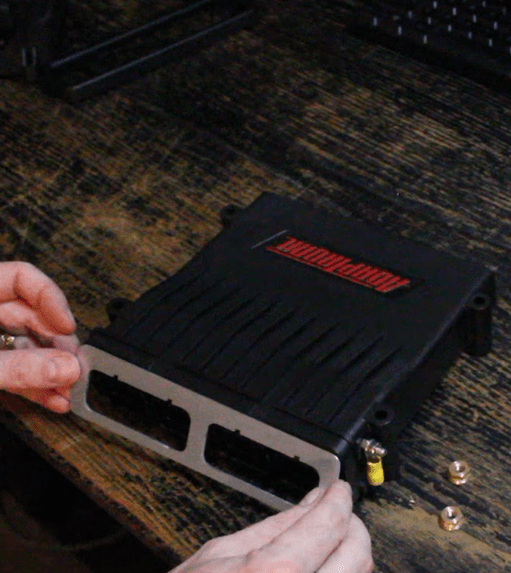
  
(note, it is not symmetrical)  
  
4.4          Find
                  the little stripe at the bottom of the end cap and at the
                  bottom of the ECU casing. These stripes must land on each
                  other (the end cap is not rotationally symmetrical; it has a
                  top and a bottom. The bottom of the ECU is slightly wider than
                  the top).  
  
  
  

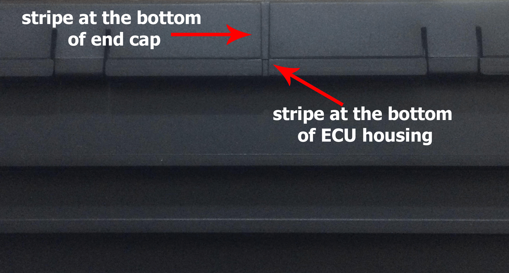
  
  
Correct way of putting back the end cap  
  
4.5          Put
                  back the end cap and clip on.  
  

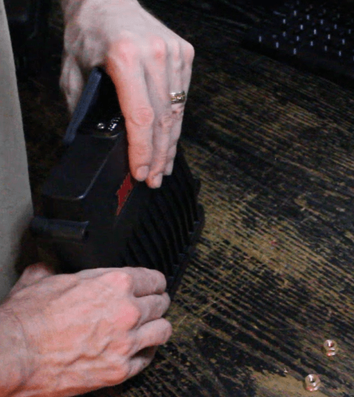

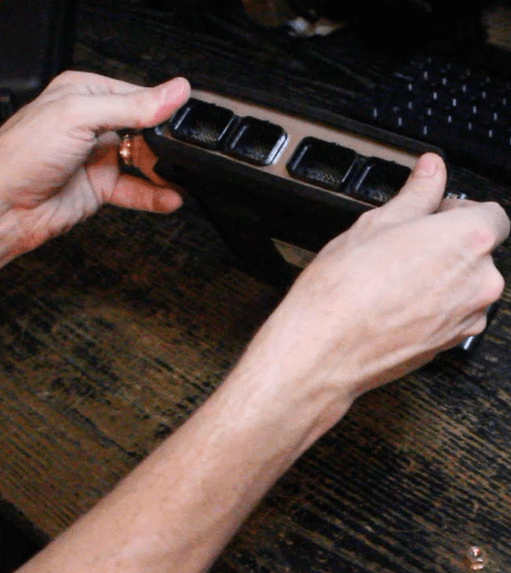
  
  
Note: If pressing the end cap using your hands does
                  not work you can use a flat hard surface to push it until all
                  clips engage  
  
4.6         
                  Tighten the MAP sensor nuts using a 10mm socket.  
  

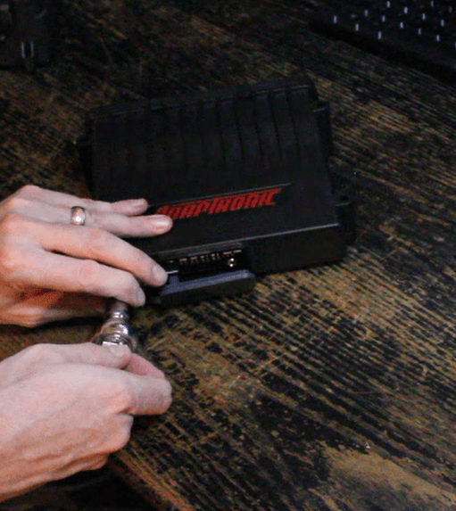
  
After following all these steps, M6000 upgrade is
                  done. Just as with the M2000 it is good practice to ensure
                  that the MAP sensor ports are still sealed and hold vacuum.  
  
©2018
        Adaptronic  
  
