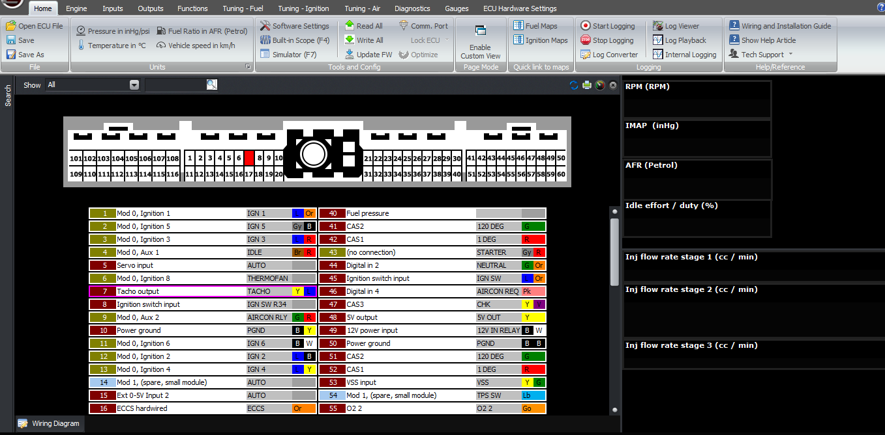

  
  
  
  
  
  
[DOWNLOADS](#)[STORE](#)[CONTACT US](#)  
  
  
  
  
  
  

How to Setup Tacho on Modular ECUs

[go back to
                support home](EN_EUGENE_MOD_HOME.md)  

  
  
  

[  

              ](EN_EUGENE_ABOUT.md)

[  

              ](EN_EUGENE_KBSC_TG.md)

  

[  

              ](EN_SelFW.md)

  

  
  
  
  
  
  
  
  
The Modular ECUs have a dedicated tacho
                  output pin. This pin is intended for use only as a tachometer
                  function, and can’t be used for generic outputs or engine
                  synchronous functions.  
  

  
  
There is a small inductor built into the ECU to
                  generate a small amount of flyback voltage to simulate an
                  ignition coil, for factory tachometers that require such a
                  signal. So the output is internally pull-ed up to 12V and no
                  external pullup resistor is required.  
  
The only setting that’s required, and this can be
                  found in the functions -> Tacho part in the software, is
                  the output frequency. In the cast majority of cars, the tacho
                  output frequency is the same as the ignition frequency, for
                  example on a 4 cylinder or a 2-rotor engine, the tacho will
                  have two pulses per crank revolution, and an 8 cylinder will
                  have 4 pulses per crank revolution. We give the option in the
                  software to select a different output frequency for cars where
                  this is not the case, and the case of engine conversions.  
  
If you leave this setting set to “standard”, then it
                  will calculate the frequency based on the ignition output
                  frequency (ie, based on the RPM, the number of cylinders and
                  the firing frequency, ie every 360 or every 720 degrees).
                  Otherwise you can choose the number of cylinders to simulate.
                  For example if you choose a 2 cylinder engine, you will have a
                  tacho pulse every 360 degrees.  
  
So, if you were installing a JZ or an RB engine into
                  a Silvia chassis and retaining the factory instrument cluster,
                  you could set the tacho frequency to be 4 cylinder and it
                  would read correctly.  
  
Again note that the tacho output is a variable
                  frequency, and it’s not phase locked to the engine’s rotation.  
  
  
  
  
3000 RPM  
  
6000 RPM  
  
9000 RPM  
  
1 cylinder  
  
25 Hz  
  
50 Hz  
  
75 Hz  
  
2 cylinder  
  
50 Hz  
  
100 Hz  
  
150 Hz  
  
3 cylinder  
  
75 Hz  
  
150 Hz  
  
225 Hz  
  
4 cylinder  
  
100 Hz  
  
200 Hz  
  
300 Hz  
  
5 cylinder  
  
125 Hz  
  
250 Hz  
  
375 Hz  
  
6 cylinder  
  
150 Hz  
  
300 Hz  
  
450 Hz  
  
7 cylinder  
  
175 Hz  
  
350 Hz  
  
525 Hz  
  
8 cylinder  
  
200 Hz  
  
400 Hz  
  
600 Hz  
  
9 cylinder  
  
225 Hz  
  
450 Hz  
  
675 Hz  
  
10 cylinder  
  
250 Hz  
  
500 Hz  
  
750 Hz  
  
11 cylinder  
  
275 Hz  
  
550 Hz  
  
825 Hz  
  
12 cylinder  
  
300 Hz  
  
600 Hz  
  
900 Hz  
  
13 cylinder  
  
325 Hz  
  
650 Hz  
  
975 Hz  
  
14 cylinder  
  
350 Hz  
  
700 Hz  
  
1050 Hz  
  
15 cylinder  
  
375 Hz  
  
750 Hz  
  
1125 Hz  
  
16 cylinder  
  
400 Hz  
  
800 Hz  
  
1200 Hz  
Thanks and happy learning!  
  
©2018
        Adaptronic  
  
