  
  
  
  
  
  
[DOWNLOADS](#)[STORE](#)[CONTACT US](#)  
  
  
  
  
  
  

Metering Oil Pump Control on Mazda Rotary
              Engines with Modular ECUs

[go back to
                support home](EN_EUGENE_MOD_HOME.md)  

  
  
  

[  

              ](EN_EUGENE_ABOUT.md)

[  

              ](EN_EUGENE_KBSC_TG.md)

  

[  

              ](EN_SelFW.md)

  

  
  
  
  
  
  
  
  
  
In this article we’ll discuss how to
                  set up the metering oil pump on the RX7 13B engines.  
  
First of all, let’s discuss the function of the metering oil
                  pump, MOP or oil metering pump, OMP (Mazda use the two terms
                  interchangeably in different documents). It’s a mechanical
                  device which allowed pressurised oil to be fed from the oil
                  system to be fed into the rotor housings in the inlet area.
                  It’s driven by a stepper motor, whose position determines the
                  amount of oil that gets injected. There’s also a position
                  feedback sensor on the pump that measures the position of the
                  pump, and the ECU controls the stepper motor to achieve a
                  certain position reading on the feedback sensor. This article
                  does not cover the oil metering on the series 1 and series 2
                  RX8 engines, both of which are different from the RX7 engines,
                  and also different from each other.  
  
  
  
  

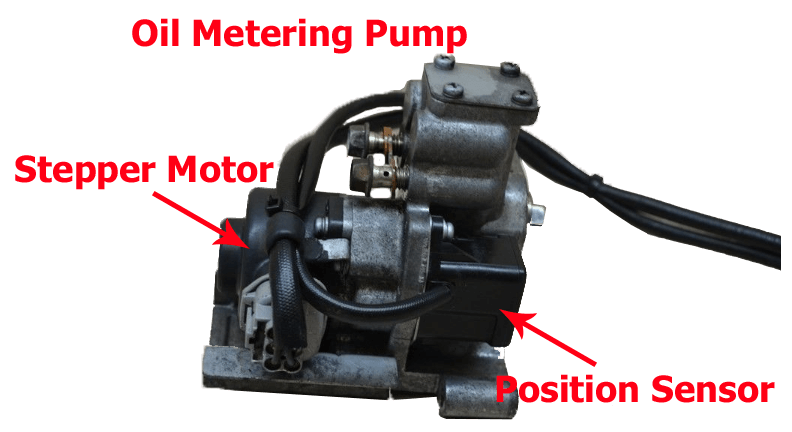
  
  
Oil Metering Pump of RX7 13B  
  
The connections to the pump are as follows.  
  
There is a 6 wire stepper motor which drives back and forward
                  to control the amount of oil delivered. Like other 6 wire
                  stepper motors, the middle pin on each row is 12V power and
                  the two pins other side must be driven in opposite phases. So
                  you will need an output for each of the 4 drive pins on the
                  motor, that is an ignition, injector or auxiliary output. On
                  the plug and play ECUs, only 2 ignition outputs are used to
                  drive the motor directly, with the opposite phases generated
                  by an additional circuit in the ECU. This allows you to run
                  the motor using only 2 outputs out of the 20 available rather
                  than 4.  
  

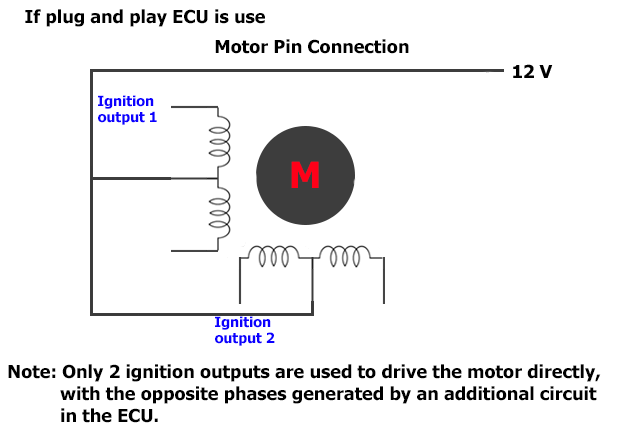
  
  

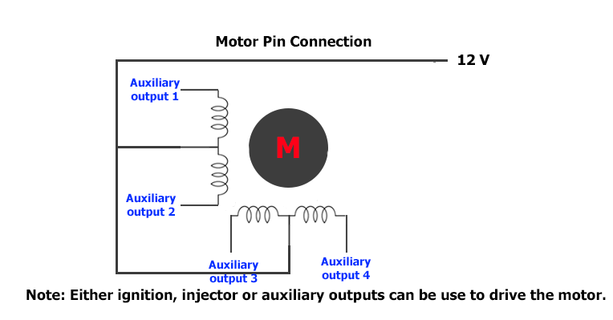
  
  
On the sensor side, the device is a 3 wire potentiometer,
                  similar to a TPS, so the sensor needs sensor ground, 5V supply
                  and a signal connection. By default the ECU will use the servo
                  input, but you can use any 0-5V input on the ECU for the MOP
                  position feedback input. This is all handled in the factory
                  wiring of a plug and play ECU anyway.  
  

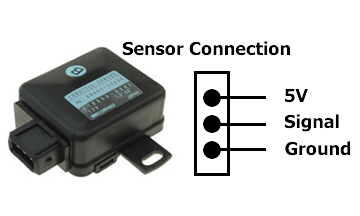
  
  
Let’s discuss the settings required for the MOP to work.
                  Firstly,   you need to select the input channel
                  for the position sensor, ie where you have wired the position
                  sensor to. If you select “default” then the ECU will assume
                  it’s wired to the servo input, which is how it’s configured on
                  the plug-in ECUs.  
  
  
  
  

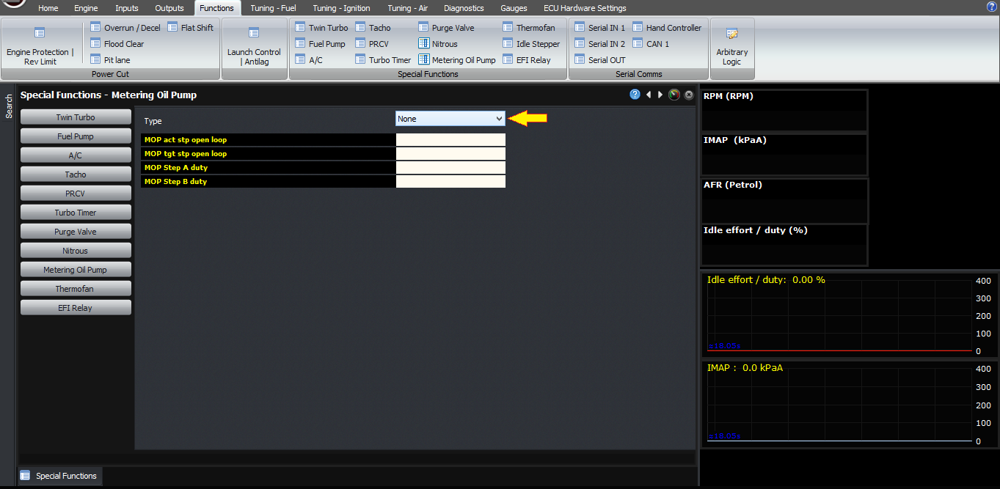
  
  
Source set to default  
  
In terms of outputs, if you’re using a plug-in ECU which
                  already has the circuitry to drive the other two phases, you
                  need to select one of these outputs as MOP step A, and the
                  other as MOP step B. Configure them as PWM at 1 kHz for
                  reasons I’ll explain a bit later.  
  

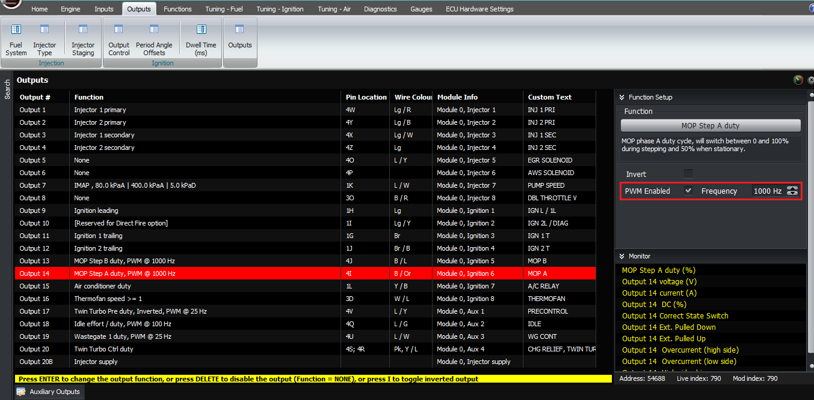
  
  

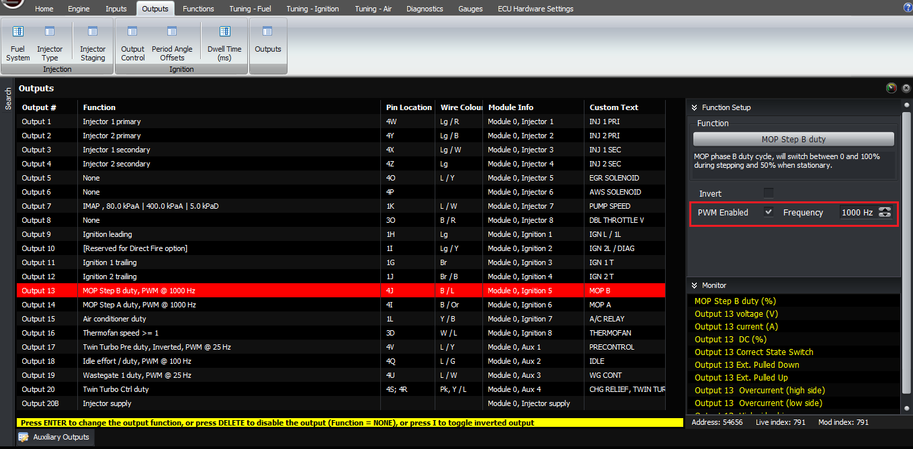
  
  
If you don’t have extra hardware to drive the boards then you
                  need to set the other two outputs to be metering oil pump
                  step A inverted and metering oil pump step B inverted,
                  both are PWM enabled at 1kHz.  
  

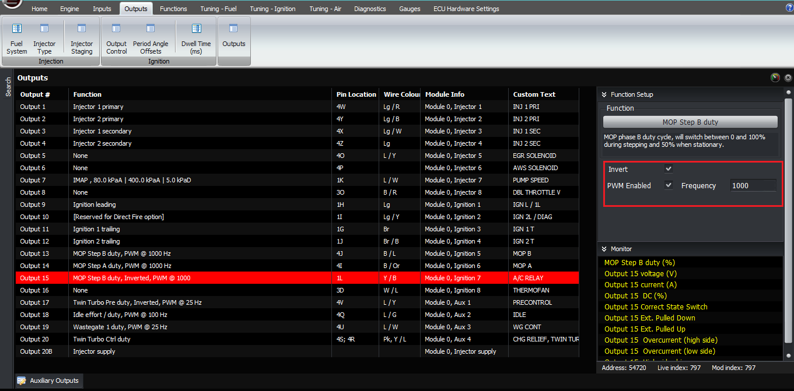
  
  

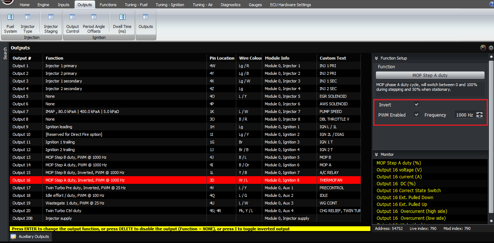
  
  
The final setting is the target MOP table, which is a function
                  of RPM and manifold pressure. This table has been calculated
                  by monitoring the behaviour of the factory ECU on the series 5
                  and series 6 engines; I understand that different types of
                  seals have different oiling requirements so you may need to
                  premix as well, please consult your engine builder or seal
                  supplier if you’re unsure. The factory behaviour is that the
                  amount of oil injected increases with RPM and with MAP, in
                  other words it’s roughly related to the fuel quantity
                  delivered, which also makes sense intuitively because people
                  use premix.  
  

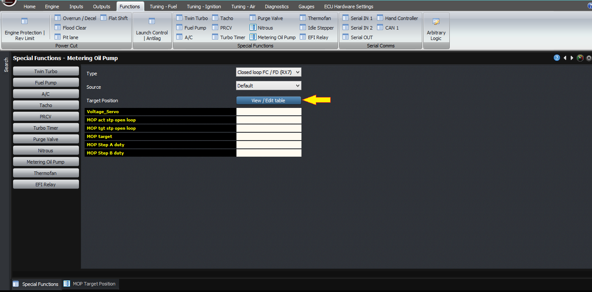
  
  

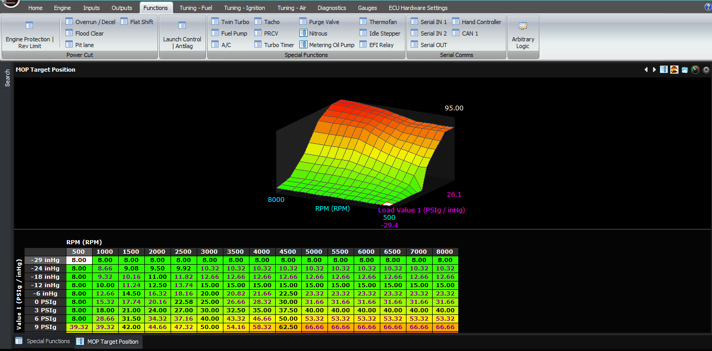
  
  
Now, let’s discuss how to check that it’s working correctly.
                  The ECU will chase the target value by driving the stepper
                  motor outputs. If it drives for a long time and ends up in the
                  wrong direction, it switches the outputs around and tries to
                  go the other way. When the ECU is driving the motor forwards
                  and backwards, the outputs are driving high and low
                  alternately, so you will see the MOP step A and B numbers
                  flicking between 0 and 100%. This happens too fast to be able
                  to see the individual steps in a PC based log, but you can see
                  them using the built-in scope or a real scope.  
  

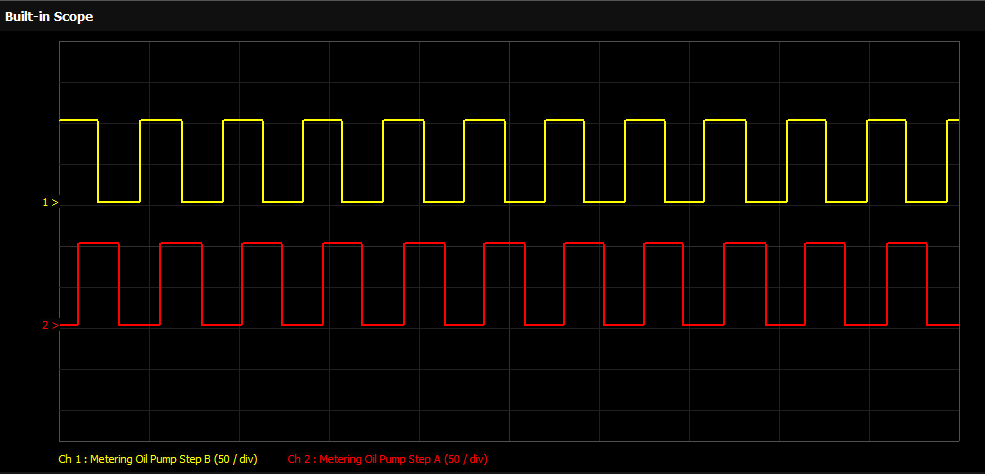
  
  
When the ECU gets to within a small error band of the target,
                  it drives both outputs with a 50% duty cycle. This uses the
                  coil inductance to reduce heating in the motor windings,
                  compared to leaving one coil energized the whole time. So when
                  it’s at the target you should see 50% on both outputs. If it
                  happens to move either side of the target, it will take a step
                  back or forward as required.  
  
Let’s discuss how to diagnose a problem with the MOP. The most
                  likely problem, based on the support questions we get, if the
                  ECU configuration is correct, is going to be wiring. So
                  firstly check the basics, ie:  
  
  

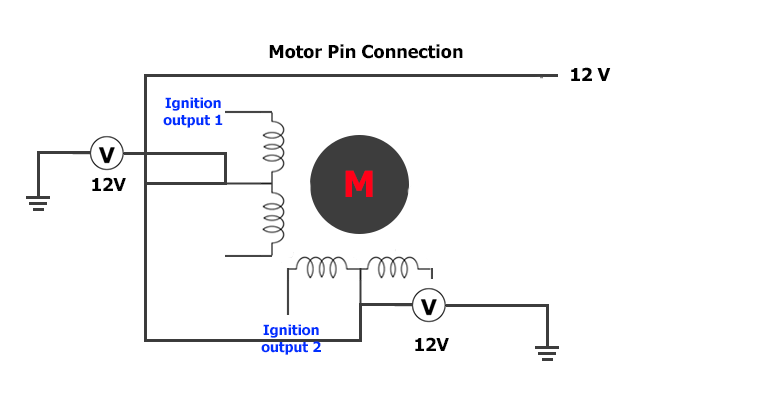
  

-   
The two motor +12V pins have 12V on them  
  
  

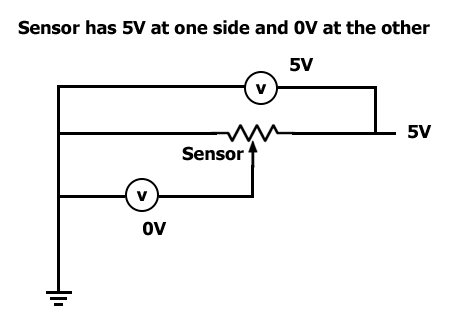
  

-   
The sensor has 5V at one side and 0V at the other  
  
  

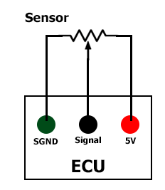
  

-   
The sense wire is connected through to the input on the
                        ECU – for example when you short it to 5V, you can see
                        the input change to 5V on the F11 ECU data screen  
  
Firstly go to the outputs page and select Outputs 13 and 14 as
                  being “none” rather than “MOP”. Follow the following tables to
                  check the voltages (on the different models):  
  
First test: Both outputs set to none:  
  

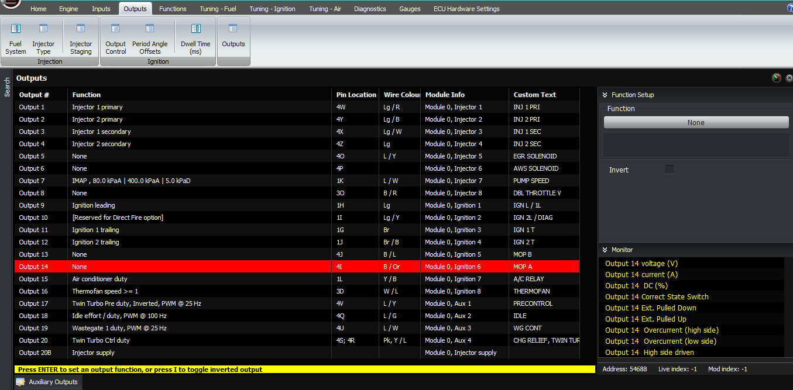
  
  
  
  
  
Series
                          5 ECUSeries
                          6 ECUSeries
                          8 ECUVoltage  
  
(approx)  
Internal
                          connectionECU
                          pinECU
                          pinECU
                          pinWire
                          colWire
                          colWire
                          col4TB
                          / L4JB
                          / L1WB
                          / L12VIgn
                          5 (op 13)4VB
                          / R4LB
                          / Y1AEB
                          / Y0VIgn
                          5 invert4SB
                          / Or4IB
                          / Or1SB
                          / Or12VIgn
                          6 (op 14)4UB
                          / G4KB
                          / Lg1AAB
                          / Lg0VIgn
                          6 invert  
  
Second test: Set output 13 to “none, invert”  
  

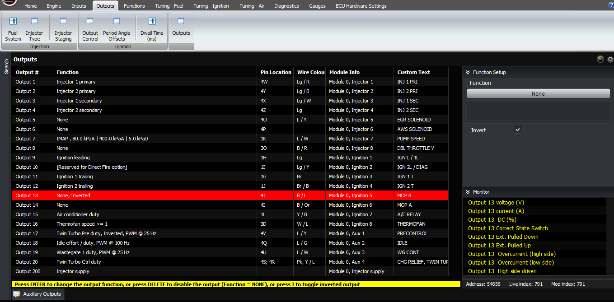
  
  
Series
                          5 ECUSeries
                          6 ECUSeries
                          8 ECUVoltage  
  
(approx)  
Internal
                          connectionECU
                          pinECU
                          pinECU
                          pinWire
                          colWire
                          colWire
                          col4TB
                          / L4JB
                          / L1WB
                          / L0VIgn
                          5 (op 13)4VB
                          / R4LB
                          / Y1AEB
                          / Y12VIgn
                          5 invert4SB
                          / Or4IB
                          / Or1SB
                          / Or12VIgn
                          6 (op 14)4UB
                          / G4KB
                          / Lg1AAB
                          / Lg0VIgn
                          6 invert  
  
Third test: Put output 13 back to “none”, set output 14 to
                  “none, invert”  
  

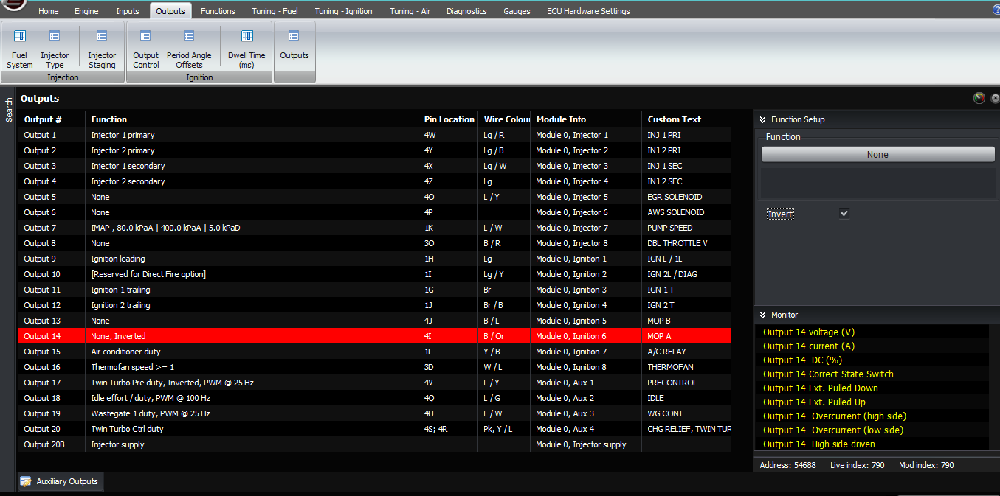
  
  
Series
                          5 ECUSeries
                          6 ECUSeries
                          8 ECUVoltage  
  
(approx)  
Internal
                          connectionECU
                          pinECU
                          pinECU
                          pinWire
                          colWire
                          colWire
                          col4TB
                          / L4JB
                          / L1WB
                          / L12VIgn
                          5 (op 13)4VB
                          / R4LB
                          / Y1AEB
                          / Y0VIgn
                          5 invert4SB
                          / Or4IB
                          / Or1SB
                          / Or0VIgn
                          6 (op 14)4UB
                          / G4KB
                          / Lg1AAB
                          / Lg12VIgn
                          6 invert  
If an output always shows 0V, then that normally means that
                  there is an open circuit coil in the pump motor, or that
                  there’s a disconnection between the motor and the ECU (for
                  example a broken wire or a bad connection).  
  
Finally, put the settings back to their standard values
                  (output 13 = Metering Oil pump Step B, output 14 = Metering
                  Oil Pump Step A).  
  

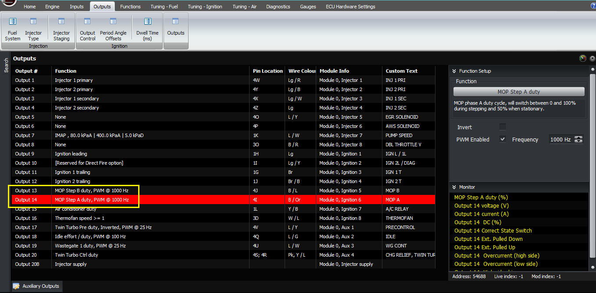
  
  
If all of those pass, then the ECU is driving the outputs
                  correctly, so the next step would be to check the pump itself,
                  for open circuit windings or mechanical problems.  
  
Additional information when using wire-in ECUs.  
  
Make sure to follow the diagram below when wiring the oil
                  metering pump on RX7 FCs and FDs .  
  

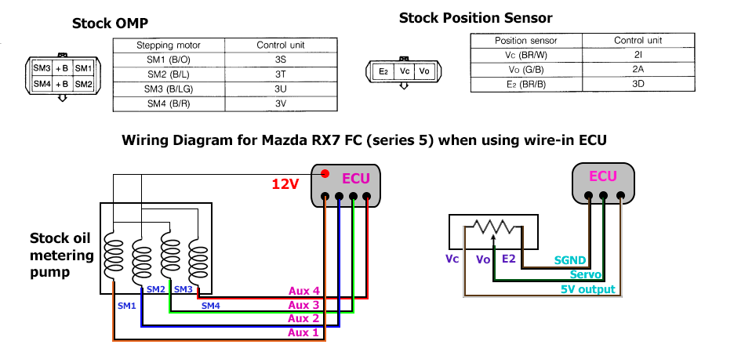
  
  
  

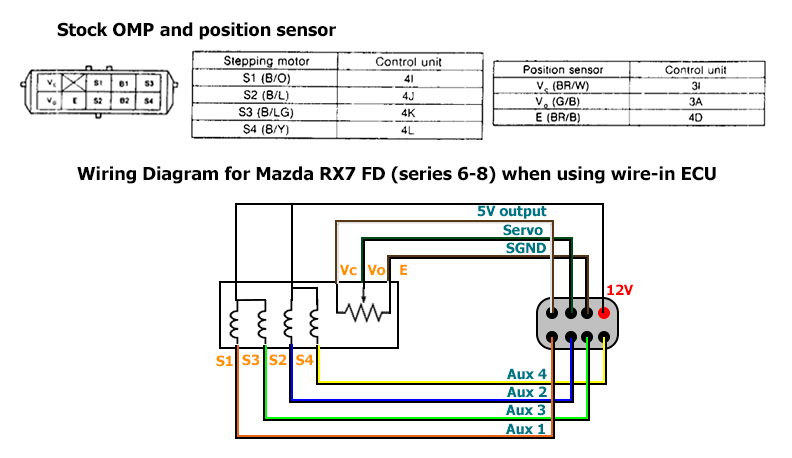
Next
                  configure either auxiliary, ignition or injector outputs to
                  drive your motor. In this example let’s use auxiliary outputs.
                  Select output 17 and 18 and configure it as “Metering Oil Pump
                  Step A” and “Metering Oil Pump Step B”, both should be
                  set as PWM at 1kHz. Then select output 19 and 20 as 
                  “Metering Oil Pump Step A, inverted” and “Metering Oil
                  Pump Step B, inverted”, both should also be set as PWM at
                  1kHz.  
  

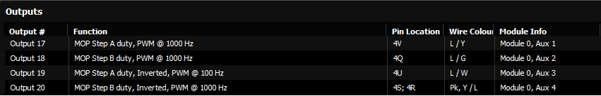
  
Thank you and happy learning!  
  
©2018
        Adaptronic  
  
