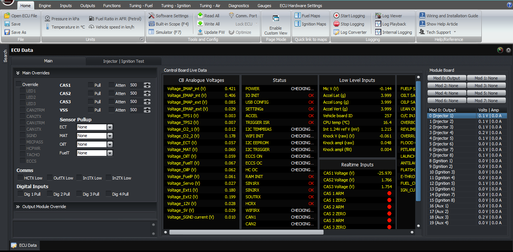
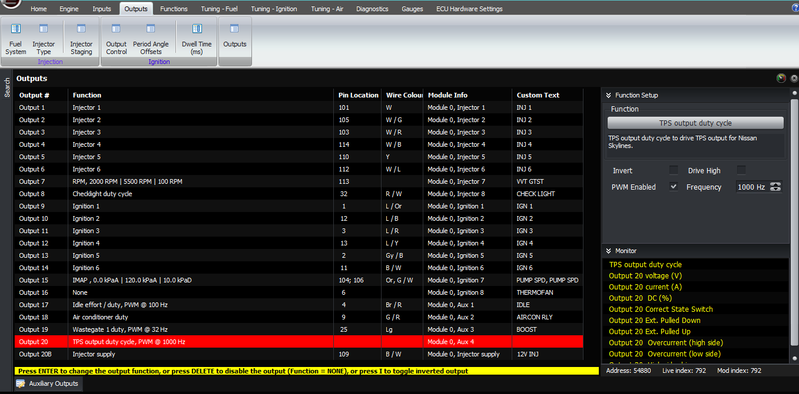
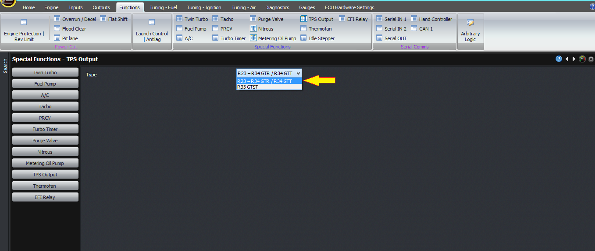
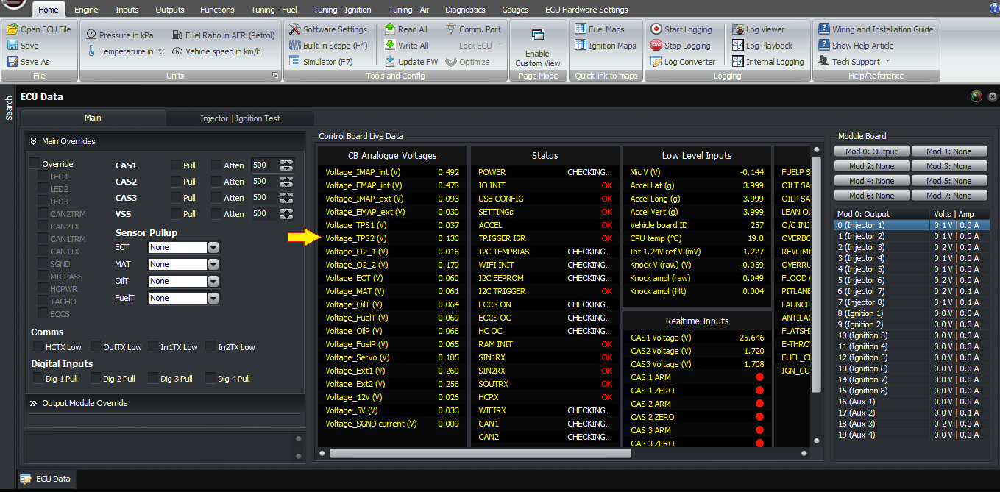

  
  
  
  
  
  
[DOWNLOADS](#)[STORE](#)[CONTACT US](#)  
  
  
  
  
  
  

TPS Output Pin on the Modular Skyline Plug-in
              ECUs

[go back to
                support home](EN_EUGENE_MOD_HOME.md)  

  
  
  

[Transient
                Throttle Conditions and How to set it up](EN_MOD_031_THROTTLETRANSIENTS.md)[
              ](EN_MOD_031_THROTTLETRANSIENTS.md)

[  

              ](EN_EUGENE_KBSC_TG.md)

  

[  

              ](EN_SelFW.md)

  

  
  
  
  
  
  
  
  
This article describes the scaling
                  of the TPS output on the Modular Skyline plug-in ECUs.  
  
The RB26DETT GTR Skylines, that is the R32 to the
                  R34, had an electronic controller for the transfer case to
                  select the amount of torque available for the front wheels.
                  One of the sensors this module relies on is the throttle
                  position, which is output as a variable voltage from the
                  factory ECU.  
  
The R33 GTST series 2 and later (so that’s the
                  RB25DET) also had an electrically controlled limited slip
                  differential, called the A-LSD, and so did the R34 GTT. Its
                  controller also relies on the TPS output from the ECU. However
                  the scaling or calibration is different between the different
                  models.  
  
The way this output is generated is with a PWM
                  output on the ECU. This is converted into a 0-5V voltage using
                  a circuit inside the ECU and output on the TPS output pin.
                  This is also fed back into the TPS2 input, which means that
                  you can monitor this voltage on the F11 window.  
  

  
  
  

  
  
Auxiliary Output 4  
  
For this to work, the auxiliary output must be set
                  to TPS output duty cycle, PWM at 1000 Hz. The only setting
                  available then is found under functions -> TPS output. The
                  type you can select is either R23-R34 GTR / R34 GTT, which is
                  a 1:1 relationship between input voltage and output voltage,
                  or R33 GTST in which case the output is 0.71 times the input
                  voltage.  
  

  
  
You can check that it’s working by watching the TPS2
                  voltage in the F11 window in relation to the TPS1 voltage as
                  you move the accelerator pedal.  
  

  
Thank you and happy learning!  
  
©2018
        Adaptronic  
  
