  
  
  
  
  
  
[DOWNLOADS](#)[STORE](#)[CONTACT US](#)  
  
  
  
  
  
  

Thermofan Control on the Modular ECUs

[go back to
                support home](EN_EUGENE_MOD_HOME.md)  

  
  
  

[Air
                Conditioner Setup](EN_MOD_018_ACSETUP.md)

[Wiring
                and Configuring Outputs on Different Types of Idle Actuators  

              ](EN_MOD_024_IDLEOPSWIRING.md)

  

[  

              ](EN_SelFW.md)

  

  
  
  
  
  
  
  
  
In this article we’ll discuss the
                  thermofan control on the Modular ECUs.  
  
You might be already thinking, why do we need a
                  special control mode for the thermofan, can’t we just trigger
                  an output based on coolant temperature? Yes you can, but to
                  control a thermofan nicely, there’s a bit more to it than
                  that. That’s the way that we used to do it on the Select ECUs,
                  but it causes some complications, namely:  
  
  
  

- You also want the thermofans to come on when
                      the air conditioner comes on, to draw air through the
                      condenser
- You want the thermofan to come ON by default if
                      there’s no sensor connected or a sensor fault, which if
                      you use a generic output based on coolant temperature, you
                      can’t do
- You want to bump up the idle effort when the
                      thermofan switches on, especially with little engines
- Ideally, you would want to bump up the idle
                      effort slightly BEFORE turning on the thermofan, as we do
                      with the air conditioner, to avoid a dip in the idle speed
                      just after the fan or fans turn on  
  
With all these considerations together, we decided
                  to make the thermofan a dedicated output type on the Modular
                  ECU rather than have people implement it with a threshold
                  based on coolant temperature with a bunch of external logic to
                  make it behave really nicely.  
  
Firstly, let’s look at the different settings
                  available, and these are available in the functions ->
                  thermofan page in the software.  
  
The first is the number of thermofan stages.
                   This can be a number from 1 to 3, and represents the
                  number of different speeds or stages for the fans. For
                  example:  
  
  
1 fan  
  
1 stage  
  
2 fans, wired to come on at the same time (single ECU
                          output)  
  
1 stage  
  
2 fans, independently controlled (2 ECU outputs)  
  
2 stages  
  
2 fans, able to run in parallel or series or just 1
                          fan, high / low speed fans etc (3 ECU outputs)  
  
3 stages  
  
  

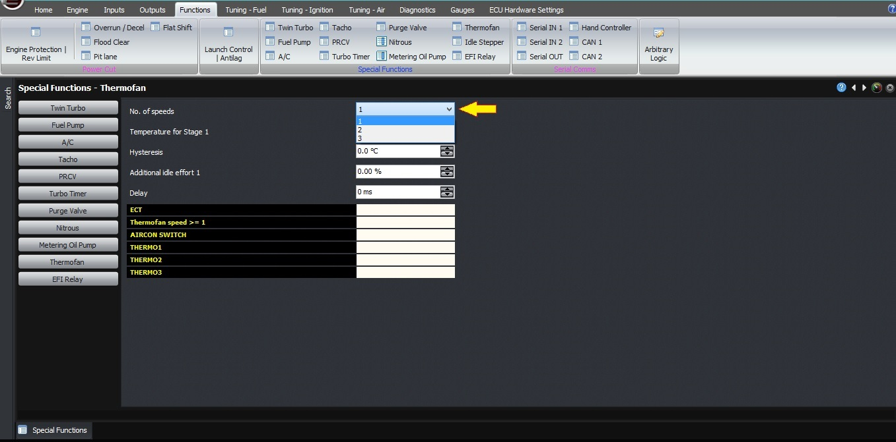
  
  
Thermofan number of stages  
  

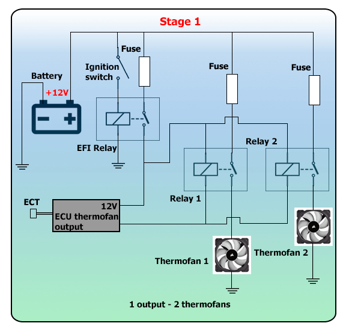

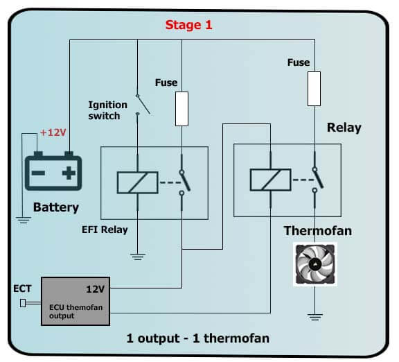

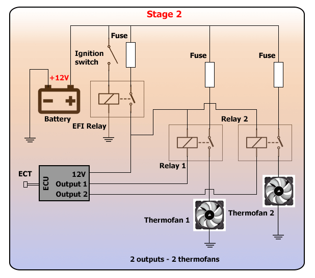

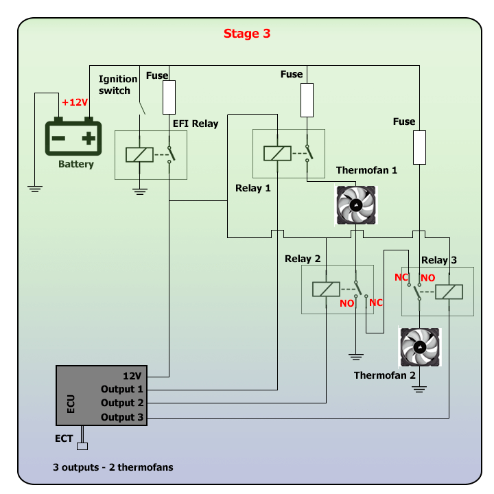
  
  
A separate output pin on the ECU is required for
                  each stage that you are going to run.  
  

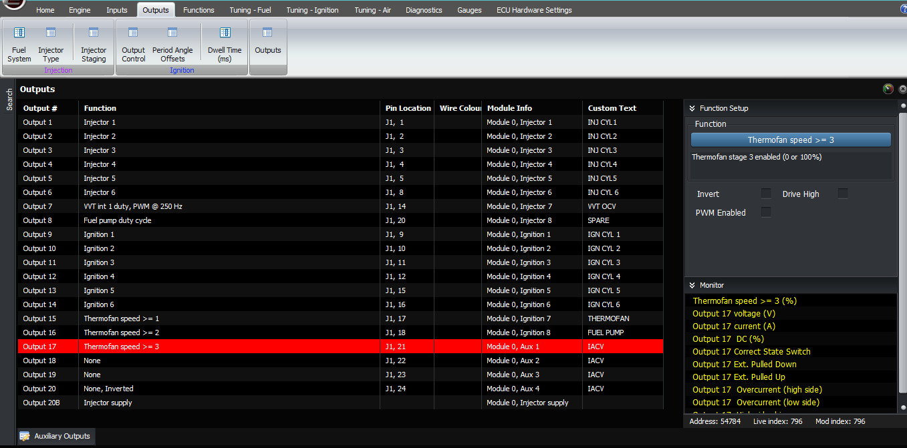
  
  
The next setting is the temperate for each stage to
                  be activated. For example if you have 2 stages, then you have
                  2 activation temperatures. When the coolant temperature goes
                  above the first stage temperature, the first stage will
                  activate. When the coolant temperature goes above the second
                  stage temperature, the second stage will activate.  
  

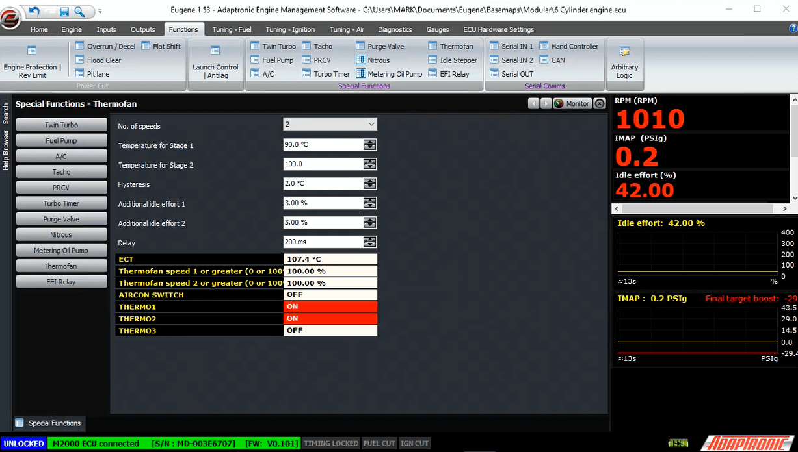
  
  
The next setting is the hysteresis, which is the
                  temperature drop below the activation temperature to turn off
                  the fan. As an example, if you set the temperature to 2
                  degrees and the activation temperature is 100 degrees, then
                  the coolant temperature will need to go above 100 degrees for
                  the fan to turn on, and it will turn off when the temperature
                  goes below 98.  
  

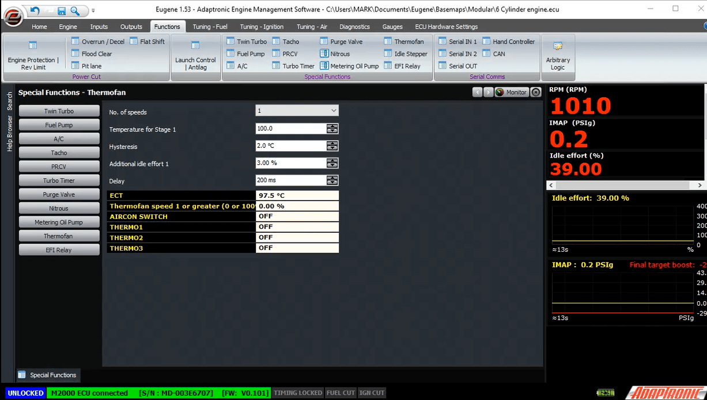
  
  
The next settings are the additional idle effort
                  (percentage) to be applied when each stage is active. For
                  example if you enter 3% here, the ECU will automatically add
                  3% to the idle duty cycle to help stabilise the idle speed
                  with the additional electrical load from the fan.  
  

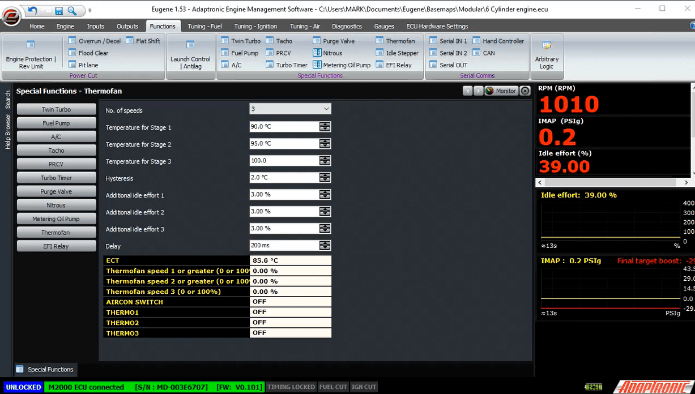
  
  

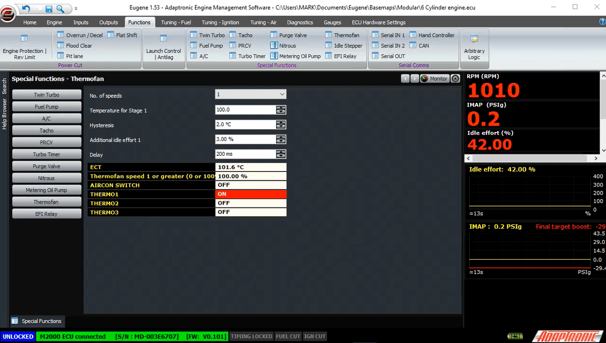
  
  
The final setting is the delay. When the coolant
                  temperature exceeds the threshold, the ECU first applies the
                  additional idle effort. After the delay time, the ECU then
                  turns on the thermofan output. This helps reduce or eliminate
                  the idle dip when the fan is turned on.  
  
In addition to this logic, the fans are always run
                  at full speed if there’s a coolant temperature sensor failure,
                  or if the air conditioner is active.  
  
You can see in the software the current state of the
                  thermofan stages and the current temperature.  
  

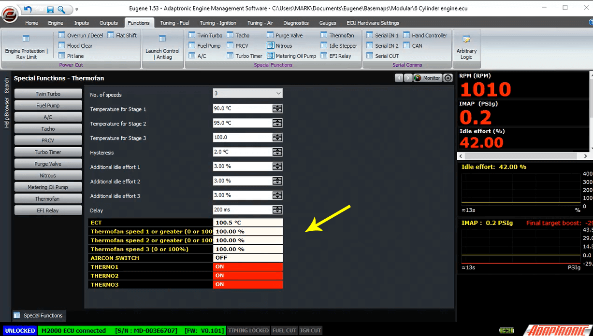
  
  
In terms of outputs, you need to connect the relays
                  so that each stage output will drive the fans correctly. The
                  ECU will drive an output low for each stage, and lower. For
                  example if you have selected a 2 stage thermofan
                  configuration, and the ECU is trying to run the thermofans at
                  stage 2, then both outputs 1 and 2 will be on at the same
                  time.  
  
The outputs are configured in the usual way, select
                  a free output, select the category as “outputs” and select
                  “Thermofan speed 1 or greater” for the first stage output. The
                  second fan output needs to be “Thermofan speed 2 or greater”  
  

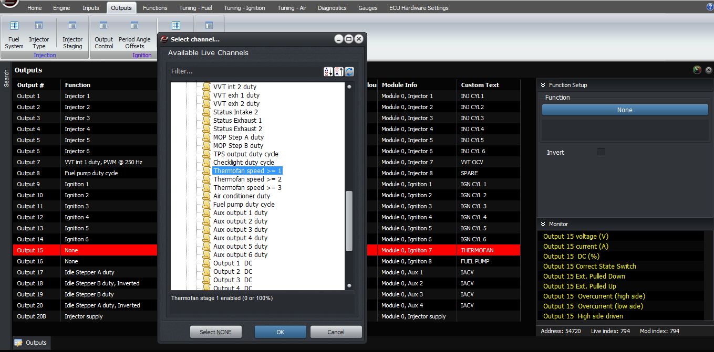
  
  
Once you have it all working, you should set the
                  additional idle effort as follows. Firstly, ensure that your
                  closed loop idle is working correctly. Then, watch the idle
                  effort before the fan is turned on (ie thermofan stage = 0).
                  Then when the engine heats up and the fan is turned on, watch
                  what happens to the idle effort. This new value minus the old
                  value with the fan off is what you should enter in the
                  additional idle effort for thermofan 1 setting. This can also
                  be applied to the higher stages. If the engine doesn’t get hot
                  enough to trigger the thermofan at idle, or you’re impatient
                  like me, you can artificially change the thermofan activation
                  temperature for this test.  
  

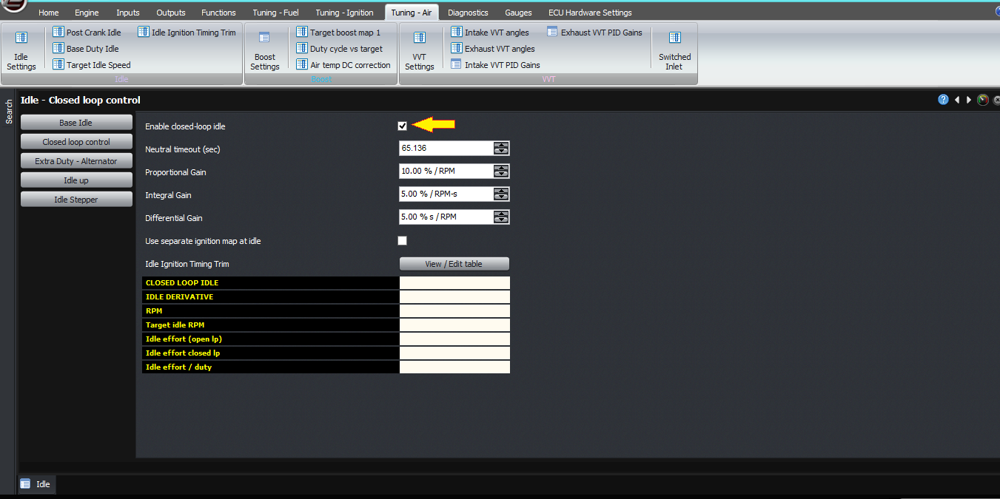
  
  
Once you’re happy with the extra idle effort, you
                  can adjust the delay to give the smoothest transition of the
                  fan turning on. Generally the delay should be fairly short, eg
                  200 ms. If the delay is much longer, the closed loop idle
                  control will start to correct for the extra effort when
                  there’s no corresponding load and the dip will become worse
                  and with a shorter delay. But the delay must be long enough
                  for the engine to react, or there is no benefit.  
  
There’s not a lot to troubleshoot with the thermofan
                  that isn’t obvious, but the only thing I’d suggest is that if
                  you have a problem where the fan or fans seem to be coming on
                  all the time, check that you have selected the correct number
                  of stages. If you have selected 2 stages when your car is only
                  set up for a single stage, and the second stage temperature is
                  zero, it means the ECU will see that the engine is always hot
                  (so long as the coolant temperature is above zero, because
                  that’s what you’ve set the high speed fan temperature to),
                  so  that’s more than likely the problem in this case.  
  
  
  

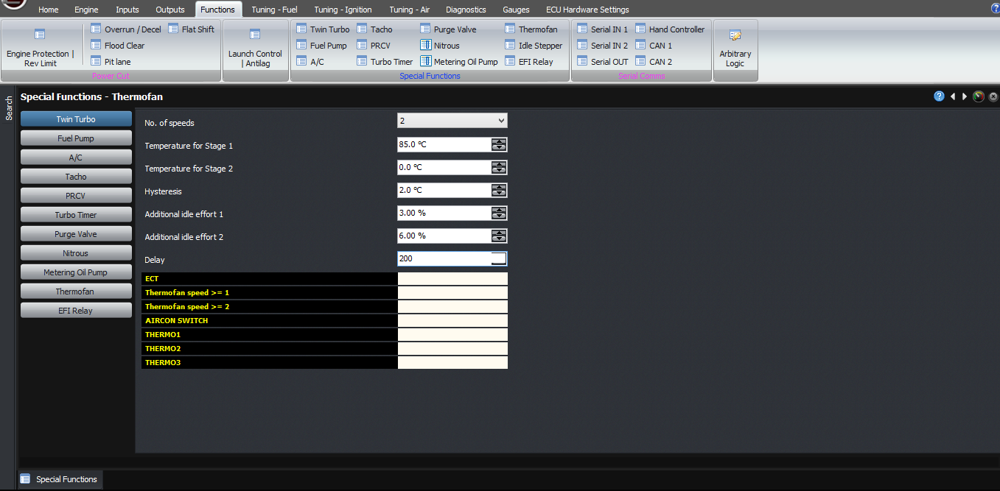
  
  
Wrong setup because temperature 2 is set to zero degrees  
  

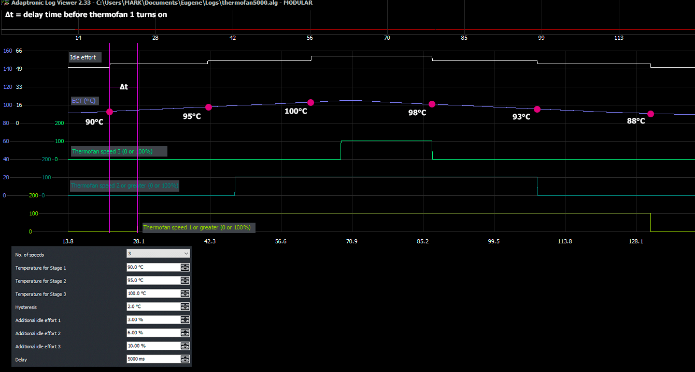
  
  
  
  
Graph of themofan speed 1 output,
                  thermofan speed 2 output, thermofan speed 3 output, idle
                  effort and coolant temp. As coolant temp is ramped up
                  thermofans switched on but with time delay due to the delay
                  set in the software and as the coolant temp ramped down
                  thermofans switched off at certain temperature considering the
                  set hysteresis.  
  
©2018
        Adaptronic  
  
