  
  
  
  
  
  
[DOWNLOADS](#)[STORE](#)[CONTACT US](#)  
  
  
  
  
  
  

Wiring and Configuring Outputs on Different
              Types of Idle Actuators using Modular ECUs

[go back to
                support home](EN_EUGENE_MOD_HOME.md)  

  
  
  

[Air
                Conditioner Setup](EN_MOD_018_ACSETUP.md)

[Thermofan
                Control  

              ](EN_MOD_023_THERMOFAN.md)

  

[  

              ](EN_SelFW.md)

  

  
  
  
  
  
  
  
  
In this article I’m going to describe the
                  different types of idle actuators, how to wire them to a
                  Modular ECU and how to configure the outputs in the software.
                  I will not be discussing how to set up open or closed loop
                  idle, there will be other articles for that.  
  
Firstly, let’s describe the different types of idle
                  actuators. There are four types that we support. There may be
                  others which might work using these methods, but these are the
                  most common and the ones we support.  
  
The four types can broadly be categorised by the
                  number of pins on the connector; 2, 3, 4 and 6.  
  
The most basic type is the 2-wire solenoid. These
                  can be found on many Fords, Mazda, Nissan and Honda engines.
                  Normally one side is connected to a 12V supply, and the other
                  is pulled to ground by the ECU when it is to be activated.
                  Sometimes these will have an internal diode; if so then you
                  have to get the polarity correct or you’ll blow up the ECU
                  output, or the internal diode, or both. If in doubt, check the
                  factory diagram for which pin is positive and which is
                  negative.  
  

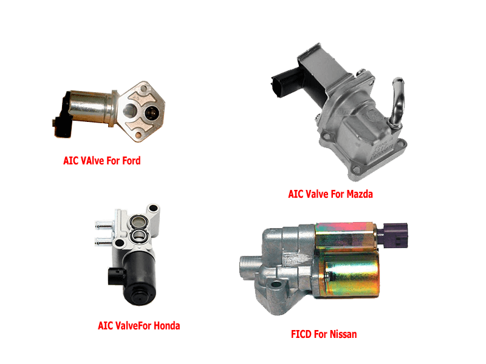
  
  
In almost all cases, these can be pulse width
                  modulated to vary the amount of air going into the engine and
                  thereby control the idle speed. To connect one of these to the
                  ECU, one side must be connected to an ignition switched 12V
                  supply, and the other side must connect to a high current
                  output on the ECU, ie either an auxiliary output or an unused
                  injector output.  
  

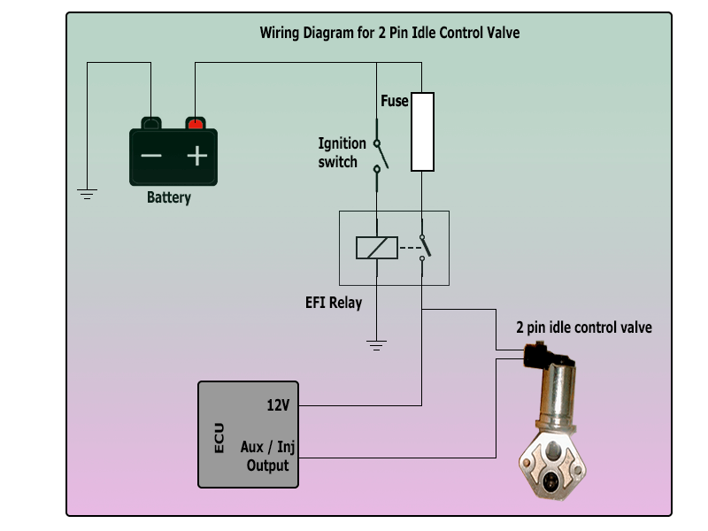
  
  

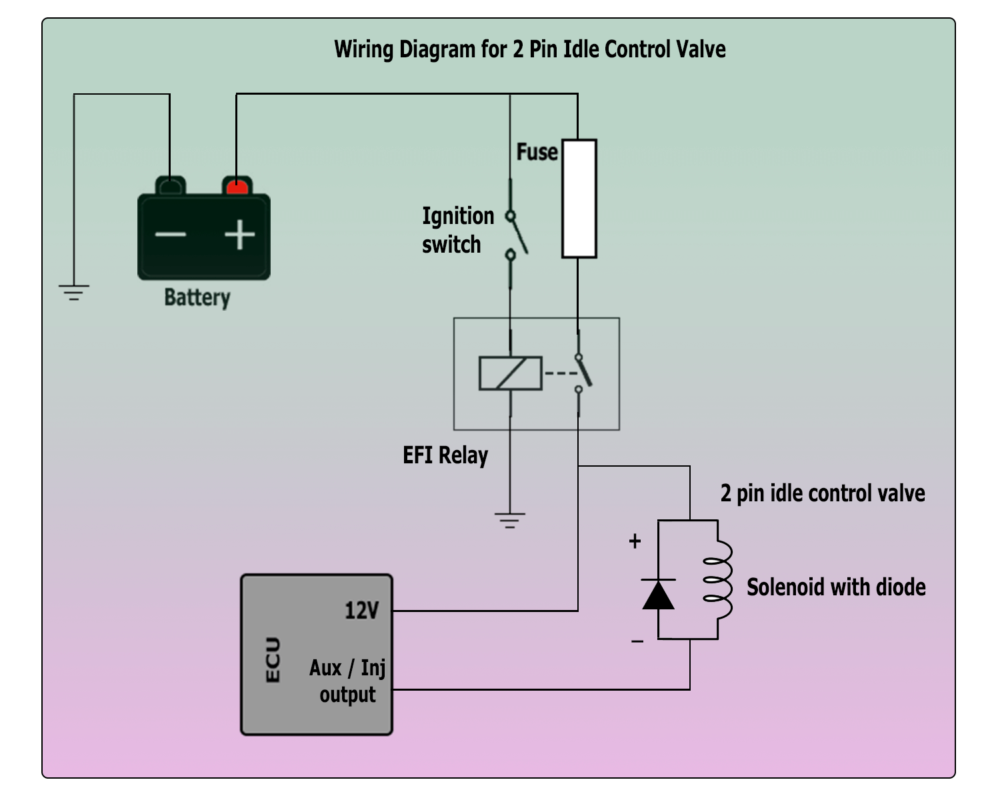
  
  
The output then needs to be selected as Idle Effort,
                  PWM. The PWM frequency may take some experimenting if you
                  don’t already know what it’s supposed to be. If the PWM
                  frequency is too high, then the current going to the valve can
                  be very smooth, so a small increase in the duty cycle will
                  mean only a small increase in the current. Sometimes the valve
                  can get stuck at a particular position, with the result that
                  small movements are impossible. So a lower PWM frequency
                  causes the valve to wiggle a little bit and prevent it from
                  getting stuck in one place. Therefore, lower PWM frequencies
                  give greater control, so if you’re struggling to get
                  consistency (idle effort corresponding to RPM) then try a
                  lower PWM frequency.  
  
The downside with the frequency being too low is
                  that if the valve opens closes too much, then it creates a
                  pressure wave at the PWM frequency which is audible from the
                  intake. That is, you can hear a humming sound at the PWM
                  frequency you’ve selected, but the hum doesn’t come from the
                  idle valve itself, you hear it through the intake and it
                  transmits through the intake air. This can be annoying and the
                  only solution is to use a higher PWM frequency.  
  
Typical frequencies we use are 100 Hz on RB and SR
                  Nissan engines, and the same on Mazda 13B engines, but on the
                  Mazda B engines as in the MX5 / Miata we generally use about
                  500 Hz because of the induction noise.  
  
  
  

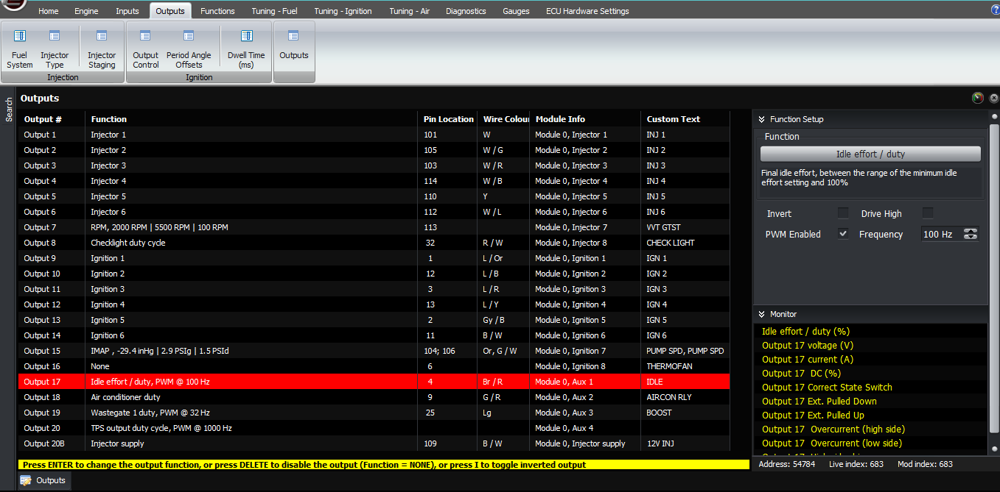
  
  
100 Hz on RB and SR Nissan engines, and the same on Mazda
                    13B engines  
  
  

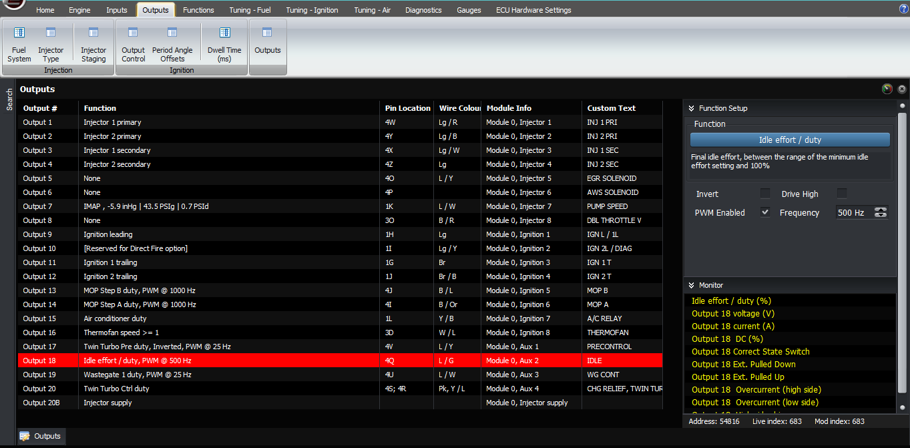
  
  
Mazda B engines as in the MX5 / Miata we generally use about
                    500 Hz  
  
You can check that it’s connected electrically by
                  looking in the diagnostic screen for the voltage and current
                  for that output. When the output is on (eg if the engine is
                  stopped, or if you set the output to none, inverted) the
                  voltage should be about 0V, because the ECU is pulling that
                  line down. The current should read a positive value, eg 1 – 2
                  Amps.  When the output is off, for example if you set it
                  to none or set the idle duty cycle to zero, the current should
                  be approximately zero and the voltage should show battery
                  voltage, eg 12V.  
  
The next type is the 3-wire. There’s an old style
                  Bosch idle valve with 3 wires, I’m not sure which cars it was
                  used on – and it’s also found on some Subarus and Toyota
                  engines. We’ll discuss the standard connection first of all
                  but there’s an alternative connection I’ve also see which is a
                  bit different.  
  
Instead of the single coil, which pulls to open the
                  valve as on the 2-wire type, the 3-wire idle valve has 2
                  coils. When one is energised, the opens the valve and allows
                  more air to flow. When the other is energised, it closes the
                  valve and allows less air to flow. If you don’t energeise
                  either coil, for example if you just unplug the motor, it
                  flows about half its maximum amount.  
  
  
  

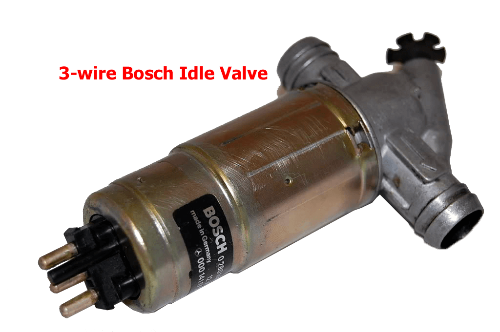
  
  
3-wire Bosch Idle Valve  
  
To connect this, the standard way is to connect the
                  middle pin to 12V, and either side to a high current output on
                  the ECU, ie either an injector or an auxiliary output. One
                  output must be configured as Idle effort, PWM, the same as
                  with the 2-wire solenoid. The other must be Idle effort, PWM,
                  but the output should be inverted. Both should have the same
                  PWM frequency, we’ve found 250 Hz works well.  
  

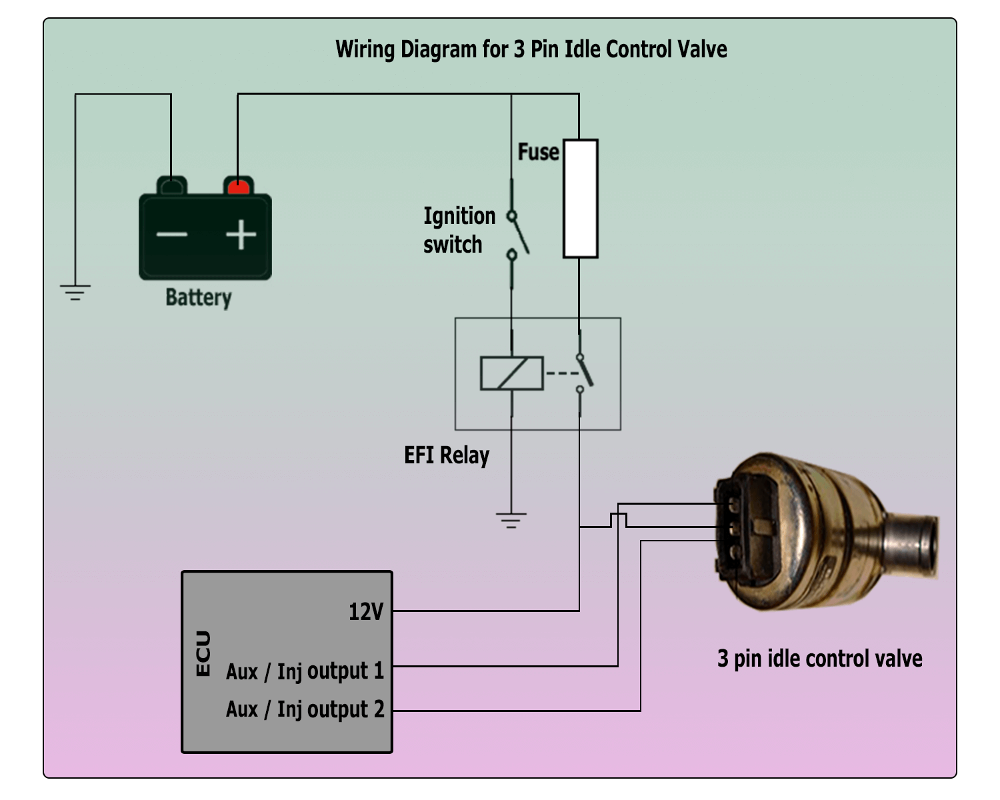
  
  

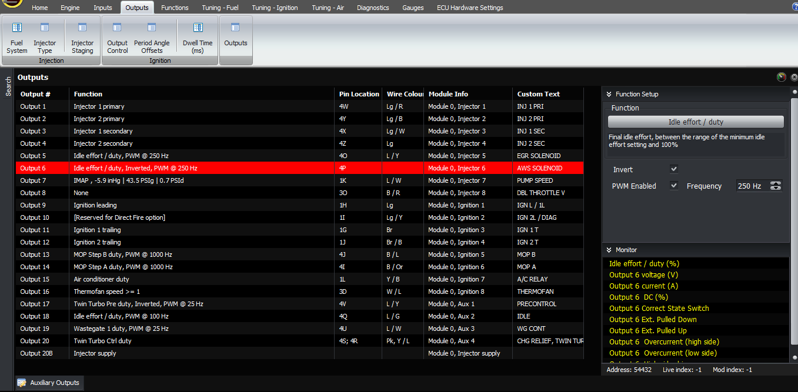
  
  
The one which is configured as idle effort must be
                  the one that is pulled low to allow more air into the RPM, ie
                  the one that increases the idle speed.  
  
You can check that the outputs are connected
                  correctly in the same way as with the 2 wire idle valve,
                  except that you have 2 outputs to check instead of just one.  
  
One way I’ve seen these connected differently is
                  that instead of the middle terminal connected to 12V and each
                  outside terminal pulled to 0V in turn, is that the two outside
                  pins are connected to 0V and 12V, and the middle terminal
                  connects to the ECU. In this case, you should use an auxiliary
                  output to drive the idle motor, and enable the “drive high”.
                  Normally the factory wiring would be so that pulling the pin
                  to ground increases the idle speed, but if not, then just
                  select “invert” on that output so it becomes idle effort,
                  invert instead of just idle effort. In this case the PWM
                  frequency should remain the same as with the conventional
                  connection, as I mentioned earlier so far 250 Hz has worked
                  well with these. So far the only time I’ve seen this is with
                  the cable throttle series 2 Lotus Elise and Exige with the
                  2ZZGE engine. Interestingly, when the 2ZZ engine is used in
                  the Celica, it’s connected normally with 12V on the middle pin
                  and the two other terminals going to the ECU.  
  

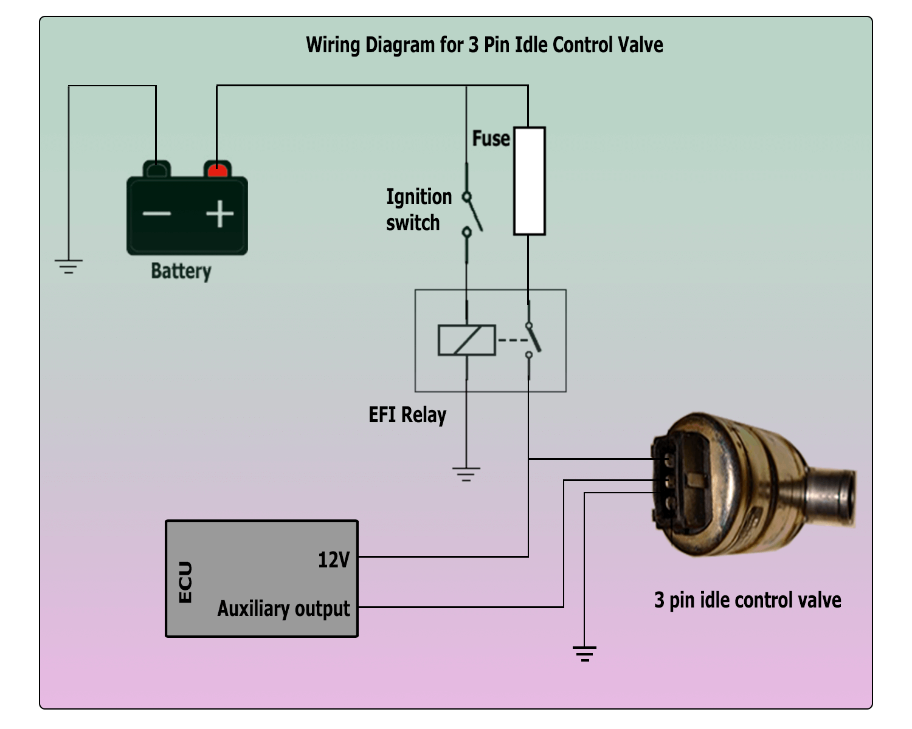
  
  
The next type is the 4 wire stepper motor. So far
                  I’ve only seen these on GM engines, but possibly for that
                  reason they seem to be popular in aftermarket installations as
                  well. These stepper motors have 250 steps, and the step period
                  they need is 5ms, so these both need to be set in the idle
                  stepper configuration.  
  
  
  

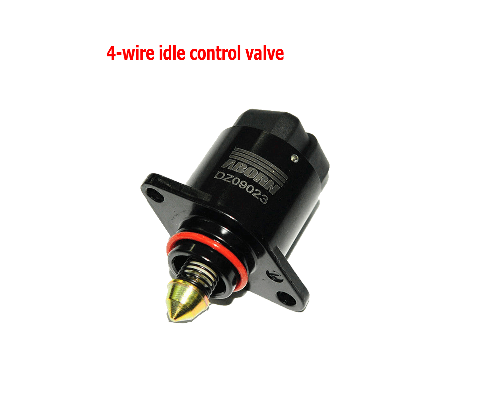
  
  
4-wire Idle Control Valve  
  

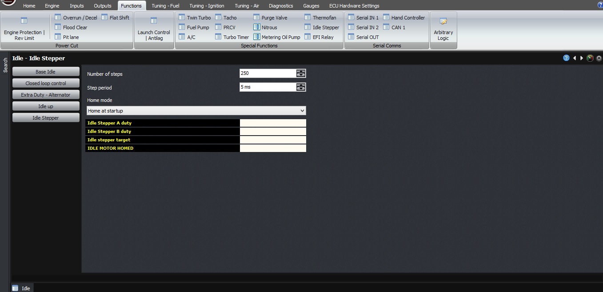
  
  
The 4 wires on the stepper motor connect to two
                  coils internally. Usually the pins are labelled as letters
                  with A B C D, and A and B are one coil, and C and D are the
                  other coil.  
  

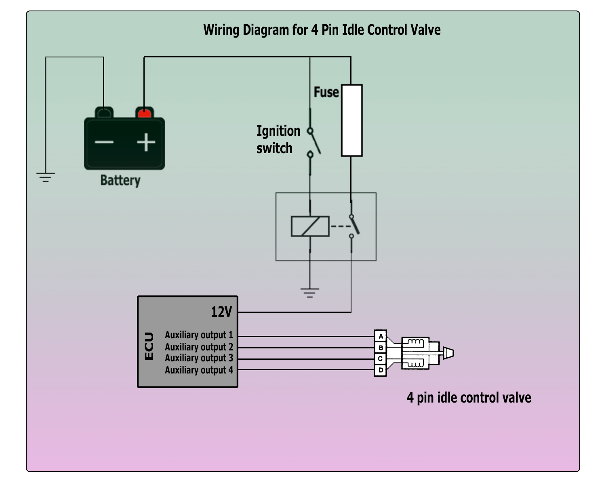
  
  
Each coil needs to be driven high at one end, and
                  low at the other.  
  
Therefore, to drive one of these motors, you need to
                  use auxiliary outputs (not injector or ignition outputs), and
                  they must be configured as drive high. Here are the settings
                  that are required:  
  

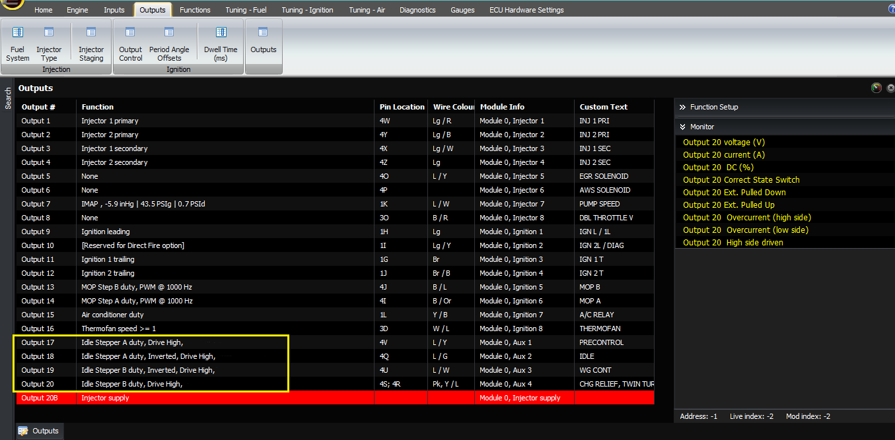
  
  
Idle motor pin  
  
ECU function  
  
A  
  
Stepper A duty cycle  
  
B  
  
Stepper A duty cycle inverted  
  
C  
  
Stepper B duty cycle inverted  
  
D  
  
Stepper B duty cycle  
  
To check that the ECU is driving the outputs
                  correct, set the outputs as follows and check the voltage
                  shown in the software:  
  
Idle motor pin  
  
ECU function  
  
Indicated voltage in software  
  
A  
  
None  
  
12V  
  
B  
  
None inverted  
  
0V (current should be > 0)  
  
C  
  
None inverted  
  
0V (current should be > 0)  
  
D  
  
None  
  
12V  
  
And now invert the outputs and check that they work
                  in the opposite phase:  
  
Idle motor pin  
  
ECU function  
  
Indicated voltage in software  
  
A  
  
None inverted  
  
0V (current should be > 0)  
  
B  
  
None  
  
12V  
  
C  
  
None  
  
12V  
  
D  
  
None inverted  
  
0V (current should be > 0)  
  
If the current shows as zero on the output which is
                  at 0V, that means that either there’s a bad connection between
                  the ECU and the motor on that pin, or the other pin on the
                  same coil. If the voltage does not switch between 0V and 12V
                  correctly, but the ECU setting is correct (ie “drive high” is
                  enabled), then either there’s a short circuit or the ECU
                  output has been damaged.  
  
If your 4-wire stepper motor has pins labelled
                  differently, then you can work out which pins are joined
                  internally with a multimeter. However the direction could
                  still be reversed, ie a higher idle effort could result in
                  less airflow and lower RPM. If this happens, then swap around
                  outputs C and D, ie C becomes Stepper B and D becomes Stepper
                  B inverted.  
  
At the moment, we recommend using the home mode as
                  “home at startup” which ensures that the stepper starts from
                  the same position each time you start the engine, which is
                  necessary for consistency.  
  
The last type of idle valve we will discuss is the
                  6-wire stepper motor. These are similar to the 4-wire motors
                  except that each coil is actually 2 coils with a centretap,
                  which is connected to 12V. Normally it will be connected as a
                  6 pin plug with 2 rows of 3 pins, and the middle pin on each
                  row needs to be connected to a ignition switched 12V source.  
  

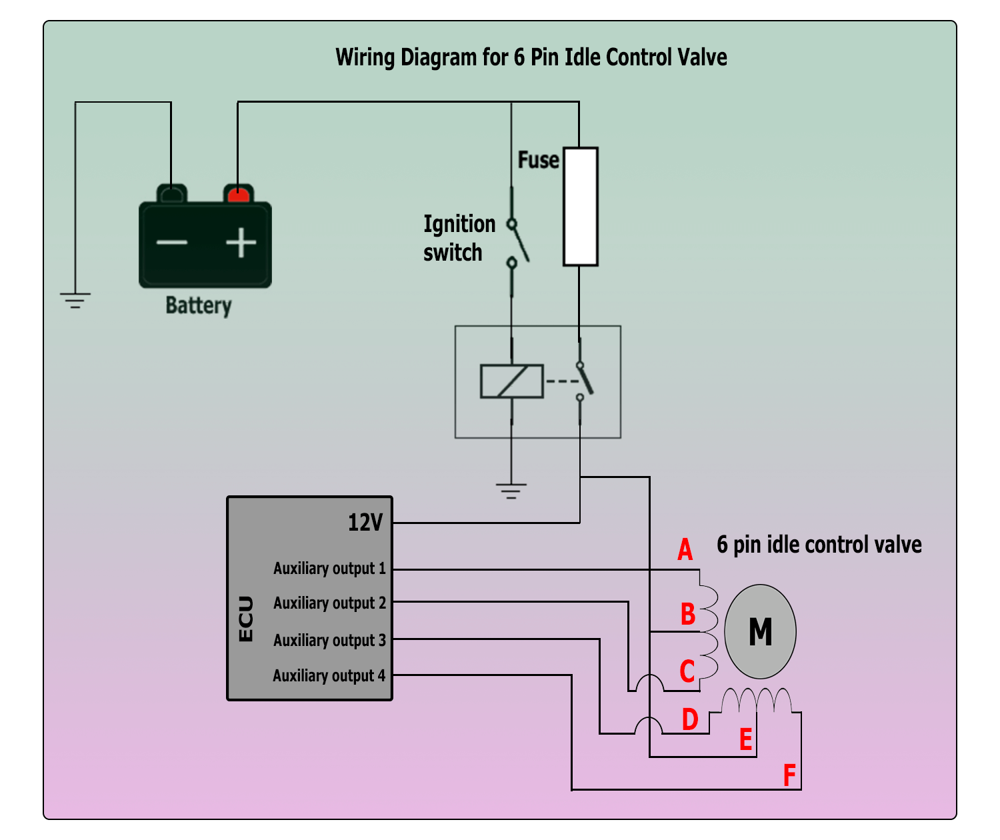
  
  

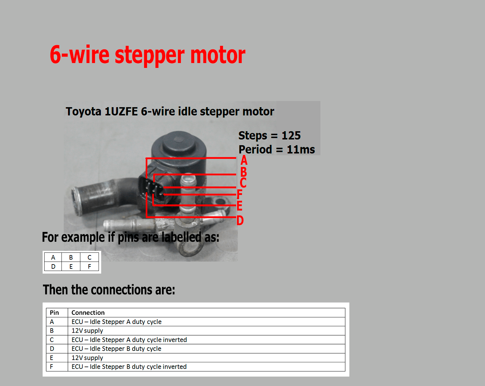
  
  
Each of the outside 4 pins then needs to connect to
                  an output on the ECU. It’s acceptable to use unused ignition
                  outputs for this use because the stepper motor draws very
                  little current.  
  
The outputs then need to be configured the same as
                  with a 4 wire stepper, but without the drive high function
                  enabled. For example if the pins are labelled as:  
  
  
A  
  
B  
  
C  
  
D  
  
E  
  
F  
  
Then the connections are:  
  
Pin  
  
Connection  
  
A  
  
ECU – Idle Stepper A duty cycle  
  
B  
  
12V supply  
  
C  
  
ECU – Idle Stepper A duty cycle inverted  
  
D  
  
ECU – Idle Stepper B duty cycle  
  
E  
  
12V supply  
  
F  
  
ECU – Idle Stepper B duty cycle inverted  
  

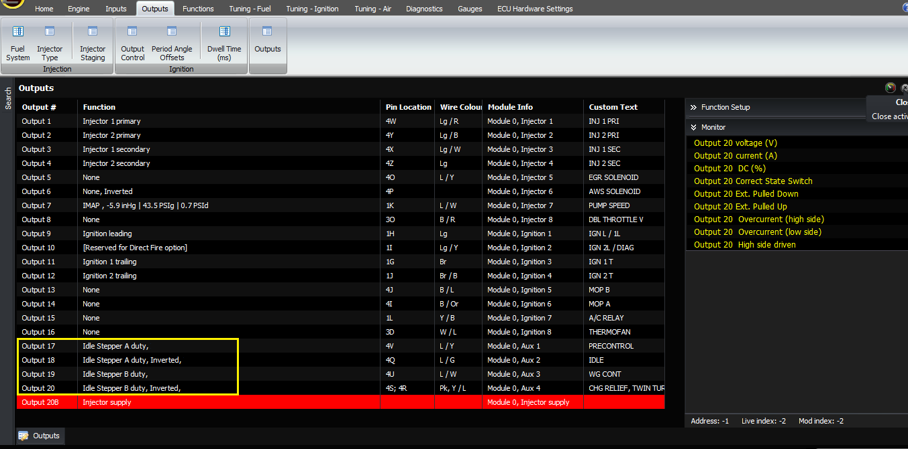
  
  
Again, the number of steps and step period must be
                  configured. The Mitsubishi steppers we’ve tested have 120
                  steps whereas the Toyota have 125. Both are happy with 10ms
                  steps. Again we recommend using the “home at startup” mode.  
  
  
  

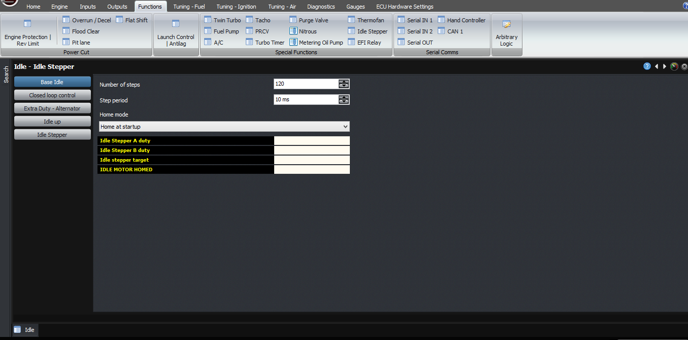
  
  
Mitsubishi  
  
  

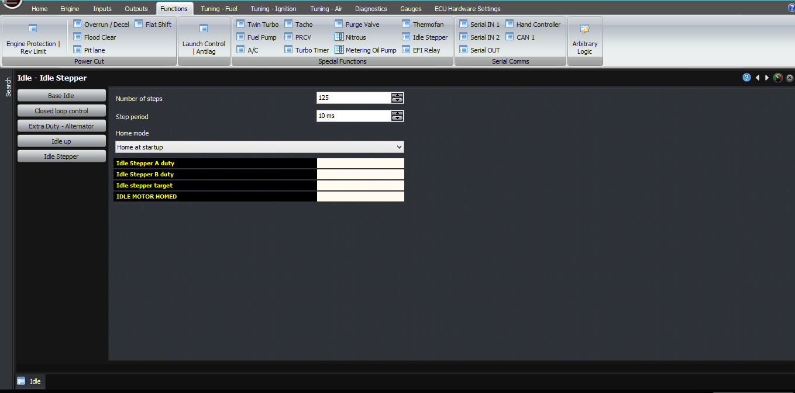
  
  
Toyota  
  
Just as with the 4 wire stepper motor, depending on
                  exactly how your stepper is wired, this above configuration
                  can result in the stepper driving the wrong way, ie a higher
                  idle effort corresponding to a lower RPM. To rectify this,
                  simply swap around the second row, as shown:  
  
  
Pin  
  
Connection  
  
A  
  
ECU – Idle Stepper A duty cycle  
  
B  
  
12V supply  
  
C  
  
ECU – Idle Stepper A duty cycle inverted  
  
D  
  
ECU – Idle Stepper B duty cycle inverted  
  
E  
  
12V supply  
  
F  
  
ECU – Idle Stepper B duty cycle  
  
To test the outputs are connected correctly, again
                  you can select each output to be “none” and verify first that
                  they all show 12V. As each one is “inverted”, the output
                  voltage should go to zero volts as the ECU pulls it to ground,
                  and you should see a small amount of current at that output
                  also. If the voltage doesn’t pull to 0V and stays at 12V, that
                  means that the output of the ECU has been damaged. If the
                  voltage isn’t at 12V in the first place, or the current stays
                  at 0 even when the output is turned on, it means that the load
                  isn’t connected. Eg there’s no 12V supply to the stepper
                  motor, or there’s no (or a bad) connection between the stepper
                  motor and the ECU, or the stepper motor coil is open circuit
                  (which you can check with a multimeter).  
  
A final word about the meanings of some of the live
                  variables on the stepper motor setup page in the software. The
                  Stepper A and Stepper B motor duty cycles will either be 0% or
                  100% depending on whether they are being pulled low or not at
                  the time. They will go between 0% and 100% in a sequence,
                  which will be too fast to log but you can see it on the
                  built-in scope or a real scope. So seeing them skip between 0%
                  and 100% is normal.  
  
The ECU calculates idle effort as if it were a duty
                  cycle, from 0 – 100%. So for a stepper motor, the ECU takes
                  this percentage and multiplies it by the number of steps, to
                  arrive at the target step which the ECU is aiming for. This is
                  shown here as the target stepper position. The final flag is
                  idle motor homed, which becomes true after power-up and the
                  motor has been opened all the way to make it easy to start the
                  engine.  
  
We will be doing other articles and videos about
                  setting up the idle parameters.  
  
Thank you and happy learning!  
  
©2018
        Adaptronic  
  
