  
  
  
  
  
  
[DOWNLOADS](#)[STORE](#)[CONTACT US](#)  
  
  
  
  
  
  

Setting up Open Loop Idle Control on Modular
              ECUs

[go back to
                support home](EN_EUGENE_MOD_HOME.md)  

  
  
  

[Setting
                up Closed Loop Idle Control](EN_MOD_026_IDLECLOSEDLOOP.md)

[  

              ](EN_EUGENE_KBSC_TG.md)

  

[  

              ](EN_SelFW.md)

  

  
  
  
  
  
  
  
  
Hi all, in this video we’re going to
                  discuss how to get the basic idle settings correct. I won’t be
                  covering how to configure outputs for idle control and wire
                  them up, because that’s done in a separate video.  
  
Just like getting the fuel mixture right, getting
                  idle control right starts off with having the basic map
                  correct and then applying closed loop on top to do fine
                  tuning. So let’s look at the basic factors that go into open
                  loop idle.  
  
Firstly, let’s show where you can find the idle
                  effort in the software. You can see it on the gauges window,
                  next to RPM. The RPM field shows the current RPM, the target
                  RPM and the idle effort (which could be duty cycle, number of
                  steps or electronic throttle authority). You can also add it
                  to the monitor window and it also appears in various idle
                  setup pages.  
  

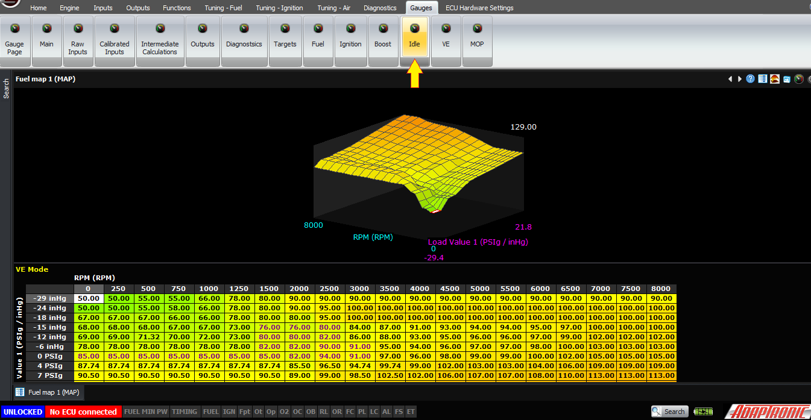
  
  
Now, let’s look at the cranking condition. This is
                  what happens when the engine is stopped, or when it hasn’t yet
                  reached the cranking RPM threshold, for example 300 RPM. In
                  this condition, the idle valve is held all the way open to
                  make the engine easier to start. So the idle effort will be
                  100% in this condition.  
  
Next, let’s consider what happens when the engine
                  fires. After this happens, the ECU is in the running (as
                  opposed to cranking) mode. In this mode, the ECU calculates
                  the idle effort from the following factors:  
  

- Base idle effort (which depends on coolant
                      temperature)
- Post-crank idle effort (which depends on
                      coolant temperature and time)
- Additional idle effort for electrical loads,
                      air conditioner, thermofan, alternator and so on
- Closed loop control  
  
Initially, we’ll turn closed loop idle control off.
                  This enables us to see what the actual settings are doing, as
                  opposed to how well the ECU can correct it.  
  

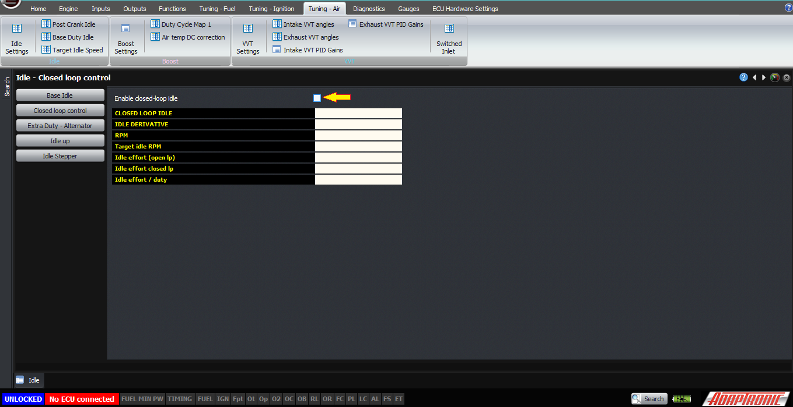
  
  
If we’re setting up the idle from scratch, we should
                  also set all the idle-up values to zero, and start off with
                  the base idle effort. This is best done with an engine
                  starting from cold. Firstly, set the target idle speed against
                  the coolant temperature; most port injected engines want to
                  run higher RPM when they are cold to combat the fuel falling
                  out of suspension at low temperatures.  
  

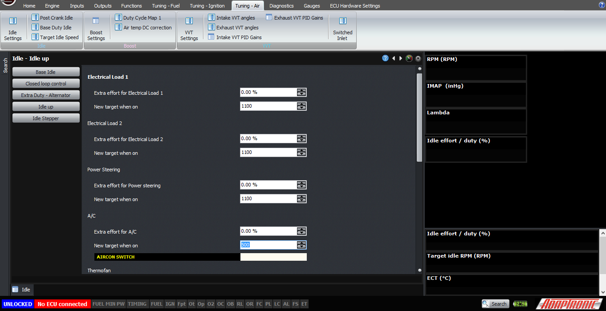
  
  

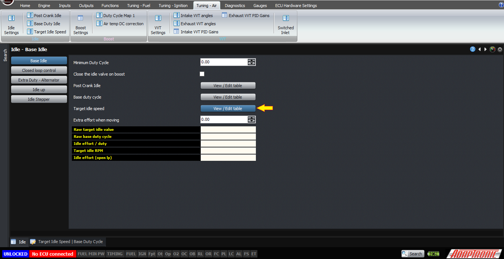

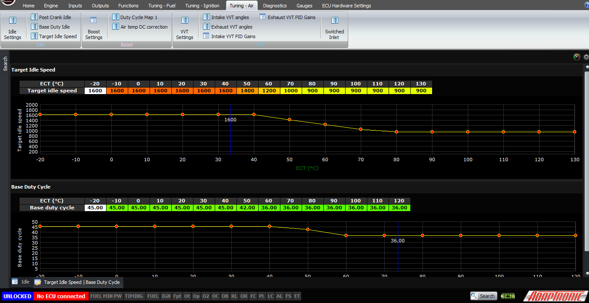
  
  
Secondly, as the engine heats up, adjust the base
                  idle effort in the base duty cycle table against coolant
                  temperature. Extrapolate past the ends as needed.  
  

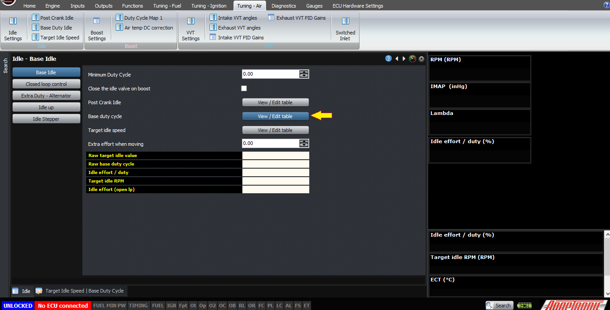

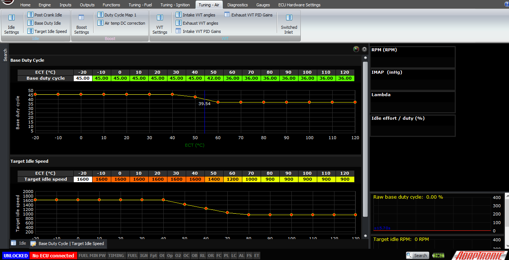
  
  
The other way to do this is to enable closed loop
                  idle control, and then allow the closed loop function to
                  settle on the target idle speed. Copy the final idle effort
                  into the table at each temperature cell as it is reached.  
  

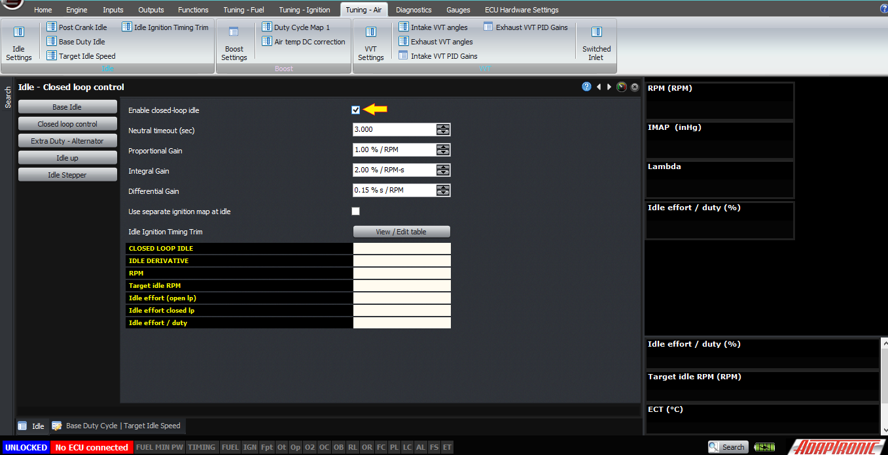
  
  
Next, you should set up the idle-up for loads. The
                  procedure for this is to either adjust the additional efforts
                  so that the target idle is still maintained when the load is
                  applied, or to allow the closed loop to correct the idle
                  effort, and take the difference between when the load is
                  applied and when it is not and copy that into the additional
                  idle effort. This is also described in the setup article for
                  the air conditioner and the thermofan.  
  
For idle loads which the ECU only knows about via
                  external inputs, these also need to be wired in and
                  configured. Generally these are switches which either pull to
                  ground when they are activated, for example a power steering
                  pressure switch. For this type of input, select a digital
                  input that you’re not using, connect the switch to this input,
                  and select the type as being “power steering” as an example.  
  

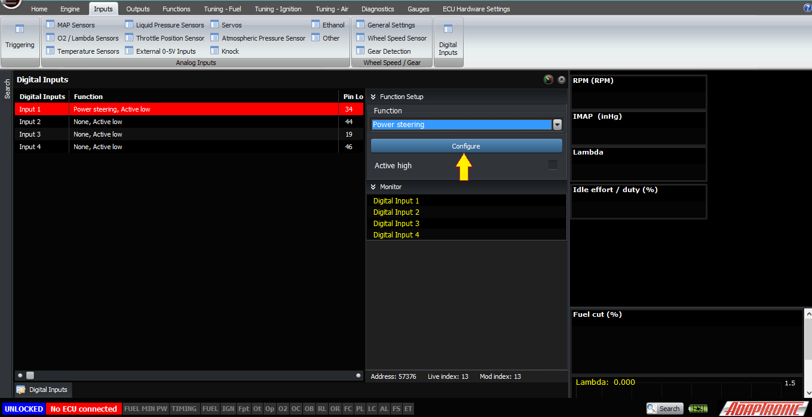
  
  
Another example is a headlight input. Normally this
                  goes high to 12V when the headlights are on, but is shorted to
                  ground when they are off. Again this should be connected to a
                  digital input, and then the input should be selected as an
                  electrical load, for example electrical load 1. But in this
                  case because it’s driven high when it’s active, we must select
                  “active high” in the digital input setting.  
  

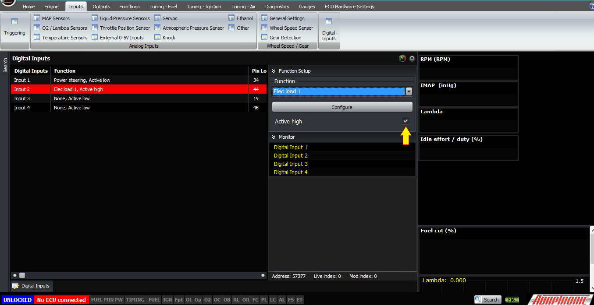
  
  
When any of the electrical inputs, power steering or
                  air conditioner inputs are active, the ECU will increase the
                  target idle RPM to the “new target when on” setting in the
                  idle-up page. If this target is below the target idle speed in
                  the target idle speed table, it will use the target idle speed
                  from the table instead (ie, it uses the maximum of the target
                  idle speed from the table, and the “new target” of any
                  activated input).  
  
The “extra duty – alternator” function is for cars
                  where the ECU is able to see the alternator field current, for
                  example if the regulator is built into the ECU rather than the
                  alternator itself. This is the case with the NB and later MX5
                  / Miata, the RX8, 86/FRS/BRZ and the Dodge SRT4 and probably
                  many others. In this case you can select an input channel for
                  the field current, enter a maximum and minimum voltage for
                  that input corresponding to the min and maximum values that
                  you will see, and minimum / maximum idle efforts for these
                  conditions. Normally the minimum idle effort would be zero.
                  The ECU will scale the idle effort linearly between these two
                  and in practice it works really well; much better than with
                  digital inputs to select whether different functions on the
                  car are turned on or not.  
  

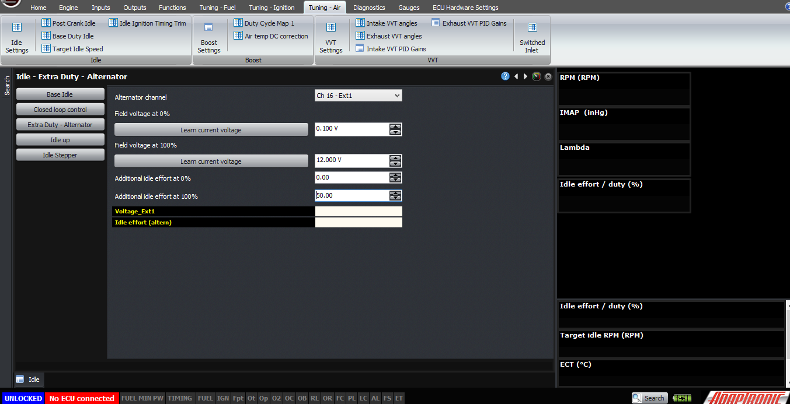
  
  
The final function I wanted to talk about is the
                  post-crank idle-up. This is a table with coolant temperature
                  on one axis and time on the other. Time=0 is the time where
                  the engine actually first fires, and for example 10 represents
                  10 seconds after the engine has started. This table enables
                  you to program in a post-crank flare to clear the engine out,
                  or save it from a stall or whatever is desired on that
                  particular engine. Note that it will be interpolated between
                  these points, and the maximium time you can have post-crank
                  idle for is 300 seconds or 5 minutes (in practice, if you need
                  it that long you’re probably doing something wrong). Note that
                  whenever the interpolated value from this table (ie, the extra
                  idle effort to add due to the post-crank amount) is greater
                  than 1%, the ECU will not go into closed loop idle. Obviously
                  during this post-crank flare, it’s going to be above the
                  target idle speed, and that’s where you want it, so going into
                  closed loop in this condition is not an option. So the ECU
                  will stay in open loop until the correction is down to less
                  than 1%.  
  
The only thing I’ll say about setting up the
                  post-crank idle effort is that sometimes if an engine doesn’t
                  want to rev up nicely post crank, it’s not because of the idle
                  effort but it’s instead because of poor fuelling. So if it
                  doesn’t seem happy and you want it to rev higher or clear
                  itself up, then you should check the post-crank enrichment
                  first – try 10% more or 10% less in this table first to see if
                  it makes a difference.  
  

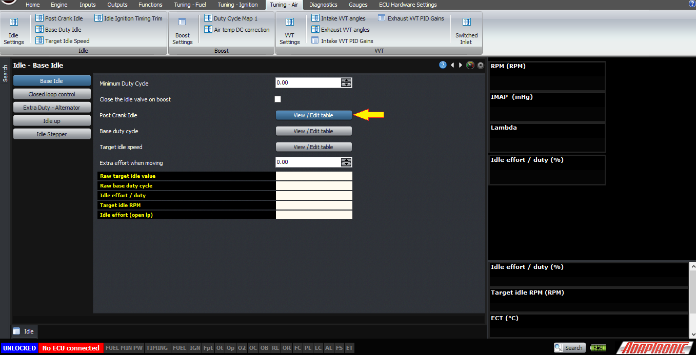

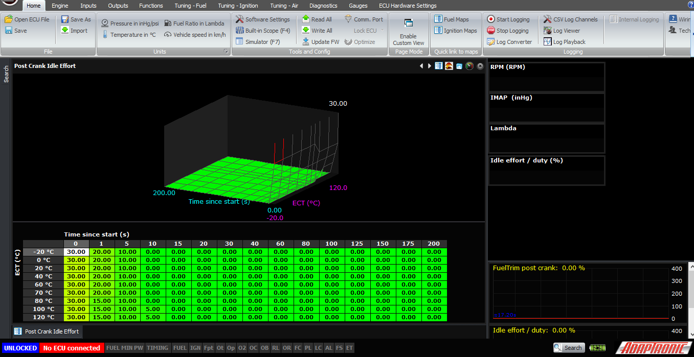
  
  
Two final settings – one is the minimum duty cycle.
                  In most cases you can set this to zero. In some cases, setting
                  it just below the minimum that you encounter with a hot engine
                  and no electrical loads can help with idle stability. And on
                  some idle valves, below a certain duty cycle they actually
                  start admitting more air, so you need to stay away from that
                  end of the scale because non-monotonic actuators make Andy
                  cry.  
  
The final setting is “close idle on boost”. In most
                  turbocharged applications, the air for the idle control valve
                  will be taken from just before the throttle body, so it really
                  acts as an idle bypass. However in some cars, even in some OEM
                  installations like some Toyota 1JZ cars, the idle motor
                  actually gets its air source from an unpressurised source. So
                  if the idle valve remains open when the engine is on boost,
                  air leaks back through the idle valve to the air filter and
                  creates a boost leak. If you enable this setting, the idle
                  valve will be closed when the engine is on boost (by closed we
                  mean set to the minimum duty cycle).  
  

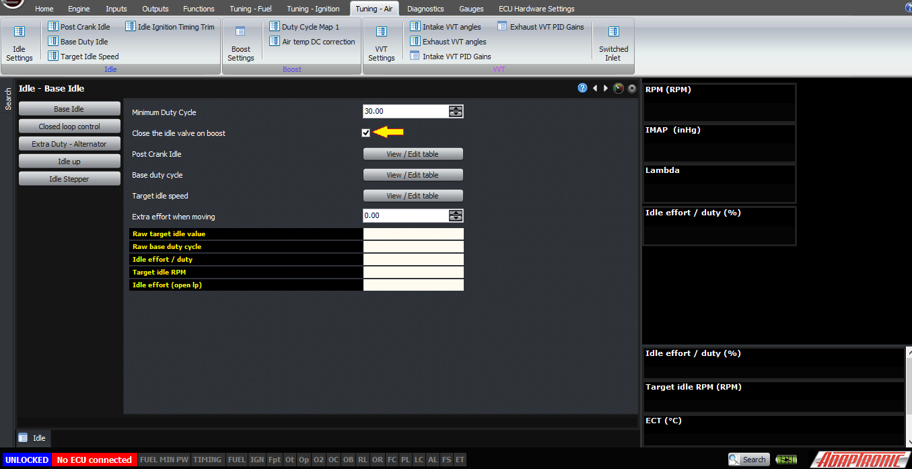
  
  
In a separate article, we’ll talk about closed loop
                  idle control.  
  
  
Thank you and happy learning!  
  
©2018
        Adaptronic  
  
