  
  
  
  
  
  
[DOWNLOADS](#)[STORE](#)[CONTACT US](#)  
  
  
  
  
  
  

Setting up Closed Loop Idle Control on Modular
              ECUs

[go back to
                support home](EN_EUGENE_MOD_HOME.md)  

  
  
  

[Setting
                up Open Loop Idle Control](EN_MOD_025_IDLEOPENLOOP.md)

[  

              ](EN_EUGENE_KBSC_TG.md)

  

[  

              ](EN_SelFW.md)

  

  
  
  
  
  
  
  
  
  
  
Closed loop idle control is one of
                  the things that makes a car nice to drive when it’s set up
                  nicely and working correctly. So in this article we’ll
                  describe what you need to do to set it up.  
Firstly, the ECU needs to know whether to go into
                  closed loop idle or not. I’ve explained this in other places
                  but for the sake of completeness I’ll include it here as well.
                  It’s not enough to know that the throttle is closed, for the
                  following reason. Imagine you’re in a situation where you’re
                  in gear, for example at 2000 RPM, coming to a stop sign. Your
                  foot is off the throttle. If the ECU went into closed loop
                  idle in this circumstance, it would see that the engine is at
                  2000 RPM, which is too high compared to the target of 800 RPM,
                  so it would reduce the idle effort. The RPM would remain
                  unchanged so it would reduce the idle effort further.
                  Eventually the idle effort would be all the way down to zero
                  but the RPM would still be too high. Then as you put your foot
                  on the clutch to stop at the stop sign, the engine stalls
                  because the idle effort is zero where it might actually need
                  40% to idle properly.  
  
Really the ECU needs to know if the engine is at the
                  current RPM because it’s idling there, or because it’s being
                  driven there by some outside force, like the wheels. Some cars
                  are set up nicely from the factory and include a clutch switch
                  and a neutral switch so that the ECU can tell if the engine is
                  disconnected from the wheels, and will only go into closed
                  loop idle if either the clutch is pressed or the gearbox is in
                  neutral. Many other manufacturers don’t have these, but they
                  have a vehicle speed input to the ECU, and the ECU will only
                  go into closed loop idle if it detects the car is stationary.  
  
The Modular ECU will go into closed loop in either
                  of these conditions, but also the throttle must be closed
                  (that is, the CLOSED THROTTLE flag on the TPS inputs page must
                  be active), and either it must have fallen close to the target
                  idle RPM, or if it hasn’t, then these conditions must have
                  been met for a minimum amount of time, which is called the
                  neutral timeout. The neutral timeout must be set so that the
                  engine has enough time to fall from maximum RPM back to idle;
                  otherwise the ECU will go into closed loop before the engine
                  has got back down to idle, with a corresponding dip in the
                  RPM, or possibly even a stall. A value of 5 seconds would be
                  typical.  
  

  
  
Let’s look at the settings required. Firstly we need
                  to enable closed loop idle.  
  

  
  
Secondly, we need to have our target idle speeds set
                  in the target idle speed table. These can be varied against
                  coolant temperature, and overridden by electrical loads, air
                  conditioner activation and so on.  
  

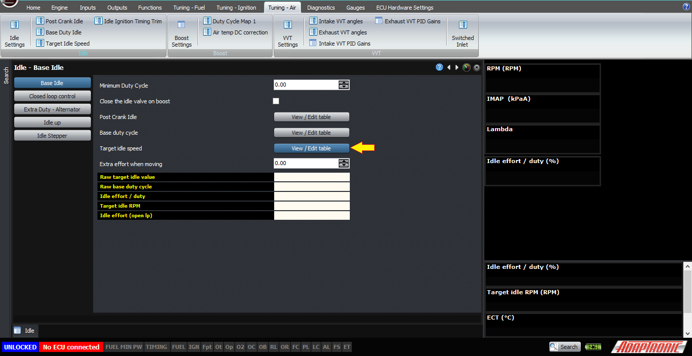

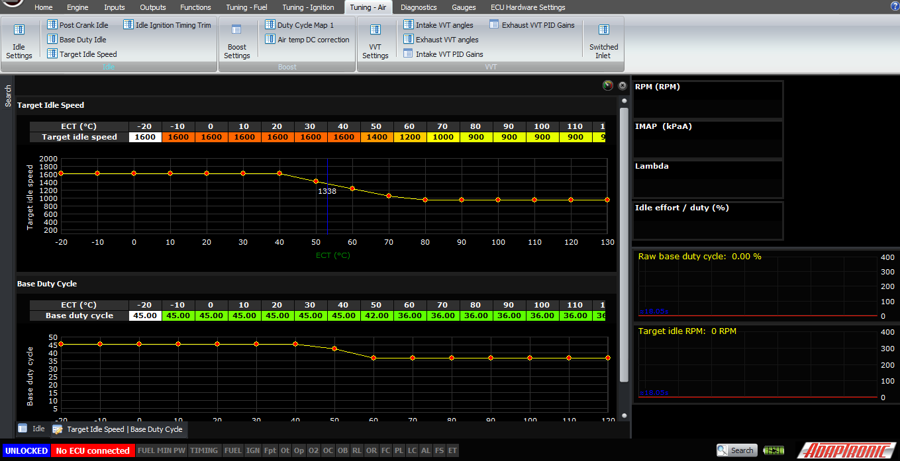
  
  
Next, we need to make sure that our closed loop
                  conditions are configured correctly. If your car has neutral
                  or clutch switches, then they can be connected to a digital
                  input and configured as “clutch” type input. Functionally they
                  mean the same thing, so they can usually be connected in
                  parallel to the one input unless you have some other reason
                  not to. If you don’t, then you will need to have a working
                  wheel speed sensor input, and there’s another article
                  explaining how to set this up.  
  

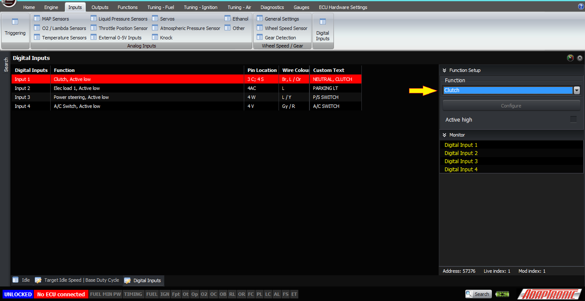
  
  
Also please check that the closed throttle flag is
                  working correctly. Sometimes aftermarket throttles get sticky
                  and don’t always return to the same position, and sometimes
                  there’s backlash between the throttle shaft and the sensor
                  which means the TPS reading doesn’t reliably go back to zero
                  when you close the throttle. Issues like this will cause
                  problems setting up closed loop idle.  
  

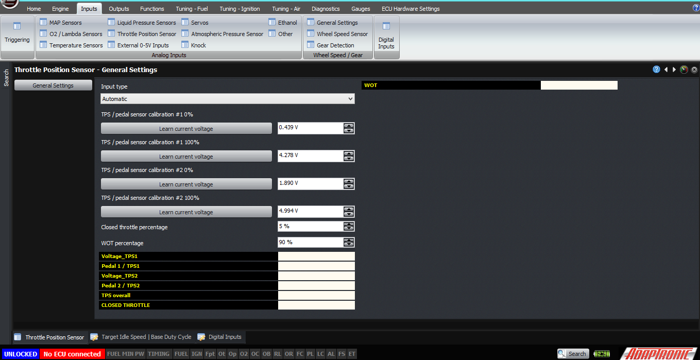
  
  
The neutral timeout has to be set, as I mentioned
                  before, about 5 seconds is a good time.  
  
Now the last settings we need to set are the PID
                  gains. I did a talk at PRI in 2016 about PID control and what
                  they all mean, so I won’t describe PID here. Typical values
                  I’ve used are 1, 2, 0.15 for PID on Mazda 13B engines, and
                  about 2, 5, 2 on Nissan RB engines.  
  

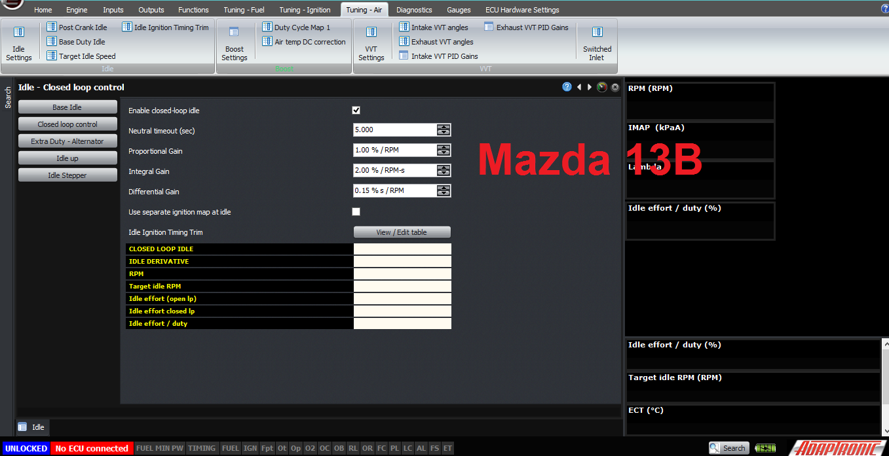

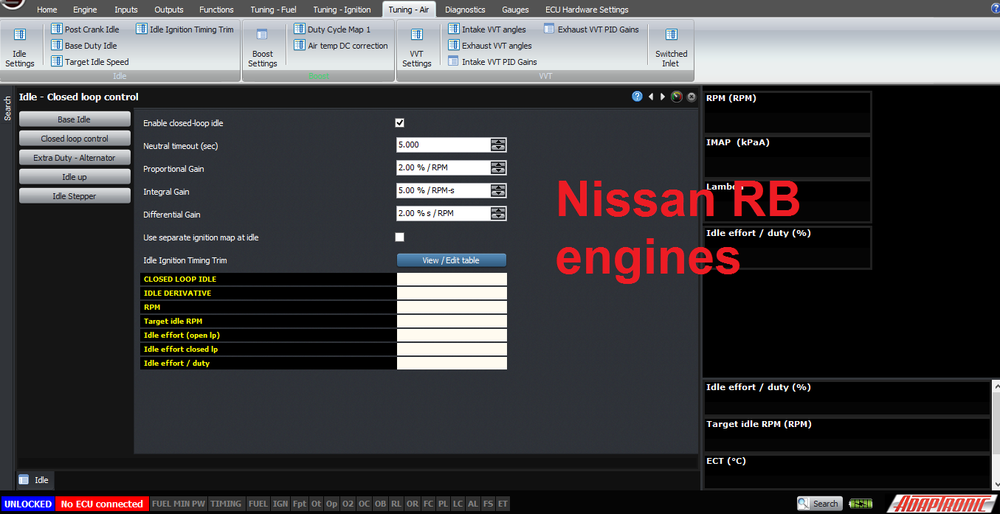
  
  
Now, the last thing I’d say is that the Modular ECU
                  actually has 2 stages of closed loop idle control, and this is
                  to help the engine come down to idle nicely. The first stage
                  is activated as soon as the throttle is closed and the car is
                  either in neutral/clutch is depressed, or the car is
                  stationary, and this called “IDLE DERIVATIVE”. If you watch
                  the flags on the closed loop idle screen, you’ll see this one
                  come on first of all, basically as soon as you take your foot
                  off the throttle on a free rev. In this condition, the ECU
                  calculates only the derivative term, not the proportional and
                  integral terms, of the PID controller. This helps the engine
                  come back to idle gently. So if the engine wants to dip or
                  stall when coming back to idle, and you’re sure that the fuel
                  map is solid on the way back to idle, then increasing the
                  differential gain can often help with this. The limit to how
                  high you can increase it will be the fact that if you increase
                  it too high, you’ll get a hunt at idle.  
  

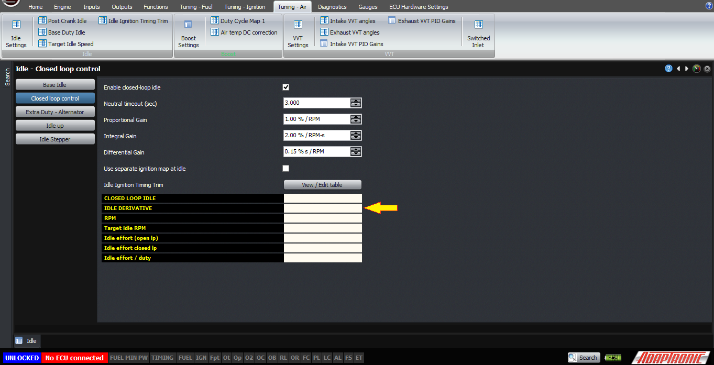
  
  
Try to get the majority of the control done with the
                  proportional term, and use the differential term to stop the
                  hunting as far as you can. Similarly increase the integral
                  term as high as you can, but you’ll be limited by hunting that
                  will occur if you increase it too high.  
  
The last point to discuss is ignition timing at
                  idle.  
  
The default operation of the ECU is that it uses the
                  main ignition map at the idle condition, just as at any other
                  condition, however when the ECU is in closed loop idle, it can
                  adjust the ignition timing to stabilise the idle speed.  
  
In this mode, the “Separate ignition timing table”
                  is deselected, and the idle ignition table is a table of the
                  ignition timing change as a function of the RPM error. RPM
                  error is defined as the actual RPM minus the target, for
                  example +200 means that the engine is 200 RPM above the
                  target.  So in general you’d have about +10° at -200 RPM,
                  sliding down to 0° at 0 RPM, and -10° at +200 RPM. I have not
                  found an engine yet whose idle smoothness did not benefit from
                  ignition timing to correct the idle speed.  
  

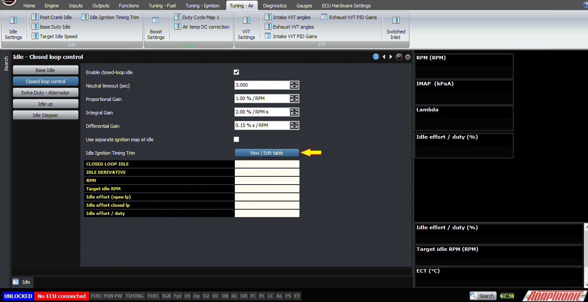

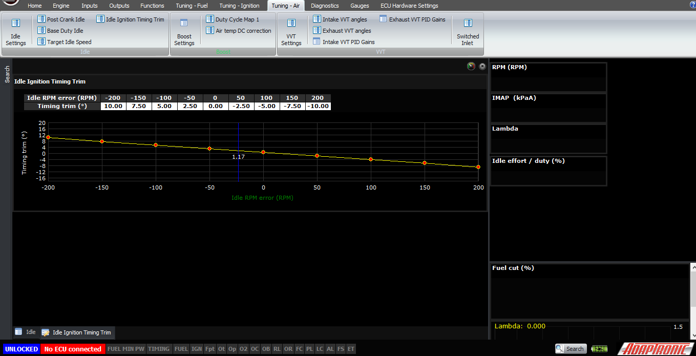
  
  
Another method, which has been requested by one of
                  our customers, is to have a “separate ignition timing table”,
                  in which case instead of making a correction to the ignition
                  map, the ECU just looks at this separate ignition timing map
                  when the ECU is in closed loop idle mode. In this case, you
                  can choose whether the timing is dependent on the actual RPM,
                  or the RPM error, and then the idle ignition timing table
                  becomes the actual ignition timing.  
  

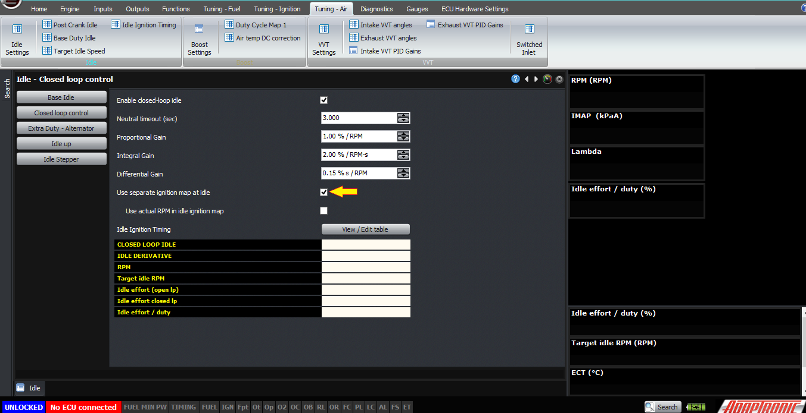

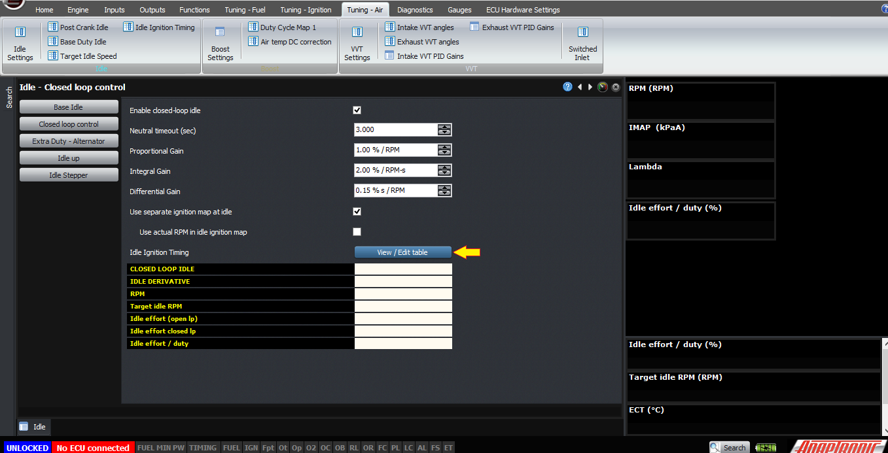

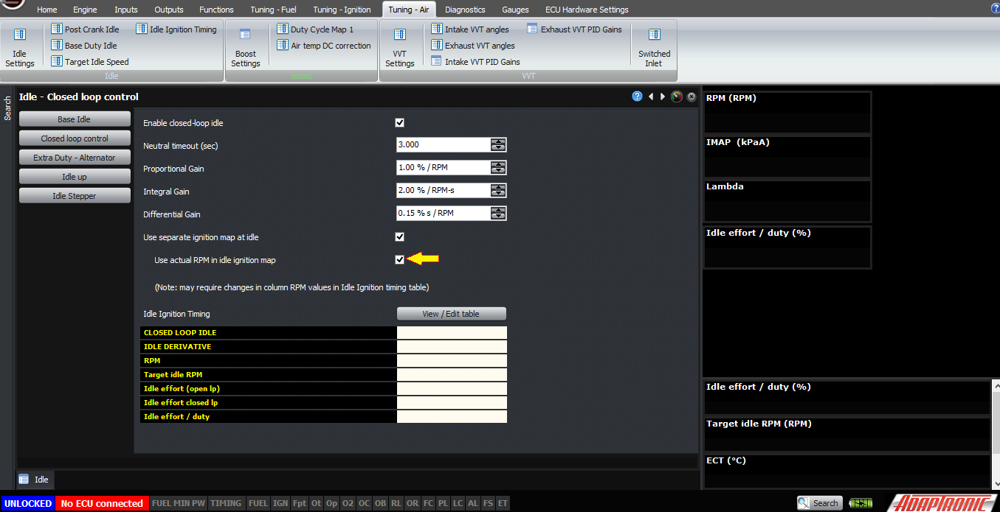
  
  
Main problems that you might encounter with setting
                  up closed loop idle are an idle hunt. In this case firstly you
                  need to ensure that it is actually caused by the idle control
                  – ie, if you disable the closed loop idle, the hunt goes away.
                  If so, that means that one or more of your PID gains are too
                  high, or possibly your D gain is too low. In this case,
                  setting PID gains to zero means that you don’t have the
                  problem, and with the PID gains you had, the problem occurs,
                  so you can find a happy median between the two.  
  

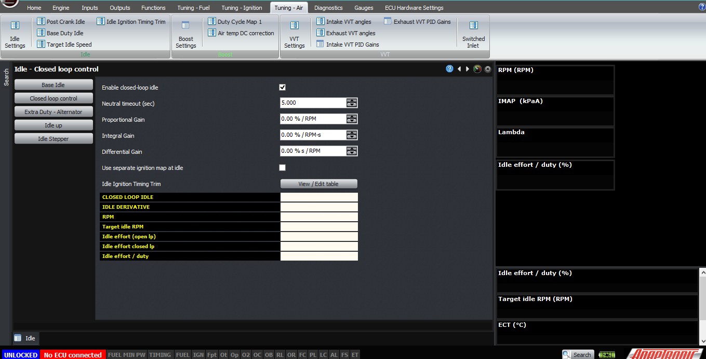
  
  
The other problem you might get is a dip or stall on
                  return to idle. For this problem, it could be caused by
                  several causes, the most likely being the fuel map being too
                  lean on return to idle. However if you take a log and see the
                  idle effort going lower than it should be and that’s what
                  causing the dip, then it’s probably going into closed loop
                  idle too early and you should try increasing the neutral
                  timeout. The other common cause is if the ECU is going into
                  closed loop idle when the engine is not idling, for example
                  throttle-off while driving as I mentioned at the start of the
                  article, in which case you need to check that your
                  neutral/clutch inputs (if available) are working correctly and
                  your vehicle speed input is also working correctly. This also
                  should be evident in the log file, because if you graph RPM
                  and idle effort, it should be obvious where you’re cruising,
                  driving with your foot off the throttle, and the idle effort
                  shouldn’t be changing during this time except for engine loads
                  like air conditioner cycling and so on. In the log you can
                  also look at the idle effort correction only due to the closed
                  loop, which should definitely not be changing during this
                  time.  
  
  
Thank you and happy learning!  
  
©2018
        Adaptronic  
  
