Different Fuel Tuning Modes on Modular ECUs/*

Copyright (c) 2008, Yahoo! Inc. All rights reserved.

Code licensed under the BSD License:

http://developer.yahoo.net/yui/license.txt

version: 2.6.0

*/

html{color:#000;background:#FFF;}body,div,dl,dt,dd,ul,ol,li,h1,h2,h3,h4,h5,h6,pre,code,form,fieldset,legend,input,textarea,p,blockquote,th,td{margin:0;padding:0;}table{border-collapse:collapse;border-spacing:0;}fieldset,img{border:0;}address,caption,cite,code,dfn,em,strong,th,var{font-style:normal;font-weight:normal;}li{list-style:none;}caption,th{text-align:left;}h1,h2,h3,h4,h5,h6{font-size:100%;font-weight:normal;}q:before,q:after{content:'';}abbr,acronym{border:0;font-variant:normal;}sup{vertical-align:text-top;}sub{vertical-align:text-bottom;}input,textarea,select{font-family:inherit;font-size:inherit;font-weight:inherit;}input,textarea,select{*font-size:100%;}legend{color:#000;}del,ins{text-decoration:none;}body{font:13px/1.231 arial,helvetica,clean,sans-serif;*font-size:small;*font:x-small;}select,input,button,textarea{font:99% arial,helvetica,clean,sans-serif;}table{font-size:inherit;font:100%;}pre,code,kbd,samp,tt{font-family:monospace;*font-size:108%;line-height:100%;}body{text-align:center;}#ft{clear:both;}#doc,#doc2,#doc3,#doc4,.yui-t1,.yui-t2,.yui-t3,.yui-t4,.yui-t5,.yui-t6,.yui-t7{margin:auto;text-align:left;width:57.69em;*width:56.25em;min-width:750px;}#doc2{width:73.076em;*width:71.25em;}#doc3{margin:auto 10px;width:auto;}#doc4{width:74.923em;*width:73.05em;}.yui-b{position:relative;}.yui-b{_position:static;}#yui-main .yui-b{position:static;}#yui-main,.yui-g .yui-u .yui-g{width:100%;}{width:100%;}.yui-t1 #yui-main,.yui-t2 #yui-main,.yui-t3 #yui-main{float:right;margin-left:-25em;}.yui-t4 #yui-main,.yui-t5 #yui-main,.yui-t6 #yui-main{float:left;margin-right:-25em;}.yui-t1 .yui-b{float:left;width:12.30769em;*width:12.00em;}.yui-t1 #yui-main .yui-b{margin-left:13.30769em;*margin-left:13.05em;}.yui-t2 .yui-b{float:left;width:13.8461em;*width:13.50em;}.yui-t2 #yui-main .yui-b{margin-left:14.8461em;*margin-left:14.55em;}.yui-t3 .yui-b{float:left;width:23.0769em;*width:22.50em;}.yui-t3 #yui-main .yui-b{margin-left:24.0769em;*margin-left:23.62em;}.yui-t4 .yui-b{float:right;width:13.8456em;*width:13.50em;}.yui-t4 #yui-main .yui-b{margin-right:14.8456em;*margin-right:14.55em;}.yui-t5 .yui-b{float:right;width:18.4615em;*width:18.00em;}.yui-t5 #yui-main .yui-b{margin-right:19.4615em;*margin-right:19.125em;}.yui-t6 .yui-b{float:right;width:23.0769em;*width:22.50em;}.yui-t6 #yui-main .yui-b{margin-right:24.0769em;*margin-right:23.62em;}.yui-t7 #yui-main .yui-b{display:block;margin:0 0 1em 0;}#yui-main .yui-b{float:none;width:auto;}.yui-gb .yui-u,.yui-g .yui-gb .yui-u,.yui-gb .yui-g,.yui-gb .yui-gb,.yui-gb .yui-gc,.yui-gb .yui-gd,.yui-gb .yui-ge,.yui-gb .yui-gf,.yui-gc .yui-u,.yui-gc .yui-g,.yui-gd .yui-u{float:left;}.yui-g .yui-u,.yui-g .yui-g,.yui-g .yui-gb,.yui-g .yui-gc,.yui-g .yui-gd,.yui-g .yui-ge,.yui-g .yui-gf,.yui-gc .yui-u,.yui-gd .yui-g,.yui-g .yui-gc .yui-u,.yui-ge .yui-u,.yui-ge .yui-g,.yui-gf .yui-g,.yui-gf .yui-u{float:right;}.yui-g div.first,.yui-gb div.first,.yui-gc div.first,.yui-gd div.first,.yui-ge div.first,.yui-gf div.first,.yui-g .yui-gc div.first,.yui-g .yui-ge div.first,.yui-gc div.first div.first{float:left;}.yui-g .yui-u,.yui-g .yui-g,.yui-g .yui-gb,.yui-g .yui-gc,.yui-g .yui-gd,.yui-g .yui-ge,.yui-g .yui-gf{width:49.1%;}.yui-gb .yui-u,.yui-g .yui-gb .yui-u,.yui-gb .yui-g,.yui-gb .yui-gb,.yui-gb .yui-gc,.yui-gb .yui-gd,.yui-gb .yui-ge,.yui-gb .yui-gf,.yui-gc .yui-u,.yui-gc .yui-g,.yui-gd .yui-u{width:32%;margin-left:1.99%;}.yui-gb .yui-u{*margin-left:1.9%;*width:31.9%;}.yui-gc div.first,.yui-gd .yui-u{width:66%;}.yui-gd div.first{width:32%;}.yui-ge div.first,.yui-gf .yui-u{width:74.2%;}.yui-ge .yui-u,.yui-gf div.first{width:24%;}.yui-g .yui-gb div.first,.yui-gb div.first,.yui-gc div.first,.yui-gd div.first{margin-left:0;}.yui-g .yui-g .yui-u,.yui-gb .yui-g .yui-u,.yui-gc .yui-g .yui-u,.yui-gd .yui-g .yui-u,.yui-ge .yui-g .yui-u,.yui-gf .yui-g .yui-u{width:49%;*width:48.1%;*margin-left:0;}.yui-g .yui-g .yui-u{width:48.1%;}.yui-g .yui-gb div.first,.yui-gb .yui-gb div.first{*margin-right:0;*width:32%;_width:31.7%;}.yui-g .yui-gc div.first,.yui-gd .yui-g{width:66%;}.yui-gb .yui-g div.first{*margin-right:4%;_margin-right:1.3%;}.yui-gb .yui-gc div.first,.yui-gb .yui-gd div.first{*margin-right:0;}.yui-gb .yui-gb .yui-u,.yui-gb .yui-gc .yui-u{*margin-left:1.8%;_margin-left:4%;}.yui-g .yui-gb .yui-u{_margin-left:1.0%;}.yui-gb .yui-gd .yui-u{*width:66%;_width:61.2%;}.yui-gb .yui-gd div.first{*width:31%;_width:29.5%;}.yui-g .yui-gc .yui-u,.yui-gb .yui-gc .yui-u{width:32%;_float:right;margin-right:0;_margin-left:0;}.yui-gb .yui-gc div.first{width:66%;*float:left;*margin-left:0;}.yui-gb .yui-ge .yui-u,.yui-gb .yui-gf .yui-u{margin:0;}.yui-gb .yui-gb .yui-u{_margin-left:.7%;}.yui-gb .yui-g div.first,.yui-gb .yui-gb div.first{*margin-left:0;}.yui-gc .yui-g .yui-u,.yui-gd .yui-g .yui-u{*width:48.1%;*margin-left:0;} .yui-gb .yui-gd div.first{width:32%;}.yui-g .yui-gd div.first{_width:29.9%;}.yui-ge .yui-g{width:24%;}.yui-gf .yui-g{width:74.2%;}.yui-gb .yui-ge div.yui-u,.yui-gb .yui-gf div.yui-u{float:right;}.yui-gb .yui-ge div.first,.yui-gb .yui-gf div.first{float:left;}.yui-gb .yui-ge .yui-u,.yui-gb .yui-gf div.first{*width:24%;_width:20%;}.yui-gb .yui-ge div.first,.yui-gb .yui-gf .yui-u{*width:73.5%;_width:65.5%;}.yui-ge div.first .yui-gd .yui-u{width:65%;}.yui-ge div.first .yui-gd div.first{width:32%;}#bd:after,.yui-g:after,.yui-gb:after,.yui-gc:after,.yui-gd:after,.yui-ge:after,.yui-gf:after{content:".";display:block;height:0;clear:both;visibility:hidden;}#bd,.yui-g,.yui-gb,.yui-gc,.yui-gd,.yui-ge,.yui-gf{zoom:1;}h1 {
  font-size: 138.5%;
}

h2 {
  font-size: 123.1%;
}

h3 {
  font-size: 108%;
}

h1, h2, h3 {
  margin-top: 1em;
  margin-right: 0px;
  margin-bottom: 1em;
  margin-left: 0px;
}

h1, h2, h3, h4, h5, h6, strong {
  font-weight: bold;
}

abbr, acronym {
  border-bottom-width: 1px;
  border-bottom-style: dotted;
  border-bottom-color: black;
  cursor: help;
}

em {
  font-style: italic;
}

blockquote, ul, ol, dl {
  margin-top: 1em;
  margin-right: 1em;
  margin-bottom: 1em;
  margin-left: 1em;
}

ol, ul, dl {
  margin-left: 2em;
}

ol li {
  list-style-type: decimal;
  list-style-image: none;
  list-style-position: outside;
}

ul li {
  list-style-type: disc;
  list-style-image: none;
  list-style-position: outside;
}

dl dd {
  margin-left: 1em;
}

th, td {
  border-top-width: 1px;
  border-right-width: 1px;
  border-bottom-width: 1px;
  border-left-width: 1px;
  border-top-style: solid;
  border-right-style: solid;
  border-bottom-style: solid;
  border-left-style: solid;
  border-top-color: black;
  border-right-color: black;
  border-bottom-color: black;
  border-left-color: black;
  -moz-border-top-colors: none;
  border-top-colors: none;
  -moz-border-right-colors: none;
  border-right-colors: none;
  -moz-border-bottom-colors: none;
  border-bottom-colors: none;
  -moz-border-left-colors: none;
  border-left-colors: none;
  border-image-source: none;
  border-image-slice: 100% 100% 100% 100%;
  border-image-width: 1 1 1 1;
  border-image-outset: 0 0 0 0;
  border-image-repeat: stretch stretch;
  padding-top: 0.5em;
  padding-right: 0.5em;
  padding-bottom: 0.5em;
  padding-left: 0.5em;
}

th {
  font-weight: bold;
  text-align: center;
}

caption {
  margin-bottom: 0.5em;
  text-align: center;
}

p, fieldset, table, pre {
  margin-bottom: 1em;
}

input[type="text"], input[type="password"], textarea {
  width: 12.25em;
}

.navbar {
  background-color: black;
  color: white;
  font-size: smaller;
}

.Pagetitle {
  font-size: large;
  font-weight: bold;
}

.navbar:hover {
  font-weight: normal;
}

#downloads:hover {
  font-weight: normal !important;
  font-size: smaller !important;
}

.contact:hover {
  font-weight: bolder;
}

.downloads:hover {
  font-weight: bolder;
}

.store:hover {
  font-weight: bolder;
}

.downloads {
  font-weight: normal;
}

.store {
  font-weight: normal;
}

.contact {
  font-weight: normal;
}

.versionnum {
  font-size: large;
  color: black;
  font-weight: bold;
}

.releasedate {
  font-size: small;
  font-style: italic;
  color: black;
}

.releasecontent {
  font-size: medium;
}

.modrev {
  font-style: normal;
  font-weight: normal;
  font-size: small;
  color: #3333ff;
}

.selectrev {
  font-weight: normal;
  font-style: normal;
  color: #3333ff;
  font-size: small;
}

.yui-u {
  font-size: medium;
}

.backhome {
  font-size: smaller;
}

.latestrev {
  font-size: smaller;
}

.bodytxt1 {
  font-size: xx-small;
}  
  
[DOWNLOADS](#)[STORE](#)[CONTACT US](#)  
  

Different Fuel Tuning Modes on Modular ECUs

[go back to
                support home](EN_EUGENE_MOD_HOME.md)

  

[Fuel
                Pump and EFI Relay Output  

              ](EN_MOD_017_FUELPUMPEFIRELAY.md)

[Fuel
                Model  

              ](EN_MOD_029_FUELMODEL.md)

  

[  

              ](EN_SelFW.md)

  

  
  
  
  
  
There are many different ways that ECUs can
                  calculate the fuel requirement of an engine. On the Modular
                  ECUs this is part of the fuel map setting, so in a dual map
                  mode, you have the option for different calculation methods
                  between fuel maps 1 and 2. We will describe this as though
                  you’re only changing it for fuel map 1, but it applies equally
                  for fuel map2.  
  
The Modular ECUs operate on the volumetric
                  efficiency tuning principle. For those not familiar with this,
                  I did a talk about this at PRI in 2016, but I will be doing
                  another video in this style to explain it with specific
                  reference to the Modular ECU.  
  
So the whole purpose of the tuning mode selection is
                  to tell the ECU how to work out the volumetric efficiency.  
  
There are currently 4 modes supported, and these are
                  selected by the “operator” selection in the fuel map settings.
                  They are:  

- MAP
- TPS
- MAP x TPS
- MAP + TPS  
Let’s take a step back and look at what affects the
                  volumetric efficiency of an engine. Firstly, we all know that
                  RPM affects volumetric efficiency, because otherwise the
                  torque curve would be a flat line, so that must be one
                  variable of the fuel map. The other variable that affects the
                  volumetric efficiency is the pressure ratio across the engine.
                  Why is this?  
  
For the sake of simplicity we’ll just talk about 4
                  stroke piston engines because they are easiest to visualise.
                  The same principles apply to 2 stroke piston engines and
                  rotaries though. We’re all familiar with the 4-stroke cycle,
                  induction, compression, expansion (or power, combustion) and
                  exhaust. At the end of the exhaust stroke, the clearance
                  volume at the top of the chamber is filled with exhaust gas,
                  and the gas is actually at the exhaust manifold pressure. On a
                  naturally aspirated engine with a free flowing exhaust, you
                  can consider this to be atmospheric pressure. On a
                  turbocharged engine, this pressure will be higher than
                  atmospheric pressure so that there is a pressure drop across
                  the turbine to make it spin.  
  
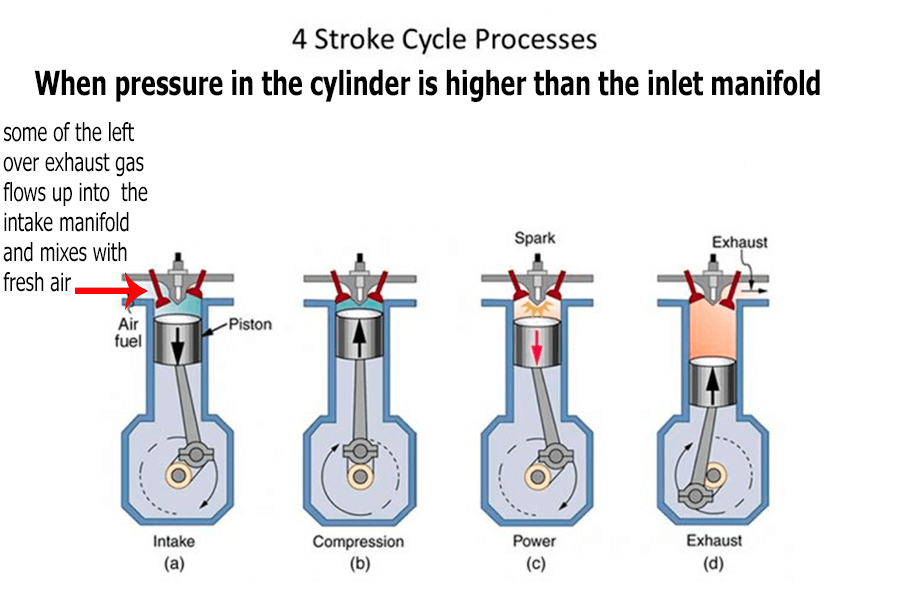  
  
When the inlet valve opens, what happens next
                  depends on the pressure ratio across the inlet valve. If the
                  pressure in the cylinder is higher than in the inlet manifold,
                  some of the left over exhaust gas flows up into the intake
                  manifold and mixes with the fresh air coming in. The result
                  then is that the air that’s actually sucked into the engine
                  (or pushed in by the atmospheric air pressure) is diluted with
                  exhaust gas, and that has the effect of reducing the
                  volumetric efficiency. If they are at approximately the same
                  pressure, for example on a naturally aspirated engine at wide
                  open throttle, then very little gas transfer occurs and the
                  cylinder sucks in approximately its swept volume in fresh air,
                  with an amount of left over exhaust gas from the previous
                  cycle consistent with the clearance volume. In the other case,
                  if the inlet pressure is higher than the exhaust pressure, for
                  example a supercharged engine at wide open throttle, you can
                  open both the inlet and exhaust valves at the same time and
                  the higher inlet pressure can blow the remaining exhaust gas
                  out the exhaust port. This procedure is called “blowing down”,
                  and has the effect of increasing the volumetric efficiency,
                  possibly to a value higher than 100%.  
  
The reason that it’s the pressure ratio across the
                  inlet port that makes the difference rather than a pressure
                  difference is that if you research the orifice plate equation,
                  you’ll find that the equations work out to give a pressure
                  ratio, rather than a pressure drop. This makes sense
                  intuitively, for example if you have a pressure drop of 2 PSI
                  across an intercooler at 15 PSI boost, it would be pretty
                  naïve to think that you’d have the same drop of 2 PSI when you
                  try to force 30 PSI through it.  
  
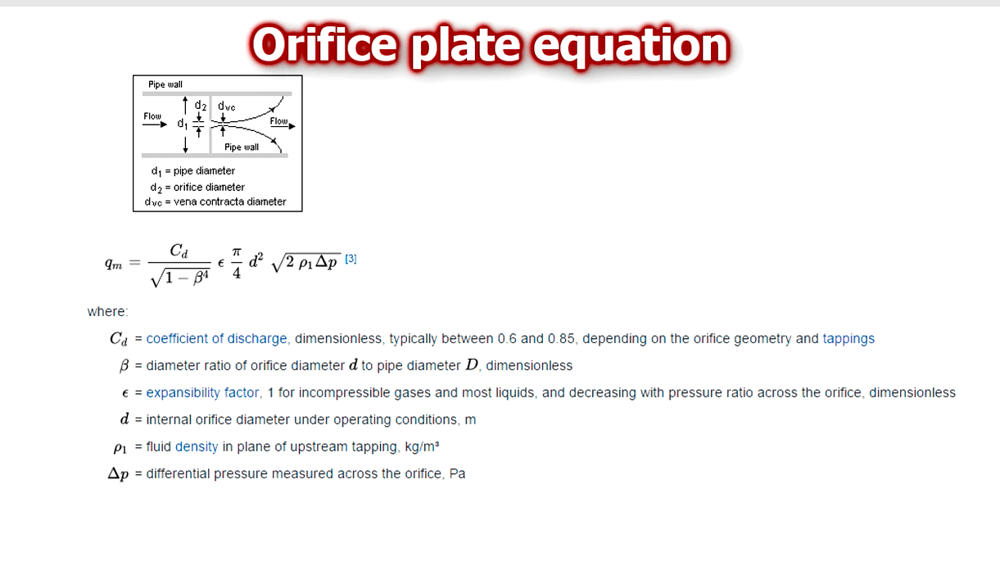  
  
So this means that the volumetric efficiency is
                  mostly dependent on the pressure ratio, which means IMAP /
                  EMAP, intake manifold absolute pressure divided by exhaust
                  manifold absolute pressure. This can be achieved, or
                  approximated, in a few different ways:  

- Direct measurement. This requires an inlet and
                      exhaust manifold pressure sensors. I describe how to
                      configure these in the inputs and sensor configuration
                      video, including some considerations for EMAP sensors, so
                      I won’t repeat them here. This is the best method, and
                      automagically compensates for barometric pressure changes,
                      different turbochargers, exhaust restrictions and so on.
                      For example on a conventional MAP tuned car, if you change
                      to a less restrictive intercooler, then at the same MAP,
                      the turbocharger needs to generate less boost because
                      there’s less pressure drop. Therefore it requires less
                      exhaust back pressure (EMAP), because it needs to make
                      less boost. Therefore the engine will “breathe” better and
                      make more power at the same boost level, and if the car
                      was tuned on MAP then you would need to retune it. If the
                      car was tuned by IMAP / EMAP, no change to the tune is
                      required.  
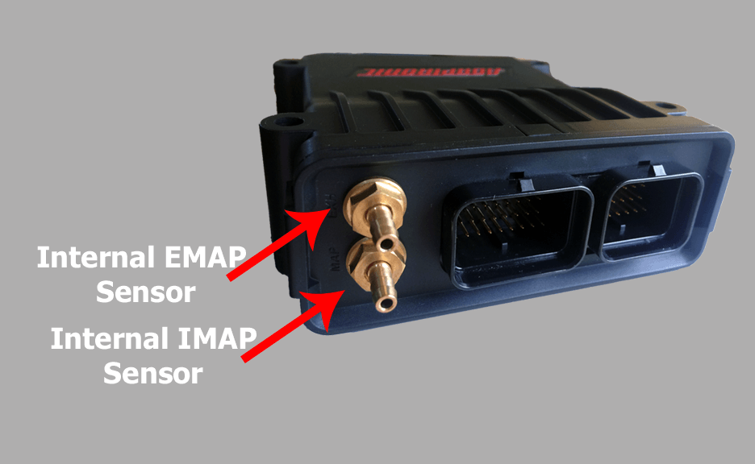  

- Assume that EMAP is the barometric pressure.
                      This is fine if you know your exhaust is not very
                      restrictive, which means you can’t have a turbocharged
                      engine.
- Just tune based on MAP. This has the limitation
                      I mentioned above.
- Some tuners like to use MGP instead of MAP,
                      claiming that it compensates for barometric pressure
                      automagically. The method the reflects the physics is IMAP
                      / EMAP, so the question is really how accurately does IMAP
                      – EMAP (which is MGP) approximate IMAP / EMAP? Well, at
                      WOT it’s 100% accurate. At high vacuum it’s very
                      inaccurate, and MAP is a much better estimate. On boost,
                      MGP is more accurate than MAP.In this following graph, the
                      grey line (pressure ratio) shows what the engine is
                      actually doing. The blue line is the position in the fuel
                      map that the ECU would look at if you used MAP as your
                      load lookup, and orange is what the ECU would look at if
                      it used MGP as the load lookup.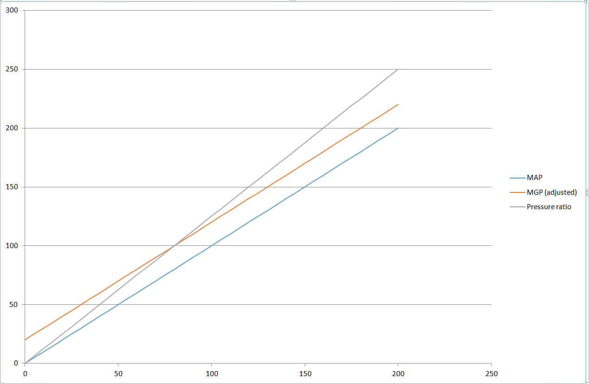This
                      example is with 80 kPa barometric pressure instead of 100.
                      You can see that above about 40 kPa, MGP is closer to the
                      line than MAP. At vacuum, MAP is closer.  
You also need to remember that the VE map of an
                  engine is not flat at a constant RPM.  
  
You can see from this map that the VE changes a lot
                  more at high vacuum conditions than close to atmospheric and
                  above. For example in this map, whether the ECU sees the 100
                  kPa site or the 125 kPa site makes no difference to the VE.
                  Remember that the load axis is separate from the MAP factor in
                  the VE equation anyway, so it’s only the difference in VE that
                  we’re looking at.  
  
Engines with individual throttle bodies present a
                  different challenge because the air does not settle fully
                  between the throttle bodies and the engine. You can measure
                  the pressure at the port, and you can even (and you should)
                  take multiple ports and join them together to get a more
                  accurate reading. However at part throttle, and especially at
                  higher engine speeds, the pressure that you measure at the
                  ports will over-estimate the amount of air the engine is
                  ingesting. So effectively, the engine’s volumetric efficiency
                  changes with throttle position.  
  
I have also met tuners who have said that on a
                  single throttle engine with a large plenum, and the engine has
                  a large overlap duration and produces little vacuum at idle,
                  they can not get a good tune on pressure or pressure ratio
                  alone, and they need to be tuned on throttle position. I
                  haven’t witnessed this myself and I’ve set up and tuned plenty
                  of engines that make very little vacuum at idle, but again I’m
                  open to more information about this and we offer TPS tuning if
                  that’s what you want to do as a tuner.  
  
Now that we have an understanding of what engines
                  actually want, we can look at the different modes, selected by
                  the “Operator” setting.  
  
The first one, and the most basic, is MAP only. This
                  is the one that the majority of people will use, and it’s what
                  you’d use on a standard engine with a single throttle and a
                  plenum. In this mode, you have one fuel map, which has RPM on
                  one axis and pressure on the other.  
  
The pressure axis is selected in the “pressure
                  selection” setting. This can be either IMAP, or IMAP / EMAP or
                  MGP. These affect the scaling of the load axis of the pressure
                  map. The pressure map can be up to 31 x 31 and the points can
                  be arbitrarily spaced and changed in real time as the engine
                  is running.  
  
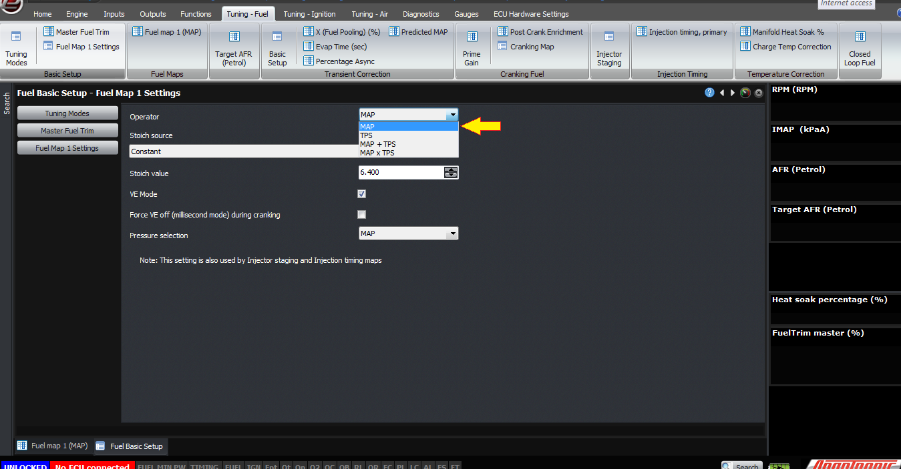  
  
(1) Select operator  
  
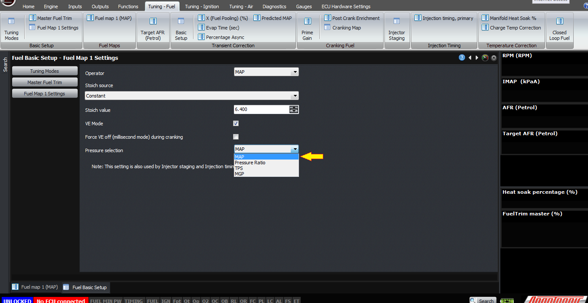  
  
(2) Choose preferred “pressure selection”  
  
If you have a naturally aspirated engine which
                  either has individual throttles, or an inlet without a decent
                  plenum, then you might want to use TPS instead of MAP. So when
                  you select TPS instead of MAP, the pressure map disappears and
                  instead you have TPS map against RPM. This can be a maximum
                  size of 15 x 31 data points and they can be all arbitrarily
                  spaced. Since it’s a VE map, the actual MAP will still be used
                  as part of the fuel calculation, as will temperature, stoich
                  ratio and target lambda.  
  
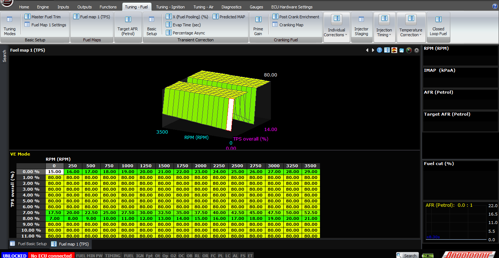  
  
Operator is set to TPS. Fuel map has TPS against RPM  
  
If you have an engine like the above, but it has
                  forced induction, then we recommend using MAP x TPS mode. This
                  is what you would use on an RB26DETT GTR engine for example,
                  or a turbocharged semi peripheral 13B with staged throttles.  
  
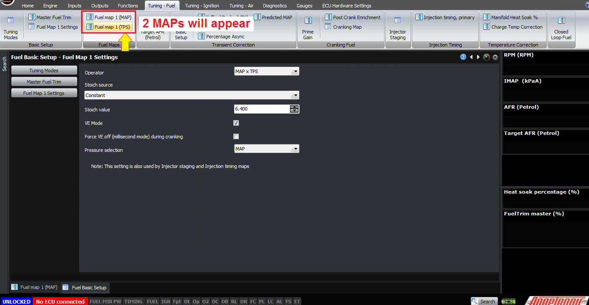  
  
In this mode, the way we generally recommend to tune
                  is to use the pressure selection to be MAP, and set the entire
                  pressure map to be 100. Then do the tune on the TPS map up to
                  wastegate boost pressure – after that you can wind up the
                  boost and make any corrections on the pressure map. The
                  calculation is very simple, it’s just a multiplication of the
                  two maps. For example you are at 2000 RPM, 20% throttle and 90
                  kPa MAP, then the ECU will look up the 2000 RPM, 20% TPS
                  point, which might be say 60% – and the 2000 RPM, 90 kPa point
                  in the pressure map which might be say 90%, and then the
                  overall VE calculated is 60% x 90% which is 54%.  
  
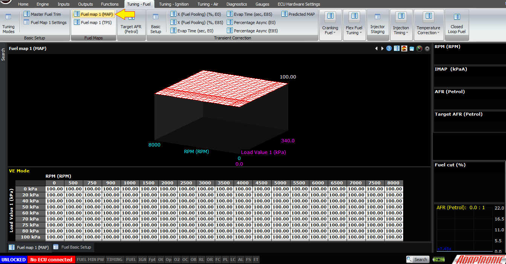  
  
There is a final mode called MAP + TPS, which is the
                  same as MAP x TPS but the two numbers are added instead of
                  multiplied. I don’t know a circumstance where that would be
                  useful but we’ve had a few requests for it so it’s been
                  included.  
  
For all of these, the VE mode should be selected. If
                  you do not select VE mode, then the maps become millisecond
                  maps instead of VE maps. The injector model will not be
                  followed, you will need to do all the temperature correction
                  the old fashioned way and we highly recommend against not
                  using VE mode because basically you’ll be re-implementing
                  every already built into the ECU.  
  
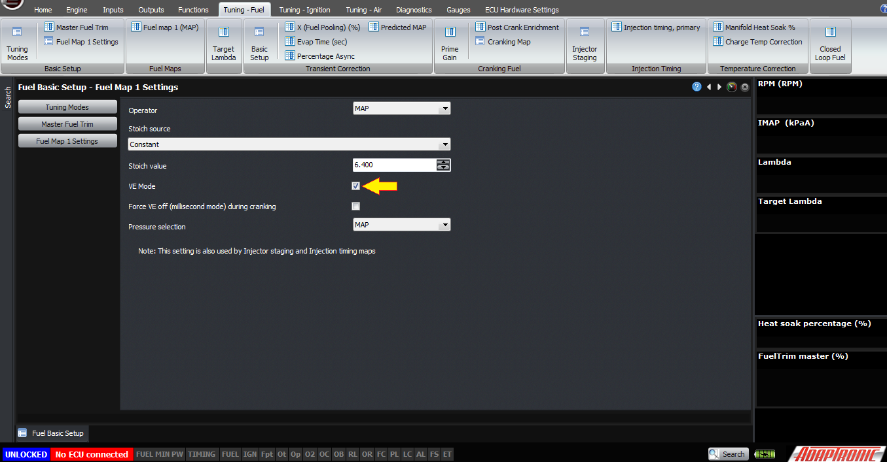  
  
Just a few miscellaneous points now.  
  
Firstly, the stoichiometric ratio has to be set for
                  the fuel that you’re running. The dual fuel maps mean that you
                  can run a separate fuel in each map and therefore have a
                  different stoich ratio for each. There will be a separate
                  article for setting up flex fuel mode.  
  
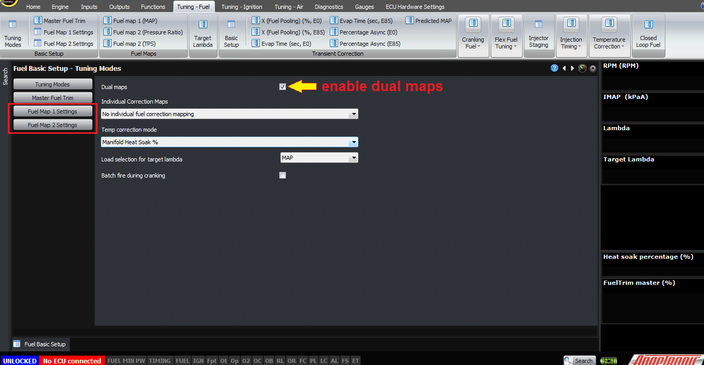  
  
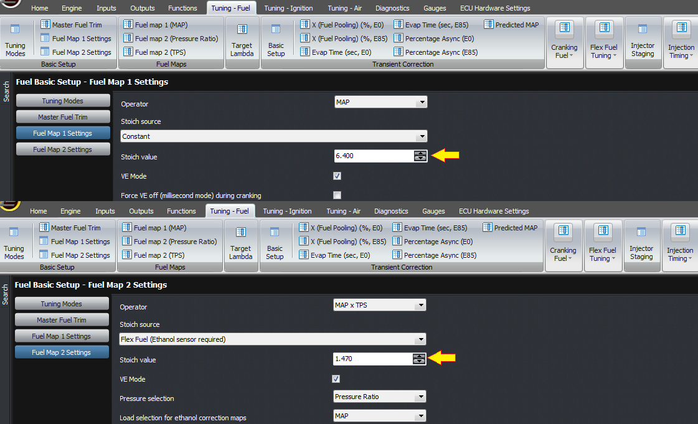  
  
stoich value for each map can be changed  
  
Secondly, under the global tuning modes, you can
                  select the axis for target lambda, being TPS or IMAP, and also
                  you can enable the individual fuel correction maps. If you
                  enable the individual maps, then you can select the axis for
                  them as being either IMAP or TPS, and then  you can map
                  the individual fuel corrections for each cylinder or rotor.  
  
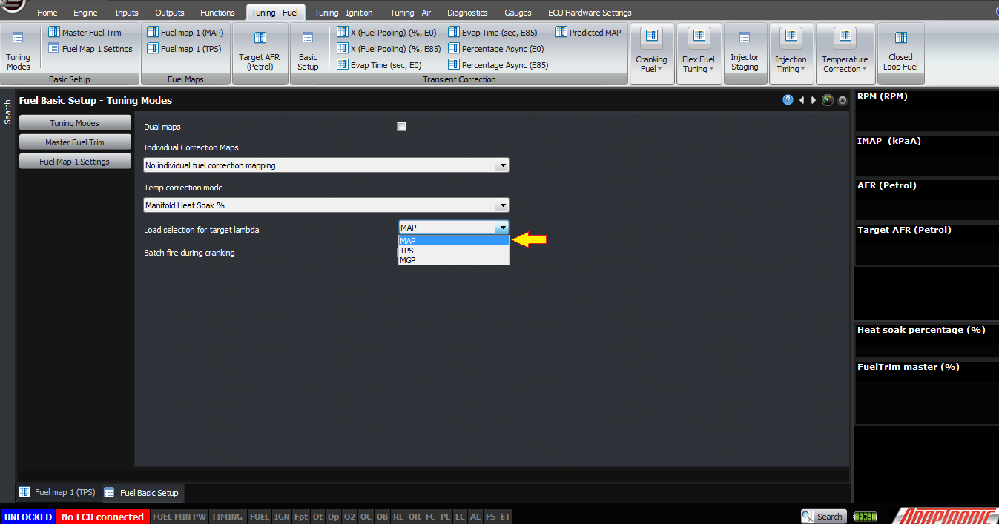  
  
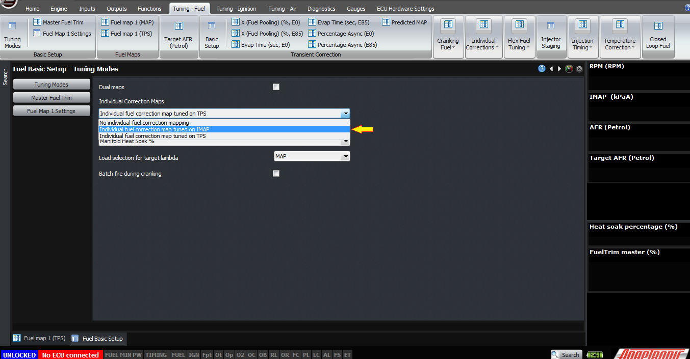  
Thank you and happy learning!  
©2018
        Adaptronic  
