  
  
  
  
  
  
[DOWNLOADS](#)[STORE](#)[CONTACT US](#)  
  
  
  
  
  
  

Fuel Model in Modular ECUs

[go back to
                support home](EN_EUGENE_MOD_HOME.md)  

  
  
  

[Different
                Fuel Tuning Modes](EN_MOD_027_FUELTUNINGMODES.md)

[How
                Fuel Mass is Converted to Milliseconds  

              ](EN_MOD_032_INJECTORMODEL.md)

  

[  

              ](EN_SelFW.md)

  

  
  
  
  
  
  
  
  
Hello all, in this article I’ll describe the fuel model in the
                Modular ECUs. This is based on a talk that I gave at PRI in
                2016, but in this talk I’ll talk specifically about where the
                settings are for the Modular ECU. In this talk I’m only talking
                about steady state tuning. However you need to understand this
                to be able to learn about transient fueling, and injector
                modelling. So if you like this is the first part of my PRI talk,
                but with specific reference to the Modular ECU settings.  
  
We’ve all seen the famous Greg Banish, Calibrated Success
                T-shirt which you can buy from Summit Racing, and I’m wearing
                mine now actually. I’m not sure I understand whether Mr Banish
                was expressing frustrating saying that it’s simple, why don’t
                people understand it – or if he’s making a joke and saying that
                actually there are many different terms in this equation, and if
                you don’t understand them all then you can get lost quickly. But
                either way, if it looks intimidating to you now, you’ll
                understand it in about twenty minutes so don’t worry.  
  

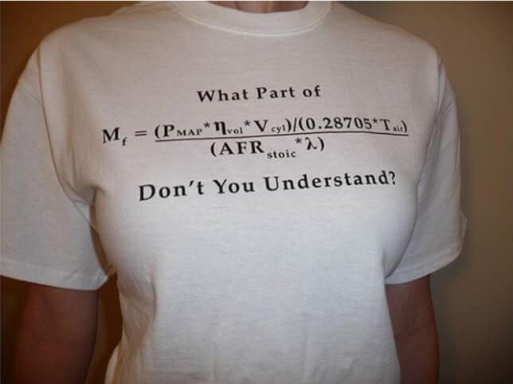
  
  
Let’s talk firstly about the way that we and other ECU
                manufacturers used to do things, and hopefully you’ll see why
                we’ve changed to a proper fuel model now. Firstly, what is the
                purpose of the injector control in the ECU? It’s to get the
                right amount of fuel into the engine, to achieve a particular
                lambda…. when the tuner isn’t there to correct it! That means
                that we’re trying to control the injectors and deal with all the
                different conditions that will occur that will affect the
                lambda, if we don’t care about them.  
  
The fuel requirement of an engine varies mostly with manifold
                pressure, and to a lesser extent it varies with RPM. The obvious
                way is therefore to have a table of millisecond values as a
                function of both MAP and RPM, and we’d call this a fuel map. And
                this works quite well, so long as all the other variables are
                constant.  
  
So which variables are not included in this calculation, and
                we’re assuming are constant, but actually are not constant? When
                I did this at PRI I let people call them out and I threw Tim
                Tams to people who answered, but I can’t do this here so I’ll
                just tell you the list I came up with:  

- Temperatures – coolant, air, fuel
- Fuel pressure
- Battery voltage
- Fuel composition (ethanol vs petrol)
- Injector type  
Now, I realise that the Injector Type isn’t really a variable,
                because it’s supposed to be something that’s installed on the
                car before you do a tune. And there is some case to say that it
                would be nice to be able to change injectors and not have to do
                a complete return. But that’s not the main point. The main point
                is that often tuners tend to specialise in particular engine
                types, and end up developing a decent library of maps for these
                engines in which they specialise. However often they don’t get
                to choose the injectors on the engine when they have to tune it,
                so they don’t get to use one of their maps from their library
                because the milliseconds are all wrong.  
  
So to deal with these variables, what ECU manufacturers
                (including us) used to do is to add in “compensation tables” for
                all of these variables. For example to deal with battery voltage
                changes, old ECUs had a “battery voltage compensation table”
                where you could enter a number of milliseconds to add to the
                injector duration as a function of battery voltage.  
  
Now, as a tuner, how do you know how to set this table? How many
                tuners are going to run the EFI system off a variable power
                supply and wind it up and down, adjusting the table so that the
                AFR at idle is constant? I don’t know many tuners who would do
                that.  
  
Similarly for temperature changes, you have separate tables for
                coolant temperature and air temperature, which makes life very
                complicated. How do you know if it’s the air or the coolant
                table which is wrong, for example? In general the more
                correction tables that you have, the harder it is to know which
                table needs to be adjusted, and the longer it takes. And to be
                honest, if you have all these compensation tables to account for
                incorrect assumptions you’ve made about other variables being
                constant, maybe your model isn’t that good in the first place.
                As in, maybe having a millisecond map against RPM and MAP isn’t
                the right way to do it.  
  
So let’s go back to chemistry and physics and work it out from
                first principles instead of making these assumptions.  
  

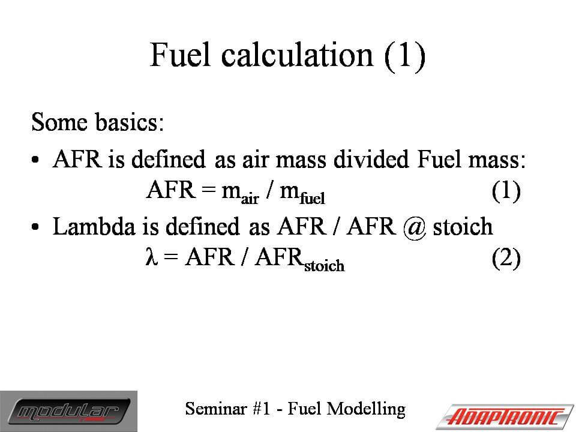
  
  
This is just the definition of an Air-Fuel ratio, and the
                definition of Lambda.  
  

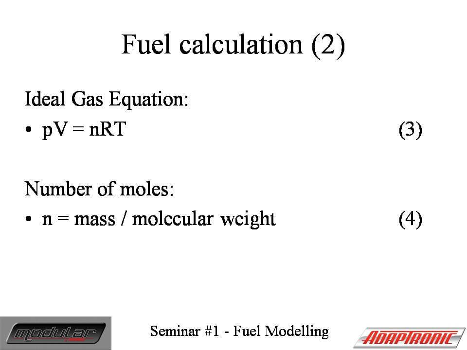
  
  
The top one is called the Ideal Gas Equation or Boyle’s Law, and
                it’s given by the pressure times the volume equals the number of
                moles times the ideal gas constant times the temperature. Note
                that the pressure and temperature in this equation are absolute
                temperature and pressure.  
  
The second one is the conversion between number of moles into
                mass, based on the molecular weight of the gas. A mole is
                defined as approximately 6.022 x 10^23 molecules in this case.
                We don’t count the molecules, we just work it out from the
                weight and knowing what air is made of.  
  

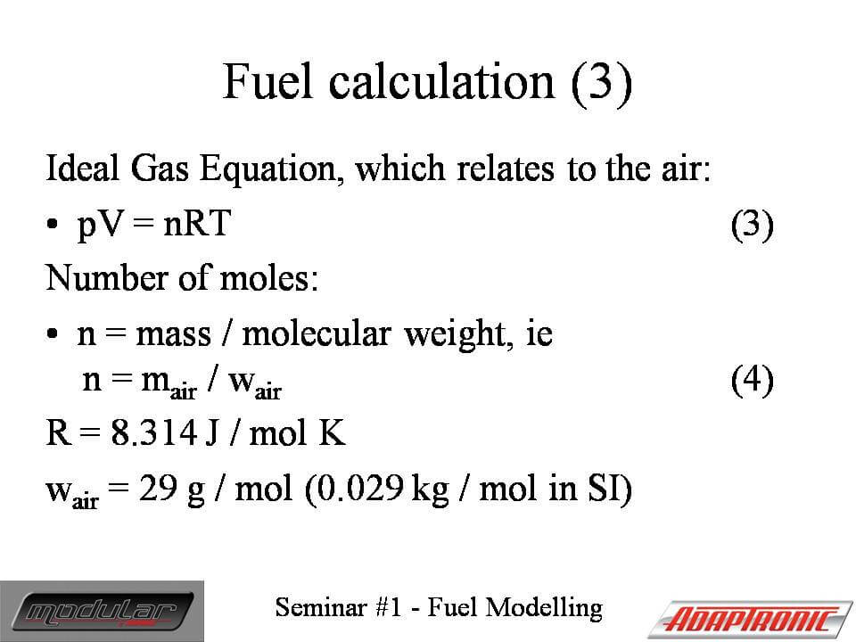

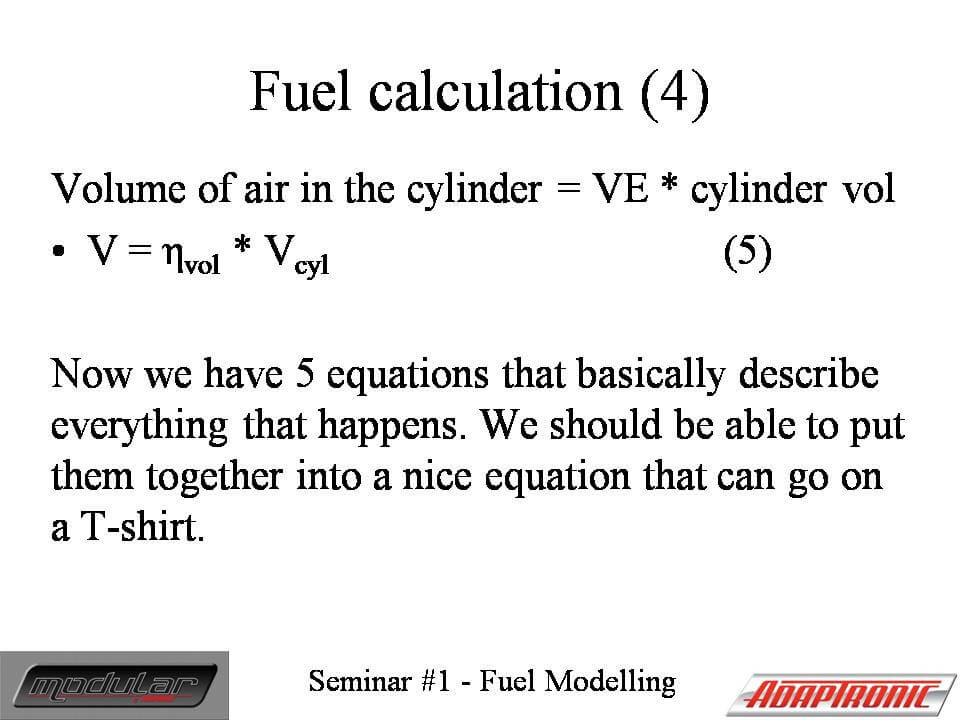
  
  
This is the definition of volumetric efficiency. It’s given by
                that Greek letter Neta, which looks like n, which is the
                thermodynamic symbol for efficiency, and it’s given by the ratio
                of the effective volume of air that travels through the inlet
                valve into the cylinder, if it was the same pressure as in the
                manifold, divided by the swept volume of the cylinder. In
                practice of course the volume expands or compresses to fit in
                the cylinder anyway, so it’s the pressure that changes, not the
                volume, but volumetric efficiency is a way to think of it.  
  

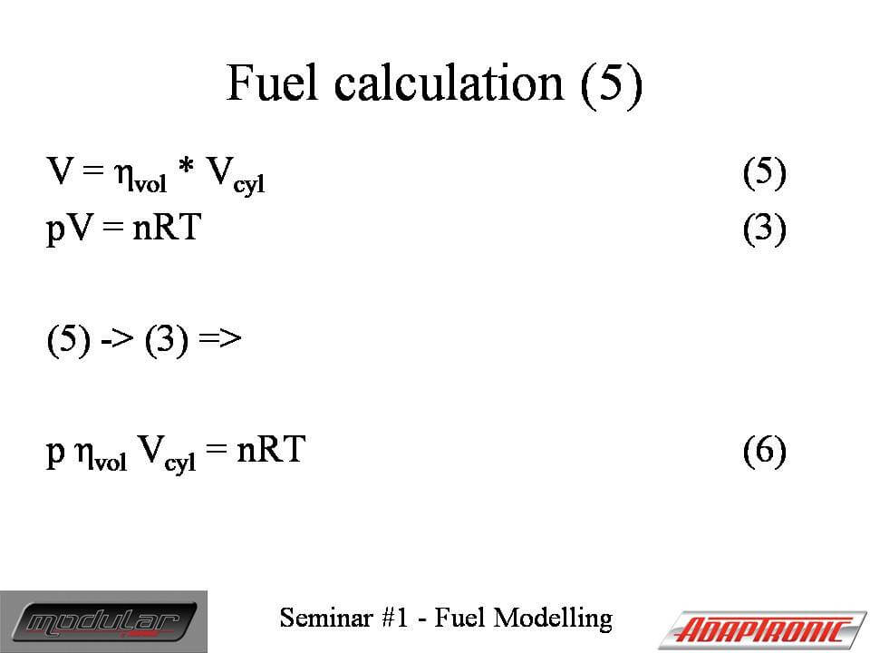

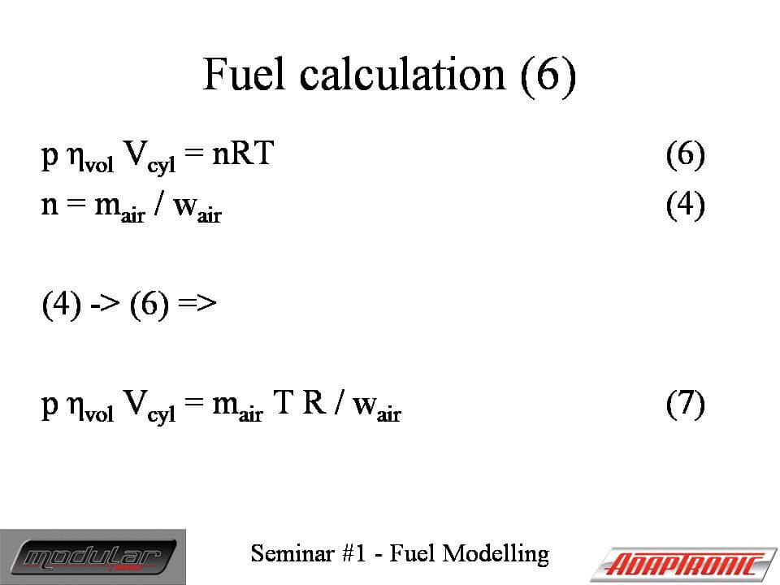

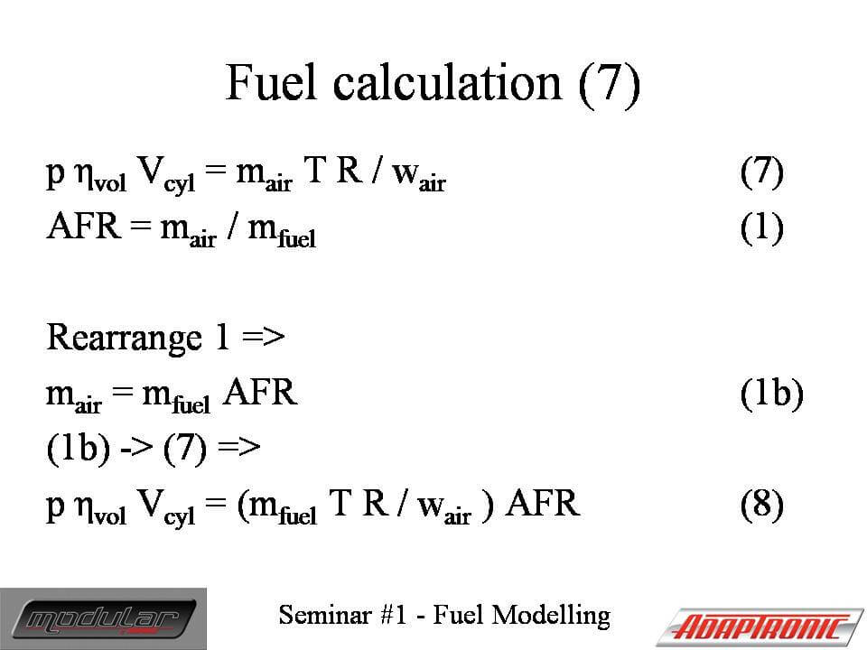

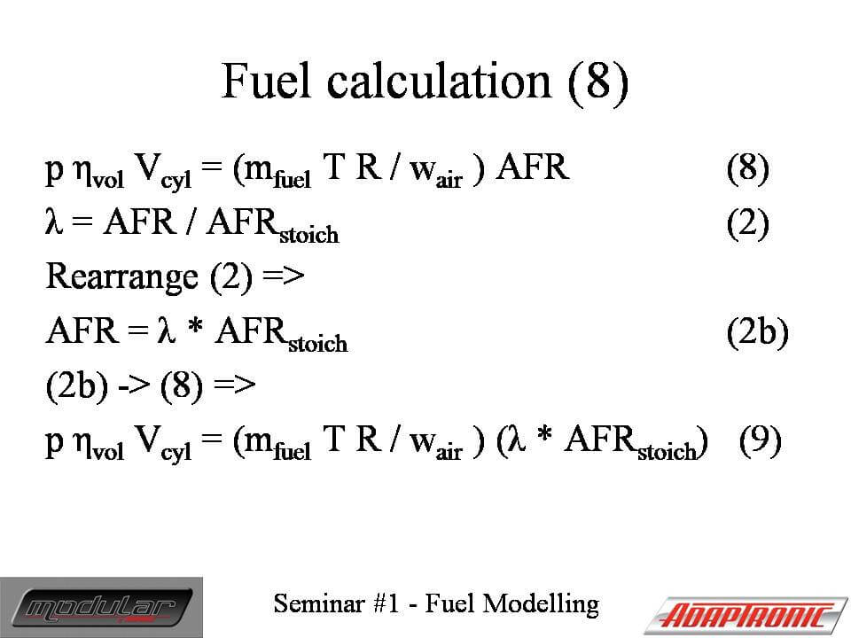

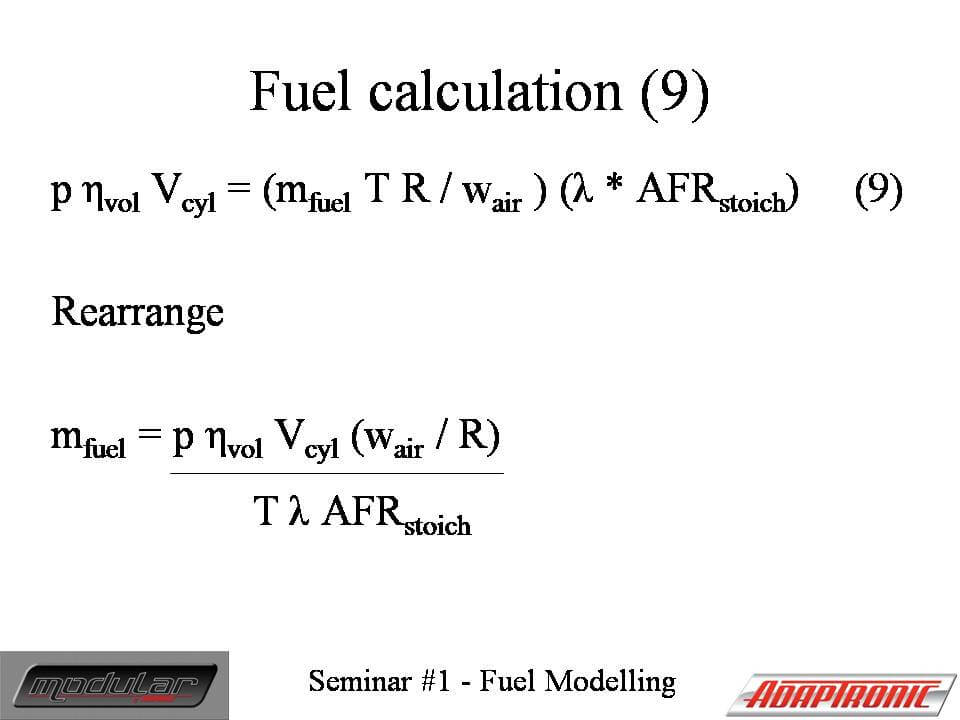

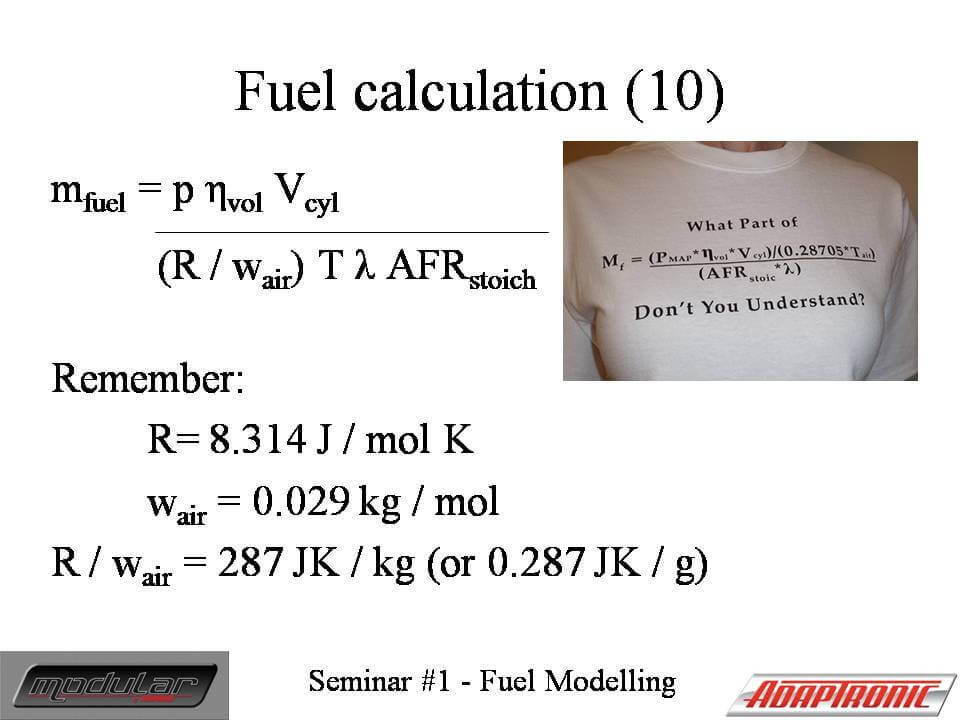
  
  
You can see now that we’ve essentially arrived at Greg’s T-shirt
                equation. There’s a scaling difference of 1000 in there, so I
                assume that’s because he’s calculating fuel in grams instead of
                the SI unit of kg or something like that.  
  
Now, let’s go over all the variables again and see how we can
                measure or know what they are.  
  
Mfuel is what we’re trying to calculate  
  
MAP is something that we can measure directly with a MAP sensor.
                To learn more about how you can measure this accurately, see the
                video on configuring inputs because there are some funky
                requirements regarding filtering, because the MAP is not
                constant throughout a cycle.  
  
VE is something we can look up from the fuel map. This replaces
                our millisecond fuel map. Please see my tuning modes video for a
                more detailed discussion of VE, what affects it on different
                types of induction systems.  
  
Vcyl – cylinder volume, the ECU knows this at setup time because
                of the engine capacity and number of cylinders.  
  
T – the air temperature, is taken as a blend between air and
                coolant temperature; I’ll do a separate article just on that
                topic.  
  
Lambda, is the lambda that we want, so that just comes from the
                target lambda table  
  
AFRstoich comes either from an ECU setting, or is calculated
                from measurement from a flex fuel sensor.  
  

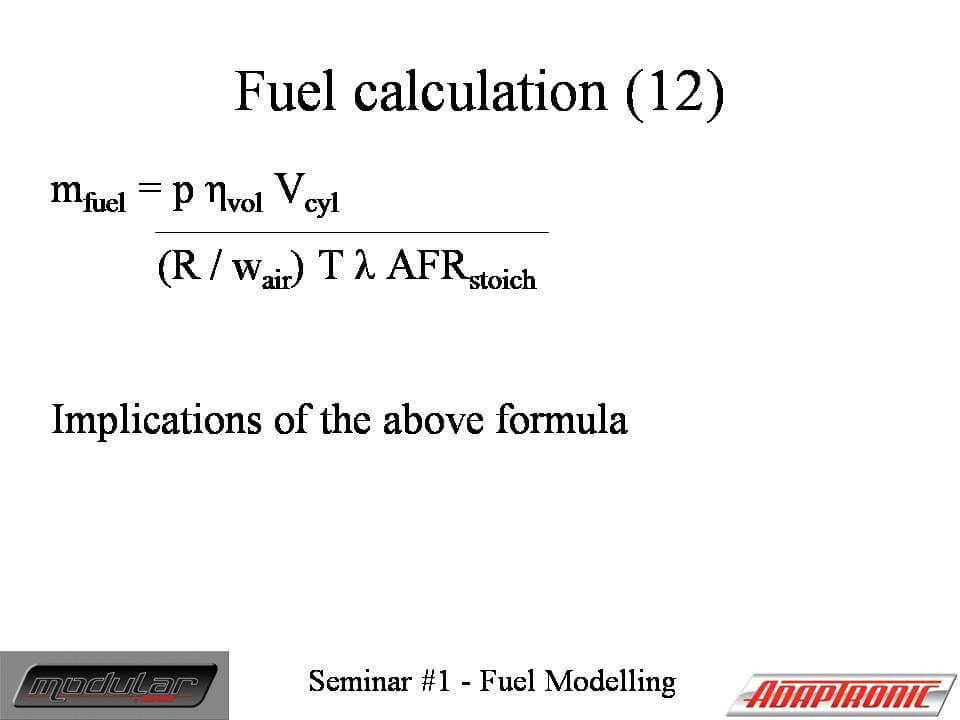
  
  
There should be some implications of this formula. For example
                if you double the manifold air pressure, then all other things
                being equal, the amount of fuel you need to inject every intake
                stroke will approximately double. Sometimes people ask questions
                like “why does the VE map look so flat, why doesn’t it increase
                a lot with boost”, but it should be obvious when you see this
                formula.  
  
Another question we get asked is, if I change the target lambda,
                will the ECU change the amount of fuel injected. And again, you
                can see from this formula that the answer is yes.  
  
This formula also means that in theory, your temperature
                correction maps should be zero, because they are supposed to be
                handled by the formula. And in practice, I have always left them
                at zero so far, and it works well because the model is accurate.  
  
Let’s look now at how this is all set up in the ECU. There are
                separate videos / articles on each of these topics so I’ll just
                tell you where all the settings are here.  
  
Engine capacity and number of cylinders (or rotors) are both set
                up in Engine -> Details.  
  

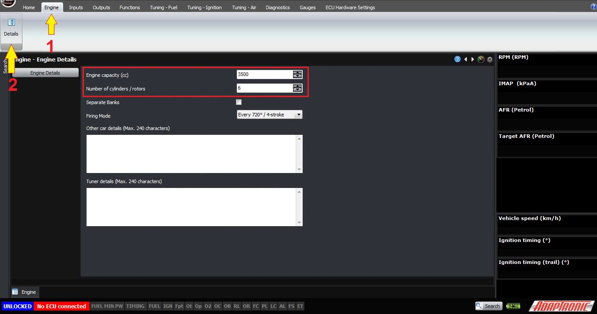
  
  
The stoich AFR is set up in the fuel map settings, for example
                Tuning – Fuel -> Basic Setup –Fuel Map 1 Settings. This
                location also allows you to set how the VE fuel map is
                configured, and also where the VE mode setting is located.  
  

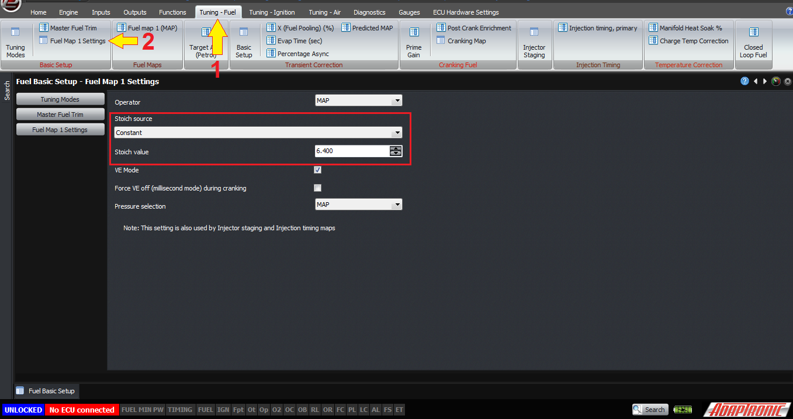
  
  
There’s another article specifically about tuning modes, how to
                set up the load axis for fuel maps based on the type of
                induction system on the engine.  
  

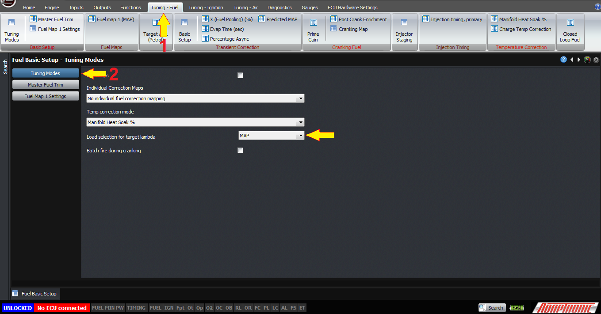
  
  
Target lambda can be found in Tuning-Fuel -> Target Lambda  
  

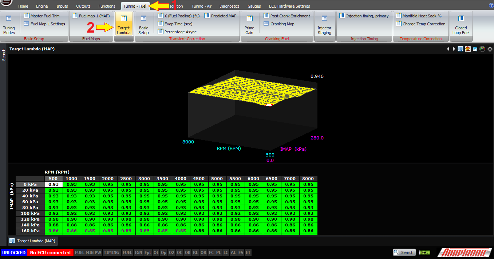
  
  
The temperature is taken from the coolant and air temperature
                sensors. By default, we use the manifold heat soak % mode which
                uses a blend of the two. This is enabled in the Tuning-Fuel
                -> Basic Setup -> Tuning Modes page, and the heat soak
                percentages can then be found in the Tuning-Fuel ->
                Temperature Correction -> Manifold Heat Soak %. This is the
                amount of weight to give to the coolant temperature, eg 100%
                means that there’s so much heat soak that by the time the air
                gets into the engine, its at engine temperature and the original
                air temperature doesn’t matter at all. 0% heat soaks means that
                there’s no effect on the air temperature by the engine
                temperature at all, which never happens in practice.  
  

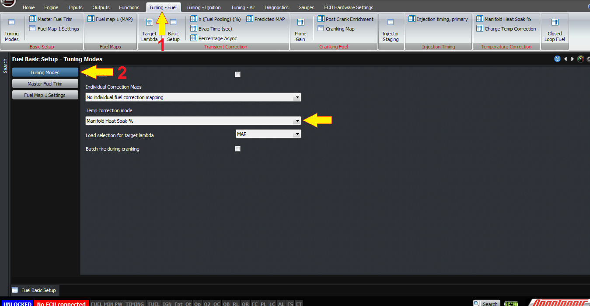
  
  

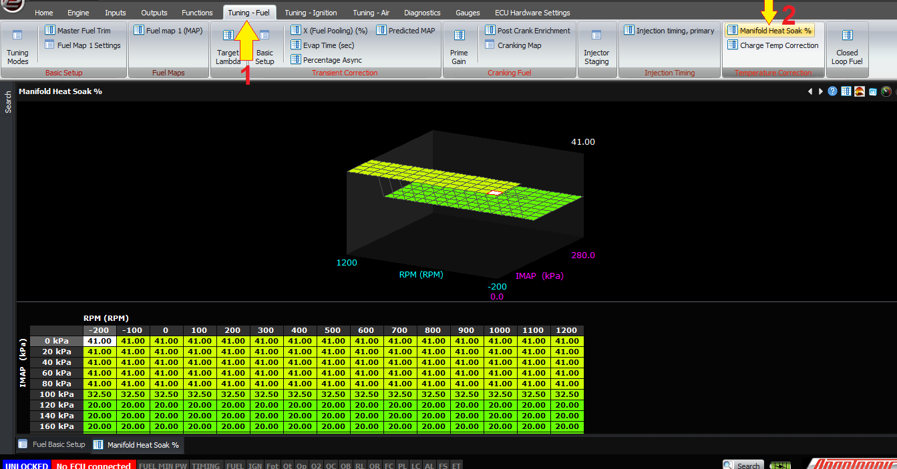
  
  
MAP and temperature inputs are configured in the Inputs menu,
                and there’s other article that talks about those specifically.  
  

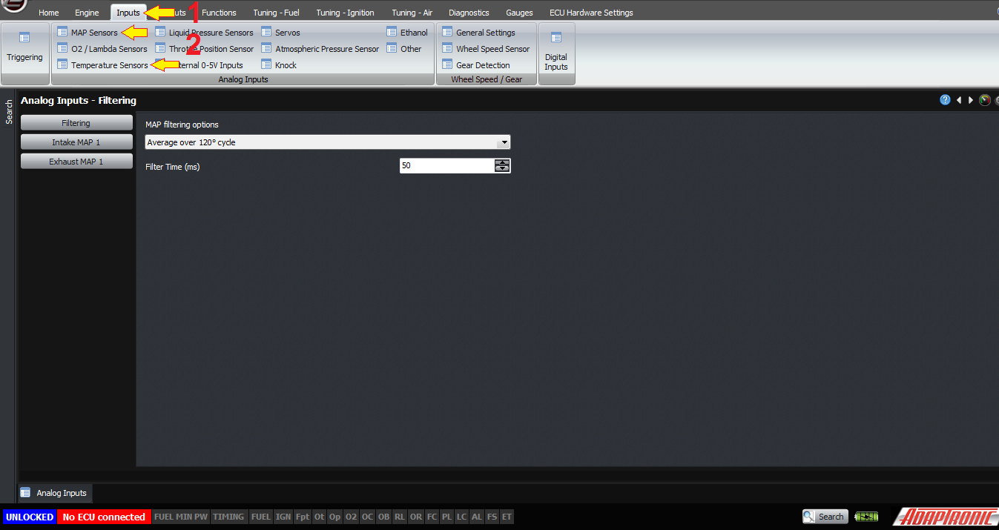
  
  
This doesn’t get you all the way to the injector millisecond
                value though, it gets you to the fuel mass. There’s a separate
                article on this, which includes the injector model, minimum
                pulsewidth or fuel delivery, the effects of fuel pressure and
                fuel temperature and so on. This also does not discuss transient
                conditions which is done in another article.  
  
Finally, the ECU reports a lot of its intermediate calculated
                values. So you can see things like the actual VE read from the
                table, and the calculated stoichiometric AFR, the calculated
                charge temperature and so on by going to the gauges window and
                expanding the “intermediate calculated value” section.  
  

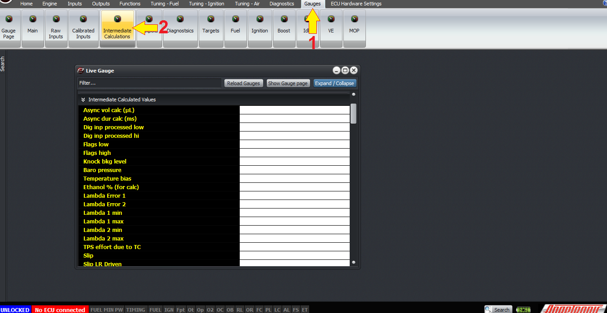
  
  
You can also see this diagrammatically by going to the
                Diagnostics -> Calculation Trace.  The main fuel display
                shows the whole fuel calculation which is quite large, but you
                can click on individual sections in it to go into more details
                of the calculation. This also works with the software simulator.  
  

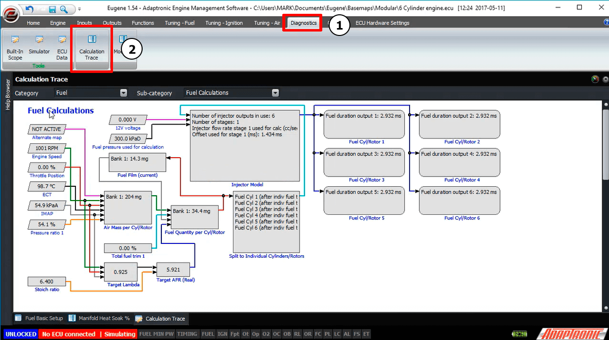
  
Thank you!  
  
©2018
        Adaptronic  
  
