Transient Throttle Conditions and How to Set it up on Modular ECUs/*

Copyright (c) 2008, Yahoo! Inc. All rights reserved.

Code licensed under the BSD License:

http://developer.yahoo.net/yui/license.txt

version: 2.6.0

*/

html{color:#000;background:#FFF;}body,div,dl,dt,dd,ul,ol,li,h1,h2,h3,h4,h5,h6,pre,code,form,fieldset,legend,input,textarea,p,blockquote,th,td{margin:0;padding:0;}table{border-collapse:collapse;border-spacing:0;}fieldset,img{border:0;}address,caption,cite,code,dfn,em,strong,th,var{font-style:normal;font-weight:normal;}li{list-style:none;}caption,th{text-align:left;}h1,h2,h3,h4,h5,h6{font-size:100%;font-weight:normal;}q:before,q:after{content:'';}abbr,acronym{border:0;font-variant:normal;}sup{vertical-align:text-top;}sub{vertical-align:text-bottom;}input,textarea,select{font-family:inherit;font-size:inherit;font-weight:inherit;}input,textarea,select{*font-size:100%;}legend{color:#000;}del,ins{text-decoration:none;}body{font:13px/1.231 arial,helvetica,clean,sans-serif;*font-size:small;*font:x-small;}select,input,button,textarea{font:99% arial,helvetica,clean,sans-serif;}table{font-size:inherit;font:100%;}pre,code,kbd,samp,tt{font-family:monospace;*font-size:108%;line-height:100%;}body{text-align:center;}#ft{clear:both;}#doc,#doc2,#doc3,#doc4,.yui-t1,.yui-t2,.yui-t3,.yui-t4,.yui-t5,.yui-t6,.yui-t7{margin:auto;text-align:left;width:57.69em;*width:56.25em;min-width:750px;}#doc2{width:73.076em;*width:71.25em;}#doc3{margin:auto 10px;width:auto;}#doc4{width:74.923em;*width:73.05em;}.yui-b{position:relative;}.yui-b{_position:static;}#yui-main .yui-b{position:static;}#yui-main,.yui-g .yui-u .yui-g{width:100%;}{width:100%;}.yui-t1 #yui-main,.yui-t2 #yui-main,.yui-t3 #yui-main{float:right;margin-left:-25em;}.yui-t4 #yui-main,.yui-t5 #yui-main,.yui-t6 #yui-main{float:left;margin-right:-25em;}.yui-t1 .yui-b{float:left;width:12.30769em;*width:12.00em;}.yui-t1 #yui-main .yui-b{margin-left:13.30769em;*margin-left:13.05em;}.yui-t2 .yui-b{float:left;width:13.8461em;*width:13.50em;}.yui-t2 #yui-main .yui-b{margin-left:14.8461em;*margin-left:14.55em;}.yui-t3 .yui-b{float:left;width:23.0769em;*width:22.50em;}.yui-t3 #yui-main .yui-b{margin-left:24.0769em;*margin-left:23.62em;}.yui-t4 .yui-b{float:right;width:13.8456em;*width:13.50em;}.yui-t4 #yui-main .yui-b{margin-right:14.8456em;*margin-right:14.55em;}.yui-t5 .yui-b{float:right;width:18.4615em;*width:18.00em;}.yui-t5 #yui-main .yui-b{margin-right:19.4615em;*margin-right:19.125em;}.yui-t6 .yui-b{float:right;width:23.0769em;*width:22.50em;}.yui-t6 #yui-main .yui-b{margin-right:24.0769em;*margin-right:23.62em;}.yui-t7 #yui-main .yui-b{display:block;margin:0 0 1em 0;}#yui-main .yui-b{float:none;width:auto;}.yui-gb .yui-u,.yui-g .yui-gb .yui-u,.yui-gb .yui-g,.yui-gb .yui-gb,.yui-gb .yui-gc,.yui-gb .yui-gd,.yui-gb .yui-ge,.yui-gb .yui-gf,.yui-gc .yui-u,.yui-gc .yui-g,.yui-gd .yui-u{float:left;}.yui-g .yui-u,.yui-g .yui-g,.yui-g .yui-gb,.yui-g .yui-gc,.yui-g .yui-gd,.yui-g .yui-ge,.yui-g .yui-gf,.yui-gc .yui-u,.yui-gd .yui-g,.yui-g .yui-gc .yui-u,.yui-ge .yui-u,.yui-ge .yui-g,.yui-gf .yui-g,.yui-gf .yui-u{float:right;}.yui-g div.first,.yui-gb div.first,.yui-gc div.first,.yui-gd div.first,.yui-ge div.first,.yui-gf div.first,.yui-g .yui-gc div.first,.yui-g .yui-ge div.first,.yui-gc div.first div.first{float:left;}.yui-g .yui-u,.yui-g .yui-g,.yui-g .yui-gb,.yui-g .yui-gc,.yui-g .yui-gd,.yui-g .yui-ge,.yui-g .yui-gf{width:49.1%;}.yui-gb .yui-u,.yui-g .yui-gb .yui-u,.yui-gb .yui-g,.yui-gb .yui-gb,.yui-gb .yui-gc,.yui-gb .yui-gd,.yui-gb .yui-ge,.yui-gb .yui-gf,.yui-gc .yui-u,.yui-gc .yui-g,.yui-gd .yui-u{width:32%;margin-left:1.99%;}.yui-gb .yui-u{*margin-left:1.9%;*width:31.9%;}.yui-gc div.first,.yui-gd .yui-u{width:66%;}.yui-gd div.first{width:32%;}.yui-ge div.first,.yui-gf .yui-u{width:74.2%;}.yui-ge .yui-u,.yui-gf div.first{width:24%;}.yui-g .yui-gb div.first,.yui-gb div.first,.yui-gc div.first,.yui-gd div.first{margin-left:0;}.yui-g .yui-g .yui-u,.yui-gb .yui-g .yui-u,.yui-gc .yui-g .yui-u,.yui-gd .yui-g .yui-u,.yui-ge .yui-g .yui-u,.yui-gf .yui-g .yui-u{width:49%;*width:48.1%;*margin-left:0;}.yui-g .yui-g .yui-u{width:48.1%;}.yui-g .yui-gb div.first,.yui-gb .yui-gb div.first{*margin-right:0;*width:32%;_width:31.7%;}.yui-g .yui-gc div.first,.yui-gd .yui-g{width:66%;}.yui-gb .yui-g div.first{*margin-right:4%;_margin-right:1.3%;}.yui-gb .yui-gc div.first,.yui-gb .yui-gd div.first{*margin-right:0;}.yui-gb .yui-gb .yui-u,.yui-gb .yui-gc .yui-u{*margin-left:1.8%;_margin-left:4%;}.yui-g .yui-gb .yui-u{_margin-left:1.0%;}.yui-gb .yui-gd .yui-u{*width:66%;_width:61.2%;}.yui-gb .yui-gd div.first{*width:31%;_width:29.5%;}.yui-g .yui-gc .yui-u,.yui-gb .yui-gc .yui-u{width:32%;_float:right;margin-right:0;_margin-left:0;}.yui-gb .yui-gc div.first{width:66%;*float:left;*margin-left:0;}.yui-gb .yui-ge .yui-u,.yui-gb .yui-gf .yui-u{margin:0;}.yui-gb .yui-gb .yui-u{_margin-left:.7%;}.yui-gb .yui-g div.first,.yui-gb .yui-gb div.first{*margin-left:0;}.yui-gc .yui-g .yui-u,.yui-gd .yui-g .yui-u{*width:48.1%;*margin-left:0;} .yui-gb .yui-gd div.first{width:32%;}.yui-g .yui-gd div.first{_width:29.9%;}.yui-ge .yui-g{width:24%;}.yui-gf .yui-g{width:74.2%;}.yui-gb .yui-ge div.yui-u,.yui-gb .yui-gf div.yui-u{float:right;}.yui-gb .yui-ge div.first,.yui-gb .yui-gf div.first{float:left;}.yui-gb .yui-ge .yui-u,.yui-gb .yui-gf div.first{*width:24%;_width:20%;}.yui-gb .yui-ge div.first,.yui-gb .yui-gf .yui-u{*width:73.5%;_width:65.5%;}.yui-ge div.first .yui-gd .yui-u{width:65%;}.yui-ge div.first .yui-gd div.first{width:32%;}#bd:after,.yui-g:after,.yui-gb:after,.yui-gc:after,.yui-gd:after,.yui-ge:after,.yui-gf:after{content:".";display:block;height:0;clear:both;visibility:hidden;}#bd,.yui-g,.yui-gb,.yui-gc,.yui-gd,.yui-ge,.yui-gf{zoom:1;}h1 {
  font-size: 138.5%;
}

h2 {
  font-size: 123.1%;
}

h3 {
  font-size: 108%;
}

h1, h2, h3 {
  margin-top: 1em;
  margin-right: 0px;
  margin-bottom: 1em;
  margin-left: 0px;
}

h1, h2, h3, h4, h5, h6, strong {
  font-weight: bold;
}

abbr, acronym {
  border-bottom-width: 1px;
  border-bottom-style: dotted;
  border-bottom-color: black;
  cursor: help;
}

em {
  font-style: italic;
}

blockquote, ul, ol, dl {
  margin-top: 1em;
  margin-right: 1em;
  margin-bottom: 1em;
  margin-left: 1em;
}

ol, ul, dl {
  margin-left: 2em;
}

ol li {
  list-style-type: decimal;
  list-style-image: none;
  list-style-position: outside;
}

ul li {
  list-style-type: disc;
  list-style-image: none;
  list-style-position: outside;
}

dl dd {
  margin-left: 1em;
}

th, td {
  border-top-width: 1px;
  border-right-width: 1px;
  border-bottom-width: 1px;
  border-left-width: 1px;
  border-top-style: solid;
  border-right-style: solid;
  border-bottom-style: solid;
  border-left-style: solid;
  border-top-color: black;
  border-right-color: black;
  border-bottom-color: black;
  border-left-color: black;
  -moz-border-top-colors: none;
  border-top-colors: none;
  -moz-border-right-colors: none;
  border-right-colors: none;
  -moz-border-bottom-colors: none;
  border-bottom-colors: none;
  -moz-border-left-colors: none;
  border-left-colors: none;
  border-image-source: none;
  border-image-slice: 100% 100% 100% 100%;
  border-image-width: 1 1 1 1;
  border-image-outset: 0 0 0 0;
  border-image-repeat: stretch stretch;
  padding-top: 0.5em;
  padding-right: 0.5em;
  padding-bottom: 0.5em;
  padding-left: 0.5em;
}

th {
  font-weight: bold;
  text-align: center;
}

caption {
  margin-bottom: 0.5em;
  text-align: center;
}

p, fieldset, table, pre {
  margin-bottom: 1em;
}

input[type="text"], input[type="password"], textarea {
  width: 12.25em;
}

.navbar {
  background-color: black;
  color: white;
  font-size: smaller;
}

.Pagetitle {
  font-size: large;
  font-weight: bold;
}

.navbar:hover {
  font-weight: normal;
}

#downloads:hover {
  font-weight: normal !important;
  font-size: smaller !important;
}

.contact:hover {
  font-weight: bolder;
}

.downloads:hover {
  font-weight: bolder;
}

.store:hover {
  font-weight: bolder;
}

.downloads {
  font-weight: normal;
}

.store {
  font-weight: normal;
}

.contact {
  font-weight: normal;
}

.versionnum {
  font-size: large;
  color: black;
  font-weight: bold;
}

.releasedate {
  font-size: small;
  font-style: italic;
  color: black;
}

.releasecontent {
  font-size: medium;
}

.modrev {
  font-style: normal;
  font-weight: normal;
  font-size: small;
  color: #3333ff;
}

.selectrev {
  font-weight: normal;
  font-style: normal;
  color: #3333ff;
  font-size: small;
}

.yui-u {
  font-size: medium;
}

.backhome {
  font-size: smaller;
}

.latestrev {
  font-size: smaller;
}

.bodytxt1 {
  font-size: xx-small;
}  
  
[DOWNLOADS](#)[STORE](#)[CONTACT US](#)  
  

Transient Throttle Conditions and How to Set it
              up on Modular ECUs

[go back to
                support home](EN_EUGENE_MOD_HOME.md)

  

[TPS
                Output Pin on the Modular Skyline Plug-In ECUs](EN_MOD_022_TPSOP.md)[
              ](EN_EUGENE_ABOUT.md)

[  

              ](EN_EUGENE_KBSC_TG.md)

  

[  

              ](EN_SelFW.md)

  

  
  
  
  
  
This is the middle part of my fuel model
                  talk from PRI in 2016, but I’ll also be discussing settings in
                  the Modular ECU specifically in this article.  
  
Firstly let’s discuss what happens in a transient
                  throttle condition – specifically when you open the throttle.
                  We have all driven cars with aftermarket ECUs with no
                  consideration for what happens in a throttle transient
                  condition and we know they feel awful, but to properly
                  understand what needs to be done, we need to understand the
                  physics of what’s actually happening in the engine and why we
                  need to consider transient conditions in the first place.  
  
The other consideration, once we know what happens
                  in the engine, is what do we do about it. I’ve seen some other
                  ECUs with up to 8 different tables to make different changes
                  to the amount of fuel injected under transient throttle
                  conditions, and often it’s not clear which one needs to be
                  adjusted. They all interact and as I said in the talk about
                  the steady state fuel model, if you need 8 separate tables
                  with values that don’t relate to what the engine is doing, or
                  that aren’t replicated across engines, then perhaps the model
                  isn’t reflecting the engine very well.  
  
There are 3 reasons that we need to deal with
                  transient conditions on a port injected engine.  
  
The first reason is that measuring MAP is hard. The
                  manifold pressure changes throughout the engine cycle due to
                  each cylinder or rotor doing its induction stroke. Here’s a
                  picture taken from an inline 6 cylinder engine.  
  
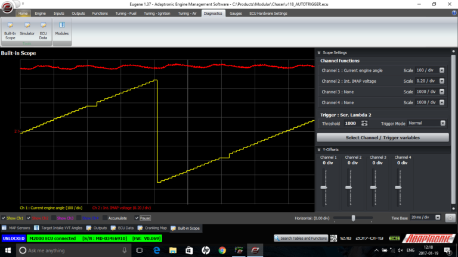  
  
Unfiltered IMAP  
  
To get this signal smooth enough to be useful, this
                  must either be filtered in the time domain or the angle
                  domain, otherwise even at idle the MAP signal will jump around
                  and so will your fuel delivery. One way you can do this is
                  with a simple time based filter, which introduces a delay.
                  Another way is with an average over an angle interval, in this
                  case 120 degrees. A third way, which we don’t do but I’ve
                  heard other people suggest, is to just take the MAP signal at
                  a single angle so it’s at the same point in the wave each
                  time. Both the angle-based methods introduce their own delays,
                  in that the signal you are looking at could be up to 120
                  degrees old. At low engine speeds, for example idle, this
                  could correspond to enough time for a throttle to open and air
                  to rush into a cylinder that’s currently doing an induction
                  stroke. So we need some way to estimate what the ACTUAL
                  manifold pressure is, at least well enough to handle the
                  transient condition.  
  
A second problem is the fuel film or wall-wetting
                  situation. Unfortunately on a port injected engine, when the
                  injector delivers a certain amount of fuel, not all of it goes
                  directly into the cylinder or rotor. A certain percentage ends
                  up on the runner walls on a film (or “pool” or “puddle” if you
                  like). This fuel isn’t wasted; it evaporates over time and
                  gets drawn into the engine as fuel vapour. However it doesn’t
                  go into the cylinder immediately; it has to form a film first
                  which then evaporates over time. As the delivered fuel
                  quantity changes with different loads, the steady state size
                  of the fuel film also changes. Therefore if the ECU just
                  starts to deliver the correct new fuel quantity, then a large
                  portion of this fuel delivered will be taken up by “filling
                  up” the film to its new steady state value. This is the key
                  reason for needing what is often called “acceleration
                  enrichment”. It’s not actually enrichment the engine needs;
                  but the ECU needs to inject more fuel, just to get to the same
                  air-fuel ratio, because of this fuel film effect.  
  
The final problem is what I’m going to call the
                  “gulp of air” problem. In many situations, the fuel is
                  injected before the inlet valve is opened because of how the
                  injection timing is set. On a 4 cylinder engine, one cylinder
                  will always be doing an induction stroke whenever you open the
                  throttle, which means that one cylinder is always going to
                  have inadequate fuel delivered if it was delivered before the
                  throttle was opened – the ECU would need a crystal ball to be
                  able to predict when you were going to open the throttle, at
                  least on a mechanical throttle system. So the ECU needs a way
                  of delivering an additional squirt of fuel to chase down the
                  air, and this is called an asynchronous injection pulse. It’s
                  asynchronous because it happens out of the sequence of the
                  regular fuel injection pulses, which are timed with the engine
                  rotation.  
  
Let’s first talk about the first problem, which is
                  the filtering required on the MAP signal slowing it to the
                  point where it becomes a problem for transient throttle
                  conditions. I don’t know how other ECU manufacturers get
                  around this problem, other than the method I described before
                  of having 8 different tables for the amount of fuel enrichment
                  to provide based on certain throttle opening percentages and
                  rates. The reason we don’t want to do that is firstly we used
                  to do that, and it was fiddly to set up and didn’t give very
                  good results. Secondly, it’s not a very good model of the
                  system. If you imagine an engine at idle, the MAP might be
                  about 30 kPa. If you suddenly open the throttle all the way,
                  the MAP will jump up to 100 kPa as quickly as you can move the
                  pedal. However if the MAP sensor has not responded appreciably
                  due to the filtering, then you would need a 200% enrichment to
                  deal with this situation. If you’re needing 200% enrichment to
                  reach the correct value, it means you’re starting with the
                  wrong value in the first place. And lastly, if someone had to
                  change their MAP filtering because of some unstable reading on
                  boost or whatever, it would change what you’d need to enter in
                  the acceleration enrichment settings, when nothing on the
                  engine has changed.  
  
The way we do it instead is we have a model of the
                  engine’s MAP at different RPM and TPS combinations. The
                  Predicted MAP table is visible under the fuel tuning,
                  transient corrections section, and this is a table of the
                  actual MAP value that you would get under each RPM / TPS
                  combination. On a dyno it’s very easy to fill out manually,
                  and there’s an adaptive MAP prediction setting where the ECU
                  will learn the predicted MAP value as you reach each
                  condition. When the ECU detects a rapid throttle opening, it
                  looks at the greater of either the predicted MAP, or the
                  measured MAP from the sensor, for a fixed amount of time
                  called the “transition time for MAP prediction” under the
                  basic setup. You can also disable MAP prediction entirely on
                  this page if you want to.  
  
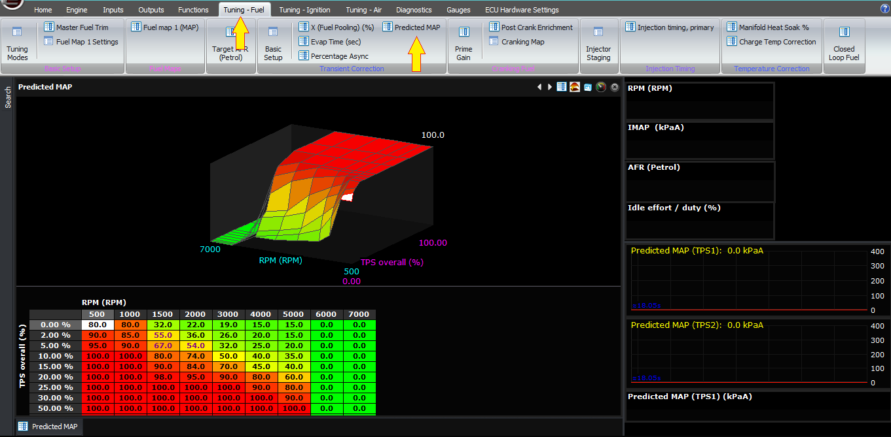  
  
Tuning Fuel>Predicted MAP  
  
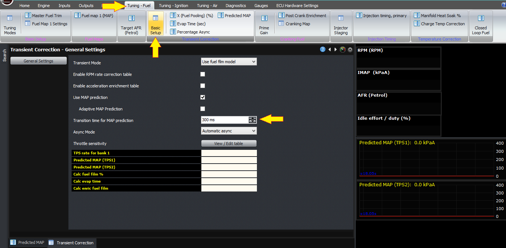  
  
Tuning fuel>BasicSetup>Transition time for MAP
                    prediction  
  
The other setting relevant to the MAP prediction is
                  the throttle sensitivity, which is how fast the throttle has
                  to be opened, to trigger MAP prediction. If you click on the
                  button for the throttle sensitivity table, you can see the
                  threshold rates (in %/second) required to trigger the MAP
                  prediction at each TPS opening point, and the live view at the
                  bottom tells you the current TPS rate. So you can play with
                  the pedal yourself and visualise what numbers you get with
                  different rates of pumping the throttle, if the numbers
                  themselves aren’t clear.  
  
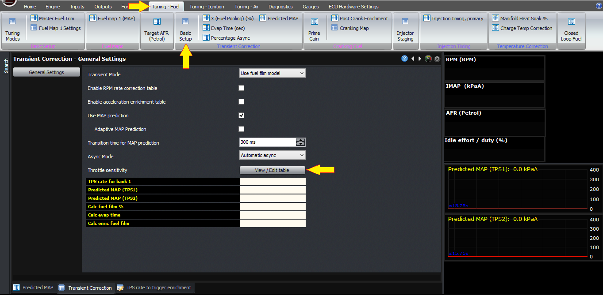  
  
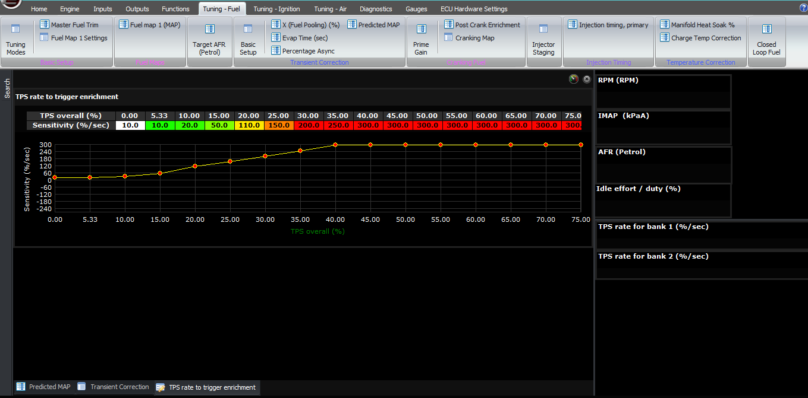  
  
Once you’ve entered the MAP values at each RPM / TPS
                  combination, you can check that it’s working correctly under
                  different conditions by either logging or using a live log
                  view of the IMAP or intake manifold absolute pressure. When
                  you do a throttle transition, you should see a step change in
                  the IMAP because of the MAP prediction and it should
                  transition pretty smoothly to the steady state value from the
                  MAP sensor. If it’s very slow to rise then either the
                  predicted MAP value is too low, or the throttle sensitivity is
                  too high so it’s not triggering the MAP prediction. If it
                  jumps high and then comes back down with a step when the MAP
                  prediction time is over, then that means your predicted MAP
                  value is too high for that RPM / TPS combination.  
  
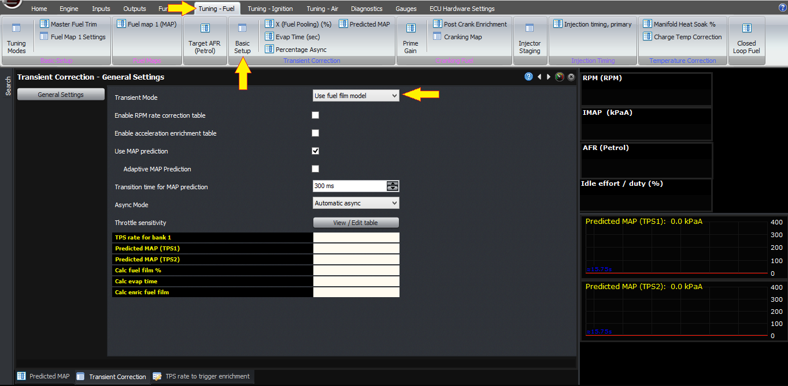  
  
Enabling Fuel Film Model  
  
Now let’s talk about the fuel film phenomenon. This
                  is the way we prefer to handle transients, and the way to
                  enable it is in the transient throttle basic setup, to select
                  the transient mode as “use fuel film model”. The theory of
                  this was explained in a youtube video by an ex-Ford engineer
                  Dr Jim Cowart ([https://www.youtube.com/watch?v=0ItkpVofKLw](https://www.youtube.com/watch?v=0ItkpVofKLw)),
                  and he describe the “X-Tau” model, where X is the percentage
                  of fuel that ends up on the runner walls in a flim, and Tau is
                  the time constant for it to evaporate. He describes that X is
                  mostly dependent on coolant temperature and to a lesser extent
                  manifold pressure, whereas Tau is mostly dependent on RPM and
                  to a lesser extent, manifold pressure. In our software we call
                  it “fuel pooling” and “evaporation time” to make it a bit more
                  easy to understand and remember.  
  
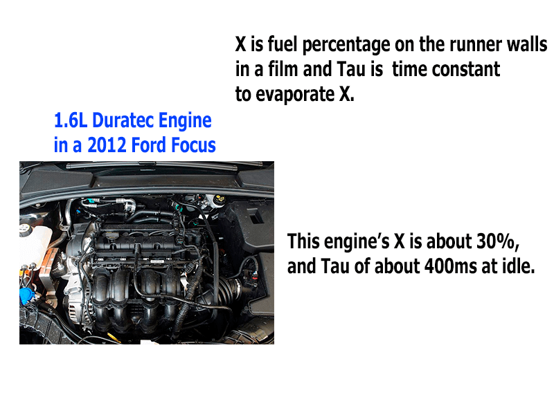  
  
Dr Cowart mentioned in his video that the Ford
                  Duratec engines he was calibrating had X of about 30%, and Tau
                  of about 400ms at idle. I’ve found with most Japanese engines
                  that X is only about 15% with standard injectors – although if
                  you have a narrow spray pattern injector like an Injector
                  Dynamics one, and a dual inlet valve head, then often the
                  injector stream points right at the divider wall between the
                  two runners, and a lot of fuel ends up on the divider. This
                  has the effect of increasing X; so an engine that might be 15%
                  on factory injectors might increase to 40% or so with upgraded
                  injectors.  
  
If we take Dr Cowart’s example, let’s further assume
                  the engine requires 10mg of fuel per induction stroke at idle,
                  and 40mg at WOT.  
  
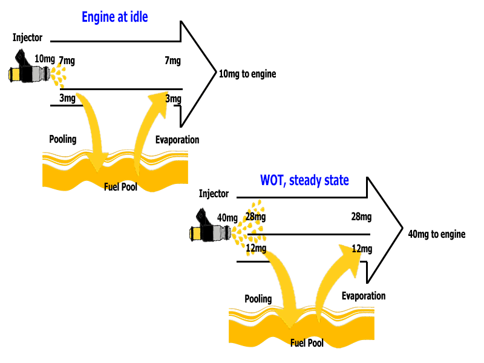  
  
If X = 30%, that means that out of the 10mg
                  injected, 3mg goes into filling up the film, and 3mg worth of
                  film evaporates and gets sucked into the engine, in the steady
                  state. The fuel film remains the same size, and 10mg still
                  gets injected into the engine.  
  
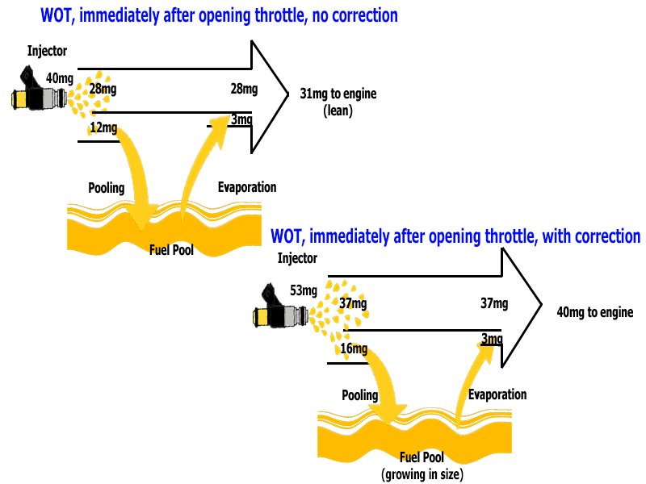  
  
We open the throttle to wide open from idle. We know
                  that we need 40mg to go into the engine, but if the ECU
                  delivers 40mg, then only 70% of that, or 28mg goes straight
                  into the engine. The other 30% or 12mg goes into the fuel
                  film, and 3mg evaporates from how big the fuel film was
                  before. So the engine gets 31 mg of fuel instead of 40.  
  
So instead the ECU calculates that the engine needs
                  40 mg of fuel. It knows, based on the model of the fuel film,
                  that it has enough fuel film to deliver 3mg of fuel. Therefore
                  it needs to inject enough fuel the 70% that will go into the
                  cylinder will equate to 37mg. This means the ECU needs to
                  inject 37 / 0.7 = 53mg – and the other 16mg will go into
                  building up the fuel film on the runner wall.  
  
Another way to think of this is an “enrichment” of
                  32%.  
  
This technique, according to Dr Cowart and also our
                  own testing, works really well for hot engines, cold engines,
                  different throttle opening rates, vacuum boost, engine size,
                  injector type and all the other things that are built into the
                  model.  
  
In terms of the values for X and Tau settings, I
                  watched the video and waited for the punchline which was how
                  to determine what X and Tau should be… and unfortunately they
                  need to be determined empirically. Ie, they need to be tuned.
                  Sorry!  
  
For this to work, firstly disable the asynchronous
                  injection because that will complicate things. Secondly try to
                  set the injection timing so that the throttle response is best
                  (even though it won’t be great).  
  
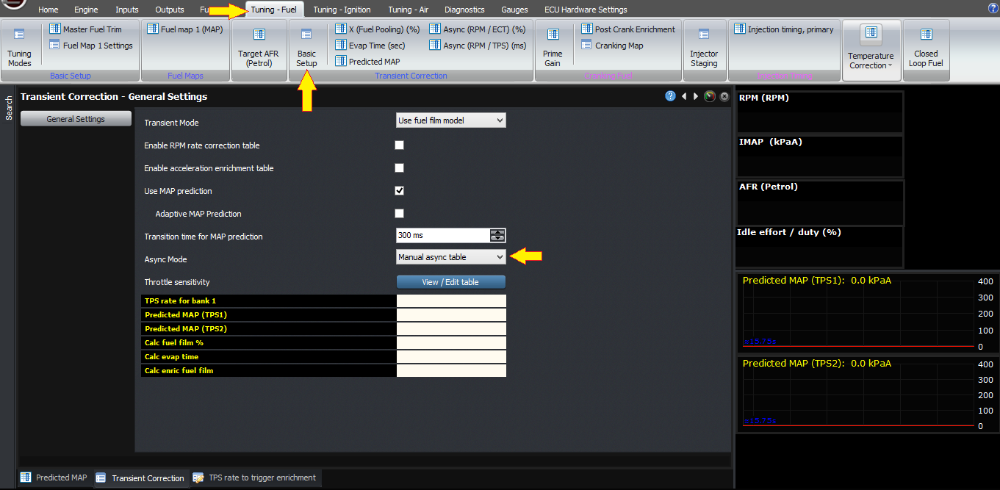  
  
Disabling Async  
  
X is the amount of fuel that ends up on the runner
                  walls. So if you increase this, it will increase the
                  additional amount of fuel the ECU will inject. So if it’s lean
                  when you first open the throttle (eg for 200ms or so), then
                  increase X.  
  
If it goes rich and then lean, then that probably
                  means that X is too high but the time is too short. If it goes
                  correct, but then lean, then X is probably about right but the
                  time is too short. If it’s correct and then it goes overly
                  rich, then try reducing the time.  
  
In general Tau or the evaporation time reduces with
                  RPM. Times are normally in the region of 0.15 – 0.4 seconds at
                  idle. I haven’t found it changes appreciably with manifold
                  pressure.  
  
X, or the percentage fuel pooling, varies with
                  coolant temperature because it affects the temperature of the
                  runner wall and therefore how much fuel condenses. As I
                  mentioned before, a well set up engine like an OEM one in my
                  experience requires X about 15% when hot and slightly more
                  when cold (eg 25%), but with people putting on aftermarket
                  injectors with spray patterns not matched to the engine, this
                  can go up to 40% or so on even a warm engine.  
  
The last topic we will discuss is the asynchronous
                  injection, to deal with the “gulp of air” issue. Firstly,
                  sometimes people say things like “well, how fast can the air
                  really move anyway, it’s got to get all the way from the
                  throttle body, fill up the plenum and into the cylinder”. If
                  you have a pressure drop with a ratio of more than 2:1, which
                  you would on most engines at idle, the air actually goes sonic
                  through the restriction, ie at the speed of sound. The speed
                  of sound at atmospheric pressure is about 300m/s, so to travel
                  the distance between the throttle body and the cylinder, which
                  unless you have a supercharged Lotus will be less than a
                  metre, we are talking about a few milliseconds.  
  
I explained the theory behind it before in the
                  introduction, so let’s look at an example. Let’s choose the
                  example before where we have an engine at idle which needs
                  10mg at idle, and then 53mg to be injected immediately after
                  we open the throttle. If we’ve done a closed-valve injection,
                  then we’ve already done the injection pulse before we knew how
                  big it needed to be. So instead we will do an asynchronous
                  injection pulse to make up the difference. In this case, the
                  difference that we need to make up is 43 mg.  
  
Whether we actually need to do this 43mg, or a
                  slightly higher or lower amount, depends on injector timing,
                  injector placement and other factors.  
  
The normal way we do this is by selecting the Async
                  mode as being “automatic async”. Then, we have an async gain
                  map where we can adjust the amount of asynchronous injection
                  burst, relative to coolant temperature and RPM. Often at lower
                  temperatures, more async is required, up to 200% with E85 for
                  example – and at higher engine speeds, less async is required.  
  
  
  
Enabling Async  
  
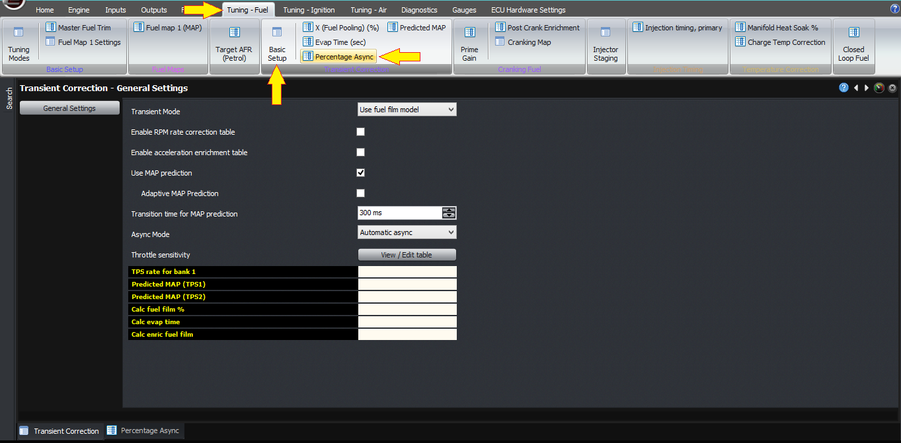  
  
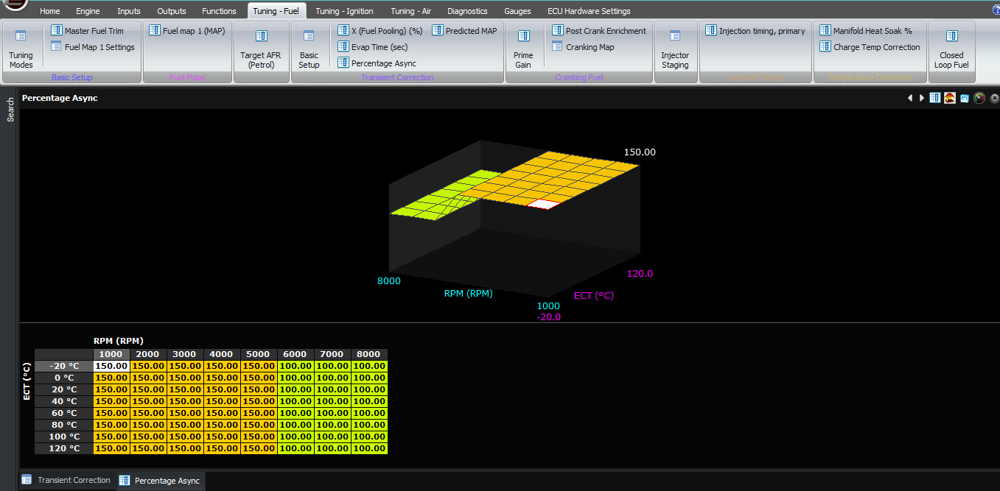  
  
The map is called the asynchronous gain. In the
                  above example, the ECU worked out that there was a shortfall
                  of fuel delivered of 43mg. If you set the async gain to 100%
                  at the current RPM and temperature, then that would cause the
                  ECU to deliver a new pulse from the injectors that corresponds
                  to 43mg worth of fuel. If you had set the async gain to 200%,
                  then the ECU would inject 86mg of fuel with the async pulse.
                  You can see that this is working on the async value in the
                  gauges.  
  
The best results are obtained by setting the async
                  gain to zero, and adjusting the injection timing to optimise
                  the response without async, optimising X and Tau and then
                  using the async function to get the last little bit of
                  response.  
  
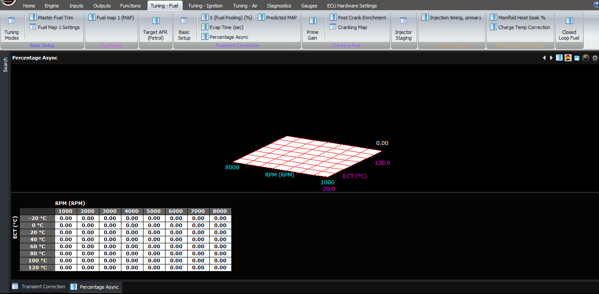  
  
The above description should be sufficient and so
                  far this has worked well. However if you do prefer to handle
                  the transient conditions manually, instead of with a model,
                  then you can also do this.  
  
Firstly, you can set the fuel film model to “manual
                  enrichments”, and this disables the fuel film modelling and
                  adjustments to the fuel requirements of the engine based on
                  transients. If you want to make corrections for transients,
                  which you will, they will need to be done using the manual
                  enrichment table.  
  
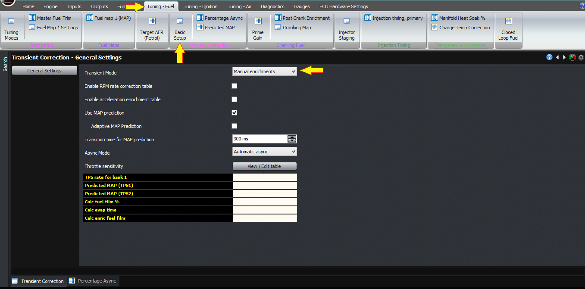  
  
To activate the manual enrichment table, you must
                  select the checkbox in the basic setup. This gives you three
                  more maps; enrichment time, enrichment amount and enrichment
                  multiplier.  
  
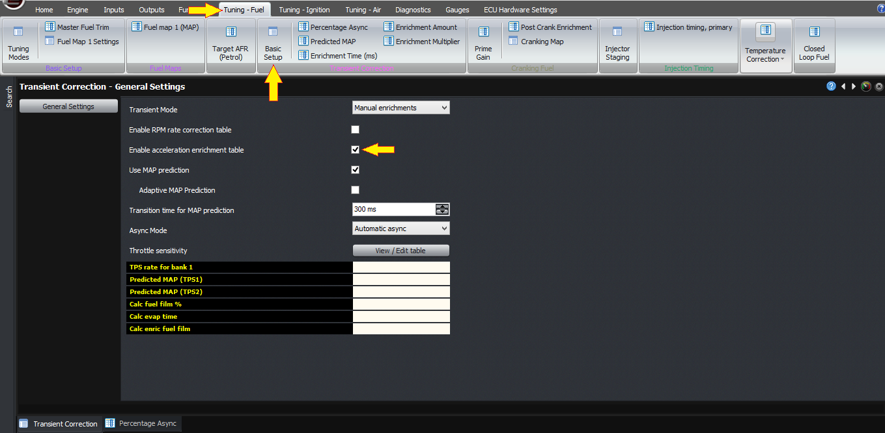  
  
The enrichment amount is the basic table, which
                  gives your percentage enrichment as a function of throttle
                  position and RPM. The ECU calculates a delta of this, for
                  example if you have 0% at TPS=0, and 40% and TPS =50%, and 50%
                  at TPS =100%, then when you go from closed throttle to 50%
                  throttle, you will have 40% enrichment, and then if you go
                  from 50% to 100%, after the first enrichment has finished, you
                  will have an additional 10%.  
  
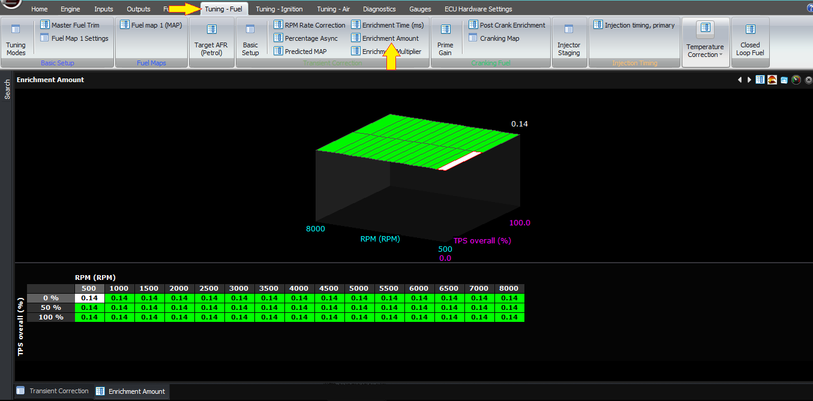  
  
The enrichment multiplier table is based on engine
                  speed and coolant temperature and allows for the fact that
                  engines generally may need more enrichment, even as a
                  percentage, at lower coolant temperatures. This is a
                  multiplier, so most of the time this table should be at 100%,
                  but if you want to add another 20% of enrichment at a certain
                  coolant temperature, you would enter 120%.  
  
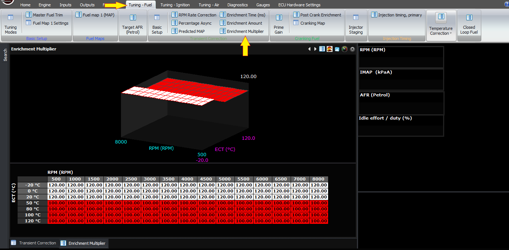  
  
The final setting is the enrichment time, which is
                  another map you can adjust if you want to do it manually.  
  
Note that you can also use this in conjunction with
                  the fuel film model if you wish to; it just shouldn’t be
                  necessary in theory.  
  
Another transient setting you can enable is the RPM
                  rate correction table. This table is based off RPM and load,
                  and the value is the percentage enrichment at an RPM rate of
                  1000 RPM/second. For example, if you wanted the ECU to always
                  enrich by 6% for a rate of 1000 RPM/second, across all RPM and
                  load conditions, you would fill the table with 6%. This also
                  means that at 500 RPM/second RPM rate, you would get a 3%
                  enrichment, and 2000 RPM/second would give you a 12%
                  enrichment. Again this condition should in theory be handled
                  by the fuel film model but it’s here if you want to set it
                  manually.  
  
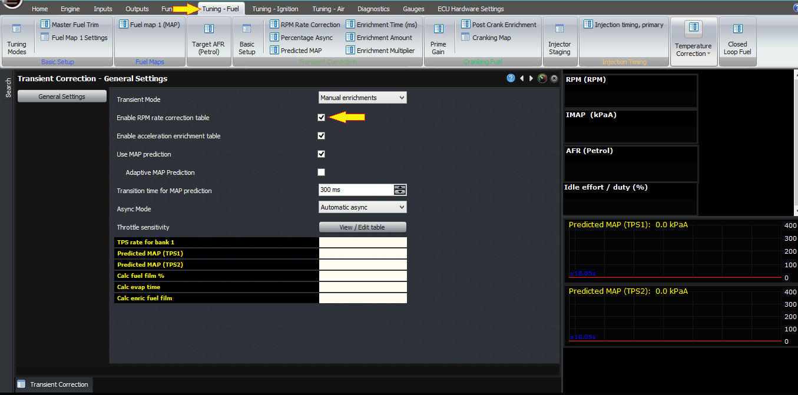  
  
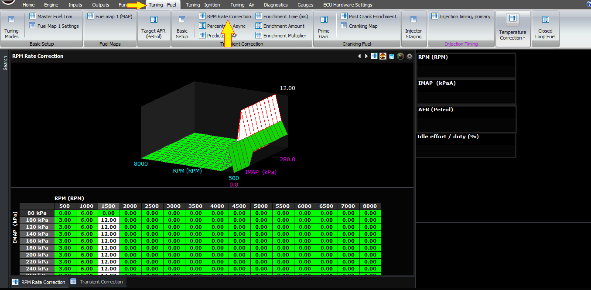  
  
There is also a manual asynchronous mode which can
                  be enabled, but when done so it is itself in milliseconds, not
                  percentage or milligrams or microlitres. When this setting is
                  enabled, you have 2 new tables; Async (RPM/ TPS) and Async
                  (RPM / ECT). These two are multiplied together. So for example
                  the RPM/ECT map would normally be set to 100% everywhere,
                  except slightly higher as required at the lower coolant
                  temperatures, and the RPM/TPS map would be your main
                  millisecond based asynchronous pulse map.  
  
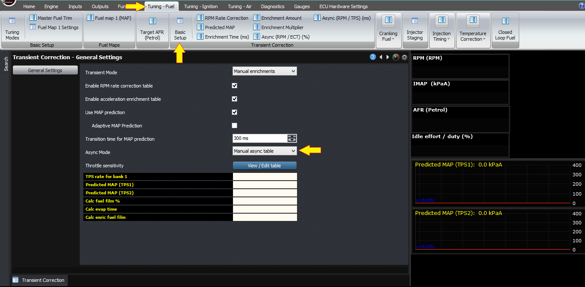  
  
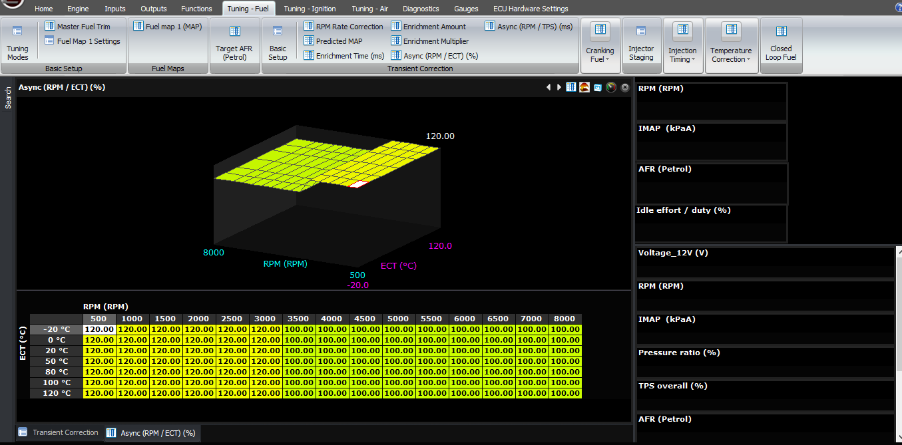  
  
In general we don’t recommend these manual modes,
                  because the results are often too specific to one engine or
                  installation, and they aren’t replicable to other engines. On
                  the one hand it prevents us from making a good starting point
                  because of this, and secondly it means that when people do
                  contact our support people for help, we have no way of seeing
                  if the table is right because it’s so specific to each engine.  
  
Please see my other videos on steady state fuel
                  calculation and also the injector model to gain a complete
                  understanding of how the fuel calculations work inside the
                  ECU.  
Thank you!  
©2018
        Adaptronic  
