  
  
  
  
  
  
[DOWNLOADS](#)[STORE](#)[CONTACT US](#)  
  
  
  
  
  
  

How Fuel Mass is Converted to Milliseconds on
              Modular ECUs

[go back to
                support home](EN_EUGENE_MOD_HOME.md)  

  
  
  

[Injection
                Timing on Port Injected Engines](EN_MOD_035_INJECTORTIMING.md)[
              ](EN_EUGENE_ABOUT.md)

[Selecting
                Injectors](EN_MOD_040_INJECTOR_SELECTIONINSW.md)

  

[  

              ](EN_SelFW.md)

  

  
  
  
  
  
  
  
  
If you’ve see the other videos or articles about how the ECU
                  calculates the amount of fuel to be delivered, you’ll have
                  seen that the end result of those is in the units of fuel
                  mass, not milliseconds. This article explains how the ECU
                  converts from fuel mass into milliseconds, and a bit about how
                  injectors behave.  
  
Firstly, let’s talk about injectors. A fuel injector for low
                  pressure EFI, as used on every port injected engine, is an
                  electromechanical device. It has mechanical and electrical
                  properties which are often not that well understood.  
  

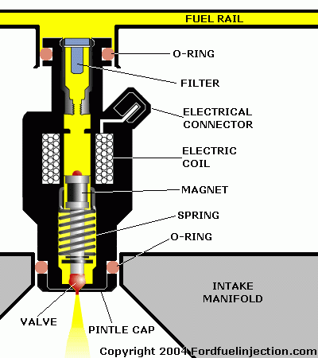
  
  
In this description I’m going to talk about fuel pressure.
                  When I talk about fuel pressure, I’m talking about the
                  differential fuel pressure across the injector, ie the fuel
                  gauge pressure minus the manifold gauge pressure. If you have
                  a manifold referenced regulator, this should be pretty much
                  constant.  
  

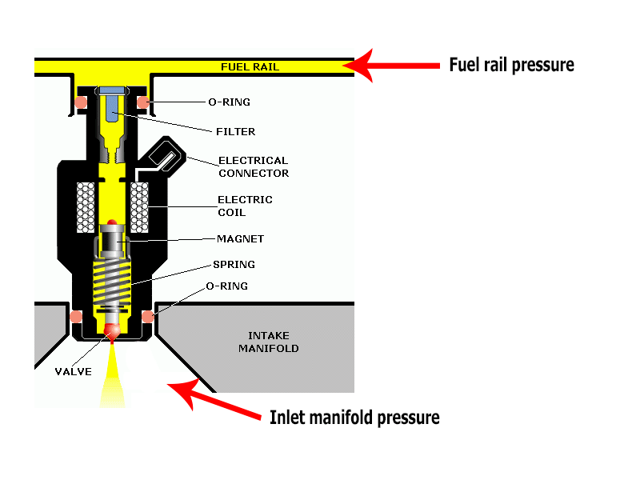
  
  
  

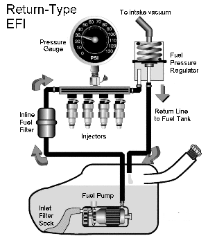
  
  
Manifold Referenced Regulator  
  
The fuel injector is designed so that the fuel pressure holds
                  the injector closed. The injector contains an electromagnet,
                  or solenoid, which pulls the injector open against this fuel
                  pressure force. The force which the solenoid exerts is
                  proportional to the current flowing through it, and therefore
                  you need a certain current to overcome the fuel pressure and
                  cause the injector to open.  
  
Electrically, the solenoid has inductance and resistance. So
                  its response can be written using the differential equation:  
  
v = L di/dt + iR  
  
where:  

- L is the inductance
- R is the resistance
- i is the instantaneous current
- v is the instantaneous voltage  
If you’re not familiar with differential equations, you might
                  be able to see or guess that the injector current depends on
                  the voltage that’s applied to it. A higher voltage gives you a
                  higher injector current. Not only that but the higher voltage
                  also causes the current in the injector to build up faster.
                  Therefore the amount of time it takes for the injector to open
                  depends on the voltage applied to it.  
  
Furthermore, at higher fuel pressures, higher injector current
                  is required for the injector to open. Therefore the amount of
                  time it takes for the injector to open depends on both fuel
                  pressure and supply voltage.  
  
Below is an example response from an aftermarket injector, the
                  Siemens 220lb/hr, taken at 3 bar of fuel pressure.  
  
This graph should be a straight line, intercepting the X-axis
                  at the amount of time it takes for the injector to open, and
                  then going up from there at a slope determined by the injector
                  flow rate.  
  
  
  
  

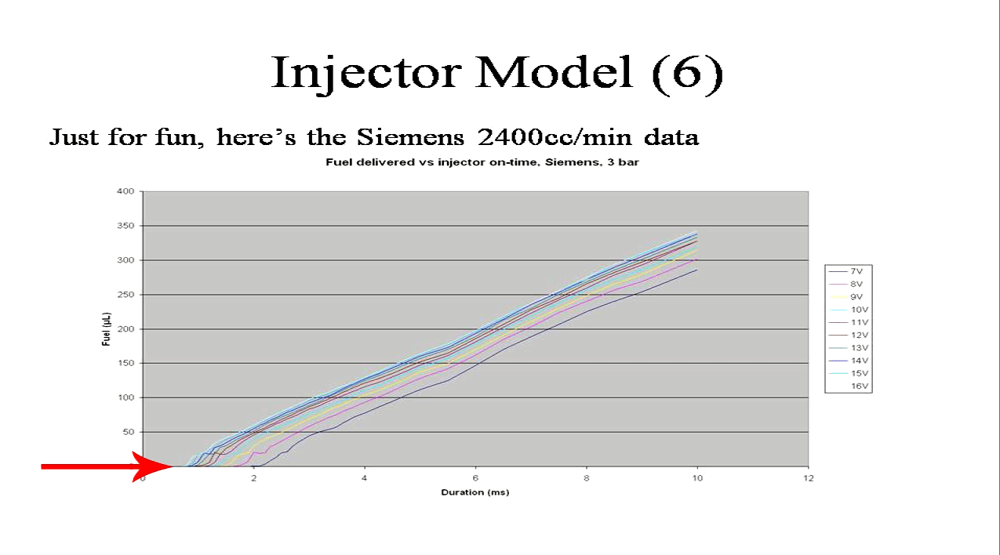
  
  
X-intercept is the line pointed by the arrow  
  
In practice we see several lines. These correspond to
                  different supply voltages for the injector. You can see that
                  the higher voltages cause the injector to open more quickly,
                  but once the injector is open, the fuel flow rate is basically
                  independent of voltage.  
  
If you have sharp eyes you will also see that at low opening
                  times, that is if we’re trying to deliver 25µL of fuel or
                  less, the curve has a bit of a kink to it. This is because of
                  pintle bounce – you only see this on underdamped injectors;
                  many don’t exhibit this behaviour at all. But what it means is
                  that if you want to deliver less than 25µL of fuel, it’s going
                  to be hard to achieve that accurately with this particular
                  injector.  
  

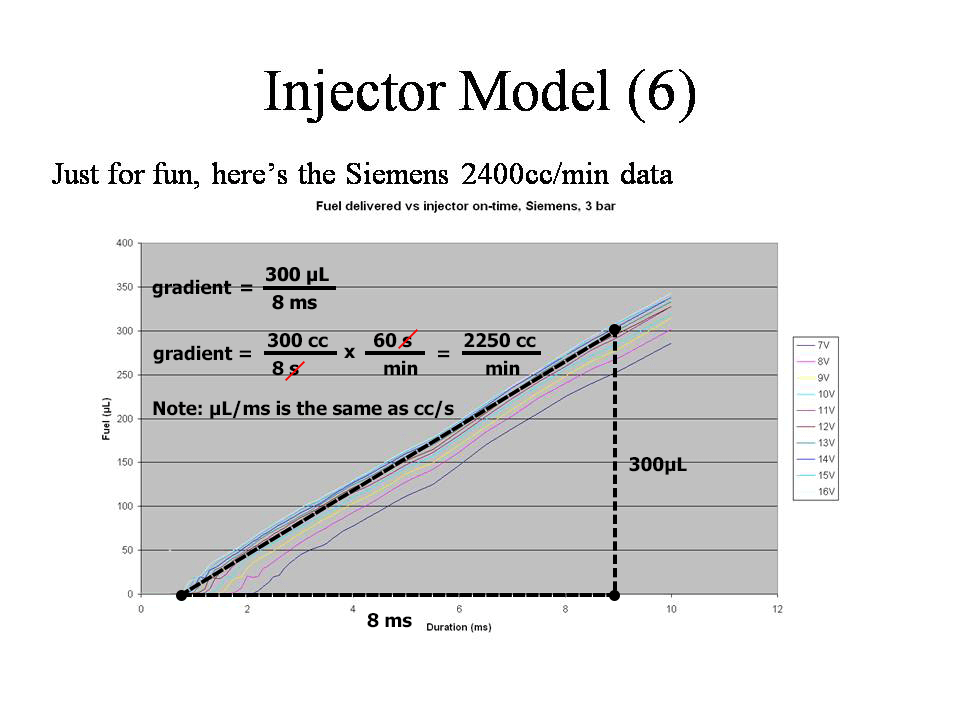
  
  
For every injector at any given pressure, there is a minimum
                  voltage required to open. We find in testing some injectors
                  that many of them won’t open at say 5 bar fuel pressure at a
                  low voltage like 7 or 8 Volts. In some cases injectors don’t
                  open reliably with 4 bar at 9V. You might be asking the
                  question “who cares; I have a decent charging system on my
                  car” but your charging system isn’t working when you’re
                  cranking the engine. It’s very common to see the supply
                  voltage drop to 8 or 9 volts during cranking, and if you’ve
                  upgraded your injectors to larger ones, but they aren’t high
                  powered enough to open at the low voltage at your nominate
                  fuel pressure, you’re going to be wondering why your engine
                  won’t start. People sometimes misdiagnose this – because after
                  you let go of the starter the voltage recovers quickly as the
                  engine is still spinning down, so the ECU is still injecting
                  fuel pulses during this time. Then when they hit the key the
                  second time, it starts. Because they haven’t diagnosed the
                  problem correctly they say that their problem is it always
                  takes 2 attempts to start, rather than my injectors aren’t
                  opening during cranking. Both are correct but the first one
                  would have you chasing cranking fuel settings when that’s not
                  the problem.  
  
Fuel injectors are essentially volume delivery devices,
                  because their flow rate does not change very much with
                  temperature. Therefore in this translation from mass to
                  milliseconds, we need to first calculate the volume.  
  
The ECU calculates the density of the fuel based on the
                  stoichiometric ratio, and the temperature if enabled. The
                  stoich ratio can be a constant, or it can be measured from a
                  flex sensor, but either way the ECU calculates the basic
                  density from this.  
  
If under the fuel system settings you enable “trim for fuel
                  density”, then the ECU will also compensate for changes to the
                  fuel density due to temperature (which themselves differ
                  between E0 and E100). This requires a fuel temperature sensor,
                  which can either be wired in, or you can read the fuel
                  temperature from a flex fuel / ethanol sensor.  
  

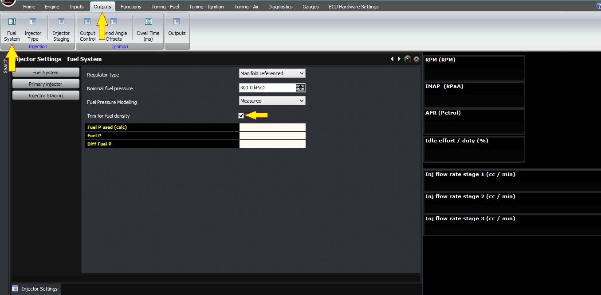
  
  
The current estimate of the fuel density is one of the
                  variables that you can see in the gauge window under
                  Intermediate Calculated Variables.  
  

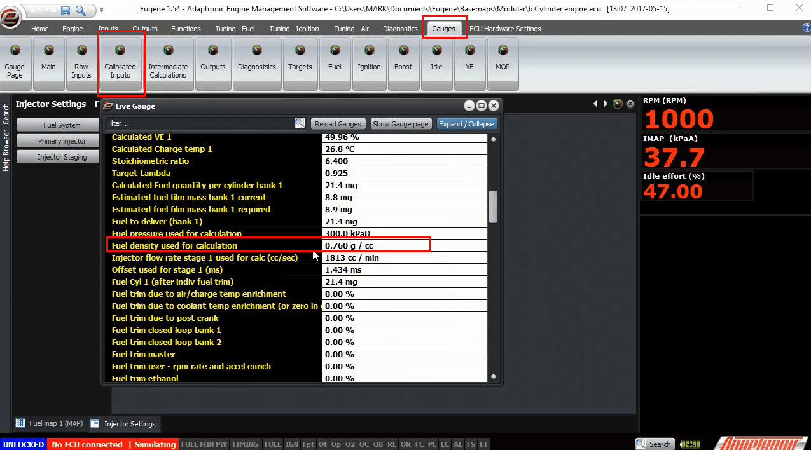
  
  
From the mass and the density, the ECU now knows the fuel
                  volume to deliver. This volume is split between the different
                  stages in accordance with the algorithm I described in the
                  injector staging video. Then each volume for each injector is
                  converted into a millisecond duration. This is done as
                  follows.  
  
Firstly, you can specify a minimum fuel volume for the
                  injector to deliver. If you enter a non-zero value in this
                  setting, the ECU will “clip” the value using this as a
                  minimum. For example if you look at the injector performance
                  graph and find that the injector is unreliable at less than 10
                  µL, you can enter 10µL and instead of the ECU trying to
                  deliver 8 which might result in missing fuel all together, it
                  will deliver 10.  
  

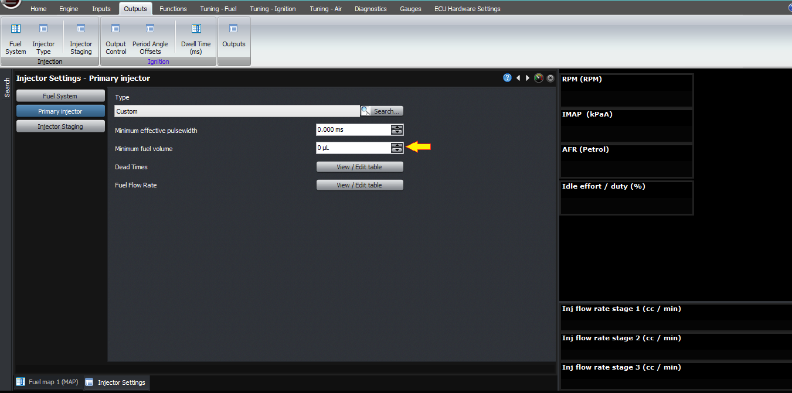
  
  
Secondly, the ECU then calculates the effective on-time from
                  knowing the flow rate and the volume required to be delivered.  
  
For those who prefer to think in effective milliseconds rather
                  than fuel volume, the Modular ECUs also have a minimum
                  effective on-time which can clip the fuel duration, so you can
                  use either this one or the volume based one. Just set the
                  other one to zero so they both aren’t working together!  
  

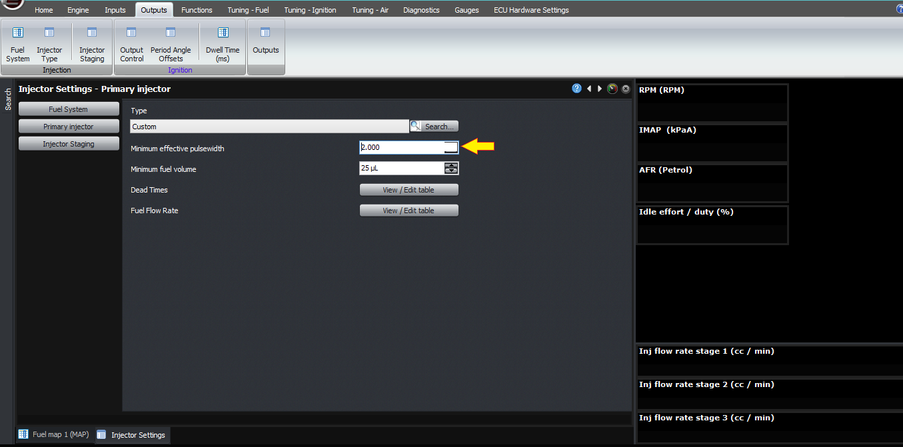
  
  
Next, the ECU has a 3D map of offset, or dead-time, as a
                  function of battery voltage and fuel pressure. Note that this
                  is the differential fuel pressure, so the pressure across the
                  injector. This can be determined in 2 ways.  
  

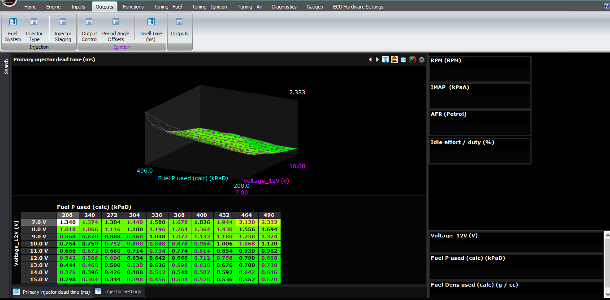
  
  
The first way is to measure it directly using a fuel pressure
                  sensor. See the sensor setup video for information on how to
                  configure pressure sensors. The ECU then measures the fuel
                  pressure and subtracts the manifold pressure to determine the
                  differential fuel pressure, which is a variable you can see on
                  the gauges window and should be fairly much constant with a
                  manifold-referenced regulator. The ECU then uses this value to
                  look up the offset and flow rate the injector settings.  
  
The second way is to use a nominal figure that you enter. For
                  this, there are two types of fuel systems that we support; one
                  is the manifold-referenced pressure regulator, where the
                  pressure regulator aims to achieve a constant differential
                  fuel pressure. The other is the fixed pressure, where this is
                  no hose from the inlet manifold to the pressure regulator, and
                  the gauge fuel pressure is constant. In this mode, the
                  differential fuel pressure varies based on manifold pressure,
                  so the ECU needs to know this to know to look up different
                  flow rates and offsets as the differential fuel pressure
                  changes.  
  
  
  
  

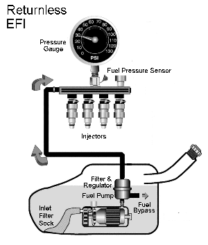
  
  
Fixed Fuel Regulator  
  
You can enter these tables manually if you have the equipment
                  and expertise to characterise injectors, or you can select
                  from a set of predefined injectors that we have already
                  characterised. I need to give a big thank you to Paul Yaw from
                  Injector Dynamics for his assistance with the
                  characterisation.  
  
If you select a predefined injector for which we have the
                  short pulse correction information, which is all of the
                  Injector Dynamics injectors, this is added automatically by
                  the firmware.  
  
Note that the current offset and flow rates are also displayed
                  in the gauges under intermediate calculated values so that you
                  can see what the ECU believes the injector to be doing.  
  
One last point; watching the differential fuel pressure is
                  very instructive. If you have a decent pressure regulator like
                  a Turbosmart FPR800 or 2000, the differential fuel pressure
                  hardly moves at all; it’s very stable. If you see it move more
                  than about 10 kPa then there’s some kind of a problem. We’ve
                  been able to diagnose poor fuel pressure regulators on
                  customers’ cars very quickly by watching this variable alone,
                  and we highly recommend adding a fuel pressure sensor to any
                  car that you’re tuning, for the simple reason that fuel
                  pressure makes such a big difference, and as someone said… I
                  can’t remember who, probably an American like Shane
                  Tecklenberg, Greg Banish or Paul Yaw, if you don’t have data,
                  you have an opinion!  
  

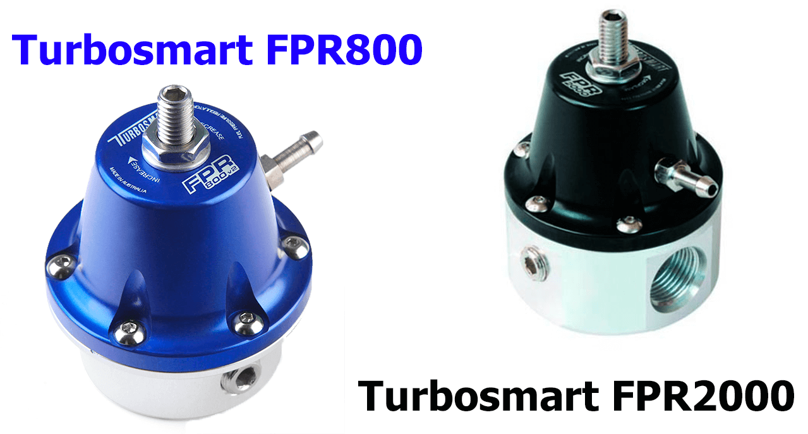
  
Thank you.  
  
©2018
        Adaptronic  
  
