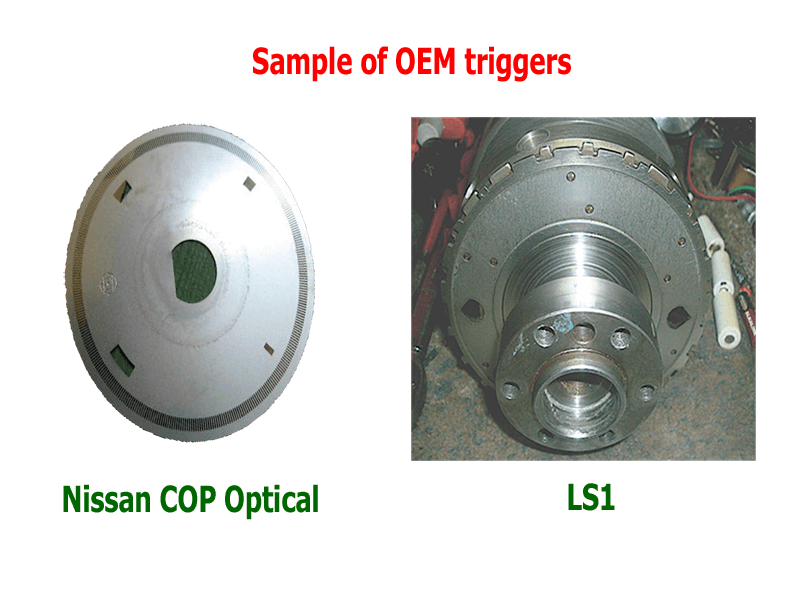
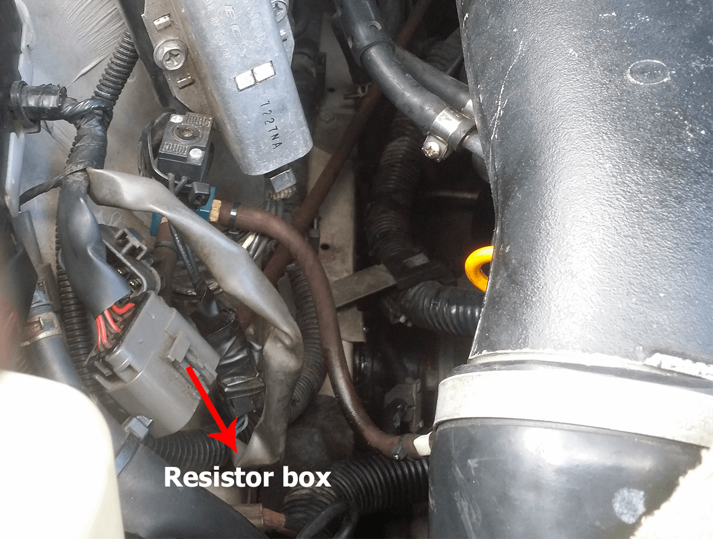
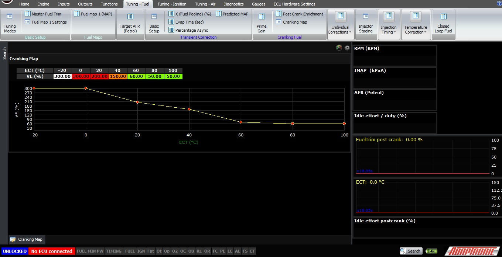
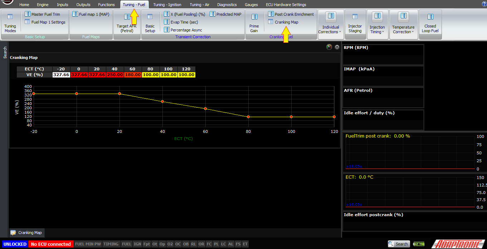
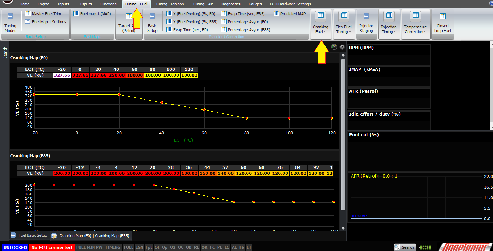
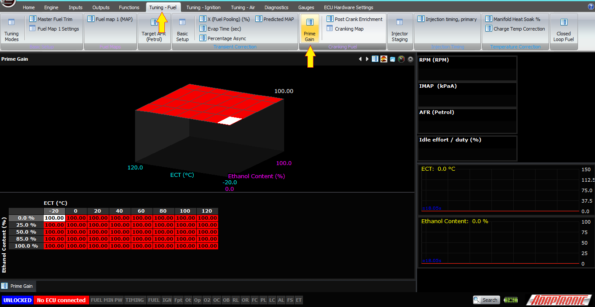
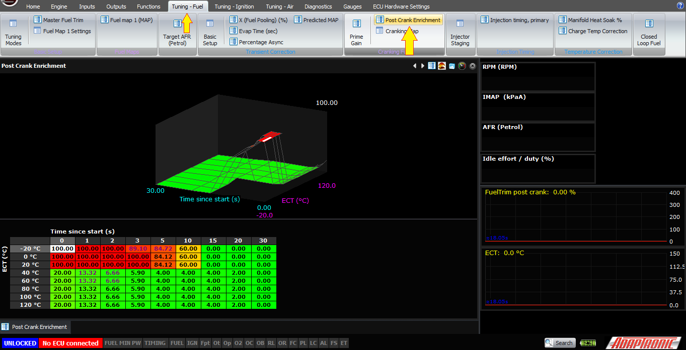
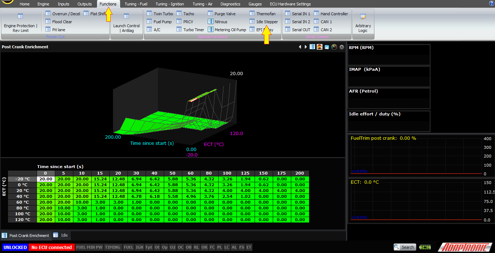

  
  
  
  
  
  
[DOWNLOADS](#)[STORE](#)[CONTACT US](#)  
  
  
  
  
  
  

Cranking Conditions on Modular ECUs

[go back to
                support home](EN_EUGENE_MOD_HOME.md)  

  
  
  

[Fuel
                Model](EN_MOD_029_FUELMODEL.md)

[How
                Fuel Mass is Converted to Milliseconds  

              ](EN_MOD_032_INJECTORMODEL.md)

  

[  

              ](EN_SelFW.md)

  

  
  
  
  
  
  
  
  
  
  
Cranking conditions are different
                  from when the engine is actually running for several reasons:  

- The engine speed is much lower, eg 180 – 240
                      RPM
- The engine speed changes throughout the cycle
                      as each cylinder or rotor does its compression stroke
                      (that’s the characteristic nyeh sound)
- The battery voltage is much lower than when the
                      engine is running  
The ECU determines whether the engine is cranking or
                  in its running state by comparing the current engine speed to
                  the cranking RPM threshold. If the engine speed is less than
                  this RPM threshold then the ECU enters cranking mode which has
                  different behaviour from when the engine is running, which is
                  what I will describe in this article.  
  
To get an engine to start nicely and reliably, there
                  are a few considerations.  
  
The first, and this is often overlooked but it’s
                  crucial, is to have a good trigger setup. The earlier the ECU
                  knows where TDC is and which cylinder it’s up to, the sooner
                  it can start generating engine synchronous pulses like
                  ignition and injector events. With the Select ECUs people
                  would often describe a problem with their setup being “hard to
                  start” and asking what they should do with the cranking
                  settings, while all along the problem was they didn’t have a
                  good trigger setup.  
  
If the ECU shows RPM=1 during cranking, this means
                  that the ECU knows that the engine is turning, for example it
                  has seen some activity on CAS1, but it doesn’t yet know where
                  TDC is. As a result it can’t fire any outputs. But we display
                  the RPM as 1 instead of 0 during this time to help with
                  problem diagnosis.  
  

  
  
This means, apart from the fact that it actually has
                  to work correctly (for example if you have a multitooth and a
                  reset, then it won’t work if the reset is not working), that
                  it’s a good idea to have a good trigger for your particular
                  engine. OEMs generally know what they’re doing, and many OEM
                  triggers for example the Nissan COP optical and LS1 have
                  excellent trigger patterns which can tell the ECU where it is
                  within the 720 degree cycle with 180 degrees of crank rotation
                  or less. If you’re going to make changes to the OEM system
                  then you need to understand the consequences of those changes
                  – for example if you wire up a non-VVT 2JZ engine and only
                  connect one of the cam triggers then it could take up to 6
                  nyehs before the ECU even knows where TDC is. Or if you
                  convert a distributor type Nissan optical system to coil on
                  plug, the engine may need to crank for up to a full cam
                  revolution for the ECU to know which cylinder to fire (which
                  is not an issue on the distributor system because the
                  distributor handles that).  
  
Next, we will consider battery voltage. The main
                  effect of this is that there’s less voltage available to make
                  the injector open. The injector needs a certain amount of
                  force to open against the fuel pressure, and that force comes
                  from the injector current. The current comes from the voltage,
                  so at a lower battery voltage there’s less force available.
                  This means that the injector dead time has to be set correctly
                  against different voltages, which is why we recommend using
                  injectors which we have characterised. One trap I’ve seen some
                  young (and sometimes not so young) players fall into is to
                  take a car which had low impedance injectors from the factory,
                  with a series resistor pack in the original wiring – and
                  change the injectors to high impedance type but leave the
                  resistor pack in. If you remember Ohm’s law it will be obvious
                  why this will cause problems, but the problem is that
                  sometimes there’s still enough current with the resistor pack
                  installed for the injector to open at 14V, but not at 10V or
                  less when the engine is cranking. This can lead the
                  inexperienced tuner to believe that there’s a cranking fuel
                  problem.  
  

  
  
When the engine is stopped, and during cranking, the
                  ECU will hold the idle valve open at 100%, to make the engine
                  easier to start. This means that on a PWM idle control valve,
                  it will be fully open. On a stepper motor idle controller, it
                  means the ECU will fully retract the plunger which also has
                  the benefit of homing the stepper motor. On an electronic
                  throttle car, it means that the target throttle position will
                  be the idle authority plus whatever the pedal is commanding –
                  eg if the idle authority is 20% and the pedal is at 0%, then
                  the target throttle position will be 20%.  
  
Finally, we will discuss ignition and fuel delivery
                  during cranking.  
  

  
  
Ignition timing is controlled by a map of target
                  ignition timing vs coolant temperature. The ECU may not have a
                  good indication of the engine angle as the engine rotates,
                  because as I mentioned before the engine speed changes a lot
                  throughout the cycle. So the ECU will try to time the pulse
                  based on that angle, but if it gets to a tooth past that angle
                  and hasn’t fired yet, it will generate a pulse. So this means
                  that pulses can be generated based on the availability of a
                  trigger event close to TDC.  
  
Most engines are happy to fire at about TDC during
                  cranking – sometimes earlier, on some engines up to 10°BTDC.
                  Some engines really don’t like this though, especially high
                  compression ones, and sometimes firing too early can “stall”
                  the starter motor. On some engines I’ve even heard of starter
                  motors breaking and being flung off engines when this has
                  happened. So before firing up an engine it’s usually a good
                  idea to disable the fuel to the engine and crank just with the
                  ignition, and check the timing with a light.  
  
Lastly, we’ve come to the fuel delivery during
                  cranking. This comes in two stages; the first is a prime pulse
                  that fires on all the injectors at once to get an initial
                  amount of fuel into the engine and wet the runner walls, and
                  after that the injection pulses are delivered synchronously
                  just as when the engine is running.  
  
The first table we will look at is the Cranking Map,
                  which you can find under fuel tuning -> cranking. This is a
                  simple VE table (or you can override it to b e in milliseconds
                  if you wish) against coolant temperature. If you are running
                  flex fuel, then you will have one of these for E0 and one for
                  E85. This is the VE of the engine at cranking, to get the
                  right amount of fuel into the engine tog et it to fire.
                  Normally we see values of about 80% when the engine is warmed
                  up, and higher when the engine is cold, for example 150 – 200%
                  on petrol / gasoline. On ethanol the cranking fuel needs to be
                  even higher, for example 300%.  
  

  
  

  
  
If you need to adjust the number and you’re not sure
                  which way to go, here’s the technique I use. If the engine has
                  too little fuel, then putting a bigger number in there will
                  make it fire up more quickly. If it’s either very rich on
                  immediate post-start, or it fails to start until you open the
                  throttle and then it fires up, then that means you have too
                  much fuel.  
  
The next table we’ll talk about is the prime gain.
                  This is a 3D table against coolant temperature and ethanol
                  percentage. This is an asynchronous pulses on all the primary
                  injectors at once, when the ECU first detects RPM. Note that
                  it doesn’t need to know where TDC is, it just needs to see
                  some activity on the CAS1 input. This prime gain is a
                  percentage of the cranking pulse. So for example if your
                  normal cranking pulse width is 10ms, and you put 50% in the
                  prime gain table, then the ECU will do an asynchronous pulse
                  of 5ms (assuming dead time = 0) when it detects the engine has
                  started to rotate, on all the primary injectors.  
  

  
  
The final tables we’ll discuss are what happens
                  after the engine fires up. The variable called “Time since
                  starting engine” will start to count up from zero (in
                  seconds), and this is used to reference two tables. One of
                  them is the post crank enrichment – whose two axes are time
                  (since starting the engine) and coolant temperature. The
                  values in the table are then the percentage enrichment
                  required.  
  

  
  
The other table has the same axes and that’s the
                  post-crank idle-up function. This additional idle effort gets
                  added to the other idle calculations. While the ECU is in
                  post-crank idle-up, which means that the interpolated value
                  from the 3D map is greater than 1%, the ECU will not go into
                  closed loop idle or overrun fuel cut.  
  
  
  
  

  
  
Functions>Idle Stepper>Base Idle>Post Crank Idle  
  
There are a few variables to get right, but once you
                  do it’s nice to have an engine that starts like an OEM engine.  
  
Thank you.  
  
  
©2018
        Adaptronic  
  
