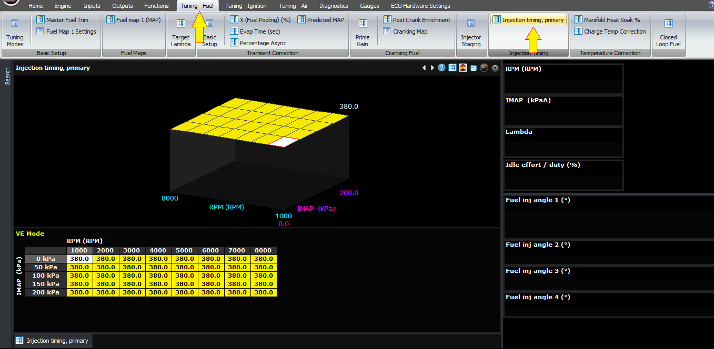
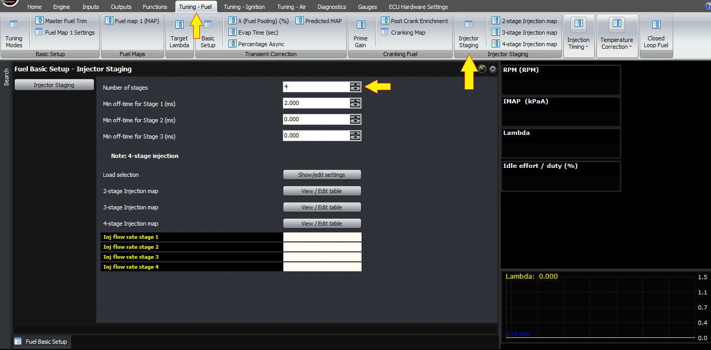
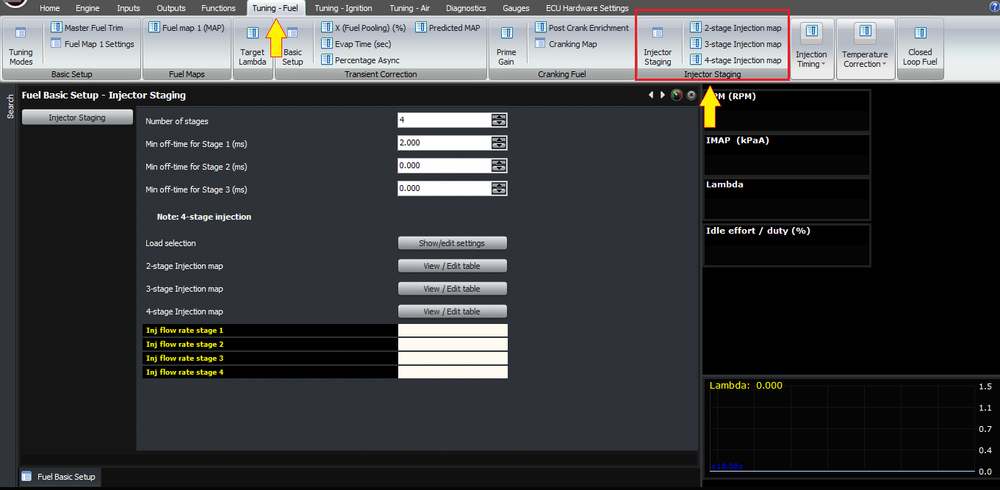

  
  
  
  
  
  
[DOWNLOADS](#)[STORE](#)[CONTACT US](#)  
  
  
  
  
  
  

Injection Timing on Port Injected Engines on
              Modular ECUs

[go back to
                support home](EN_EUGENE_MOD_HOME.md)  

  
  
  

[Staged
                Injection](EN_MOD_013_STAGEDINJECTION.md)

[Selecting
                Injectors  

              ](EN_MOD_040_INJECTOR_SELECTIONINSW.md)

  

[  

              ](EN_SelFW.md)

  

  
  
  
  
  
  
  
  
  
This article is very brief and just
                  covers the timing of injector outputs on port injection
                  engines. It does not cover direct injection systems.  
  
Injector timing on the Modular ECUs can be mapped
                  against RPM and load, and the number represents the end of the
                  injection pulse in degrees BTDC.  
  
  
  

  
  
Injector Timing Table  
  
On a staged injection engine, you can set the
                  injection timing separately for each stage, to promote better
                  mixing, minimise water hammer in the fuel rails and so–on.  
  
  
  

  
  
Number of injection stages can be found under “Injector
                    Staging”  
  
  

  
  
Injection timing can be set separately  
  
In terms of appropriate values for injection timing,
                  there are a few possible ways to do it, and to some extent it
                  depends on what you’re trying to optimise.  
  
One technique I’ve seen people do is to adjust the
                  injection timing until the indicate air-fuel ratio is richest
                  (given constant fuel delivery), indicating that the combustion
                  is most complete (least air left over). I don’t know if
                  corresponds to any other real world effects such as minimum
                  emissions or maximum torque, both sound reasonable but I won’t
                  believe it until I see some data.  
  
A common technique is to do what they call closed
                  valve injection, where the end of the injection pulse happens
                  before the intake valve opens. This requires a value of about
                  380° or higher. For the off-idle throttle response, 
                  injection timing can make a big difference and I’ve found
                  values like 380 work fairly well.  
  
Throughout medium to high RPM and on load, injection
                  timing can have an impact on torque, depending on the engine.
                  On a production engine it makes less of a difference than on a
                  high overlap engine in my experience.  
  
Another use for adjusting injection timing is to
                  minimise HC emissions. On a large-overlap engine, for example
                  an engine with big cams, often emissions will be lower by
                  injecting the fuel after the exhaust valve has closed. This
                  means that no fuel can “short circuit” the engine under open
                  throttle conditions. In tuning cars for emissions I’ve found
                  this makes a big difference, but you’ll need a 4 or 5 gas
                  analyser to see it.  
  
Rotaries I’ve found like values around 180 degrees
                  to have decent off-idle response, and side-port engines don’t
                  seem very sensitive to injection timing. Naturally aspirated
                  peripheral intake port engines are a different story however.  
  
Finally, as I mentioned before you can set the
                  timing differently on different stages if you want to. When I
                  tried this on my 13B turbo before she went to a better place,
                  I didn’t find it made any difference to torque at all, but one
                  tuner has told me it does so the option is there in case you
                  need it. At the very least you can ensure that you don’t have
                  multiple stages with the same end of injection angle adding to
                  the water hammer effect of the injectors closing.  
  
Thank you.  
  
  
©2018
        Adaptronic  
  
