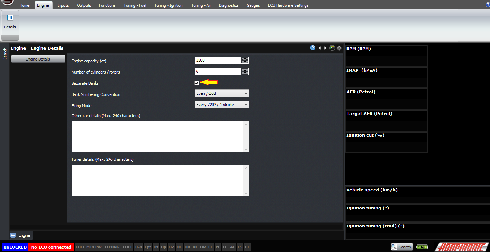
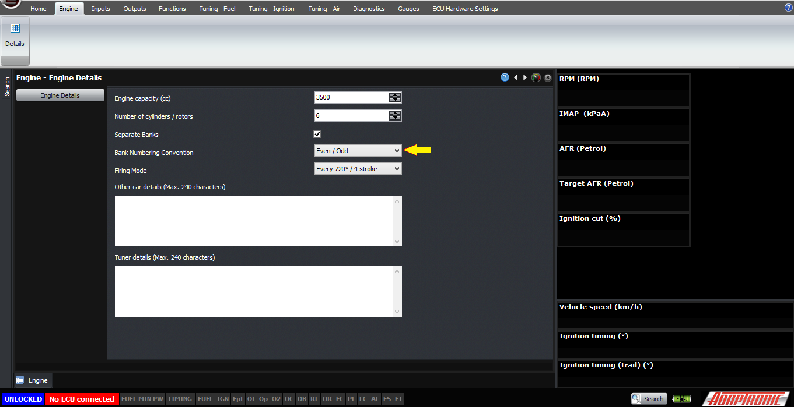
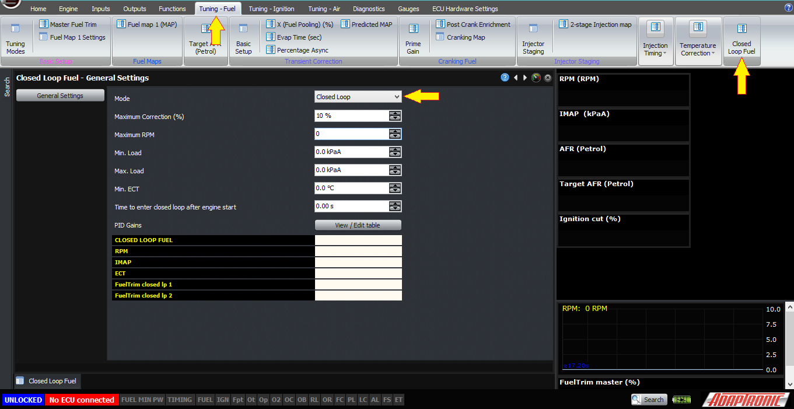
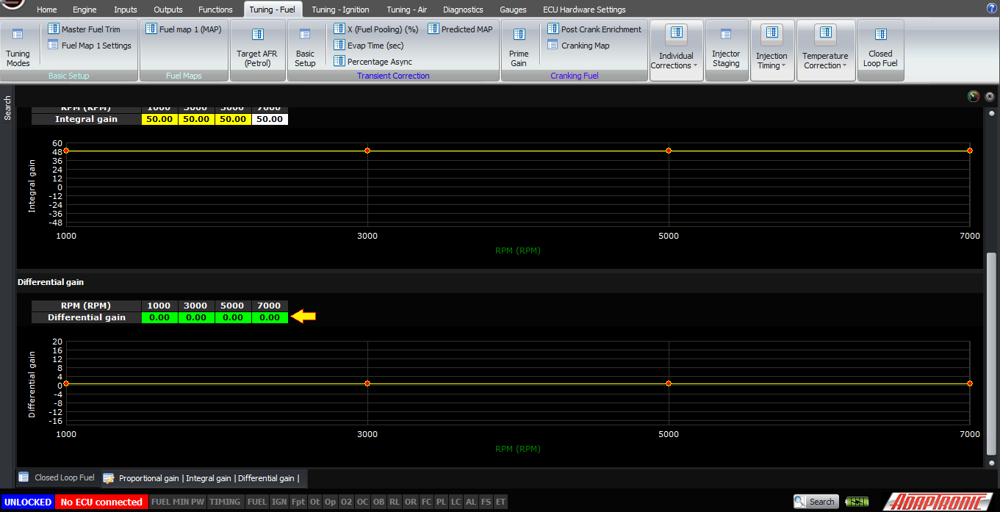
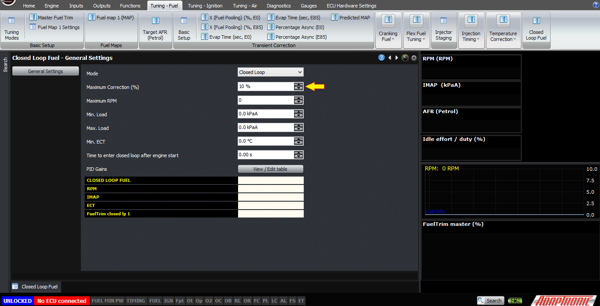

  
  
  
  
  
  
[DOWNLOADS](#)[STORE](#)[CONTACT US](#)  
  
  
  
  
  
  

Setting Up Closed Loop Fuel Control on Modular
              ECUs

[go back to
                support home](EN_EUGENE_MOD_HOME.md)  

  
  
  

[Measuring
                Fuel Pressure on Mazda RX7s](EN_MOD_006_FUELPRESSURE_FD.md)

[Different
                Fuel Tuning Modes  

              ](EN_MOD_027_FUELTUNINGMODES.md)

  

[  

              ](EN_SelFW.md)

  

  
  
  
  
  
  
  
  
  
All Adaptronic ECUs support closed
                  loop fuel control. This article explains what is required and
                  how to configure it.  
  
Firstly, and this should be obvious but I’ll say it anyway,
                  you have to have your target lambda set correctly in your
                  target lambda map.  
  
Secondly, you need some kind of lambda measurement. Normally
                  this would be a wideband lambda sensor, because with a
                  narrowband you can really only know which side of lambda 1 you
                  are, so doing closed loop for another mixture is not possible.  
  
  
  
  

  
  
Sample of wideband sensor  
  
If you are running a dual bank engine, then we would recommend
                  enabling the separate bank setting in the engine settings, and
                  running a separate lambda sensor on each bank. Make sure you
                  set the bank configuration correctly, ie whether the cylinder
                  numbers are numbered odd and even or first half and second
                  half. The first oxygen sensor must be for the bank which has
                  cylinder 1 in it (eg the odd bank), and the second one must be
                  the other bank. This also works on engines such as the
                  RB26DETT, which has a separate oxygen sensor for the front and
                  the back halves of the engine, and in this case the bank
                  numbering would be set as first half / second half, so that
                  one “bank” is 123 and the second “bank” is 456. Also in this
                  mode the oxygen sensor type should be set to “individual”.  
  
  
  
  

  
  
Enabling separate banks mode  
  
  

  
Select appropriate bank number convention for your engine  
  
Other articles and videos explain how to set up various
                  wideband lambda sensors so I won’t go into that here.  
  
The ECU needs some conditions to be met before it will
                  consider a lambda reading to be “valid”. If the input is not
                  valid then the software will just show a dash instead of a
                  lambda value and the ECU will be forced into open loop mode.
                  These conditions are different for different sensors.
- A 0-1V sensor must exceed X V for Y sec to be
                      considered working.
- A 0-5V sensor must exceed X V for Y sec to be
                      considered working.
- An Innovate wideband must be sending packets,
                      and the data in the packets must show a valid AFR or
                      lambda value. If this is true then it will display an
                      actual AFR or lambda value in Logworks. Note that if the
                      sensor is in free air, an MTX-L gauge will display a full
                      lean reading, even though it won’t send a lambda value out
                      the serial stream (it sends the O2 concentration instead)
- For the widebands that send data out the serial
                      stream but do not send the sensor status, for example
                      Zeitronix, AEM and PLX, the ECU just needs to see valid
                      serial data. If there’s valid serial data then the ECU
                      trusts the sensor, even though when the sensor is cold,
                      the controller for this devices outputs an incorrect
                      lambda value.
- For the CAN wideband inputs, they must show
                      that the sensor is online and working.Thirdly, you will need to set the conditions
                  required for the ECU to go into closed loop. The are some
                  conditions in which the ECU will never go into closed loop
                  fuel mode, and these are as follows:
- When the engine is stopped, or cranking
- When the engine is in ignition or fuel cut
- If there’s no valid reading from the lambda
                      sensor
- If the mode selected is “open loop”
- If the RPM is higher than the maximum RPM
                      selected for closed loop
- If the load is either higher than the maximum
                      or lower than the minimum required for closed loop
- If the coolant temperature is lower than the
                      minimum ECT selected for closed loop  
If you have met the conditions required, then the ECU will go
                  into closed loop mode, and you can see this on the closed loop
                  general settings page. You can also see here the variables
                  that allow or prevent closed loop operation such as RPM, load
                  and coolant temperature, as well as the closed loop fuel trim
                  for each bank.  
  

  
  
The PID gains can be set against RPM, for example often the
                  engine will develop a rich-lean closed loop hunt at idle if
                  you use the gains optimised for higher RPM operation. Typical
                  values we would use for the PID gains would be 50% for P and
                  I, and 0 for D.  
  
50% value fo P and I  
  
  
  
  

  
  
0% is set for D  
  
Another setting you may want to adjust is the
                  maximum correction percentage. This changes the amount of
                  correction that the ECU can provide due to the closed loop
                  behaviour. Typical values might be 10 or 20%.  
  

  
  
Finally, please remember that closed loop is not
                  supposed to be a substitute for having a good fuel map. It
                  will help with systematic changes that affect the mixture for
                  which you haven’t accounted, but if you have one part of the
                  map that’s rich and another that’s lean, and you go to the
                  rich part and let the closed loop stabilise, then when you go
                  to the lean part it will be extra lean. So if you’re tuning
                  manually then generally you’d have closed loop turned off, so
                  you can see what the map itself is doing rather than how well
                  the closed loop can correct it.  
  
Thank you!  
  
  
©2018
        Adaptronic  
  
