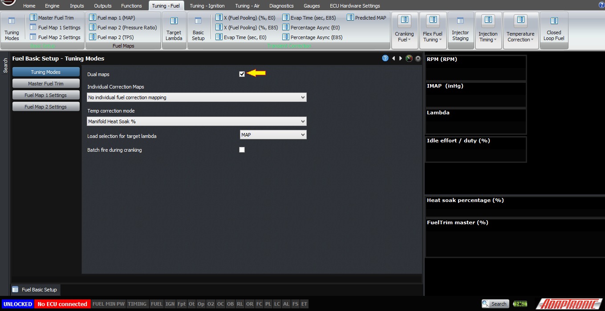
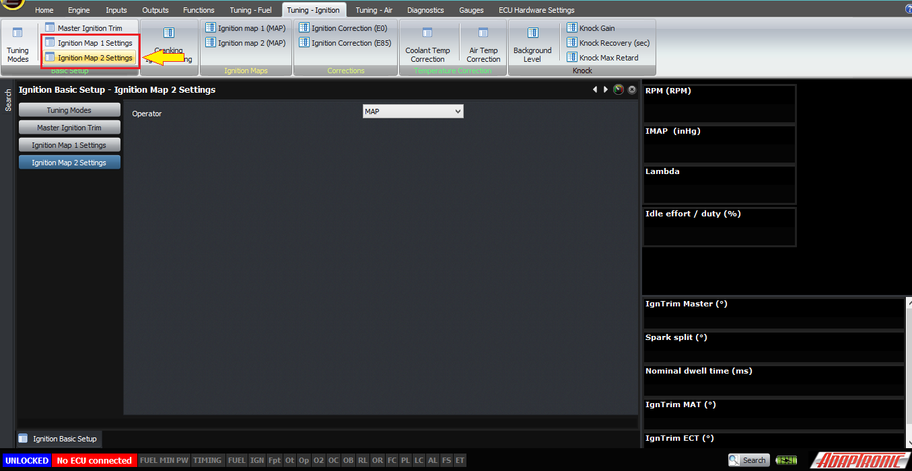
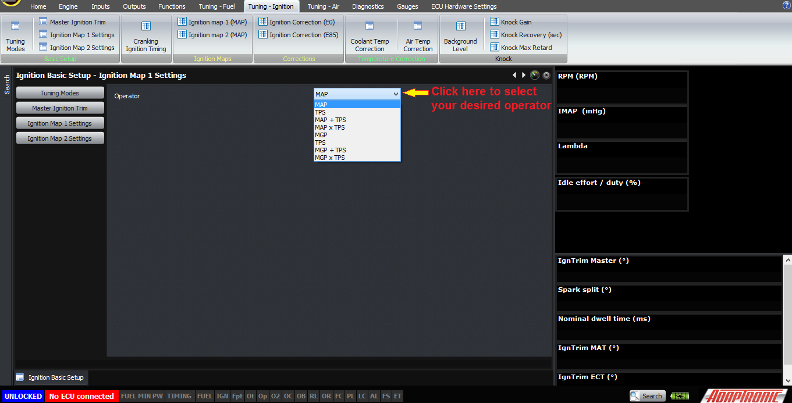
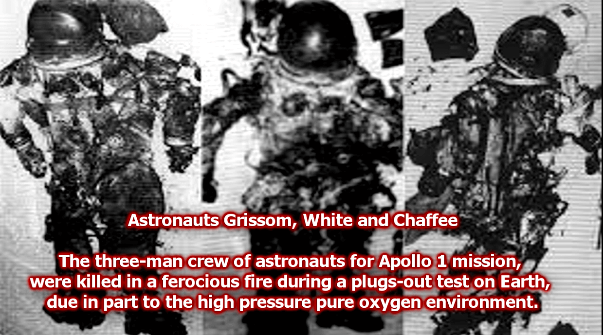
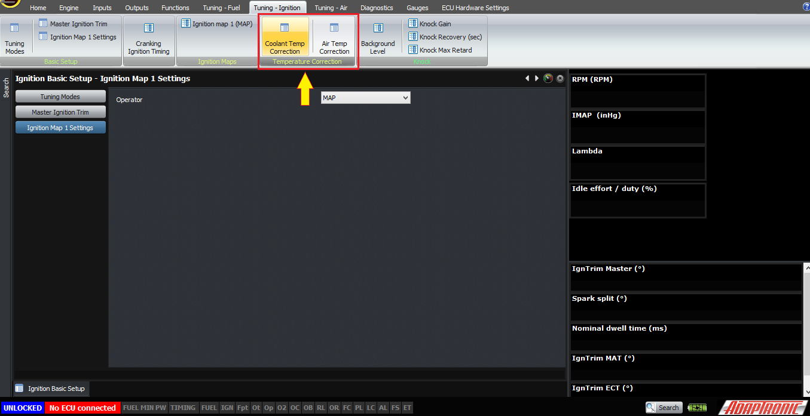
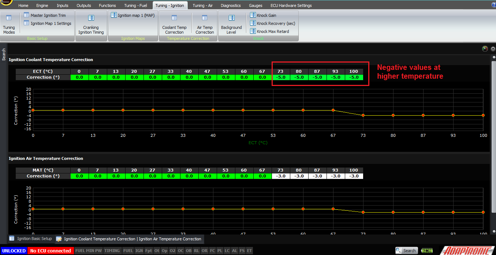

  
  
  
  
[DOWNLOADS](#)[STORE](#)[CONTACT US](#)  
  
  
  
  
  
  

Ignition Timing Tuning Modes on Modular ECUs

[go back to
                support home](EN_EUGENE_MOD_HOME.md)  

  
  
  

[Triggering
                on Modular ECU](EN_MOD_009_TRIGGERING.md)

[Setting
                Base Timing on Modular ECUs  

              ](EN_MOD_012_BASETIMING.md)

  

[  

              ](EN_SelFW.md)

  

  
  
  
  
  
  
  
This article explains the different load
                  axes of ignition mapping, as well as temperature corrections
                  for ignition timing.  
  
Similarly to the fuel mapping, the Adaptronic
                  Modular ECUs can use a combination of MAP and TPS for ignition
                  timing tuning. The ideal measurement would be the pressure of
                  the air in the cylinder, which would be best approximated by
                  MAP x VE. However we wouldn’t want a system whereby someone
                  changes the fuel map and then that changes the ignition timing
                  as well – even though that might be scientifically accurate,
                  it’s important for ECUs to behave as tuners expect them,
                  otherwise the tuner can’t make the ECU do what is needed.  
  
It’s set in the settings for your ignition map, so
                  if you’re using dual maps there will be a setting for ignition
                  map 1 and another for ignition map 2.  
  
  
  

  
  
Tuning-Ignition > Tuning Modes then enable dual maps  
  
  

  
  
Notice that the ignition maps can be set separately.  
  
The most basic is MAP. This has a pretty good
                  correlation with the pressure of the air that’s in the
                  cylinder, and therefore how quickly the flame front spreads
                  through the engine, which is what you need to compensate for
                  when you tune ignition timing against load. So this is the one
                  we recommend most of the time.  
  
  
  

  
  
Changing “Operator” can be found in “Ignition Map Settings”
                    page  
  
If you don’t have a MAP measurement, then you will
                  have to use throttle position instead. This does not correlate
                  all that well with pressure in the cylinder; at low RPM
                  especially there will be a lot of movement within the first
                  20% of throttle change and from then on it won’t change much
                  at all. So tuning ignition on throttle position will take
                  longer than on manifold pressure but on some engines that all
                  that is available.  
  
Although pressure ratio is perfect for tuning fuel,
                  it’s not appropriate for ignition timing – if it’s not obvious
                  why then I’ll leave that as an exercise for you to work out.  
  
We also offer MGP as a measurement. I don’t
                  personally think it’s a good idea, because it’s a absolute
                  pressure that affects the flame propogation rate, not the
                  pressure relative to the outside of the engine. The rapid
                  spreading of the Apollo 1 fire and a similar event in the USSR
                  was due partially to the pure oxygen environment but also the
                  elevated pressure; they had the command module pressured to
                  about 1.1 bar or 16 PSI of absolute pressure during the Apollo
                  1 fire when the flammability testing was all designed to
                  operate in space with a pressure of about 0.3 bar or 5 PSI.
                  But I’ve heard the argument from one person that “tuners are
                  used to tuning off gauge pressure” so we’ve put in that option
                  as well.  
  

  
  
On turbocharged cars with individual throttles,
                  often the MAP does not fully tell the story of how well the
                  engine is breathing, and that’s why those car need to have a
                  combined MAP x TPS tune for the fuel model. On those cars,
                  it’s possible to improve drivability by selecting a MAP + TPS
                  ignition tune, perform the full MAP tune while leaving the TPS
                  map at zero, and then adding some positive values in the TPS
                  map at light throttle to increase light throttle torque.  
  
I can’t think of a reason why someone would want to
                  multiply MAP and TPS maps, as on the fuel system, but this
                  option is also there for anyone who wants to use it – and
                  these can be either MAP or MGP (although as I said above, MGP
                  doesn’t really represent anything on the car).  
  
In addition to the basic ignition tuning modes, you
                  can, if you want to, add in correction for air and coolant
                  temperature. Normally the engine would be tuned with these at
                  zero, and then safety functions can be added for example
                  putting in some negative values at high air or coolant
                  temperatures. Please do not tune the engine with negative
                  values in these tables, because what can happen is that during
                  tuning, while the engine is on the dyno and there’s a lot of
                  heat soak, temperatures are high and you can be in the part of
                  the map with the negative correction in it. So if you tune
                  with this correction in place, your basic map may end up too
                  far advanced, and then when Fred takes it out for a drive when
                  it’s cold the ignition timing could be too aggressive.  
  

  
  

  
  
Setting up closed loop ignition timing with
                  reference to knock control will be a separate article.  
  
Thank you very much!  
  
  
©2018
        Adaptronic  
  
