How to Setup Open Loop Boost Control on Modular ECUs/*

Copyright (c) 2008, Yahoo! Inc. All rights reserved.

Code licensed under the BSD License:

http://developer.yahoo.net/yui/license.txt

version: 2.6.0

*/

html{color:#000;background:#FFF;}body,div,dl,dt,dd,ul,ol,li,h1,h2,h3,h4,h5,h6,pre,code,form,fieldset,legend,input,textarea,p,blockquote,th,td{margin:0;padding:0;}table{border-collapse:collapse;border-spacing:0;}fieldset,img{border:0;}address,caption,cite,code,dfn,em,strong,th,var{font-style:normal;font-weight:normal;}li{list-style:none;}caption,th{text-align:left;}h1,h2,h3,h4,h5,h6{font-size:100%;font-weight:normal;}q:before,q:after{content:'';}abbr,acronym{border:0;font-variant:normal;}sup{vertical-align:text-top;}sub{vertical-align:text-bottom;}input,textarea,select{font-family:inherit;font-size:inherit;font-weight:inherit;}input,textarea,select{*font-size:100%;}legend{color:#000;}del,ins{text-decoration:none;}body{font:13px/1.231 arial,helvetica,clean,sans-serif;*font-size:small;*font:x-small;}select,input,button,textarea{font:99% arial,helvetica,clean,sans-serif;}table{font-size:inherit;font:100%;}pre,code,kbd,samp,tt{font-family:monospace;*font-size:108%;line-height:100%;}body{text-align:center;}#ft{clear:both;}#doc,#doc2,#doc3,#doc4,.yui-t1,.yui-t2,.yui-t3,.yui-t4,.yui-t5,.yui-t6,.yui-t7{margin:auto;text-align:left;width:57.69em;*width:56.25em;min-width:750px;}#doc2{width:73.076em;*width:71.25em;}#doc3{margin:auto 10px;width:auto;}#doc4{width:74.923em;*width:73.05em;}.yui-b{position:relative;}.yui-b{_position:static;}#yui-main .yui-b{position:static;}#yui-main,.yui-g .yui-u .yui-g{width:100%;}{width:100%;}.yui-t1 #yui-main,.yui-t2 #yui-main,.yui-t3 #yui-main{float:right;margin-left:-25em;}.yui-t4 #yui-main,.yui-t5 #yui-main,.yui-t6 #yui-main{float:left;margin-right:-25em;}.yui-t1 .yui-b{float:left;width:12.30769em;*width:12.00em;}.yui-t1 #yui-main .yui-b{margin-left:13.30769em;*margin-left:13.05em;}.yui-t2 .yui-b{float:left;width:13.8461em;*width:13.50em;}.yui-t2 #yui-main .yui-b{margin-left:14.8461em;*margin-left:14.55em;}.yui-t3 .yui-b{float:left;width:23.0769em;*width:22.50em;}.yui-t3 #yui-main .yui-b{margin-left:24.0769em;*margin-left:23.62em;}.yui-t4 .yui-b{float:right;width:13.8456em;*width:13.50em;}.yui-t4 #yui-main .yui-b{margin-right:14.8456em;*margin-right:14.55em;}.yui-t5 .yui-b{float:right;width:18.4615em;*width:18.00em;}.yui-t5 #yui-main .yui-b{margin-right:19.4615em;*margin-right:19.125em;}.yui-t6 .yui-b{float:right;width:23.0769em;*width:22.50em;}.yui-t6 #yui-main .yui-b{margin-right:24.0769em;*margin-right:23.62em;}.yui-t7 #yui-main .yui-b{display:block;margin:0 0 1em 0;}#yui-main .yui-b{float:none;width:auto;}.yui-gb .yui-u,.yui-g .yui-gb .yui-u,.yui-gb .yui-g,.yui-gb .yui-gb,.yui-gb .yui-gc,.yui-gb .yui-gd,.yui-gb .yui-ge,.yui-gb .yui-gf,.yui-gc .yui-u,.yui-gc .yui-g,.yui-gd .yui-u{float:left;}.yui-g .yui-u,.yui-g .yui-g,.yui-g .yui-gb,.yui-g .yui-gc,.yui-g .yui-gd,.yui-g .yui-ge,.yui-g .yui-gf,.yui-gc .yui-u,.yui-gd .yui-g,.yui-g .yui-gc .yui-u,.yui-ge .yui-u,.yui-ge .yui-g,.yui-gf .yui-g,.yui-gf .yui-u{float:right;}.yui-g div.first,.yui-gb div.first,.yui-gc div.first,.yui-gd div.first,.yui-ge div.first,.yui-gf div.first,.yui-g .yui-gc div.first,.yui-g .yui-ge div.first,.yui-gc div.first div.first{float:left;}.yui-g .yui-u,.yui-g .yui-g,.yui-g .yui-gb,.yui-g .yui-gc,.yui-g .yui-gd,.yui-g .yui-ge,.yui-g .yui-gf{width:49.1%;}.yui-gb .yui-u,.yui-g .yui-gb .yui-u,.yui-gb .yui-g,.yui-gb .yui-gb,.yui-gb .yui-gc,.yui-gb .yui-gd,.yui-gb .yui-ge,.yui-gb .yui-gf,.yui-gc .yui-u,.yui-gc .yui-g,.yui-gd .yui-u{width:32%;margin-left:1.99%;}.yui-gb .yui-u{*margin-left:1.9%;*width:31.9%;}.yui-gc div.first,.yui-gd .yui-u{width:66%;}.yui-gd div.first{width:32%;}.yui-ge div.first,.yui-gf .yui-u{width:74.2%;}.yui-ge .yui-u,.yui-gf div.first{width:24%;}.yui-g .yui-gb div.first,.yui-gb div.first,.yui-gc div.first,.yui-gd div.first{margin-left:0;}.yui-g .yui-g .yui-u,.yui-gb .yui-g .yui-u,.yui-gc .yui-g .yui-u,.yui-gd .yui-g .yui-u,.yui-ge .yui-g .yui-u,.yui-gf .yui-g .yui-u{width:49%;*width:48.1%;*margin-left:0;}.yui-g .yui-g .yui-u{width:48.1%;}.yui-g .yui-gb div.first,.yui-gb .yui-gb div.first{*margin-right:0;*width:32%;_width:31.7%;}.yui-g .yui-gc div.first,.yui-gd .yui-g{width:66%;}.yui-gb .yui-g div.first{*margin-right:4%;_margin-right:1.3%;}.yui-gb .yui-gc div.first,.yui-gb .yui-gd div.first{*margin-right:0;}.yui-gb .yui-gb .yui-u,.yui-gb .yui-gc .yui-u{*margin-left:1.8%;_margin-left:4%;}.yui-g .yui-gb .yui-u{_margin-left:1.0%;}.yui-gb .yui-gd .yui-u{*width:66%;_width:61.2%;}.yui-gb .yui-gd div.first{*width:31%;_width:29.5%;}.yui-g .yui-gc .yui-u,.yui-gb .yui-gc .yui-u{width:32%;_float:right;margin-right:0;_margin-left:0;}.yui-gb .yui-gc div.first{width:66%;*float:left;*margin-left:0;}.yui-gb .yui-ge .yui-u,.yui-gb .yui-gf .yui-u{margin:0;}.yui-gb .yui-gb .yui-u{_margin-left:.7%;}.yui-gb .yui-g div.first,.yui-gb .yui-gb div.first{*margin-left:0;}.yui-gc .yui-g .yui-u,.yui-gd .yui-g .yui-u{*width:48.1%;*margin-left:0;} .yui-gb .yui-gd div.first{width:32%;}.yui-g .yui-gd div.first{_width:29.9%;}.yui-ge .yui-g{width:24%;}.yui-gf .yui-g{width:74.2%;}.yui-gb .yui-ge div.yui-u,.yui-gb .yui-gf div.yui-u{float:right;}.yui-gb .yui-ge div.first,.yui-gb .yui-gf div.first{float:left;}.yui-gb .yui-ge .yui-u,.yui-gb .yui-gf div.first{*width:24%;_width:20%;}.yui-gb .yui-ge div.first,.yui-gb .yui-gf .yui-u{*width:73.5%;_width:65.5%;}.yui-ge div.first .yui-gd .yui-u{width:65%;}.yui-ge div.first .yui-gd div.first{width:32%;}#bd:after,.yui-g:after,.yui-gb:after,.yui-gc:after,.yui-gd:after,.yui-ge:after,.yui-gf:after{content:".";display:block;height:0;clear:both;visibility:hidden;}#bd,.yui-g,.yui-gb,.yui-gc,.yui-gd,.yui-ge,.yui-gf{zoom:1;}h1 {
  font-size: 138.5%;
}

h2 {
  font-size: 123.1%;
}

h3 {
  font-size: 108%;
}

h1, h2, h3 {
  margin-top: 1em;
  margin-right: 0px;
  margin-bottom: 1em;
  margin-left: 0px;
}

h1, h2, h3, h4, h5, h6, strong {
  font-weight: bold;
}

abbr, acronym {
  border-bottom-width: 1px;
  border-bottom-style: dotted;
  border-bottom-color: black;
  cursor: help;
}

em {
  font-style: italic;
}

blockquote, ul, ol, dl {
  margin-top: 1em;
  margin-right: 1em;
  margin-bottom: 1em;
  margin-left: 1em;
}

ol, ul, dl {
  margin-left: 2em;
}

ol li {
  list-style-type: decimal;
  list-style-image: none;
  list-style-position: outside;
}

ul li {
  list-style-type: disc;
  list-style-image: none;
  list-style-position: outside;
}

dl dd {
  margin-left: 1em;
}

th, td {
  border-top-width: 1px;
  border-right-width: 1px;
  border-bottom-width: 1px;
  border-left-width: 1px;
  border-top-style: solid;
  border-right-style: solid;
  border-bottom-style: solid;
  border-left-style: solid;
  border-top-color: black;
  border-right-color: black;
  border-bottom-color: black;
  border-left-color: black;
  -moz-border-top-colors: none;
  border-top-colors: none;
  -moz-border-right-colors: none;
  border-right-colors: none;
  -moz-border-bottom-colors: none;
  border-bottom-colors: none;
  -moz-border-left-colors: none;
  border-left-colors: none;
  border-image-source: none;
  border-image-slice: 100% 100% 100% 100%;
  border-image-width: 1 1 1 1;
  border-image-outset: 0 0 0 0;
  border-image-repeat: stretch stretch;
  padding-top: 0.5em;
  padding-right: 0.5em;
  padding-bottom: 0.5em;
  padding-left: 0.5em;
}

th {
  font-weight: bold;
  text-align: center;
}

caption {
  margin-bottom: 0.5em;
  text-align: center;
}

p, fieldset, table, pre {
  margin-bottom: 1em;
}

input[type="text"], input[type="password"], textarea {
  width: 12.25em;
}

.navbar {
  background-color: black;
  color: white;
  font-size: smaller;
}

.Pagetitle {
  font-size: large;
  font-weight: bold;
}

.navbar:hover {
  font-weight: normal;
}

#downloads:hover {
  font-weight: normal !important;
  font-size: smaller !important;
}

.contact:hover {
  font-weight: bolder;
}

.downloads:hover {
  font-weight: bolder;
}

.store:hover {
  font-weight: bolder;
}

.downloads {
  font-weight: normal;
}

.store {
  font-weight: normal;
}

.contact {
  font-weight: normal;
}

.versionnum {
  font-size: large;
  color: black;
  font-weight: bold;
}

.releasedate {
  font-size: small;
  font-style: italic;
  color: black;
}

.releasecontent {
  font-size: medium;
}

.modrev {
  font-style: normal;
  font-weight: normal;
  font-size: small;
  color: #3333ff;
}

.selectrev {
  font-weight: normal;
  font-style: normal;
  color: #3333ff;
  font-size: small;
}

.yui-u {
  font-size: medium;
}

.backhome {
  font-size: smaller;
}

.latestrev {
  font-size: smaller;
}

.bodytxt1 {
  font-size: xx-small;
}  
  
[DOWNLOADS](#)[STORE](#)[CONTACT US](#)  
  

How to Setup Open Loop Boost Control on Modular
              ECUs

[go back to
                support home](EN_EUGENE_MOD_HOME.md)

  

[Selecting Injectors](EN_MOD_040_INJECTOR_SELECTIONINSW.md)[
              ](EN_EUGENE_ABOUT.md)

[Target
                Boost Modes  

              ](EN_MOD_043_TARGETBOOST.md)

  

[  

              ](EN_SelFW.md)

  

  
  
  
  
  
This article describes how to
                  configure boost control in open loop mode on the Modular ECUs.
                  In open loop mode, it means that the duty cycle is fixed in
                  your ECU settings, and whatever boost that generates is what
                  you get. This is the way many tuners configure boost
                  controllers because it’s relatively easy to do it this way. It
                  has its limitations though so let’s talk about basic boost
                  control hardware first of all.  
  
First, I’m going to look at the mechanical side of
                  boost control; the reason being that often people think that
                  what they need is to learn about the ECU settings, when they
                  don’t really understand the mechanical system they’re
                  controlling. If you do know this well then skip ahead!  
  
We know that exhaust gas comes out of the engine and
                  spins the turbine, which in turn spins the compressor which
                  generates the boost. To regulate the boost, we control how
                  much exhaust is allowed to bypass the turbine through one or
                  more wastegates.  
  
The wastegate is a flap or some other kind of valve
                  which is opened by an actuator. Although it’s possible to
                  design a wastegate like a butterfly so that exhaust pressure
                  does not try to push it open, the two most common types of
                  wastegates I’ve seen have been the flap style as on internally
                  gated turbochargers, where high exhaust back pressures before
                  the turbine will force the door open, and the common
                  aftermarket external gate style where again the exhaust
                  pressure pushes on the disc which forces it to open. This is
                  important to remember.  
  
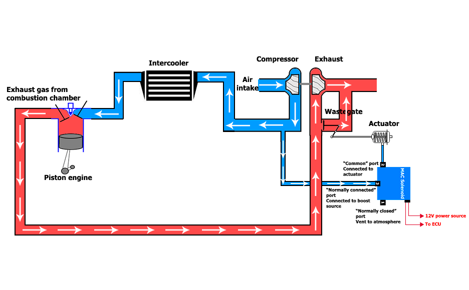  
  
Turbo System  
  
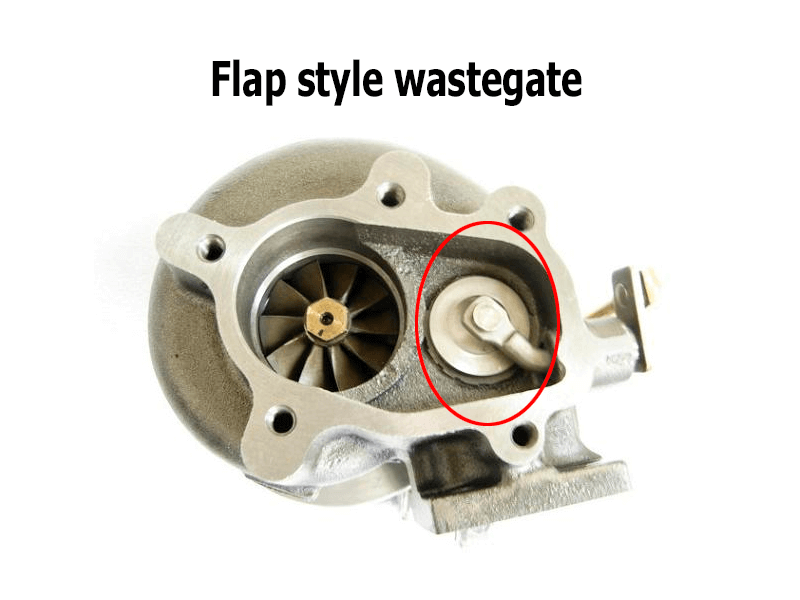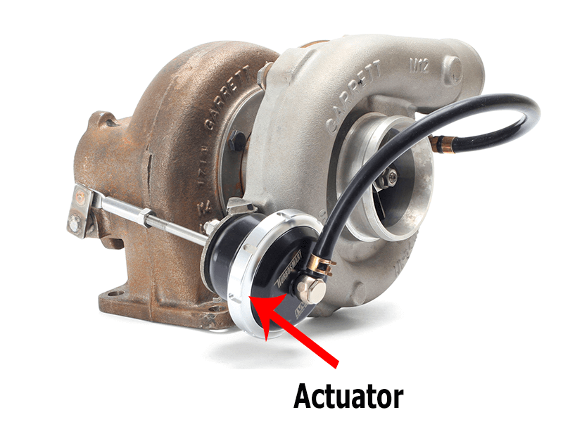  
  
Apart from the exhaust pressure opening the gate,
                  which is an undesired effect, the position of the gate is
                  controlled by an actuator. The actuator has a diaphragm with
                  pressure on either side, and the pressure difference across
                  the diaphragm causes a force, which moves the gate actuator
                  rod and can open the gate. Holding the gate shut is a spring
                  which is normally a compression spring with significant
                  preload.  
  
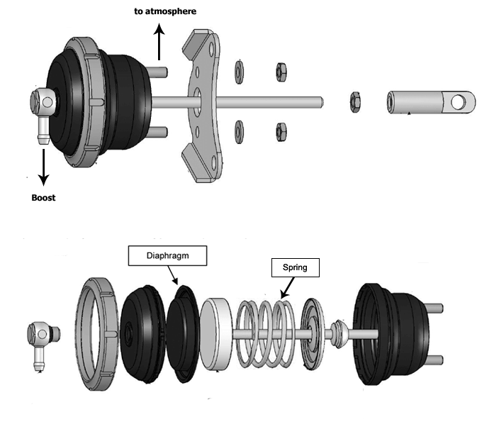  
  
The actuator can either have two pressure ports on
                  it, one for each side of the diaphragm, or just a single port
                  with the other port open to atmosphere.  
  
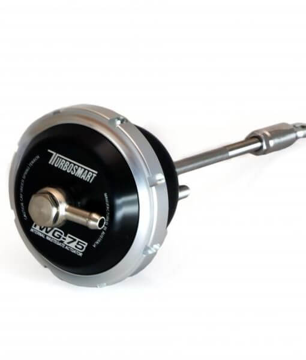  
  
Single port actuator  
  
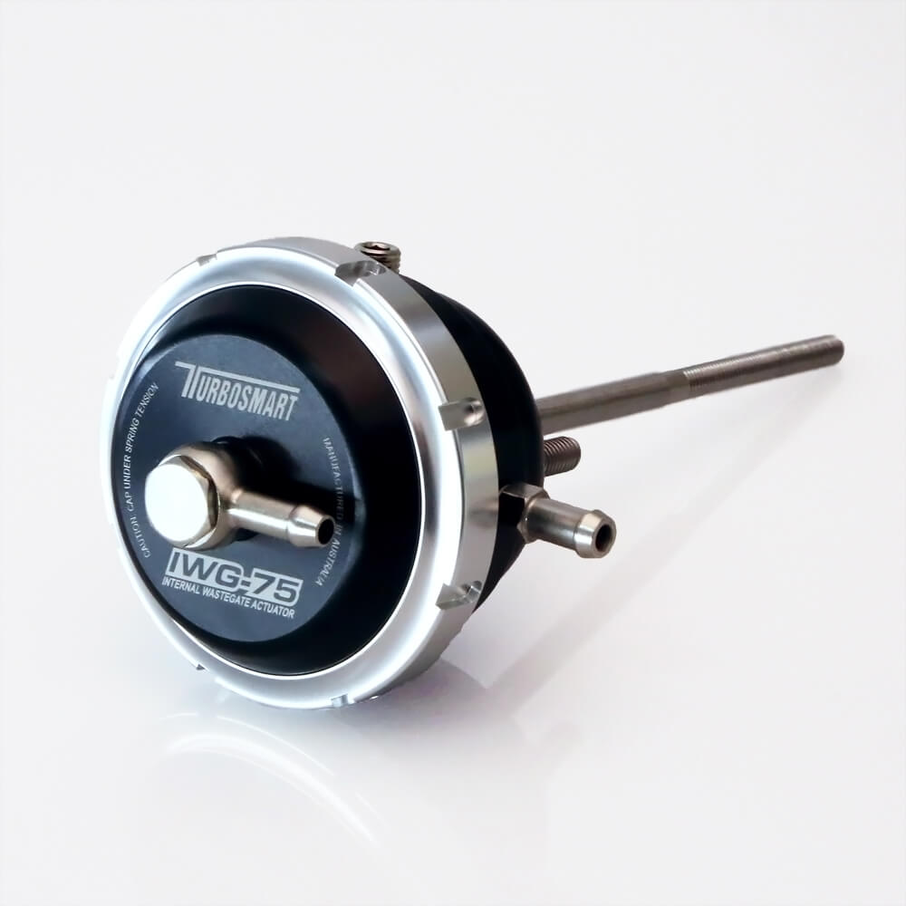  
  
Two-port actuator  
  
There are other features of some wastegates such as
                  water cooling, and some like some of the Turbosmart have
                  position sensors as well or they can be added as an option.  
  
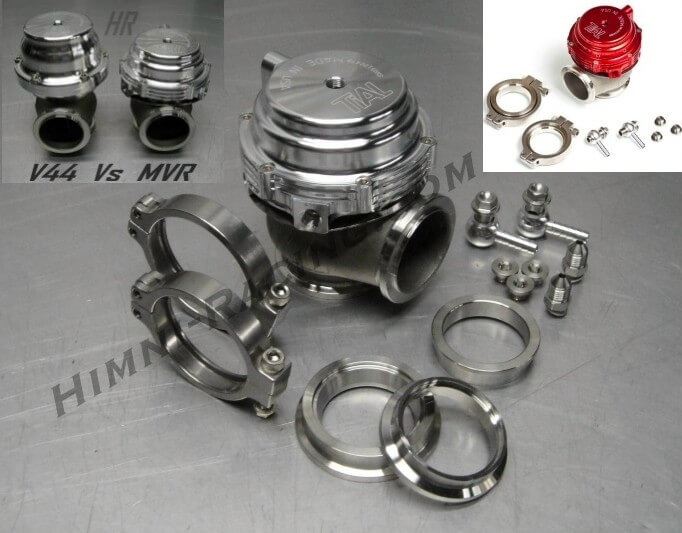  
  
Wastegate with water cooling feature  
  
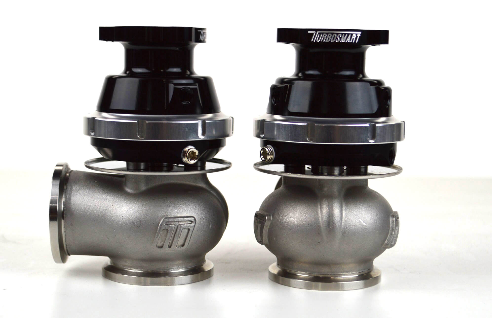  
  
Turbosmart wastegate with position sensor feature  
  
Let’s first consider the most basic type of
                  wastegate system, where you have a single port actuator. The
                  actuator’s pressure port is fed from boosted air from the
                  compressor. At atmospheric pressure, ie zero boost, there’s
                  zero pressure differential across the diaphragm, and the
                  spring holds the gate shut. No exhaust bypasses the turbine,
                  so the turbocharger starts to build boost.  
  
If the turbocharger builds enough boost to increase
                  the airflow through the engine to the point where it can
                  increase the boost further, ie it’s in a position to spool
                  (the RPM is high enough to come on boost and the throttle is
                  open far enough), then the boost will eventually become high
                  enough that the air pressure in the diaphragm is high enough
                  to overcome the spring preload and the actuator rod will start
                  to move. The pressure at which the air pressure force equals
                  the preload in the spring, and from then on it starts to move,
                  is sometimes called the “cracking” pressure because it’s where
                  the wastegate cracks open. Usually the spring will be
                  described by this pressure, for example a 10 PSI spring or a 1
                  bar spring.  
  
As the boost increases more, the spring is
                  compressed further and the wastegate opens further, until a
                  point where so much exhaust is bypassing the turbine that it
                  can’t build any more boost, and boost is now stable at this
                  point. Note that this will be higher than the cracking
                  pressure because the gate has had to move further to reach an
                  equilibrium point.  
  
There are multiple ways to control the boost on such
                  a system, but we’ll only talk about the 3-port method. In this
                  system you have a 3-port valve under ECU control. We use the
                  Mac valves. The “common” port on the Mac valve connects to the
                  actuator, the “normally connected” port connects to the boost
                  source and the “normally closed” port is allowed to vent to
                  atmosphere.  
  
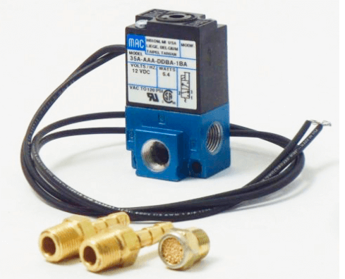  
  
3 way solenoid Mac valve  
  
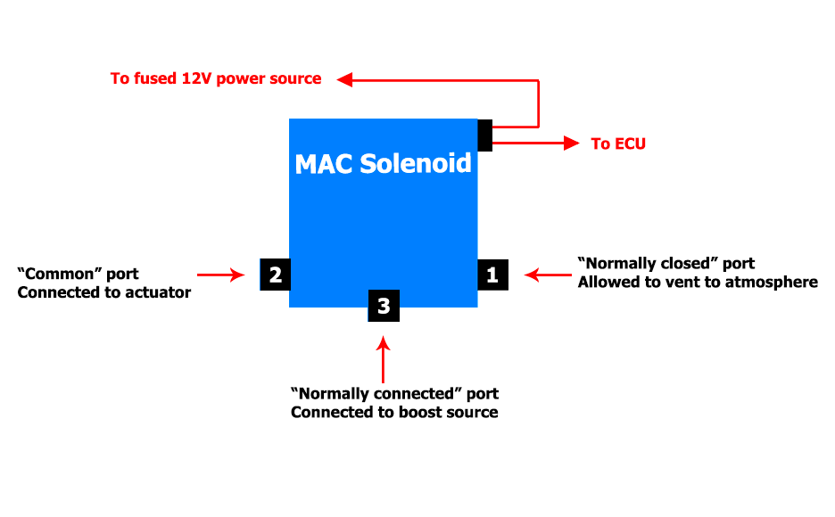  
  
Mac valve port functions  
  
In that way, when the valve is switched off, it just
                  connects the boost source straight to the actuator, and the
                  amount of boost you get is determined by the spring. When the
                  valve is turned on, the boost source is blocked off and the
                  actuator vents to atmosphere, so you get an unlimited amount
                  of boost. By pulse width modulating the valve, you can control
                  it to anywhere in between.  
  
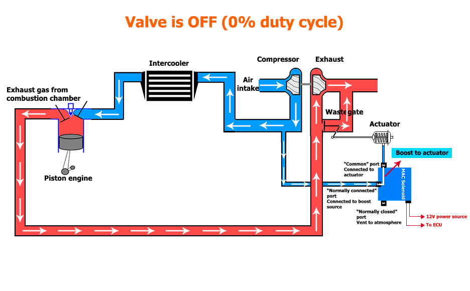  
  
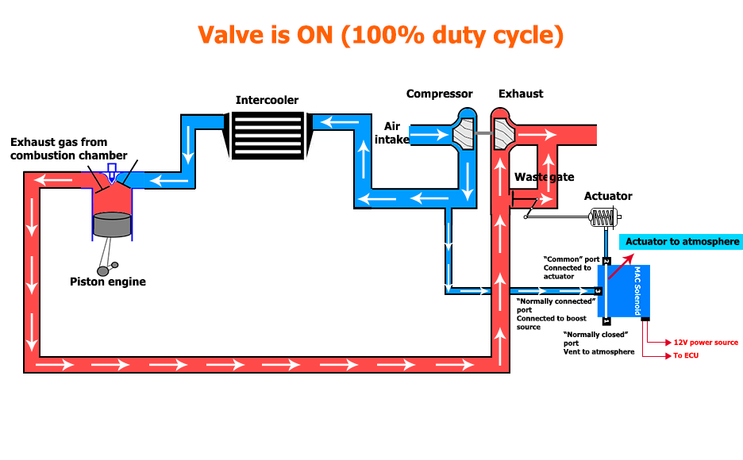  
  
For example if you have a 10 PSI spring, you can
                  achieve 20 PSI of boost by pulse width modulating the valve at
                  50% duty cycle. At 50% duty cycle it means that half of the
                  time, the actuator sees the 20 PSI from the compressor exist,
                  and the other half of the time it sees atmospheric pressure
                  which is zero boost – so the average works out to be 10 PSI
                  which is what the actuator is trying to regulate to. If you
                  set the duty cycle to 25%, then one quarter of the time it
                  would see atmospheric pressure and three quarters would see
                  boost, so that means you’d end up with 13 PSI boost . Normally
                  you’d PWM the solenoid at about 30 Hz.  
  
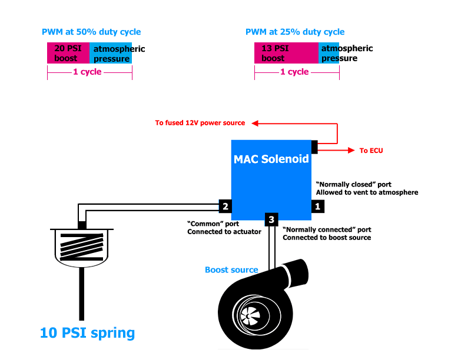  
  
Now, let’s look at some undesired effects of this
                  system, limitations and so on, so that you can spot them when
                  they occur.  
  
The first I mentioned before; the exhaust back
                  pressure pushes the door open. The force exerted by a pressure
                  is the pressure times the area. So unless the diaphragm is
                  very large compared to the wastegate, then exhaust back
                  pressure is going to have an effect on boost. In many cases it
                  will limit the amount of boost you can run, because even with
                  the solenoid at 100% or leaving the hose off the actuator all
                  together, once the boost reaches a certain level, the turbo
                  will need a certain amount of exhaust pressure to create the
                  boost and that pressure will force the door open, so it will
                  be self limiting. So this limits the amount of boost you can
                  practically run in an internally gated, factory style
                  turbocharger. It also means that if you run a constant duty
                  cycle, the boost will normally drop off to some extent as RPM
                  increases, due to the backpressure increase at higher speeds
                  (the compressor has to spin faster to make the same boost at
                  higher RPM because the engine is hungrier, so the turbine has
                  to spin faster also).  
  
Turbosmart have come out with a replacement for the
                  factory actuator though, called the IWG. It’s similar in
                  construction to a proper actuator from an external gate, but
                  it’s packaged so it can be used as an upgrade for factory
                  style, internally gated turbochargers. The big advantage of
                  this over the standard actuators is that they can have larger
                  diaphragm area than the factory actuator, which makes the
                  behaviour less dependent on exhaust back pressure. This makes
                  the boost pressure more stable and predictable, and also
                  increases the maximum amount of boost you can run.  
  
A common mistake, in my opinion, that people make is
                  to get the pressure source for the boost control from the
                  inlet manifold, rather than from the compressor exit. We know
                  that whichever pressure the actuator sees is the pressure it
                  will attempt to regulate to because that’s all the information
                  it has. Consider a part throttle condition where the driver
                  does not want the full torque available. If the system is set
                  to produce 10 PSI of boost, and the actuator gets its pressure
                  reference from the compressor exit, then we will have 10 PSI
                  before the throttle body, and less after the throttle body,
                  for example zero boost. This is what the driver says that he
                  or she wants, by only applying part throttle.  
  
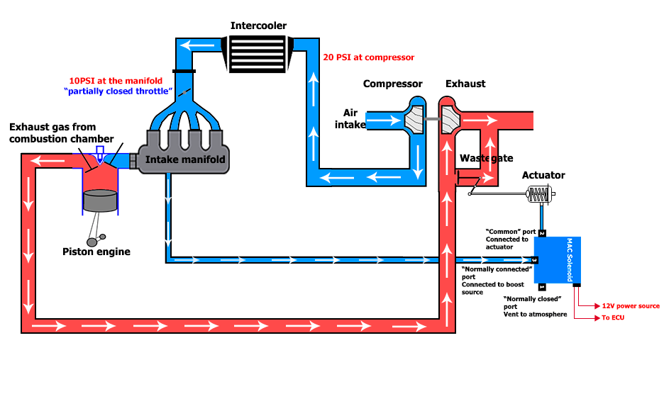  
  
Connecting the boost pressure source on the intake manifold  
  
If the actuator reference is taken from the manifold
                  instead of the compressor exit (or some other point before the
                  throttle), then it means that the turbo will need to work
                  extra hard because the actuator will keep the gate shut until
                  it sees 10 PSI in the manifold. So the turbo might be making
                  say 20 PSI of boost, but because of the partial throttle
                  condition we only see 10 PSI in the manifold. This has two
                  problems:
- It makes it harder for the driver to control
                      the torque, since whatever he’s doing with the pedal will
                      be undone to some extent by the action of the actuator and
                      wastegate
- It could result in an overspeeding condition
                      where if you put your foot down afterwards, you would get
                      a boost spike because the turbo is spinning too fast.  
Turbosmart also now have a dual port version of the
                  IWG, so rather than having one side of the diaphragm open to
                  the atmosphere, both sides of the diaphragm have ports on
                  them. With a dual port actuator, the connection method is
                  usually different. The standard way is to connect the boost
                  pressure to the “normal” of the actuator, ie the one which you
                  increase the pressure to open the gate. Then the second port
                  of the actuator, which holds the gate shut, goes to the
                  “common” of a 3-port valve. The “normally connected” port on
                  the 3-port valve vents to atmosphere, so in the normal
                  condition the actuator connection is the same as a single port
                  actuator. When the solenoid is activated though, the “normally
                  closed” port is connected to the pressure source and then the
                  actuator sees boost pressure on both sides.  
  
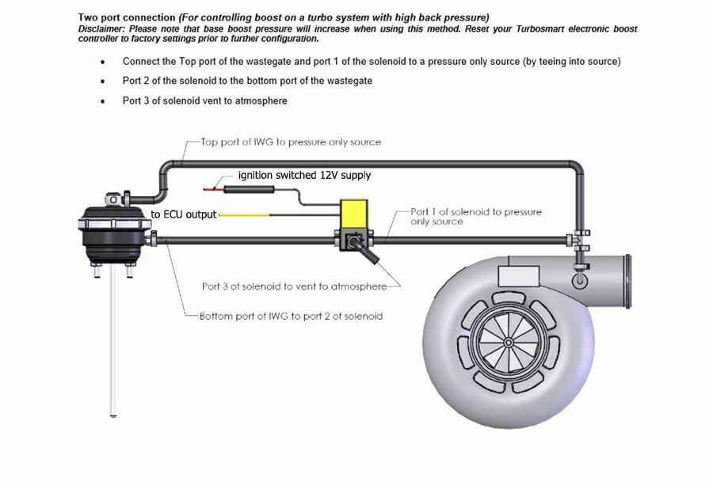  
  
The mathematics is the same as the single port
                  actuator, but it means that there’s more pressure available to
                  force against the back pressure forcing the flap open, and
                  therefore the boost regulation at higher back pressure
                  conditions is better.  
  
This theory can also be applied to an external
                  wastegate. External gates normally have much bigger
                  diaphragms, but they also usually have larger gates. In this
                  case the “bottom” port is the one which gets the pressure to
                  open the gate, and the “top” or the dome gets the pressure to
                  close the gate.  
  
There is a third connection type, which uses a
                  4-port Mac valve. Conceptually it’s the same as a 3-port
                  valve, and if you have 2 x 3-port valves you can achieve the
                  same thing so I’ll just describe it as 2 x 3-port valves here.  
  
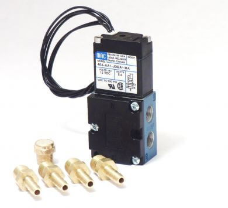  
  
Four-port Mac valve  
  
In this configuration, the top and the bottom of the
                  actuator each connect to the common ports of their own 3-port
                  valves. The bottom one’s normally connected port connects to
                  the boost source, and the normally closed port vents to
                  atmosphere, just as with a single port actuator. The top
                  port’s connection is opposite – the normally connected port
                  connects vents to atmosphere and the normally closed port
                  connects to the pressure source.  
  
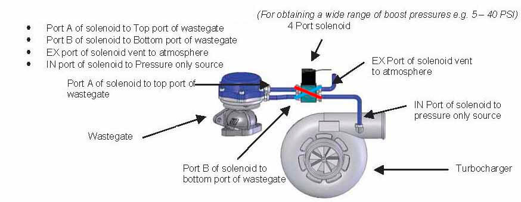  
  
When the solenoid is turned off, the bottom of the
                  actuator sees boost, and the top sees atmospheric pressure so
                  you end up with the boost set by the spring pressure. However
                  when it’s turned on, the bottom sees atmospheric pressure and
                  the top sees boost which holds the gate shut. Because you
                  don’t have the boost on the other side of the diaphragm, this
                  can hold shut against substantial exhaust back pressure even
                  with a spring that isn’t that strong.  
  
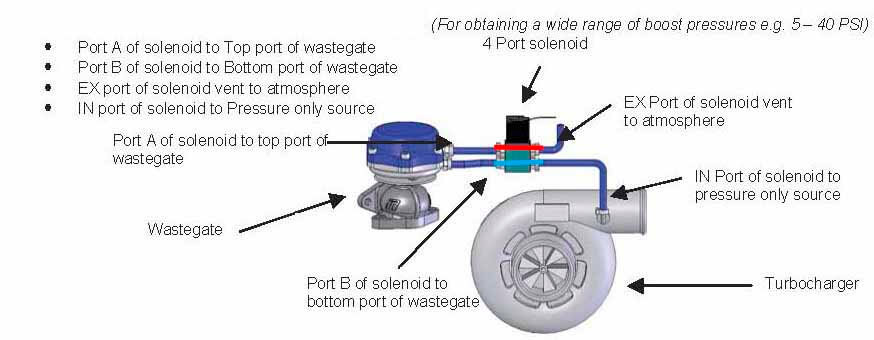  
  
A typical single 3-port valve system can usually
                  only hold up to about double the spring pressure level of
                  boost with any degree of control, but a 4-port system as
                  described here can hold much higher. The limiting factor is
                  when the exhaust back pressure ends up being more than or
                  close to the spring pressure plus your boost pressure; in that
                  case the only way to do it is with an external pressure source
                  like a CO2 bottle.  
  
Now that we’ve talked about the mechanical system,
                  we can talk about how the ECU works out the duty cycle in the
                  basic duty cycle mode.  
  
The first thing to understand is that there are many
                  variables that the ECU can use to control the boost level. The
                  ECU can determine boost by the main boost map, but can also
                  have corrections for external switch inputs, the current
                  transmission gear ethanol content and “push to pass” or
                  “scramble boost”.  
  
All the settings are found in the Tuning – Air,
                  boost control section in the software.  
  
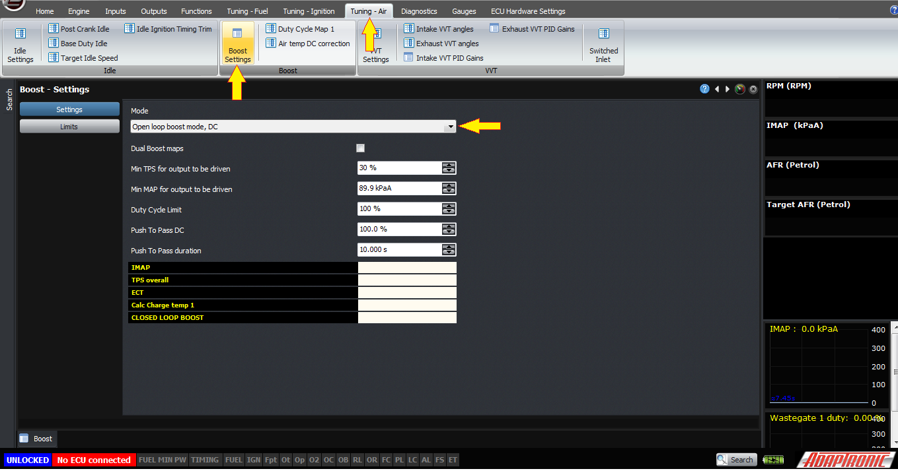  
  
Firstly, the mode you should select if you want to
                  do it based on the duty cycle only, is the “Open loop boost
                  mode, DC”  
  
Secondly, you can choose whether to enable “dual
                  boost maps” or not. Dual boost maps allow you to have two
                  separate boost maps, which is the duty cycle vs throttle
                  position and RPM. If you don’t enable this, then you can still
                  have a switch to select different boost levels and I’ll
                  explain that in a bit.  
  
If you do enable dual boost maps, then you will have
                  two duty cycle maps in the settings. To enable the second map,
                  you must select a digital input as boost setting 1, and then
                  when that input is triggered then the ECU will switch over to
                  the second boost map.  
  
Secondly, the ECU will only activate the wastegate
                  control output once the conditions of minimum TPS and MAP are
                  met, so set this to values like slightly on boost or slightly
                  on vaccum, and TPS of say 30% so it’s not always driving the
                  valve during cruise conditions. Of course you could just tune
                  this in the map anyway.  
  
Duty cycle limit is a percentage you can manually
                  enter to be able to limit the duty cycle of the output. This
                  is really put in there for convenience of testing and safety;
                  there’s no logical reason to use it in a final system.  
  
You’ll need to set up an output to drive the 3 or 4-
                  port valve. This should be an auxiliary output, or on the
                  Modular ECUs you can use an unused injector output instead.
                  Just as with driving other PWM solenoid valves, the other side
                  of the solenoid should connect to an ignition switched, 12V
                  supply. The corresponding output in the ECU should be
                  configured as Wastegate 1 duty, PWM at 30 Hz for most valves.
                  You can run two or four valves off a single output, but the
                  reason you would use the Wastegate 2 duty is if you’re doing
                  dual closed loop boost control, for example on a 300ZX or a
                  V12 with two separate turbos and two separate inlet manifolds.  
  
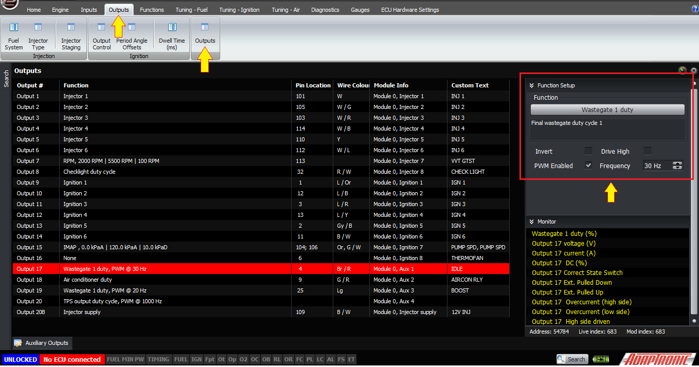  
  
Once you’ve set up those initial settings, you can
                  adjust the duty cycle map. In the single map mode, you’ll just
                  have the duty cycle map 1, where the axes are throttle
                  position and RPM. Just like the other maps in the Modular ECUs
                  you can insert and remove columns and rows as you like.  
  
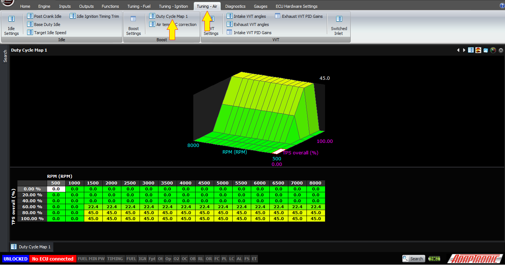  
  
There’s another map, which hopefully you won’t need
                  to adjust, but it’s there in case you do, and it’s a
                  correction for air temperature. In theory this map should be
                  at zero everywhere but if you find that there’s an air
                  temperature sensitivity which you want to tune out, which
                  usually means generating more boost for the same duty cycle at
                  lower air temperatures, you can put in a slope with negative
                  values at lower air temperatures.  
  
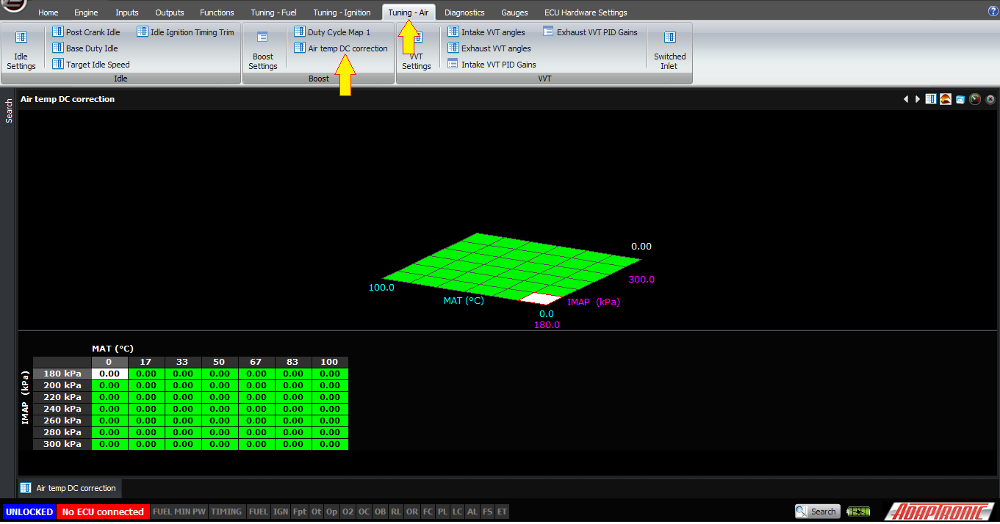I
                  know that some people use a basically open loop boost control
                  strategy, but with a map where they can adjust a correction
                  based on manifold pressure. You can also do that using this
                  table if you like. This is similar to using a
                  proportional-only controller, and just as with a PID closed
                  loop system, you can get it to hunt if you’re not careful and
                  make it too aggressive.  
  
The next item to consider is boost limits. These are
                  limits to the duty cycle based on circumstances in which you
                  want to run less than full boost. Each of these limit types
                  can be enabled separately.  
  
Ethanol content is the first one, and this is a
                  simple 2D table with ethanol content as a percentage from 0 to
                  100% as the input variable, and the value that you enter is
                  the duty cycle to which the output will be limited. For
                  example if you put 30 in this table at the current ethanol
                  percentage, then even if you have 50% in your main map, you
                  will only have a 30% duty cycle output (except in the case of
                  push to pass which I’ll describe soon).  
  
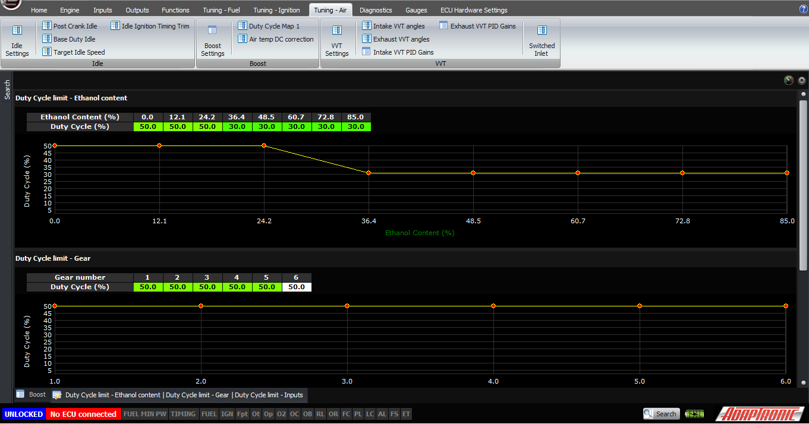  
  
  
  
The second one is the gear based duty cycle limit –
                  in this case the input variable is the gear number, eg 1, 2,
                  3, 4, 5, 6 and the value in the table is the maximum duty
                  cycle for each gear. If you have a limit in this table and the
                  ethanol table then both limits will apply, which means that
                  you’ll get the lower of the two.  
  
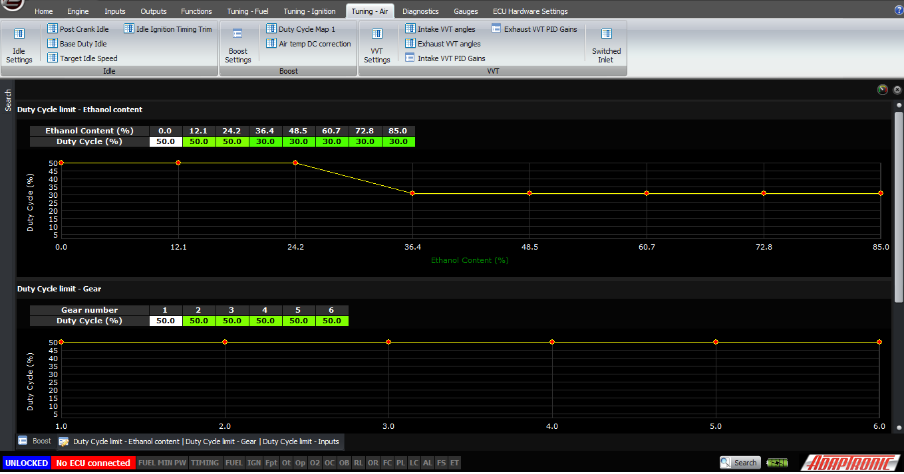  
  
The final limit is based on digital inputs for boost
                  selection.  
  
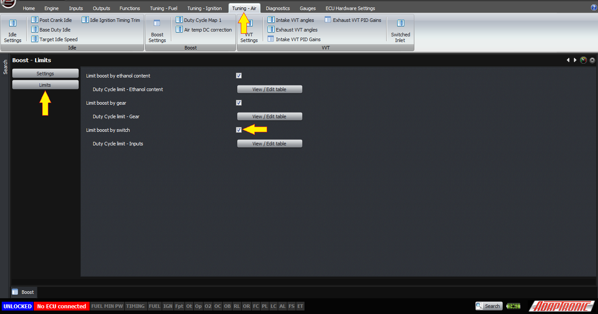  
  
The digital input value is from 0 – 3. This allows
                  for 4 different boost settings via 2 digital inputs, and it’s
                  easy to set up using a 4-position, 2-pole rotary switch.  
  
To set this up, you will need 2 digital inputs. One
                  must be set as Boost Setting 1, and the second must be set as
                  Boost Setting 2.  
  
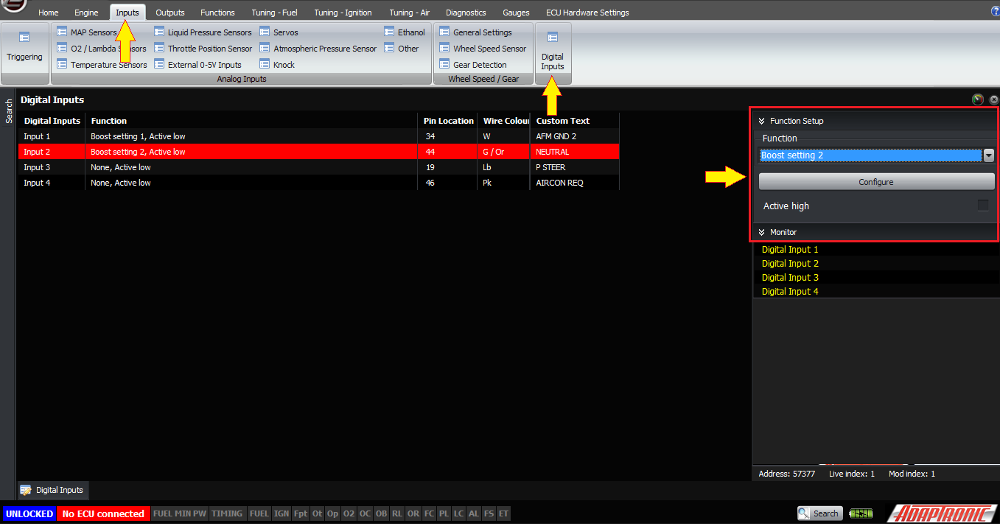  
  
The following input configurations give the
                  following boost switch numbers:
- Both inputs off (inactive, usually means open
                      circuit) – 0
- Boost setting 1 active (usually that means
                      connected to ground) – 1
- Boost setting 2 active – 2
- Both boost setting inputs active – 3The ECU will then use the duty cycles in this table
                  as the limit for the duty cycle. If you want one switch to
                  give the full boost as defined in the map, then set the value
                  to 100%.  
  
Note that on some systems, having a fixed duty cycle
                  might give a problem where the boost is not constant with RPM,
                  despite that being your intention, and in that case you would
                  be better off using a target boost mode which will be covered
                  in a different article.  
  
The final setting you have available is the “push to
                  pass” setting, sometimes called “scramble boost”. It’s a bit
                  like the proton pill that Roger Ramjet used to take which
                  gives him the strength of 20 atom bombs for a period of 20
                  seconds, but in this case you can define the duration, and you
                  can also specify the duty cycle that’s active for this push to
                  pass time. Note that the push to pass function overrides all
                  of the limits except for the duty cycle limit.  
  
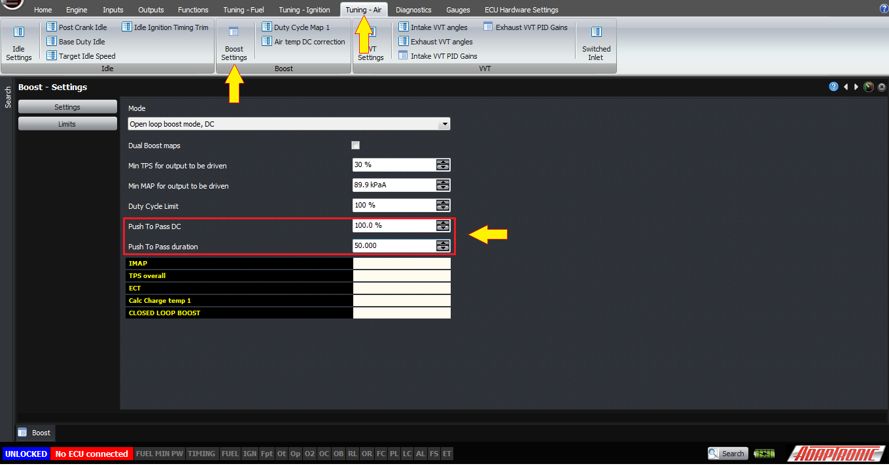  
  
Thank you very much!  
  
©2018
        Adaptronic  
