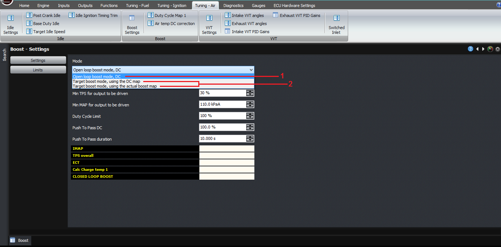
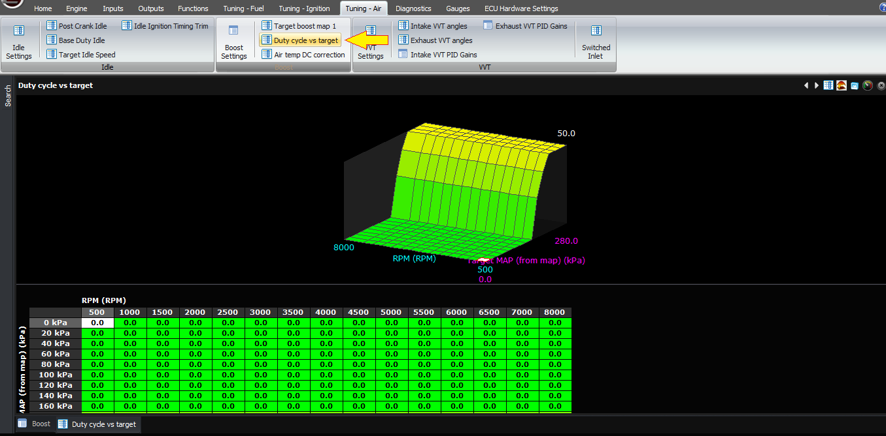
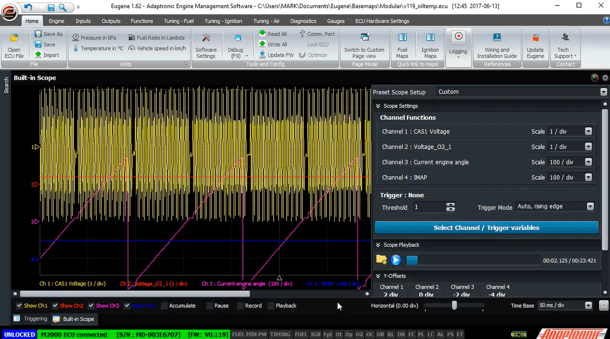
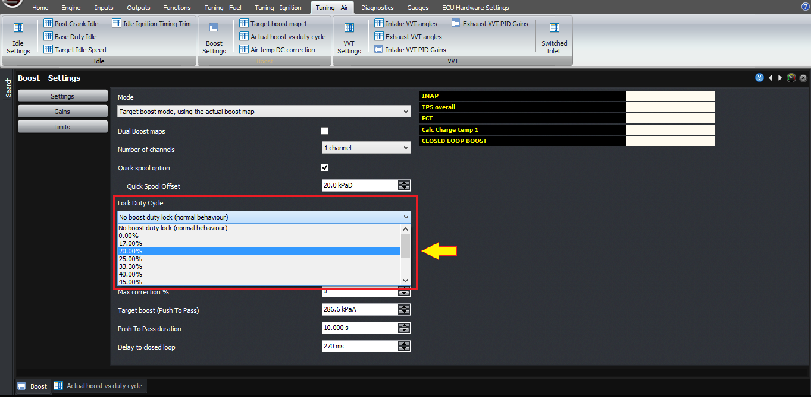
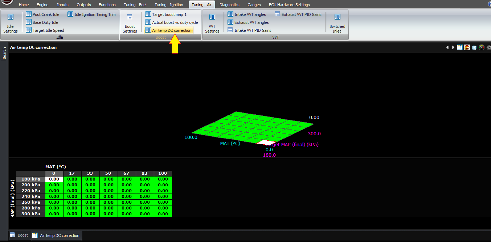
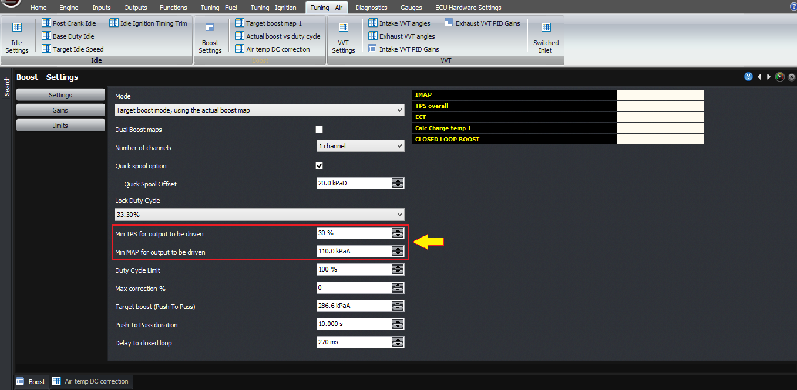
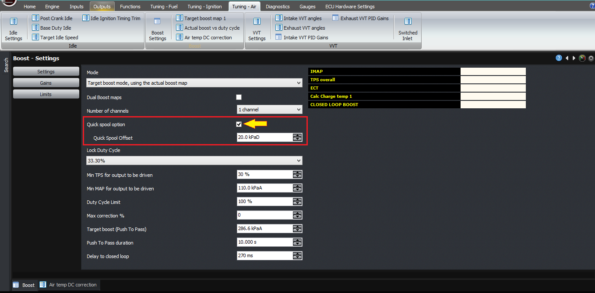
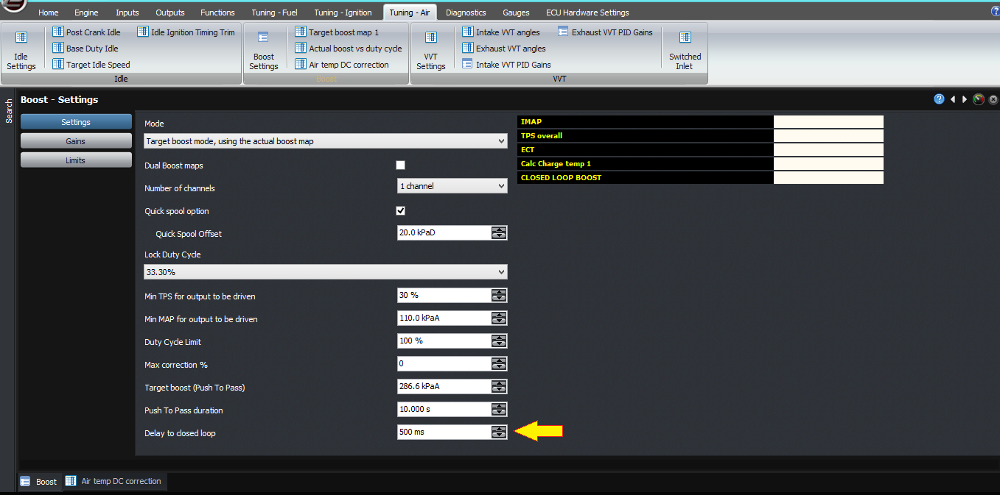
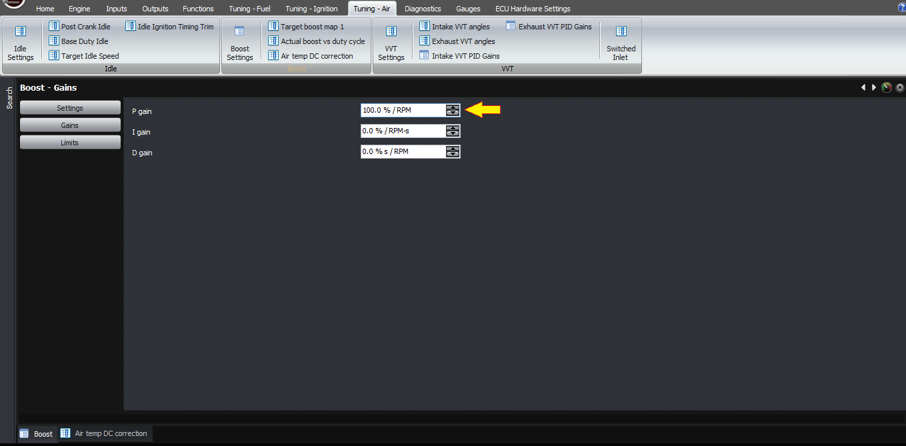

  
  
  
  
  
  
  
  
[DOWNLOADS](#)[STORE](#)[CONTACT US](#)  
  
  
  
  
  
  

Target Boost Modes on Modular ECUs

[go back to
                support home](EN_EUGENE_MOD_HOME.md)  

  
  
  

[Injection
                Timing on Port Injected Engines](EN_MOD_035_INJECTORTIMING.md)[
              ](EN_EUGENE_ABOUT.md)

[How
                to Setup Open Loop Boost Control  

              ](EN_MOD_039_OPENLOOPBOOSTCONTROL.md)

  

[  

              ](EN_SelFW.md)

  

  
  
  
  
  
  
  
  
  
This article describes using target
                  boost modes in the Modular ECUs.  
  
Firstly, let’s talk about the reason we do it this
                  way. What we found with the Select ECUs was that the majority
                  of people were happy to run an open loop duty cycle, but a few
                  wanted to do closed loop functions also.  
  
Also, people wanted different boost levels under
                  different conditions. For example with different ethanol
                  content, or an external input switch to select a different
                  boost level, or in different gears. The vast majority of
                  people wanted the switch to hold a certain boost level, which
                  if you have a well configured mechanical system, will equate
                  to a fairly constant duty cycle, but in other cases this
                  doesn’t happen and you end up with boost creep or taper as RPM
                  increases.  
  
If you do want to do closed loop, then as well as
                  having different base duty cycles under these different
                  conditions, we need to have different boost targets as well,
                  or run in open loop mode.  
  
This means that if you want to change one of these
                  settings, you need to change 2 values; one is the target boost
                  and the second is the duty cycle, not to mention the creep or
                  taper behaviour discussed earlier.  
  
So with the Modular ECU we’ve decided to get away
                  from that, and instead we have two modes of running the boost
                  control. One is open loop duty cycle, which has already been
                  described in the open loop duty cycle article. The second is
                  target boost, which is the topic of this article.  
  
In target boost mode, instead of working out a duty
                  cycle from all the maps, we instead work out a target MAP. So
                  the basic boost map, instead of being a duty cycle map,
                  instead becomes the target MAP in kPa, or if you prefer PSI an
                  inHg, it’s represented as gauge pressure but offset from 1
                  standard atmosphere so it still represents MAP. All the
                  limits, for example the ethanol, the switch input and the
                  current transmission gear all become MAP limits now rather
                  than duty cycle limits, and push to pass is now a new (higher)
                  MAP setting rather than duty cycle.  
  
The ECU then calculates the target MAP, based on all
                  these functions, using the same logic as the open loop boost
                  control uses to calculate the duty cycle.  
  
This target MAP then becomes the target for closed
                  loop PID, but the ECU also needs a way to work out the duty
                  cycle from this MAP target.  
  
Currently there are 2 ways to do this.  
  

  
  
The first is the more traditional way, and in it you
                  have a 3D map of RPM on one axis, and target MAP on the other.
                  The value of the cell in the map is the duty cycle required to
                  achieve that target boost at the given RPM. This means it has
                  to be tuned, which will be pretty fiddly. So it’s here for
                  people that are used to this technique from other ECUs but we
                  don’t recommend it.  
  

  
  
The other way is to instead have an actual boost
                  map, where the two axes are RPM across, and duty cycle going
                  down. The map then contains the actual boost achieved
                  (represented as MAP) with the given RPM / duty cycle
                  combinations. You can use the “lock duty cycle” function in
                  the boost control settings to force the ECU to use a
                  particular duty cycle on the actuator, and then as you
                  increase the RPM through the rev range, the ECU will record
                  the actual boost achieved into this table. Therefore, to set
                  the table, all you need to do is set the axis points and then
                  go through each duty cycle in turn and allow the ECU to sample
                  it as you do a power run.  
  

  
  
When you then disable the “lock duty cycle”
                  function, the ECU then works out the target MAP or boost as
                  described earlier. The ECU goes through the current column
                  based on the RPM to find out what the duty cycle would need to
                  be to achieve the target MAP. This could be described as
                  reverse-interpolation. The ECU then uses this for the base
                  duty cycle.  
  

  
  
After the ECU has the base duty cycle, it applies
                  the air temperature correction map as described earlier,
                  however the axis is now the target MAP rather than the
                  measured MAP. Therefore you can’t use it to do a semi-closed
                  loop function (but you have a PID controller with which to do
                  that).  
  

  
  
Now the ECU has a base duty cycle and a target.
                  Let’s look at the other functions it can perform.  
  
First of all, the other conditions for driving the
                  solenoid output, such as minimum MAP and minimum TPS, still
                  apply, so we need to bear that in mind.  
  

  
  
Next, there is a quick spool function. If the
                  mechanical setup is tight then this should have no effect but
                  nothing is perfect, so here it is. When the MAP is less than
                  the target MAP minus the quick spool offset, the output is
                  held on at 100% duty cycle, to help the turbo spool up more
                  quickly. The offset is there to allow you to switch over to
                  the standard boost control duty cycle before the turbo
                  overspeeds and causes a boost spike condition; so you’d
                  normally set the offset to a value like 15 kPa or 2 PSI, more
                  if your turbo comes on to boost very suddenly.  
  

  
  
After that, there is a time allowed before the ECU
                  will go into closed loop boost control. This is to avoid
                  integrator wind-up effects; basically it allows the turbo to
                  reach an equilibrium speed. A typical value would be 500
                  milliseconds.  
  

  
  
Then you have the PID gains, for if you want to run
                  closed loop. If you want to run open loop, just set these to
                  zero. The gains are in percent-percent; so as an example, if
                  your target is 210 kPa, and the actual MAP is 200 kPa, that
                  means you’re 10 kPa too low. If you enter a proportional gain
                  of 100%, then that will give you +10% duty cycle correction on
                  the idle valve. So in practice you need numbers smaller than
                  this unless you have a very small wastegate spring.  
  

  
  
Finally, in terms of diagnostics, the best way is
                  just like fuel tuning – it should be pretty much right in open
                  loop before you try setting up closed loop. So set the PID
                  gains to zero initially and work your way upwards. Remember
                  any integrator term you have will possibly lead to integrator
                  wind-up issues so try to get as much working as possible off
                  the P term.  
  
Thank you!  
  
  
©2018
        Adaptronic  
  
