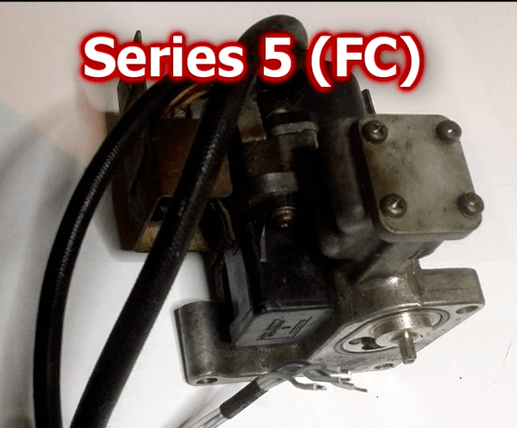
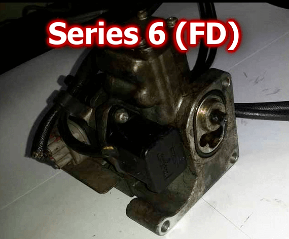
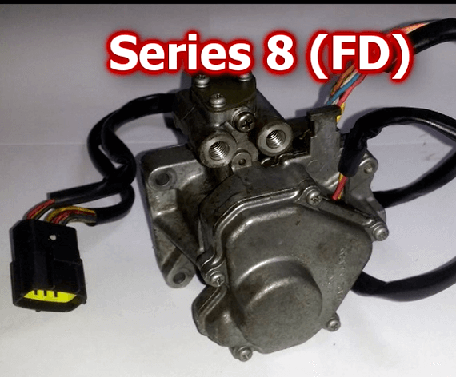
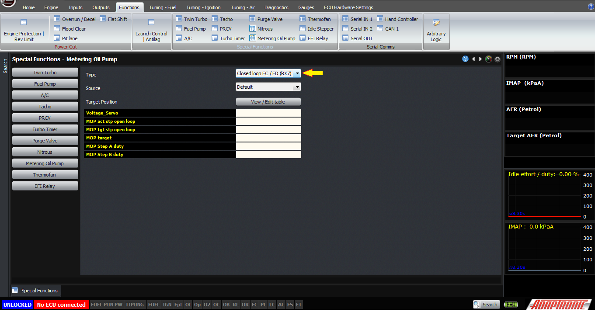
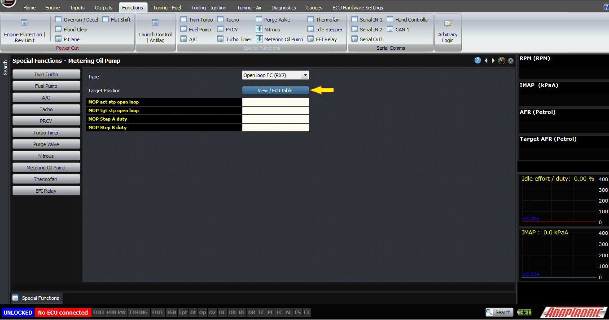
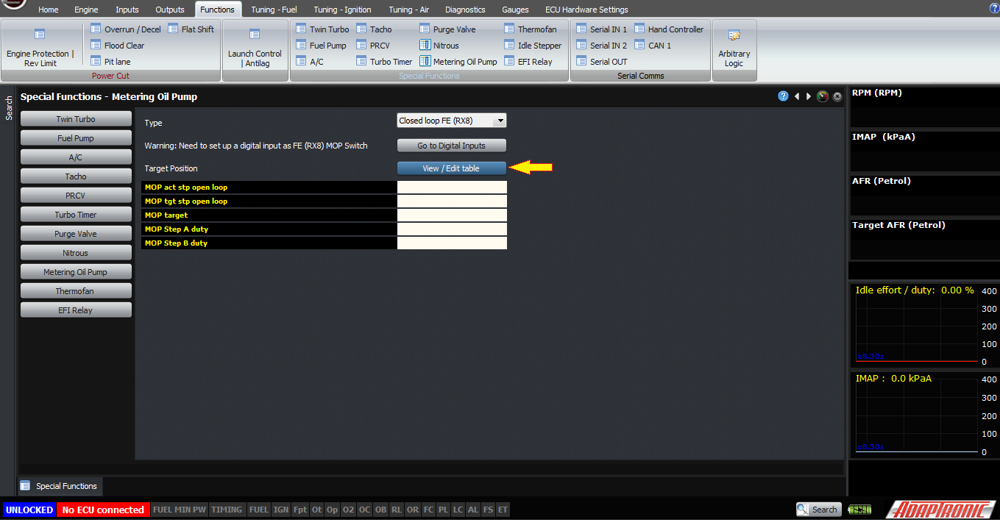
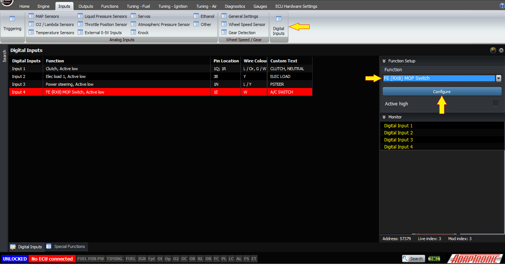
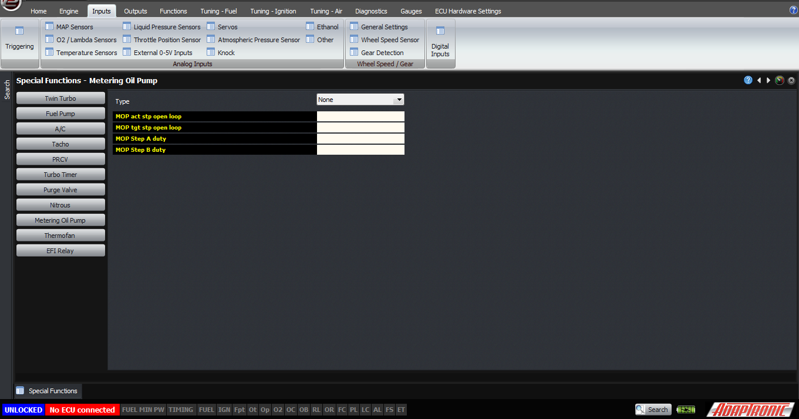

Open Loop MOP Control for RX7s and MOP Control for RX8s on Modular
      ECUs/*

Copyright (c) 2008, Yahoo! Inc. All rights reserved.

Code licensed under the BSD License:

http://developer.yahoo.net/yui/license.txt

version: 2.6.0

*/

html{color:#000;background:#FFF;}body,div,dl,dt,dd,ul,ol,li,h1,h2,h3,h4,h5,h6,pre,code,form,fieldset,legend,input,textarea,p,blockquote,th,td{margin:0;padding:0;}table{border-collapse:collapse;border-spacing:0;}fieldset,img{border:0;}address,caption,cite,code,dfn,em,strong,th,var{font-style:normal;font-weight:normal;}li{list-style:none;}caption,th{text-align:left;}h1,h2,h3,h4,h5,h6{font-size:100%;font-weight:normal;}q:before,q:after{content:'';}abbr,acronym{border:0;font-variant:normal;}sup{vertical-align:text-top;}sub{vertical-align:text-bottom;}input,textarea,select{font-family:inherit;font-size:inherit;font-weight:inherit;}input,textarea,select{*font-size:100%;}legend{color:#000;}del,ins{text-decoration:none;}body{font:13px/1.231 arial,helvetica,clean,sans-serif;*font-size:small;*font:x-small;}select,input,button,textarea{font:99% arial,helvetica,clean,sans-serif;}table{font-size:inherit;font:100%;}pre,code,kbd,samp,tt{font-family:monospace;*font-size:108%;line-height:100%;}body{text-align:center;}#ft{clear:both;}#doc,#doc2,#doc3,#doc4,.yui-t1,.yui-t2,.yui-t3,.yui-t4,.yui-t5,.yui-t6,.yui-t7{margin:auto;text-align:left;width:57.69em;*width:56.25em;min-width:750px;}#doc2{width:73.076em;*width:71.25em;}#doc3{margin:auto 10px;width:auto;}#doc4{width:74.923em;*width:73.05em;}.yui-b{position:relative;}.yui-b{_position:static;}#yui-main .yui-b{position:static;}#yui-main,.yui-g .yui-u .yui-g{width:100%;}{width:100%;}.yui-t1 #yui-main,.yui-t2 #yui-main,.yui-t3 #yui-main{float:right;margin-left:-25em;}.yui-t4 #yui-main,.yui-t5 #yui-main,.yui-t6 #yui-main{float:left;margin-right:-25em;}.yui-t1 .yui-b{float:left;width:12.30769em;*width:12.00em;}.yui-t1 #yui-main .yui-b{margin-left:13.30769em;*margin-left:13.05em;}.yui-t2 .yui-b{float:left;width:13.8461em;*width:13.50em;}.yui-t2 #yui-main .yui-b{margin-left:14.8461em;*margin-left:14.55em;}.yui-t3 .yui-b{float:left;width:23.0769em;*width:22.50em;}.yui-t3 #yui-main .yui-b{margin-left:24.0769em;*margin-left:23.62em;}.yui-t4 .yui-b{float:right;width:13.8456em;*width:13.50em;}.yui-t4 #yui-main .yui-b{margin-right:14.8456em;*margin-right:14.55em;}.yui-t5 .yui-b{float:right;width:18.4615em;*width:18.00em;}.yui-t5 #yui-main .yui-b{margin-right:19.4615em;*margin-right:19.125em;}.yui-t6 .yui-b{float:right;width:23.0769em;*width:22.50em;}.yui-t6 #yui-main .yui-b{margin-right:24.0769em;*margin-right:23.62em;}.yui-t7 #yui-main .yui-b{display:block;margin:0 0 1em 0;}#yui-main .yui-b{float:none;width:auto;}.yui-gb .yui-u,.yui-g .yui-gb .yui-u,.yui-gb .yui-g,.yui-gb .yui-gb,.yui-gb .yui-gc,.yui-gb .yui-gd,.yui-gb .yui-ge,.yui-gb .yui-gf,.yui-gc .yui-u,.yui-gc .yui-g,.yui-gd .yui-u{float:left;}.yui-g .yui-u,.yui-g .yui-g,.yui-g .yui-gb,.yui-g .yui-gc,.yui-g .yui-gd,.yui-g .yui-ge,.yui-g .yui-gf,.yui-gc .yui-u,.yui-gd .yui-g,.yui-g .yui-gc .yui-u,.yui-ge .yui-u,.yui-ge .yui-g,.yui-gf .yui-g,.yui-gf .yui-u{float:right;}.yui-g div.first,.yui-gb div.first,.yui-gc div.first,.yui-gd div.first,.yui-ge div.first,.yui-gf div.first,.yui-g .yui-gc div.first,.yui-g .yui-ge div.first,.yui-gc div.first div.first{float:left;}.yui-g .yui-u,.yui-g .yui-g,.yui-g .yui-gb,.yui-g .yui-gc,.yui-g .yui-gd,.yui-g .yui-ge,.yui-g .yui-gf{width:49.1%;}.yui-gb .yui-u,.yui-g .yui-gb .yui-u,.yui-gb .yui-g,.yui-gb .yui-gb,.yui-gb .yui-gc,.yui-gb .yui-gd,.yui-gb .yui-ge,.yui-gb .yui-gf,.yui-gc .yui-u,.yui-gc .yui-g,.yui-gd .yui-u{width:32%;margin-left:1.99%;}.yui-gb .yui-u{*margin-left:1.9%;*width:31.9%;}.yui-gc div.first,.yui-gd .yui-u{width:66%;}.yui-gd div.first{width:32%;}.yui-ge div.first,.yui-gf .yui-u{width:74.2%;}.yui-ge .yui-u,.yui-gf div.first{width:24%;}.yui-g .yui-gb div.first,.yui-gb div.first,.yui-gc div.first,.yui-gd div.first{margin-left:0;}.yui-g .yui-g .yui-u,.yui-gb .yui-g .yui-u,.yui-gc .yui-g .yui-u,.yui-gd .yui-g .yui-u,.yui-ge .yui-g .yui-u,.yui-gf .yui-g .yui-u{width:49%;*width:48.1%;*margin-left:0;}.yui-g .yui-g .yui-u{width:48.1%;}.yui-g .yui-gb div.first,.yui-gb .yui-gb div.first{*margin-right:0;*width:32%;_width:31.7%;}.yui-g .yui-gc div.first,.yui-gd .yui-g{width:66%;}.yui-gb .yui-g div.first{*margin-right:4%;_margin-right:1.3%;}.yui-gb .yui-gc div.first,.yui-gb .yui-gd div.first{*margin-right:0;}.yui-gb .yui-gb .yui-u,.yui-gb .yui-gc .yui-u{*margin-left:1.8%;_margin-left:4%;}.yui-g .yui-gb .yui-u{_margin-left:1.0%;}.yui-gb .yui-gd .yui-u{*width:66%;_width:61.2%;}.yui-gb .yui-gd div.first{*width:31%;_width:29.5%;}.yui-g .yui-gc .yui-u,.yui-gb .yui-gc .yui-u{width:32%;_float:right;margin-right:0;_margin-left:0;}.yui-gb .yui-gc div.first{width:66%;*float:left;*margin-left:0;}.yui-gb .yui-ge .yui-u,.yui-gb .yui-gf .yui-u{margin:0;}.yui-gb .yui-gb .yui-u{_margin-left:.7%;}.yui-gb .yui-g div.first,.yui-gb .yui-gb div.first{*margin-left:0;}.yui-gc .yui-g .yui-u,.yui-gd .yui-g .yui-u{*width:48.1%;*margin-left:0;} .yui-gb .yui-gd div.first{width:32%;}.yui-g .yui-gd div.first{_width:29.9%;}.yui-ge .yui-g{width:24%;}.yui-gf .yui-g{width:74.2%;}.yui-gb .yui-ge div.yui-u,.yui-gb .yui-gf div.yui-u{float:right;}.yui-gb .yui-ge div.first,.yui-gb .yui-gf div.first{float:left;}.yui-gb .yui-ge .yui-u,.yui-gb .yui-gf div.first{*width:24%;_width:20%;}.yui-gb .yui-ge div.first,.yui-gb .yui-gf .yui-u{*width:73.5%;_width:65.5%;}.yui-ge div.first .yui-gd .yui-u{width:65%;}.yui-ge div.first .yui-gd div.first{width:32%;}#bd:after,.yui-g:after,.yui-gb:after,.yui-gc:after,.yui-gd:after,.yui-ge:after,.yui-gf:after{content:".";display:block;height:0;clear:both;visibility:hidden;}#bd,.yui-g,.yui-gb,.yui-gc,.yui-gd,.yui-ge,.yui-gf{zoom:1;}h1 {
  font-size: 138.5%;
}

h2 {
  font-size: 123.1%;
}

h3 {
  font-size: 108%;
}

h1, h2, h3 {
  margin-top: 1em;
  margin-right: 0px;
  margin-bottom: 1em;
  margin-left: 0px;
}

h1, h2, h3, h4, h5, h6, strong {
  font-weight: bold;
}

abbr, acronym {
  border-bottom-width: 1px;
  border-bottom-style: dotted;
  border-bottom-color: black;
  cursor: help;
}

em {
  font-style: italic;
}

blockquote, ul, ol, dl {
  margin-top: 1em;
  margin-right: 1em;
  margin-bottom: 1em;
  margin-left: 1em;
}

ol, ul, dl {
  margin-left: 2em;
}

ol li {
  list-style-type: decimal;
  list-style-image: none;
  list-style-position: outside;
}

ul li {
  list-style-type: disc;
  list-style-image: none;
  list-style-position: outside;
}

dl dd {
  margin-left: 1em;
}

th, td {
  border-top-width: 1px;
  border-right-width: 1px;
  border-bottom-width: 1px;
  border-left-width: 1px;
  border-top-style: solid;
  border-right-style: solid;
  border-bottom-style: solid;
  border-left-style: solid;
  border-top-color: black;
  border-right-color: black;
  border-bottom-color: black;
  border-left-color: black;
  -moz-border-top-colors: none;
  border-top-colors: none;
  -moz-border-right-colors: none;
  border-right-colors: none;
  -moz-border-bottom-colors: none;
  border-bottom-colors: none;
  -moz-border-left-colors: none;
  border-left-colors: none;
  border-image-source: none;
  border-image-slice: 100% 100% 100% 100%;
  border-image-width: 1 1 1 1;
  border-image-outset: 0 0 0 0;
  border-image-repeat: stretch stretch;
  padding-top: 0.5em;
  padding-right: 0.5em;
  padding-bottom: 0.5em;
  padding-left: 0.5em;
}

th {
  font-weight: bold;
  text-align: center;
}

caption {
  margin-bottom: 0.5em;
  text-align: center;
}

p, fieldset, table, pre {
  margin-bottom: 1em;
}

input[type="text"], input[type="password"], textarea {
  width: 12.25em;
}

.navbar {
  background-color: black;
  color: white;
  font-size: smaller;
}

.Pagetitle {
  font-size: large;
  font-weight: bold;
}

.navbar:hover {
  font-weight: normal;
}

#downloads:hover {
  font-weight: normal !important;
  font-size: smaller !important;
}

.contact:hover {
  font-weight: bolder;
}

.downloads:hover {
  font-weight: bolder;
}

.store:hover {
  font-weight: bolder;
}

.downloads {
  font-weight: normal;
}

.store {
  font-weight: normal;
}

.contact {
  font-weight: normal;
}

.versionnum {
  font-size: large;
  color: black;
  font-weight: bold;
}

.releasedate {
  font-size: small;
  font-style: italic;
  color: black;
}

.releasecontent {
  font-size: medium;
}

.modrev {
  font-style: normal;
  font-weight: normal;
  font-size: small;
  color: #3333ff;
}

.selectrev {
  font-weight: normal;
  font-style: normal;
  color: #3333ff;
  font-size: small;
}

.yui-u {
  font-size: medium;
}

.backhome {
  font-size: smaller;
}

.latestrev {
  font-size: smaller;
}

.bodytxt1 {
  font-size: xx-small;
}  
  
[DOWNLOADS](#)[STORE](#)[CONTACT US](#)  
  

Open Loop MOP Control for RX7s and MOP Control
              for RX8s on Modular ECUs

[go back to
                support home](EN_EUGENE_MOD_HOME.md)

  

[Metering
                Oil Pump Control on Mazda Rotary Engines](EN_MOD_021_MOP.md)[
              ](EN_EUGENE_ABOUT.md)

[  

              ](EN_EUGENE_KBSC_TG.md)

  

[  

              ](EN_SelFW.md)

  

  
  
  
  
  
This article describes how it is
                  possible to do open loop MOP control on a rotary engine using
                  a Modular ECU.  
  
Firstly, we don’t recommend this except for testing
                  purposes. Mazda included a position sensor on the metering oil
                  pump so that it could be[closed
                    loop](EN_MOD_021_MOP.md)controlled, and also on the RX8, if the
                  factory ECU detects a metering oil pump failure, it limits the
                  throttle authority to 5%. If you’re not running premix then
                  the engine will have the wrong amount of lubrication.  
  
Let’s start by discussing the types of metering oil
                  pumps.  
  
Firstly, the series 5 (FC) and the series 6 (FD) are
                  mechanically very similar. They look the same except for a
                  slightly different part number, 198700-0050 for the series 5
                  and 198700-0060 for the series 6 – and also the Series 6 has a
                  single connector for the motor and sensor, whereas the series
                  5 has separate connectors for the sensor and the motor.  
  
  
The series 8 (FD) has the same connector as the
                  series 6, but looks quite different as you can see in this
                  picture. There’s no plastic housing, and there’s no heat
                  shield.  
  
  
All of the RX7 oil metering pumps are 72-step
                  devices, with a position sensor that gives an analogue output
                  proportional to the position of the oil metering pump.  
  
The wire colours are shown below, both the wire
                  colours in the loom and on the pump itself (the colours are
                  not the same either side of the connector). The table also
                  shows what they need to connect to in the ECU to make them
                  work.  
  
Loom
                  (car)         
                  Loom (MOP)      ECU connection  
  
B/O                   
                     
                  W                    
                  MOP stepper A (ign 6 on plugin RX7 ECU)  
  
B/Lg  
                                
                    
                    L                       MOP
                  stepper A inverted  
  
B/L                    
                     
                  Y                       MOP
                  stepper B (ign 5 on plugin RX7 ECU)  
  
B/Y                    
                     
                  B                       MOP
                  stepper B inverted  
  
B/W                  
                     
                  R                        12V
                  power  
  
B/W                  
                     
                  R/W                  
                  12V power  
  
Br/B                  
                     
                  B                        
                  SGND  
  
Br/W                
                     
                  L                         
                  +5V  
  
G/B                   
                     
                  Y                         
                  Signal (position), connect to 0-5V input eg Servo  
  
The default mode for the metering oil pump is[closed loop mode](EN_MOD_021_MOP.md).  
  
Closed loop mode  
  
In this mode, the target table is a percentage
                  travel of the sensor from 0.764V to 4.207V. If the sensor
                  tells the ECU that it’s more than 2% away from the target,
                  then the ECU will execute a step. The step period is 15ms if
                  the motor is more than 5% away from the target, otherwise the
                  step period is 20ms. If the measured position is within 2% of
                  the target then the ECU drives both outputs with 50% duty
                  cycle so as to reduce heating in the motor windings.  
  
The ECU will also automatically change the phase of
                  the two MOP step outputs if, after 1000 steps, the motor has
                  not reached its target.  
  
The ECU can now also drive the motor in an open loop
                  manner, in a similar way to an idle control stepper motor. Of
                  course with an open loop system, there’s no position sensor,
                  so the ECU must “home” the motor by driving it fully in one
                  direction or the other. Because when an engine starts it will
                  generally start at idle, we drive the motor fully closed and
                  then use that as the zero position. The target position in the
                  map is still a percentage, but it’s now a percentage of the
                  number of steps, the motor being a 72 step device. So numbers
                  should be in the range of 0 – 100. Unlike with the closed loop
                  system, zero is the minimum and represents the factory oil
                  quantity at idle. In this mode, the step period is fixed at
                  15ms. During testing and characterisation, the pumps behaved
                  correctly (ie, did not skip poles) right down to 10ms step
                  periods but 15ms allows some margin. When the motor is at the
                  target step, the ECU will again PWM both outputs at 50% to
                  minimise heating. If another step is to be taken, the ECU
                  first reasserts the logic levels for the current step for one
                  period to make sure that a pole is not skipped.  
  
Note that because there’s no sensor so the ECU
                  doesn’t know where the motor is, if you reverse the phases of
                  the motor winding there’s no way for the ECU to know this and
                  you’ll just have the wrong amount of oil injected.  
  
The same control method can be used for the RX8
                  series 1 oil metering pump, which again even though it looks
                  quite different from the RX7 oil metering pumps, is still a 72
                  step device.  
  
These open loop modes are selected using the MOP
                  type selection in the software, and because all devices are 72
                  step devices, all three modes have the same logical function.  
  
Open loop mode  
  
Loom
                  (car)         
                  Loom (MOP)      ECU output  
  
B/O                   
                     
                  Y                         
                  MOP stepper
                  A                
                  (Add out 6, 2W on plugin RX8 RCU)  
  
L/Y                     
                     
                  L                         
                  MOP stepper A inverted(Add out 5, 2V on plugin RX8 RCU)  
  
B/L                    
                     
                  B                        
                  MOP stepper
                  B                
                  (Add out 8, 2AB on plugin RX8 RCU)  
  
R/G                   
                     
                  W                       
                  MOP stepper B inverted(Add out 7, 2Y on plugin RX8 RCU)  
  
W/R                  
                     
                  R                        
                  12V power  
  
W/R                  
                     
                  O                        
                  12V power  
  
The last method we will describe is the closed loop
                  RX8 metering oil pump control.  
  
Closed loop FE mode  
  
The RX8 pump has a switch, rather than a position
                  sensor, to measure the position of the motor, and this switch
                  changed state around step number 58 according to the
                  documentation. The ECU can use this to “home” the stepper
                  position at startup, and it also uses this to reset the step
                  number when it passes the switch point later. However other
                  than these conditions, the RX8 motor is operated as a stepper,
                  where the ECU remembers the current step number and counts the
                  steps – as there is no linear feedback for the ECU. For this
                  mode, the outputs need to be configured as described before,
                  although the wire colours are different on the RX8 pump – but
                  also we need a digital input to be assigned as an RX8 metering
                  oil pump position switch input. This connects to pin A on the
                  MOP sensor connector, with pin C connecting to sensor ground.  
  
  
B/Y                    
                     pin A   Digital input (2N on plugin RX8
                  ECU)  
  
Br                       
                     pin C   SGND (1U on plugin RX8 ECU)  
  
pin B            
                          (no connection)  
  
Again, this is primarily for diagnosis as these
                  sensors are known to fail so please don’t use this if you’re
                  not intimately familiar with rotary engines.  
  
Finally, the “none” mode can be used to disable the
                  MOP output, and in that case both outputs will be driven with
                  50% duty cycle.  
  
  
Thank you!  
  
©2018
        Adaptronic  
