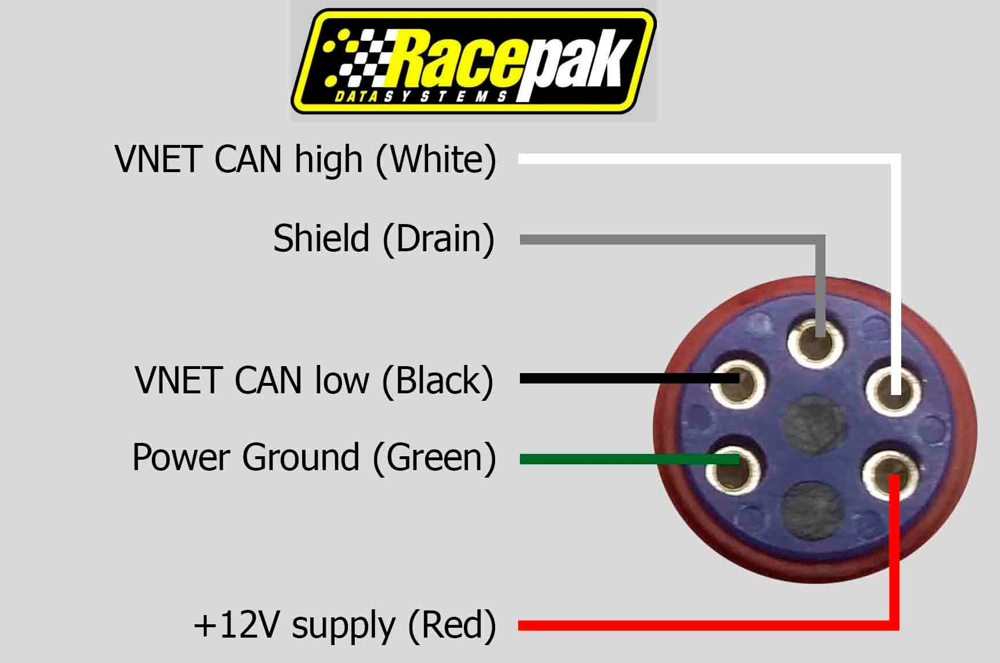
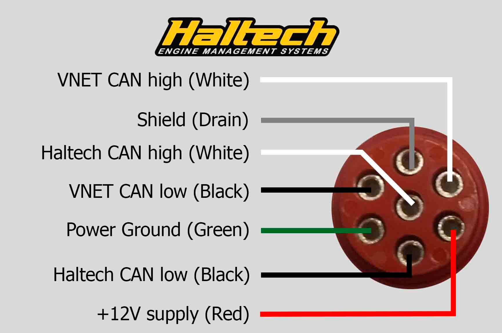
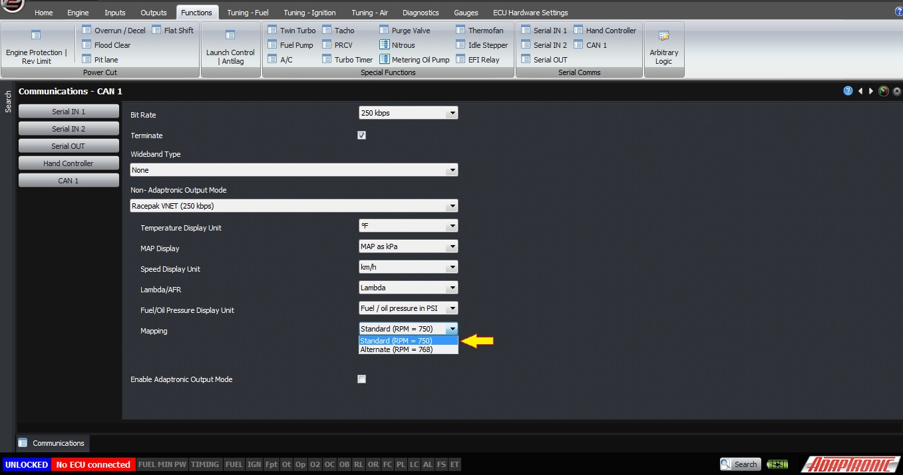
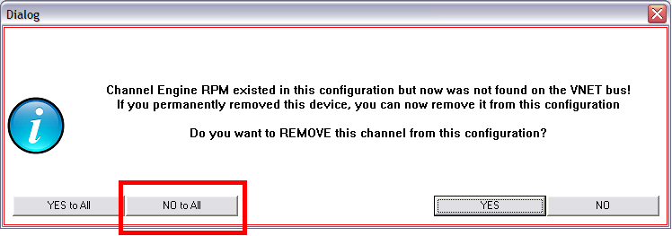
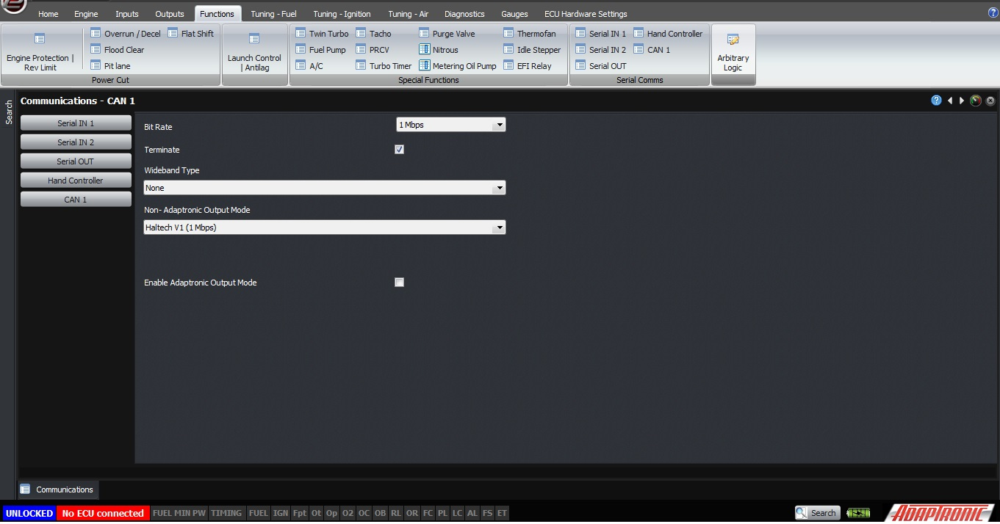
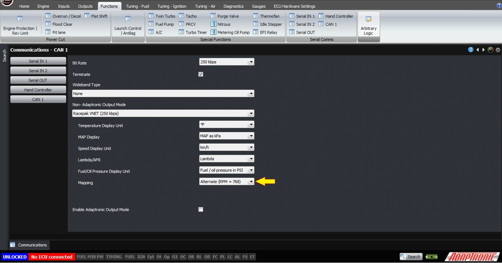

  
  
  
  
  
  
[DOWNLOADS](#)[STORE](#)[CONTACT US](#)  
  
  
  
  
  
  

Using a Racepak IQ3 Dash with a Modular ECU

[go back to
                support home](EN_EUGENE_MOD_HOME.md)  

  
  
  

[CAN
                Protocol and the Adaptronic CAN System](EN_MOD_050_NATIVECAN.md)[
              ](EN_EUGENE_ABOUT.md)

[Setting
                up the AEM CD7 Dash  

              ](EN_MOD_051_AEMDASH.md)

  

[  

              ](EN_SelFW.md)

  

  
  
  
  
  
  
  
  
  
  
  
About the Racepak system:  
  
Racepak has its own implementation of CAN which it calls
                    VNET. This is a 250 kbps bus, where different CAN IDs are
                    allocated for different variables which can be transmitted
                    and logged.  
  
As well as the CAN IDs being broadcast to transmit data,
                    there is a separate protocol which allows information about
                    the data to be read and written (you can consider this the
                    “settings”). Any scaling / offsetting is done in
                    the sensor interface (or EFI interface) itself, and the dash
                    only displays or logs these scaled data. Therefore to change
                    units between metric and imperial, this must be done not in
                    the dash setting, but in the device generating the data (in
                    this case, the ECU).  
  
The pinout on the VNET connector is as follows:  
  
  

  
  
The
                    wire colours of the VNET cable which we used to wire up are
                    as follows:  
  
  
PinColourFunctionConnectionGreenPower
                          groundNo
                          connection required if the dash has its own
                          power. Otherwise you can connect this to
                          power ground at the ECU to provide power to the dashRed12V
                          supplyNo
                          connection required if the dash has its own
                          power. Otherwise you can connect this to
                          ignition switched power at the ECU to provide power to
                          the dashBlackCAN
                          lowCAN
                          L – J2-23 on M2000 / M6000WhiteCAN
                          highCAN
                          H – J2-15 on M2000 / M6000DrainShield
                          wireNo
                          connection  
The
                    two other pins are unused on the VNET connection, but on the
                    Haltech branded IQ3 are the CAN connections to the
                    Haltech ECU.  
  
  
  

  
  
ECU
                    settings:  
  
The following ECU settings must be
                  set up to use the Racepak mode directly:  

- CAN bitrate =
                      250 kbps
- CAN
                      termination = ON, if this is the last or only device on
                      the chain. Otherwise if it’s in the middle of
                      the chain then CAN termination = OFF
- CAN
                      output mode = Racepak
- Unit
                      selections according to your personal preference.  
  
The
                    following unit selections are available:  
  
  
Setting name  
  
Options  
  
Scaling  
  
Temperature  
  
Celcius  
Fahrenheit  
  
Native = Celcius
                            (0.1 degree resolution)  
Fahrenheit = C * 9/5 + 32  
  
Speed  
  
km/h  
mph  
  
Native = km/h
                            (0.1 km/h resolution)  
mph = km/h / 1.6  
  
Lambda  
  
Lambda  
Petrol AFR  
  
Native = lambda
                            (0.001 resolution)  
Petrol AFR = lambda * 14.7  
  
Fuel / oil
                            pressure  
  
kPa  
PSI  
  
Native = kPa
                            (0.1 kPa resolution)  
PSI = kPa *0.145  
  
MAP  
  
kPa  
MGP, kPa  
MGP, PSIg  
MGP, PSIg / inHg  
  
Native = kPa
                            absolute (0.1 kPa resolution)  
MGP = MAP – baro (still in kPa)  
MGP PSIg = MGP * 0.145  
MGP PSIg  = MGP * 0.145, MGP >=0  
MGP * 0.290, MGP <= 0  
  
Dash settings:  
  
Start with the IQ3 configuration file supplied by
                    Adaptronic. This has the channels for the ECU data already
                    loaded, so that they can be selected on the dash
                    screen.  
  
[IQ3_Config_Modular.rcg](http://www.adaptronic.com.au//files/IQ3_Config/IQ3_Config_Modular.rcg)  
[IQ3_Config_Modular_Remap_forHaltechIQ3V2.rcg](http://www.adaptronic.com.au//files/IQ3_Config/IQ3_Config_Modular_Remap_forHaltechIQ3V2.rcg)  
If
                    you attempt to read out the full VNET settings, you will be
                    presented with this warning:  
  

  
  
You should click “no to all” to
                  avoid the channels being deleted.  
  
Note also that the Datalink
                  software will allow you to see settings in these channels (eg
                  scaling), but changing them will have no effect. To change the
                  scaling for different units, please use the Adaptronic
                  software Eugene.  
  
The following are the data
                  generated by the Adaptronic ECU in Racepak output mode, as of
                  firmware 0.140:  
  
  
CAN address
                              (hex)  
(remap address in brackets)  
  
Variable name  
  
Decimal
                              places  
  
Units  
  
750 (768)  
  
RPM (engine
                            speed)  
  
0  
  
RPM  
  
751 (769)  
  
ECT (coolant
                            temp)  
  
1  
  
°C, °F  
  
752 (76a)  
  
Oil Pressure  
  
1  
  
kPaG, PSIg  
  
757 (76f)  
  
Ignition advance
                            (leading)  
  
1  
  
° BTDC  
  
755 (76d)  
  
IMAP (intake
                            manifold absolute pressure)  
  
1  
  
kPaA, kPaG, PSIg, PSIg /
                            -inHg  
  
753 (76b)  
  
Pedal / TPS  
  
2  
  
%  
  
75A (772)  
  
Lambda  
  
2  
  
Lambda, petrol
                            AFR  
  
75F (777)  
  
Vehicle speed  
  
1  
  
km/h, mph  
  
756 (76e)  
  
Fuel pressure
                            (gauge)  
  
1  
  
kPaG, PSIg  
  
758 (770)  
  
Injector 1 duty  
  
2  
  
%  
  
754 (76c)  
  
MAT (air
                            temperature)  
  
1  
  
°C, °F  
  
765 (77d)  
  
EGT1  
  
1  
  
°C, °F  
  
760 (778)  
  
Transmission
                            Gear  
  
2  
  
(I don’t know
                            why gear has 2 decimal places by default in the
                            Racepak system)  
  
761 (779)  
  
Battery voltage  
  
2  
  
V  
  
766 (77e)  
  
Oil temperature  
  
1  
  
°C, °F  
  
  
The default function is to have
                  the remap disabled, and the base address = 750. The remap is
                  for compatible which will be explained later for the Haltech
                  IQ3 dash.  
Haltech cobranded IQ3  
  
There are at least three versions
                  of the Haltech IQ3.  
  
Early
                    version:  
  
The first version read the Haltech
                  V1 protocol. This was actually based on the AIM protocol. The
                  Modular ECU can output this protocol by selecting:  

- The
                      output mode as Haltech V1
- The
                      bit rate as 1 Mbps
- Terminate
                      = ON  

  
  
The CAN output from the ECU must
                  be connected to the Haltech CAN pins on the red
                  connector, shown above. These pins are different from the VNET
                  CAN connection.  
This works, however:  

- The
                      Oil Temperature channel was never implemented on the
                      Haltech V1 ECU, so the ECU always sent zero on this
                      channel. I believe it was never programmed correctly in
                      the Racepak EFI module, because when we output
                      the oil temperature to this channel, it is not displayed
                      correctly on the dash.
- The
                      same problem occurs with the EGT channel.
- MAP
                      is output as gauge pressure (MGP); fuel and oil are also
                      output as gauge pressure.To change units, you will need to
                      change the scaling by using the Racepak Datalink software.  
  
You can also user the
                      method for the later version, described below.  
  
Later
                        version:  
  
Haltech stopped supporting the V1
                      protocol on the Haltech IQ3 dash, and started to
                      support the Haltech V2 protocol instead, but with
                      additional authentication to ensure that the ECU connected
                      is a Haltech ECU. So even outputting the Haltech V2
                      protocol option, this does not work with the Haltech IQ3
                      V2 dash.  
  
The Haltech IQ3 dash supports VNET
                      also, so you can use the VNET
                      connection. However the data from the ECU then
                      conflicts with the data from the inbuilt Haltech protocol
                      converter. To counteract this, the Modular ECU allows you
                      to remap the CAN IDs, by adding 18 (hex) to the address.
                      For example, RPM becomes 768 instead of 750. These
                      remapped addresses are described in the
                      table above, and are already programmed in the
                      file IQ3_Config_Modular_Remap_forHaltechIQ3V2.RCG.  
  
For this connection you need to
                      connect the Adaptronic CAN pins to the VNET
                      pins, not the Haltech connection pins. On the red
                      connector cable, these two pins are not connected, so you
                      may need to buy a Racepak cable to be able to connect to
                      these pins.  
  
IQ3 Street:  
  
The IQ3 street works using the connection described in the
                    “early version” above (ie connecting the same way as a
                    Haltech ECU), and selecting the Haltech V2
                    protocol. Although we haven’t  
  
  
  

  
  
  
©2018
        Adaptronic  
  
