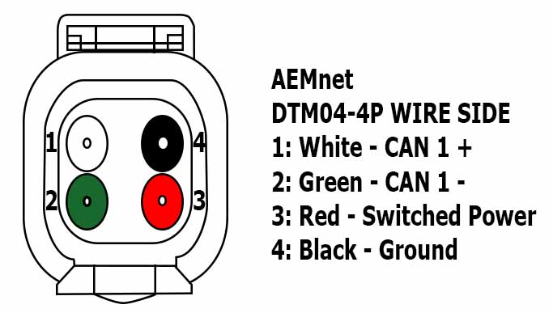
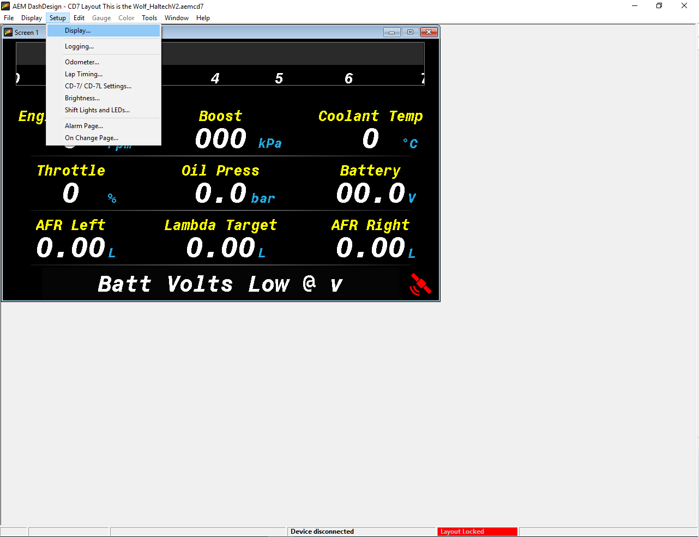
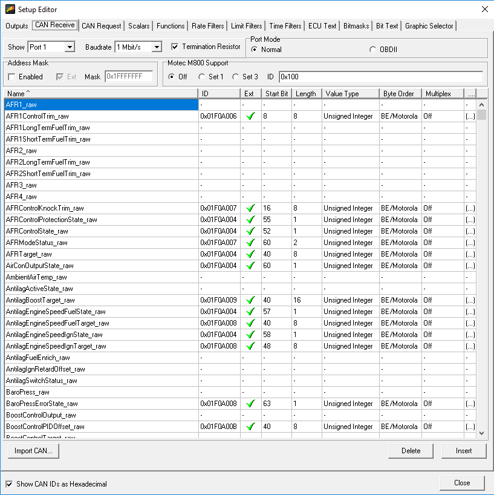
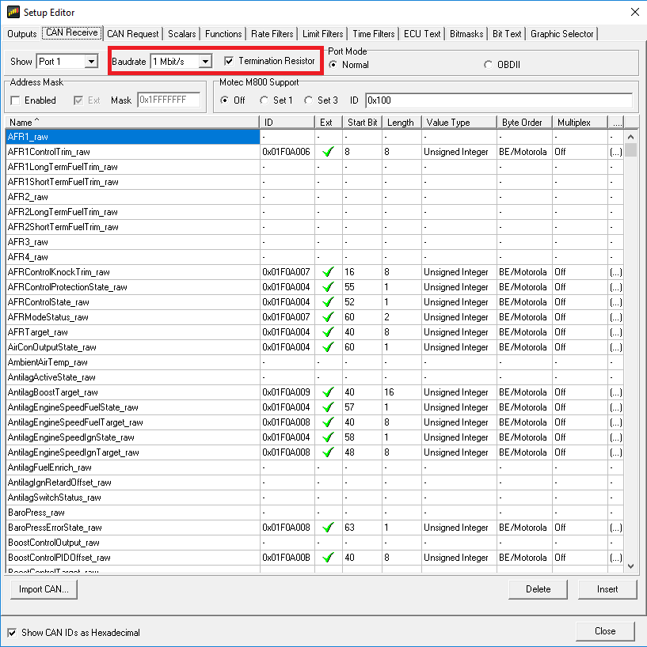
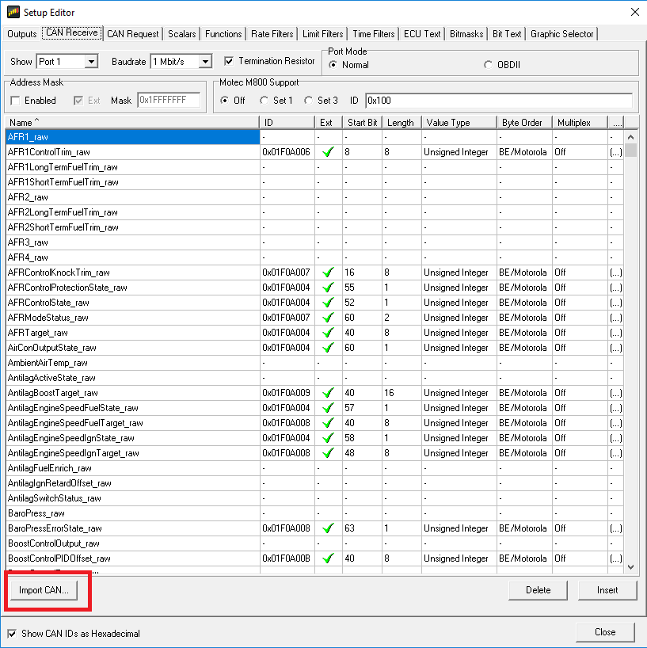
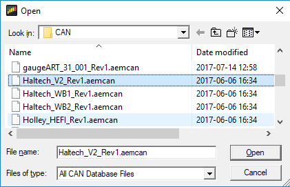
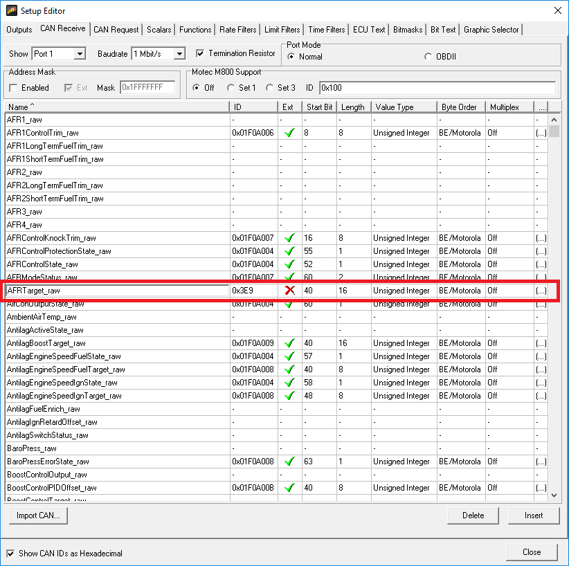
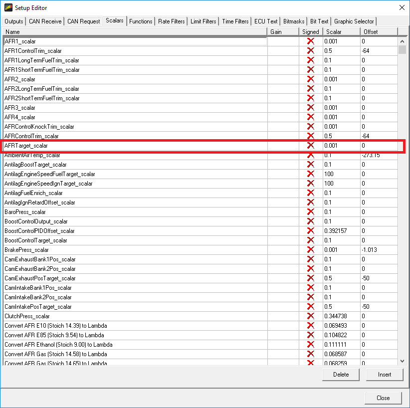

  
  
  
  
  
  
[DOWNLOADS](#)[STORE](#)[CONTACT US](#)  
  
  
  
  
  
  

Setting up the AEM CD7 Dash with the Adaptronic
              Modular ECU

[go back to
                support home](EN_EUGENE_MOD_HOME.md)  

  
  
  

[Using
                a Racepack IQ3 Dash](EN_MOD_049_RACEPAK_VNET.md)

[CAN
                Protocol and the Adaptronic CAN System  

              ](EN_MOD_050_NATIVECAN.md)

  

[  

              ](EN_SelFW.md)

  

  
  
  
  
  
  
  
  
  
The AEM CD7 dash is one of the many
                  full colour TFT dashes on the market. It has built in support
                  for many aftermarket ECUs and a fully configurable CAN system.
                  This article shows two ways that it can be used.  
  
In both, we will just use the CAN1 connection on the
                  dash. The dash actually has 2 CAN busses, but we will just use
                  the first one in this example.  
  
In terms of physical connection, all the pins we
                  need are found on the 4 pin DTM connector. The colours are as
                  follows:  
  
  
Pin and Colour  
  
AEM Name  
  
Our connection  
  
1 - White  
  
CAN 1+  
  
CAN H – J2-15 on M2000 /
                            M6000  
  
2 – Green  
  
CAN 1-  
  
CAN L – J2-23 on M2000 /
                            M6000  
  
3 – Red  
  
Switched Power  
  
Ignition  switched
                            power - J2-7 on M2000 / M6000  
  
4 – Black  
  
Power ground  
  
Power ground – J2-8 on
                            M2000 / M6000  
  

  
  
Note that here, the standard red/black are used for
                  power and ground, and white/green are the CAN pair, unlike the
                  Racepak where they use red/green for power and ground, and
                  white/black for the CAN pair. The best thing about standards
                  is that there are so many to choose from.  
  
Using the Haltech V2 Protocol  
  
The first method is to use the Haltech V2 protocol.
                  The Adaptronic Modular ECUs can emulate the Haltech V2
                  protocol which allows it to be used with any dash that
                  supports the Haltech, with the exception of the Haltech IQ3
                  simplicita, but if you want to use that dash, then please read
                  the article or watch the video on how to use the Racepak
                  dashes.  
  
Firstly, the Haltech protocol specifies a bit rate
                  of 1 Mbps, but both the ECU and the dash allow you to choose
                  different bit rates. So to be correct, the ECU should be set
                  to 1 Mbps, and the termination should be set to “on”. If
                  you’re using the secondary CAN port on a Modular ECU that
                  supports a second CAN port, the termination is always on and
                  can’t be disabled.  
  
Secondly, the dash must be configured using the AEM
                  Dash Design software. To do this, load your dash configuration
                  and then go to Setup -> Display.  
  

  
  
In the Setup editor, go to CAN Receive.  
  

  
  
Select the following settings:  

- Choose port 1 (because we are connecting via
                      the CAN1 port on the 4-pin DTM connector)
- Baudrate = 1 Mbps (default is 500 kbps)
- Termination resistor = checked / enabled
- Port mode = normal
- Motec M800 support =off  

  
  
Then select the “Import CAN…” button  
  

  
  
Select the Haltech V2 AEMCAN template:  
  

  
  
And select “replace” when it asks you if you want to
                  override the new channels.  
  
Send this to the dash using the “Upload to Display”
                  or Ctrl+U and the two devices will now talk to eachother.  
  
The following lists the Haltech channels as
                  implemented in Modular firmware 0.145 and notes for them. Note
                  that the full CAN spec is Haltech’s intellectual property, so
                  if you want a full description of Haltech’s protocol, please
                  do not ask us. This is just to describe individual channels,
                  which ones are available and anything weird or unusual with
                  how it is interpreted by the AEM dash:  
  
  
Haltech
                              name  
  
Our
                              name  
  
AEM
                              dash name  
  
Notes  
  
RPM  
  
RPM  
  
Engine
                            Speed  
  
  
  
Manifold
                            Pressure  
  
IMAP  
  
Boost  
  
Haltech
                            defines it as absolute pressure (as we do), and
                            that’s what we send, but it’s displayed as “boost”
                            on the dash. Eg 56 kPaA, shows up on the “boost”
                            channel on the dash as 56 kPa, which is misleading.  
  
Throttle
                            Position  
  
TPS
                            overall  
  
Throttle  
  
  
  
Fuel
                            Pressure  
  
Fuel P  
  
  
  
This is
                            given as offset from 101.3 kPa (absolute pressure
                            assuming baro = 101.3 kPa). We add 101.3 when
                            outputting on this channel because we measure oil
                            pressure as a gauge pressure. It displays correctly
                            on the dash.  
  
Oil
                            Pressure  
  
Oil P  
  
Oil Press  
  
See Fuel
                            Pressure  
  
Engine
                            Demand  
  
Load
                            Value 1  
  
  
  
We output
                            this, but I’m not sure which channel it is mapped to
                            on the AEM system  
  
Injection
                            Stage 1 Duty Cycle  
  
Injector
                            1 Duty  
  
  
  
  
  
Injection
                            Stage 2 Duty Cycle  
  
Injector
                            “n+1” Duty  (where “n” is number of cylinders)  
  
  
  
  
  
Injection
                            Stage 3 Duty Cycle  
  
Injector
                            “2n+1” Duty  
  
  
  
  
  
Injection
                            Stage 4 Duty Cycle  
  
Injector
                            “3n+1” Duty  
  
  
  
  
  
Ignition
                            Angle (Leading)  
  
Ignition
                            timing  
  
  
  
  
  
Wheel
                            Slip  
  
  
  
  
  
Wheel
                            slip, ie driven minus ground  
  
Wheel
                            Diff  
  
  
  
  
  
Speed
                            difference between two ground speeds  
  
Wideband
                            Sensor 1  
  
Lambda 1  
  
AFR Left  
  
Haltech
                            sends as lambda, so do we, on the dash default
                            configuration it’s displayed as lambda and shows “L”
                            as the unit. If you want it in AFR there’s probably
                            a dash configuration option you can change or an
                            input scaling.  
  
Wideband
                            Sensor 2  
  
Lambda 2  
  
AFR Right  
  
  
  
Battery
                            Voltage  
  
Voltage_12V  
  
  
  
  
  
Coolant
                            Temperature  
  
ECT  
  
  
  
  
  
Air
                            Temperature  
  
MAT  
  
  
  
  
  
Fuel
                            Temperature  
  
Fuel T  
  
  
  
  
  
Oil
                            Temperature  
  
Oil P  
  
  
  
  
  
Target
                            Lambda  
  
Target
                            Lambda  
  
Lambda
                            Target  
  
This was
                            not implemented in the standard Haltech AEMCAN file.
                            To implement it, see belo  
  
Adding Target Lambda:  

- Go the display settings, CAN Receive
- Find the AFRTarget_Raw row.
- If the Ext shows a green tick, double click the
                      Ext checkbox to force it to the standard 11 bit CAN ID
- Change the CAN ID to 0x3e9
- Start bit = 40, length = 16, unsigned integer,
                      BE/ Motorola  

  
  
Next go to the Scalars tab, find AFRTarget_scalar
                  and set it to 0.001 with an offset of zero. The Haltech lambda
                  is divided by 1000, so a value of 1000 means stoichiometry.  
  

  
  
Using the[
                    Adaptronic Native Protocol](file:///C:/Users/Larry%20Cruz/Dropbox/2018/Scratch/Using%20Blue%20Griffon%20to%20edit%20Eugene%20HTML%20help%20files/EN/EN_MOD_050_ADAPCAN.md):  
  
The second method, which is a little bit more work
                  to set up but gives much better control, is to use the
                  Adaptronic native protocol. Rather than try to map all of the
                  Adaptronic variables to the AEM variables, these are just
                  given the same names as in the Adaptronic software.  
  
The way to import them all is to do as follows.
                  First we must clear the existing channels, which will probably
                  be set up for the AEM ECU:  

- Go to Setup -> Display
- Select the Outputs tab
- Select the first output name, and click
                      “Delete” at the bottom right, to remove this channel.
- Now that the “Delete” button has the focus, you
                      can hold down the enter key and it will delete all the
                      channels
- Go to the CAN Receive tab
- Again click the top row, and click Delete
- Hold down Enter to delete all the CAN receive
                      channels
- Go to the Scalars tab
- Again click the top row, and click Delete
- Hold down Enter to delete all the CAN receive
                      channels
- Go back to the CAN Receive tab
- Click “Import CAN…”
- Select the appropriate DBC file  
The standard DBC files are available in this
                  article. If you have enabled specific other channels to be
                  output, you can also generate the DBC file from the software.  
  
In the standard DBC filenames, the following terms
                  have the following meanings:  

- Standard – means that it includes all the
                      channels which are always output from the ECU
- Full – means that it includes all 1024
                      channels. Some names will be blank and therefore you will
                      get conflict errors when they are imported  
The unit scaling is done in the CAN importation
                  because the dash is not unit-aware. The following suffices are
                  used for different unit combinations:  
  
Filename
                            suffixAFR / Lambda
                            unitPressure unitTemp and SpeedImperial_AFRPetrol
                          AFRPSIFahrenheit
                          / mphImperial_LambdaLambdaPSIFahrenheit
                          / mphMetric_AFRPetrol
                          AFRkPaCelcius
                          / km/hMetric_AFR_PSIPetrol
                          AFRPSICelcius
                          / km/hMetric_LambdaLambdakPaCelcius
                          / km/h  
If you have selected some additional CAN channels to
                  be output in the software, then you can generate a DBC file
                  from the software. When doing this, you must select the output
                  units for scaling for AFR/Lambda, mph / km/h, PSI / kPa and
                  Celcius / Fahrenheit.  
  
DBC Files:  
  
[Adaptronic
                    Full Imperial AFR](http://www.adaptronic.com.au/files/DBC%20Files/Adaptronic_Full_Imperial_AFR.dbc)  
[Adaptronic
                    Full Imperial Lambda](http://www.adaptronic.com.au/files/DBC%20Files/Adaptronic_Full_Imperial_Lambda.dbc)  
[Adaptronic
                    Full Metric AFR](http://www.adaptronic.com.au/files/DBC%20Files/Adaptronic_Full_Metric_AFR.dbc)  
[Adaptronic
                    Full Metric AFR PSI](http://www.adaptronic.com.au/files/DBC%20Files/Adaptronic_Full_Metric_AFR_PSI.dbc)  
[Adaptronic
                    Full Metric Lambda](http://www.adaptronic.com.au/files/DBC%20Files/Adaptronic_Full_Metric_Lambda.dbc)  
[Adaptronic
                    Standard Imperial AFR](http://www.adaptronic.com.au/files/DBC%20Files/Adaptronic_Standard_Imperial_AFR.dbc)  
[Adaptronic
                    Standard Imperial Lambda](http://www.adaptronic.com.au/files/DBC%20Files/Adaptronic_Standard_Imperial_Lambda.dbc)  
[Adaptronic
                    Standard Metric AFR](http://www.adaptronic.com.au/files/DBC%20Files/Adaptronic_Standard_Metric_AFR.dbc)  
[Adaptronic
                    Standard Metric AFR PSI](http://www.adaptronic.com.au/files/DBC%20Files/Adaptronic_Standard_Metric_AFR_PSI.dbc)  
[Adaptronic
                    Standard Metric Lambda](http://www.adaptronic.com.au/files/DBC%20Files/Adaptronic_Standard_Metric_Lambda.dbc)  
  
Big thank you to @Aaparkah.300 – Aaron Parker for
                  lending us the dash for testing.  
  
  
©2018
        Adaptronic  
  
