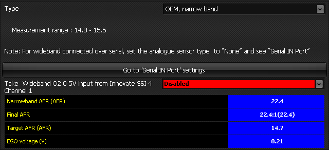

  
  
  
  
  
  
[DOWNLOADS](#)[STORE](#)[CONTACT US](#)  
  
  
  
  
  
  

EGO (Exhaust Gas Oxygen) Sensor -
                  Select  

[go back to support
                home](EN_SEL_HOME.md)  

  
  
  

[MAP sensor
                calibration  

              ](EN_SEL_CALIB_MAP.md)

[Temp
                sensor calibration  

              ](EN_SEL_CALIB_TEMP.md)

[TPS
                calibration  

              ](EN_SEL_CALIB_TPS.md)

[  

              ](EN_SelFW.md)

  

  
  
  
  
  
If you intend
                  running the engine in closed loop fuel control mode, you will
                  need to install and configure an oxygen sensor.  

- From the drop-down menu, select the type of
                      oxygen sensor.
- If you only have a serial-connected wideband
                      oxygen sensor and no analogue oxygen sensor, then the
                      analogue sensor type should be set to ‘None’.
- If a serial-connected wideband oxygen sensor is
                      selected and connected, the AFR from it overrides the AFR
                      calculated from the analogue input. However if there is no
                      data from the serial device for a given period of time,
                      the value calculated from the analogue input is used
                      instead.
- When the engine is running, the AFR readings
                      can be verified. There will usually be no sensible output
                      from an oxygen sensor when the engine is not running, and
                      usually no reading will be displayed on the software.

  
  
  
  
  
  
  
©2018
        Adaptronic  
  
