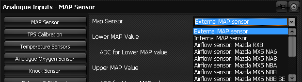
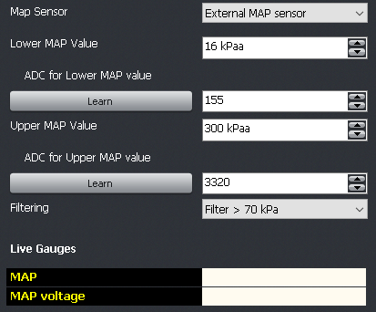

  
  
  
  
  
  
[DOWNLOADS](#)[STORE](#)[CONTACT US](#)  
  
  
  
  
  
  

Manifold Absolute Pressure (MAP)- Select  

[go back to support
                home](EN_SEL_HOME.md)  

  
  
  

[EGO Sensor
                calibration  

              ](EN_SEL_CALIB_EGO.md)

[Temp
                Sensor calibration  

              ](EN_SEL_CALIB_TEMP.md)

[TPS
                calibration  

              ](EN_SEL_CALIB_TPS.md)

[  

              ](EN_SelFW.md)

  

  
  
  
  
  
Select ECUs allow ‘load sensing’ by
                  one of the following methods:  

- An internal 4 bar MAP sensor inside every
                      Select ECU.
- An external MAP sensor (purchased separately,
                      almost any brand can be used)
- Using the stock Mass Air Flow (MAF) meter (if
                      applicable, and only if Adaptronic have characterized that
                      particular type of MAF sensor).  
Note that if your car was originally
                  naturally aspirated with a MAF sensor, but has been converted
                  to forced induction, then you must use a MAP sensor instead of
                  the stock MAF sensor!  
  
As shown below, you must select your load sensing option in
                  Eugene on the ‘Inputs and Triggering -> Analogue Inputs ’
                  from the main menu.  
  
  

  
  
If you are using an external MAP sensor,
                  the sensor must be calibrated. See the image below:  
  
  

  

- Open the Analogue Calibrations tabsheet.
- Enter the minimum readable pressure to the ‘Lower
                    Value’ box. You must then apply this pressure to the MAP
                    sensor. A value such as 16 kPa would be typical.
- Apply this vacuum to the MAP sensor, and click the
                    ‘Learn’ button (Note that 16kPa absolute pressure is the
                    same as about 64 cm/Hg of vacuum).
- Enter the maximum pressure of the MAP sensor into the
                    ‘Upper value’ field. This will be 100 for a 1 Bar MAP
                    sensor, 200 for a 2 Bar MAP sensor and 300 for a 3 Bar MAP
                    sensor.
- Release the vacuum from the sensor so that it reads
                    atmospheric pressure (100kPa).
- Adjust the ‘Upper value ADC reading’ value until the
                    ‘Current MAP’ reads 100 kPa. Note: If you have a way of
                    applying the maximum pressure to the sensor (either it is a
                    1 Bar sensor, or you have access to a regulated pressure
                    source), you can just do this and then click the ‘Learn’
                    button.
- Apply different pressures to the sensor and verify
                    that the correct pressures are shown at ‘Current MAP’.  
  
  
  
  
©2018
        Adaptronic  
  
