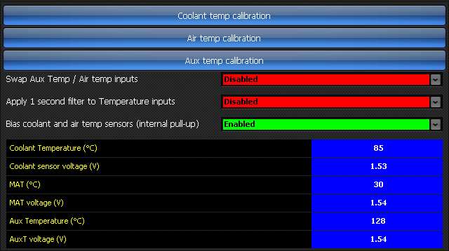
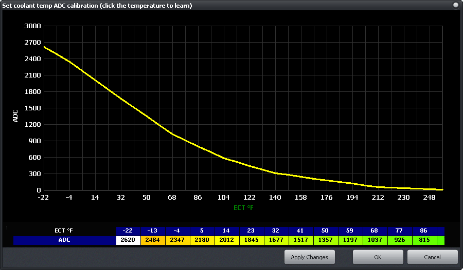
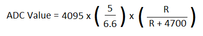

  
  
  
  
  
  
[DOWNLOADS](#)[STORE](#)[CONTACT US](#)  
  
  
  
  
  
  

Temperature Sensors - Select

[go back to support
                home](EN_SEL_HOME.md)  

  
  
  

[EGO sensor
                calibration  

              ](EN_SEL_CALIB_EGO.md)

[MAP
                Sensor calibration  

              ](EN_SEL_CALIB_MAP.md)

[TPS
                calibration  

              ](EN_SEL_CALIB_TPS.md)

[  

              ](EN_SelFW.md)

  

  
  
  
  
  
Refer to the ‘Temp sensor
                  calibration’ panel as shown below:  
  

  
  
  
  
Each temperature sensor input on the
                  Select ECUs (Water Temperature, Air Temperature, Aux
                  Temperature) has its own calibration table. There is also a
                  tickbox to specify whether the temperature inputs are ‘biased’
                  (pulled-up) inside the Select ECU (this will usually be
                  ticked, except for some piggyback Select Plug-In ECUs which
                  share temperature sensors with the factory ECU).  
  
  
You may choose to enable a
                  firmware-based filter (with a 1 second time constant) for the
                  temperature readings, to make them more stable.  
  
  
To Calibrate the temperature
                  sensors…  
  
The default table in the ECU suits a common type of sensor. In
                  practice, it is easiest to do a ‘sanity check’ when the engine
                  is stopped (and verify that it reads approximately ambient
                  temperature), and then verify the readings with a thermometer
                  as the engine warms up. This is most easily done with the
                  water temperature sensor.  
  
  
To calibrate the sensors properly,
                  you must perform a temperature sweep, and populate the
                  calibration table (see below):  
  

  
  

- It can be easiest to start at
                      the hottest temperature by heating the sensor up to just
                      above the maximum temperature (125°C). Stop heating the
                      sensor.
- With a thermometer installed, monitor the
                      temperature of the sensor.
- As the temperature falls through its operating
                      range, ‘learn’ the ADC reading for each appropriate
                      temperature by clicking on the temperature number (you
                      will see the cursor changed to a pointing hand).
- Ensure that the sensor cools slowly so that the
                      thermometer is reading the sensor temperature accurately.
                      This may be facilitated by heating it gently, or immersing
                      the sensor and thermometer in oil or water (not water at
                      125°).Once the sensor gets down to ambient temperature,
                  repeat the process by freezing the sensor to its lowest
                  reading, and allowing it to heat up to ambient, and learning
                  the ADC readings as it reaches the appropriate temperatures.  
  
If you have a table or graph that gives the resistance values
                  of the sensor at different temperatures, the ADC value can be
                  manually calculated from this resistance (R). The formula is
                  given below:  
  

  
  
Note that this must be performed for all
                  temperature sensors in use (water temperature sensor, air
                  temperature and auxiliary temperature). There is no need to
                  enter values for a sensor which will not be connected.  
  
  
  
  
  
  
©2018
        Adaptronic  
  
