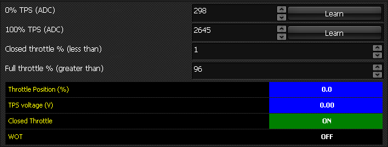

  
  
  
  
  
  
[DOWNLOADS](#)[STORE](#)[CONTACT US](#)  
  
  
  
  
  
  

Throttle Position Sensor (TPS) - Select

[go back to support
                home](EN_SEL_HOME.md)  

  
  
  

[EGO sensor
                calibration  

              ](EN_SEL_CALIB_EGO.md)

[Temp
                sensor calibration  

              ](EN_SEL_CALIB_TEMP.md)

[MAP
                sensor calibration  

              ](EN_SEL_CALIB_MAP.md)

[  

              ](EN_SelFW.md)

  

  
  
  
  
  
If you are using a throttle
                  position sensor, you will need to calibrate it.  

- Go to the ‘Analogue Calibrations’ tabsheet.
- Make sure the throttle is fully closed.
- Click the ‘Learn’ button next to the TPS 0%
                      reading (see below).

  

- Verify that the number to the left of the button
                    changes. It should be somewhere between 100 and 1000.
- Open the throttle completely (on a car, push
                    accelerator all the way to the floor), and click the ‘Learn’
                    button next to the 100% reading.
- Verify that the reading changes. It should be
                    somewhere between 1900 and 4000.
- If the 100% reading is lower than the 0% reading,
                    this indicates that the TPS has been wired back to front.
- If the two readings are very close, it indicates that
                    one or more of the wires to the TPS is not connected or the
                    sensor is faulty. Check the wiring.
- The 0% calibration may have to be repeated once the
                    engine has warmed up, because on some engines the throttle
                    is moved by a thermo-sensitive device to increase the idle
                    air when the engine is cold.
- Verify that the ‘Current TPS’ reading reflects the
                    position of the throttle actuator (push the throttle a few
                    times to check its operation).  
Note: If you are using a TPS switch this
                will need to be set under the Aux in tab.  
  
  
  
  
  
  
  
©2018
        Adaptronic  
  
